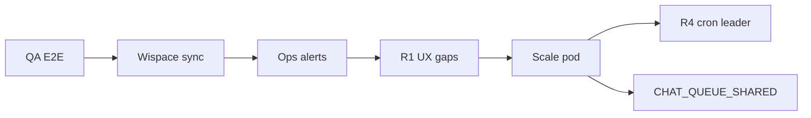

# Edge Cases & Gaps — Remediation Roadmap

This document records **weaknesses / unhandled areas** of the `demo_send_message_fb` POC (all features, not just rate limit) and **how to remediate** them in **small phases** — independent PR merges.

**Baseline status:** Chat rate limit **V1 + H1–H7 ✓**. DB POC **separated** to `ai_chat_bot_db` (✓). Items below are remaining gaps or scale-dependent improvements.

Related: [project-overview.md](./project-overview.md), [study-session-reminder.md](./study-session-reminder.md), [chat-rate-limit-quota.md](./chat-rate-limit-quota.md), [AGENTS.md](../AGENTS.md) (Integration gaps table).

---

## Phase Table (Summary)

| Phase | Name | Estimated Effort | POC 1-Instance Priority |
|-------|------|-----------------|------------------------|
| **Q1** ✓ | E2E QA for 4 flows | 0.5 days | **High** — before go-live |
| **L1** ✓ | Non-text message → guide reply | 0.5 days | Medium |
| **L2** ✓ | Send 24h policy for reports / reminders | 0.5–1 days | Medium |
| **L3** ✓ | `user_id` change mapping (PSID stays same) | 1 day | Low (rare) |
| **L4** ✓ | `ref` link security — one-time token (POC); HMAC optional bridge | 1–2 days | **High** — before real-user go-live |
| **R1** ✓ | Report: empty score → friendly message | 0.5 days | Medium |
| **R2** ✓ | Report: split long bubbles | 0.5 days | Low |
| **R3** ✓ | Report: classify Wispace errors (defer cron / UX menu) | 1–1.5 days | Medium |
| **R5** ✓ | Report: outbox retry 5xx (like reminders) | 1–1.5 days | When Wispace has frequent 503 |
| **R4** ✓ | 08:00 report: idempotency / cron leader (≥2 pods) | 1 day | Only when scaling |
| **S0** ✓ | Wispace wire `study-calendar/sync` | 0.5 days (Wispace) | **High** — integration |
| **S1** ✓ | Ops alert for `failed` / stuck reminder jobs | 0.5 days | Medium |
| **S2** ✓ | Adaptive dispatch poll (scale) | 1–2 days | When outbox grows |
| **C1** | Tier quota by Wispace plan | 2+ days | Post-product |
| **C2** | Event store / LLM billing | ✓ MVP (hybrid Q0 + `llm_usage_events`) — [c2-master-implementation-plan.md](./c2-master-implementation-plan.md) |
| **I1** ✓ | Alert / grep `CHAT_QUOTA_*` + runbook | 0.5 days | Medium |
| **DL** ✓ | Dead-letter webhook + auto-retry cron | 1.5 days | Multi-pod / production |
| **I2** | Aggregate monitoring (Slack/webhook ops) | 1 day | When real users arrive |
| **I3** ✓ | Remove `UserCalendars` DB fallback | 1 day | API-only via `x-psid` |

**Recommended order:** ~~Q1/S0/I1/S1/L1/R1/L2/R2/R3/L3/R4/R5/S2~~ (✓) → `CHAT_QUEUE_SHARED` when scaling → remaining items per user feedback.



---

## 1. Messenger ↔ WISPACE Linking

### Already Implemented ✓

| Behavior | Code / Notes |
|----------|-------------|
| Opt-in / `referral.ref` | `MessengerService` → `user_messenger_mappings` |
| **`user_id` change with same PSID** | **L3** ✓ — `MessengerMappingService`, `MAPPING_USER_ID_UPDATED`, ops relink |
| Duplicate topic/cadence report registration | `SUBSCRIPTION_ALREADY_ACTIVE` |
| Postback dedupe 15s | `isDuplicatePostback` |
| **POST webhook signature** | `MessengerWebhookSignatureGuard` + `MESSENGER_APP_SECRET` / `X-Hub-Signature-256` |
| Unlinked user chat | `MISSING_USER_REF` |
| **Token-only link (L4)** | `MessengerLinkContextService` verifies WISPACE; startup fails if config missing; legacy `ref=userId` removed |
| **Non-text message** (sticker, image, file) | **L1** — `UNSUPPORTED_MESSAGE_TYPE`, `isUnsupportedUserMessage` |
| **User blocks bot** / **Meta 24h window** | **L2** ✓ — `*_MESSENGER_24H` log, reminder terminal fail, report cron skip |

### Gaps & Remediation

| Gap | Impact | Remedy | Phase |
|-----|--------|--------|-------|
| ~~**`ref` = raw `userId` — no owner verification**~~ | ~~IDOR~~ | **Done (POC)** — token-only + startup validator; `m.me` links only from WISPACE — [messenger-link-security.md](./messenger-link-security.md) | **L4** ✓ |
| ~~POST `/webhook` doesn't verify Meta signature~~ | Spoofed payload if webhook URL leaks | **Done** — `MessengerWebhookSignatureGuard`, `MESSENGER_APP_SECRET`, `rawBody` | Done |
| ~~App port public / flood bypasses Nginx~~ | Bypasses rate limit + body cap | **Done** — Docker `127.0.0.1:PORT`; Nginx `deploy/nginx/` on VPS | Done |
| ~~Meta webhook retry; 1 event errors~~ | ~~Other events still processed (correct); error event lost~~ | **DL** ✓ — `messenger_webhook_dead_letters` + 5-min auto-retry cron + advisory lock + ops script | Done |

---

## 2. AI Learning Reports

### Already Implemented ✓

| Behavior | Notes |
|----------|-------|
| Cron 08:00, 2–3 day window before exam | `ReportScheduleService` |
| Skip if already sent today | `hasSentScheduledReportToday` |
| Per-user error doesn't block batch | `report-cron.service` try/catch per mapping |
| Missing OpenAI key | Fallback template |
| Menu + ops `send-reports` | `forceSend` bypasses window; default **skips** already sent today; `{ psid }` sends to one user |
| **Empty TaskScoreAverage** | **R1** — `StudentReportNoScoreDataError` → friendly message about taking a test, no throw |
| **Long report bubble** | **R2** ✓ — `sendTextBubblesViaPsid` + `CHAT_MAX_BUBBLES` |
| **Wispace API error** | **R3** ✓ + **R5** ✓ — 5xx: outbox `report_send_jobs`, cron retries every 15 min until `daysUntilExam >= 0`; menu shows "try again later"; 4xx shows "insufficient data" |
| **Meta 24h proactive** | **L2** ✓ — `*_MESSENGER_24H` log; cron `windowClosed` / `deferred` |
| **Multi-pod cron 08:00** | **R4** ✓ — `messenger_scheduled_report_claims`, advisory lock, `CRON_LEADER_*` |
| **Report outbox retry 5xx** | **R5** ✓ — `report_send_jobs`, `ReportSendRetryDispatchService` cron `*/15` ICT |

### Gaps & Remediation

| Gap | Impact | Remedy | Phase |
|-----|--------|--------|-------|
| Menu 503 — UX only, no auto-retry | User must tap "View progress" again | Acceptable for POC; optional scheduled retry postback | Backlog |

### 2.1 R3 + R5 — Report Behavior (✓ Implemented)

**R5** adds outbox `report_send_jobs` (unique `psid` + `exam_date`): 08:00 cron writes job on 5xx → polls every **15 minutes** retrying until sent successfully or `daysUntilExam < 0` / `REPORT_SEND_MAX_RETRIES` exhausted.

#### Quick Comparison

| | Study Reminder | Report Cron + R5 Outbox | Menu "View Progress" |
|--|----------------|------------------------|---------------------|
| Wispace **5xx** | Retry with minute backoff, `study_reminder_jobs` | **R5** — `report_send_jobs`, retries until day before exam (`daysUntilExam >= 0`) | Shows `*_API_DEFERRED`; user taps again |
| Last day of window + 503 | Retries within the day | **R5** — retries at 8:15, 8:30… and **day 13** (1 day before exam) if retries remain | — |

Code: `ReportSendJobRepository`, `ReportSendRetryDispatchService`, `ReportCronService.retryQueued`, env `REPORT_SEND_*`.

#### Example — Exam on **day 14**, 503 on last window day (R5 fixed)

| Time | What Happens |
|------|-------------|
| **12th** 8:00 | Cron gets 503 → job in `report_send_jobs`, `next_retry_at` 8:15 |
| **12th** 8:15 | Retry dispatch → OK → Lan receives report ✓ |
| (or 503 all day on 12th) | **13th** 8:15 retry still runs (`daysUntilExam=1`) → chance to send even though 13th 8:00 cron skips the window |

#### R5 — Env

```env
REPORT_SEND_MAX_RETRIES=3
REPORT_SEND_RETRY_BACKOFF_MINUTES=15
REPORT_SEND_RETRY_POLL_MINUTES=15   # matches cron */15 ICT
```

Ops fallback (no duplicate reports):

```bash
# One user deferred / R5 exhausted
POST /messenger/send-reports
{ "psid": "<PSID>" }

# Manually run outbox retry
POST /messenger/send-reports/retry-dispatch

# Re-send entire batch (skip users who already received today)
POST /messenger/send-reports
{}

# Force re-send even if already received (rare)
POST /messenger/send-reports
{ "allowDuplicate": true }
```

---

## 3. Study Session Reminders

### Already Implemented ✓

Outbox `study_reminder_jobs`, retry/backoff, stuck `processing` reset, upsert on reschedule, stale cancel, menu preview, LLM fallback, `claimJob` multi-instance.

| Behavior | Notes |
|----------|-------|
| **Wispace wire sync** | **S0** ✓ — `POST /messenger/study-calendar/sync` after POST/DELETE `UserCalendar` |
| **Adaptive dispatch poll** | **S2** ✓ — `StudyReminderWorkerService` `setTimeout` loop; `findNextDueTime`; env `STUDY_REMINDER_POLL_*` |

### Gaps & Remediation

| Gap | Impact | Remedy | Phase |
|-----|--------|--------|-------|
| **14-day** horizon | Far-out sessions have no jobs | Documented; increase `STUDY_REMINDER_SYNC_HORIZON_HOURS` if product requires | Config / doc |
| Unlinked PSID user | No reminders | By design — optional other channels (email) outside scope | — |
| `failed` job exhausted retries | Student misses reminder, ops unaware | **S1** ✓ — `study-reminder:jobs --failed`, `OPS_HEALTH_ALERT` cron, `npm run ops:health` | Done |
| 24h window on reminders | Send fail | **L2** ✓ — `STUDY_SESSION_REMINDER_*_MESSENGER_24H`, terminal fail | Done |

### 3.1 S2 — Adaptive Dispatch Poll (✓ Implemented)

Replaces fixed **1-minute** cron with an adaptive loop:

1. `dispatchDueReminders()` → returns `nextDueAt` (`findNextDueTime` — MIN `remind_at` / `next_retry_at`)
2. Delay next poll: `clamp(msTilDue - pollLeadMs, pollMinMs, pollMaxMs)`

| Env | Default | Meaning |
|-----|---------|---------|
| `STUDY_REMINDER_POLL_MIN_MS` | 30s | Fastest poll (job about to be due) |
| `STUDY_REMINDER_POLL_MAX_MS` | 210s (3.5 min) | Slowest poll (no jobs) |
| `STUDY_REMINDER_POLL_LEAD_MS` | 60s | Wake 1 minute before job is due |

- **No jobs** → ~3.5 min intervals (reduces DB load on scale)
- **Job due in 10 minutes** → polls again ~9 minutes later
- Multi-pod: each pod runs its own loop; `claimJob` is atomic — no advisory lock needed for dispatch

Details: [study-session-reminder.md §11.6](./study-session-reminder.md#116-worker-dispatch-polling--trở-ngại-tải-db--giảm-rủi-ro).

---

## 4. Chat AI + Agent

### Already Implemented ✓

Rate limit V1 + **H1–H7**, agent tools, history RAM/DB, delivery semantics H4.

### Gaps & Remediation

| Gap | Impact | Remedy | Phase |
|-----|--------|--------|-------|
| Tier by Wispace plan | All users share same `CHAT_FREE_FORM_DAILY_LIMIT` | Phase 7: limit by `user_id` / plan API — [§5.8](./chat-rate-limit-quota.md) | **C1** |
| Event store / billing | Hard to audit monthly LLM costs | [c2-master-implementation-plan.md](./c2-master-implementation-plan.md) | **C2** ✓ MVP |
| Schedule change tool via chat | **Confirm postback** — `reschedule_study_session` only stages; Wispace API runs when user taps "Confirm reschedule" | Done |

---

## 5. Infrastructure & Operations

| Edge Case | Current State | Remedy | Phase |
|-----------|---------------|--------|-------|
| **1-instance POC** | Appropriate | Keep `CHAT_QUEUE_SHARED=false` | — |
| **≥2 pod chat** | Queue/history split across pods | `CHAT_QUEUE_SHARED=true` + migration — H7 ✓; `appendChatHistoryTurn` atomic ✓ | Done (enable env) |
| **≥2 pod report cron** | ~~Risk of duplicate 08:00 sends~~ | **R4** ✓ claim + advisory lock + optional cron leader | Done |
| **≥2 pod reminder cron** | `claimJob` ✓ + **cron pg_advisory_lock** ✓ | `upsertPendingJob` TOCTOU fixed ✓ (`pg_advisory_xact_lock`) | Done |
| Cron webhook dedupe cleanup multi-pod | N×DELETE | **pg_advisory_lock** ✓ — only 1 pod runs every 15 minutes | Done |
| Monitoring / alerts | Log + scripts | **I1** ✓ runbook + `ops:health`; **S1** ✓ failed/stuck jobs; **DL** ✓ dead-letter cron; **I2** Slack alert | **I2** |
| **Manual VPS prod env sync** | Local/prod drift; secret rotation requires SSH | **Doppler** + `DOPPLER_TOKEN` on CI — [doppler-secrets.md](./doppler-secrets.md) | Done (code) — needs dashboard setup |
| Wispace **schema** change | ~~`UserCalendars` DB fallback~~ | **I3** ✓ — API-only `UserCalendar` via `x-psid` | **I3** ✓ |

### I1 — Lightweight Ops Alert (No Prometheus Needed) ✓

| Task | Done When |
|------|-----------|
| Runbook grep `CHAT_QUOTA_DENY`, `REFUND`, `RECOVERED` | `project-overview.md` §12 |
| `chat-quota:status --ops` + `study-reminder:jobs --failed` / `--stuck` | Ops scripts |
| Cron 09:00 ICT + `npm run ops:health` | `OPS_HEALTH_ALERT` in app log |

### S1 — Failed / Stuck Reminders ✓

| Task | Done When |
|------|-----------|
| `npm run study-reminder:jobs -- --failed` | Terminal failed (retries exhausted) |
| `npm run study-reminder:jobs -- --stuck` | Processing > 10 minutes |
| `npm run ops:health` / internal cron | `OPS_HEALTH_ALERT` on spikes |

---

## Q1 — E2E QA Checklist (No Code Needed) ✓

Manual tests run before go-live (Messenger + prod `.env`).

### Q1.1 Linking

- [x] Open `m.me` with `ref={userId}` from WISPACE
- [x] Verify `user_messenger_mappings` has `psid` + `user_id`
- [x] Persistent menu displayed (after `profile/setup`)

### Q1.2 Reports

- [x] Postback "View progress" → receive message, log `LEARNING_PROGRESS`
- [x] (Optional) User in 2–3 day pre-exam window → cron or `POST /messenger/send-reports`

### Q1.3 Reminders

- [x] Session in `UserCalendar` within horizon
- [x] `npm run study-reminder:jobs` shows `pending` job → correct `remind_at`
- [x] After sync (API or cron) → reminder message arrives on time
- [x] Postback preview "Upcoming study session" works

### Q1.4 Chat Quota

- [x] `CHAT_RATE_LIMIT_ENABLED=true`
- [x] Send text → bot replies, `chat-quota:status` shows increased `used`
- [x] Burst / daily limit exceeded → `CHAT_QUOTA_DENIED`
- [x] Menu postback does **not** increase quota

```bash
npm run chat-quota:status -- --psid=<PSID>
npm run study-reminder:jobs
```

---

## Documentation Updates When Closing Phases

| When Merging Phase | Update |
|--------------------|--------|
| Any | Check ✓ in phase table at top of file |
| S0 | `AGENTS.md` Integration gaps, `study-session-reminder.md` |
| S2 | `study-session-reminder.md` §11.6, `project-overview.md` §6 |
| R4, H7 scale | `project-overview.md` §10 |
| L1, R1, L2, R2, R3, … | Move corresponding section in this file → "Already Implemented" ✓ |

---

*POC prioritizes shipping — not implementing the entire roadmap; phases chosen per real user feedback and deploy scale.*
