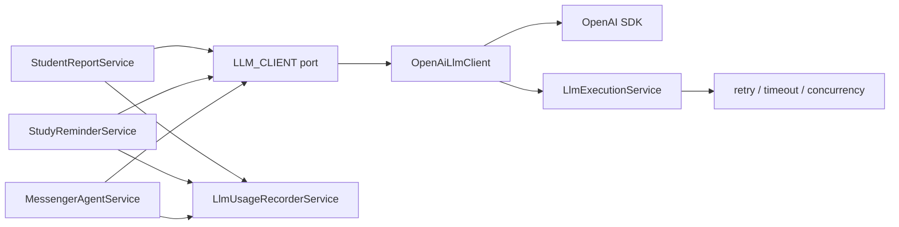

# LLM Provider Abstraction Plan

> **Trạng thái:** ✅ Phase 0–6 đã implement xong (xem PR [#32](https://github.com/lengocanh2005it/messenger-ai-for-student/pull/32)).
> Adapter pattern: `LlmProviderAdapter` interface, OpenAI adapter, OpenAI-compatible adapter, factory. Mọi consumer (messenger-bot, discord-bot) đã migrate.

## 1. Mục tiêu tài liệu

Tài liệu này phân tích việc codebase hiện đang phụ thuộc cứng vào OpenAI SDK và đề xuất một interface trung gian để sau này có thể đổi sang LLM provider khác với ít thay đổi nhất.

Mục tiêu chính:

- Giảm coupling trực tiếp giữa business services và OpenAI SDK.
- Giữ nguyên hành vi hiện tại của chatbot, báo cáo học tập và nhắc lịch học trong phase đầu.
- Tách phần "gọi model" khỏi phần nghiệp vụ Messenger, Student Report, Study Reminder.
- Chuẩn bị đường để dùng OpenAI-compatible endpoint hoặc provider khác như Anthropic, Gemini, local LLM, gateway nội bộ.
- Không phá các lớp Clean Architecture hiện có.

## 1b. Quyết định thiết kế đã chốt

Ba điểm này đã được phân tích và chốt — **không cần thảo luận lại khi implement**:

| # | Vấn đề | Quyết định |
|---|--------|------------|
| 1 | `LlmFeature` / `LlmUsageFeature` / `LlmExecutionFeature` — 3 type cùng giá trị | Hợp nhất trong Phase 1: canonical `LlmFeature` ở `llm-execution/domain`, hai type cũ thành alias backward-compat, xóa sau khi migrate xong |
| 2 | `LlmExecutionService.run()` signature | Giữ nguyên `run<T>(fn, context?)` — không đổi để tránh sửa tất cả caller. Pseudo code trong tài liệu đã được sửa để khớp |
| 3 | `OpenAiLlmClient` đọc config từ đâu | Inject `LlmExecutionConfigService`, thêm `getApiKey()` / `getModel()` / `getBaseUrl()` vào đó — single source of truth, không inject `ConfigService` riêng trong adapter |

## 2. Đặt vấn đề

Hiện tại dự án dùng OpenAI ở nhiều điểm trong application services. Điều này chạy tốt cho POC, nhưng nếu sau này muốn đổi provider thì phải sửa nhiều nơi:

- Sửa nơi khởi tạo SDK.
- Sửa format messages.
- Sửa format tool/function calling.
- Sửa response parsing.
- Sửa usage tracking token.
- Sửa retry/error detection.
- Sửa test mock vì test đang dùng OpenAI response shape.

Nói ngắn gọn: business logic hiện biết quá nhiều về OpenAI.

Vấn đề lớn nhất không chỉ là `new OpenAI(...)`. Phần khó hơn là các service đang phụ thuộc vào "ngôn ngữ giao tiếp" của OpenAI:

- `chat.completions.create(...)`
- `response_format: { type: 'json_object' }`
- `tools: [{ type: 'function', function: ... }]`
- `choice.message.tool_calls`
- `toolCall.function.arguments`
- `ChatCompletionMessageParam`
- `ChatCompletionToolMessageParam`
- `ChatCompletion`
- `usage.prompt_tokens`, `usage.completion_tokens`, `usage.total_tokens`

Nếu đổi sang model chỉ support text completion, hoặc provider có function calling khác format, phần agent sẽ là vùng sửa nhiều nhất.

## 3. Hiện trạng coupling trong codebase

### 3.1. Student Report

File chính:

- `src/modules/student-report/application/services/student-report.service.ts`

Hiện service này:

- Import trực tiếp `OpenAI` từ package `openai`.
- Đọc `OPENAI_API_KEY`.
- Đọc `OPENAI_MODEL`.
- Tự tạo client bằng `new OpenAI({ apiKey })`.
- Gọi `client.chat.completions.create(...)`.
- Dùng `response_format: { type: 'json_object' }`.
- Parse `response.choices[0]?.message?.content`.
- Gọi `llmUsageRecorder.recordFromCompletion(...)` với raw OpenAI completion.

Mức coupling: trung bình.

Lý do: service chỉ cần JSON output. Nếu có một interface `generateJson(...)` thì phần này tách khá dễ.

### 3.2. Study Reminder

File chính:

- `src/modules/study-reminder/application/services/study-reminder.service.ts`

Hiện service này tương tự Student Report:

- Import trực tiếp `OpenAI`.
- Đọc `OPENAI_API_KEY`, `OPENAI_MODEL`.
- Tự tạo OpenAI client.
- Gọi Chat Completions với JSON mode.
- Ghi usage từ raw completion.
- Fallback template khi thiếu API key hoặc LLM lỗi.

Mức coupling: trung bình.

Lý do: giống Student Report, đây là use case JSON generation, ít phức tạp hơn agent có tools.

### 3.3. Messenger Agent

File chính:

- `src/modules/messenger/application/agent/messenger-agent.service.ts`
- `src/modules/messenger/application/agent/messenger-agent.tools.ts`

Hiện agent:

- Import trực tiếp `OpenAI`.
- Import OpenAI message types:
  - `ChatCompletionMessageParam`
  - `ChatCompletionToolMessageParam`
- Tự cache `OpenAI` client trong service.
- Build messages theo OpenAI role format.
- Gọi `client.chat.completions.create(...)`.
- Truyền `tools: MESSENGER_AGENT_TOOLS`.
- Dùng `tool_choice: 'auto'`.
- Đọc `choice.tool_calls`.
- Đọc `toolCall.function.name`.
- Đọc `toolCall.function.arguments`.
- Push assistant message và tool message theo format OpenAI.
- Ghi usage theo từng tool round bằng raw OpenAI completion.

Mức coupling: cao.

Lý do: agent không chỉ gọi LLM một lần. Nó có vòng lặp tool calling nhiều round, dùng OpenAI message shape để duy trì conversation state. Đây là phần cần thiết kế kỹ nhất.

### 3.4. Tool schema

File chính:

- `src/modules/messenger/application/agent/messenger-agent.tools.ts`

Hiện tool schema export kiểu:

```ts
import type { ChatCompletionTool } from 'openai/resources/chat/completions';

export const MESSENGER_AGENT_TOOLS: ChatCompletionTool[] = [
  {
    type: 'function',
    function: {
      name: 'get_user_profile',
      description: '...',
      parameters: { ... },
    },
  },
];
```

Điều này làm application layer bị dính OpenAI type dù tool definition bản chất là domain/application concept.

Mức coupling: cao nhưng dễ sửa theo hướng adapter.

Giải pháp: định nghĩa tool ở dạng provider-neutral:

```ts
export interface LlmToolDefinition {
  name: string;
  description: string;
  parameters: Record<string, unknown>;
}
```

OpenAI adapter sẽ map sang:

```ts
{
  type: 'function',
  function: {
    name,
    description,
    parameters,
  },
}
```

### 3.5. LLM usage tracking

File chính:

- `src/modules/llm-usage/application/services/llm-usage-recorder.service.ts`

Hiện service này import:

```ts
import type { ChatCompletion } from 'openai/resources/chat/completions';
```

Và method chính:

```ts
recordFromCompletion(input: {
  response: Pick<ChatCompletion, 'id' | 'usage'>;
})
```

Mức coupling: trung bình.

Vấn đề:

- Usage recorder hiện biết raw OpenAI completion.
- DB field đang có tên `openaiResponseId`.
- Config cost đang có wording "OpenAI invoice".

Giải pháp phase đầu:

- Giữ `recordFromCompletion(...)` để tránh diff quá lớn.
- Thêm method mới `recordFromLlmUsage(...)` hoặc dùng sẵn `recordUsage(...)`.
- Adapter trả về normalized usage.
- Các service mới gọi `recordUsage(...)` qua normalized data.

Giải pháp phase sau:

- Rename semantic field ở domain thành `providerResponseId`.
- Giữ DB column cũ nếu chưa muốn migration, hoặc thêm migration riêng nếu cần chuẩn hóa dữ liệu.

### 3.6. Retry/error utils

File chính:

- `src/shared/utils/openai-error.utils.ts`
- `src/modules/llm-execution/application/services/llm-execution.service.ts`

Hiện `LlmExecutionService` dùng:

```ts
isOpenAiRetryableError(error)
```

Mức coupling: trung bình.

Nếu dùng OpenAI-compatible provider thì có thể vẫn ổn trong ngắn hạn vì lỗi HTTP thường giống nhau. Nhưng nếu đổi sang provider khác, retry logic nên dựa trên normalized error:

- rate limit
- timeout
- server error
- network error
- provider overloaded

Giải pháp phase sau:

- Đổi `openai-error.utils.ts` thành `llm-error.utils.ts`.
- Adapter có thể expose `normalizeError(error): LlmProviderError`.
- `LlmExecutionService` retry dựa trên `LlmProviderError.retryable`.

### 3.7. Metrics wording

File chính:

- `src/modules/metrics/metrics.service.ts`

Hiện comments/help text dùng wording OpenAI:

- `Raw OpenAI API call duration`
- `OpenAI API call duration per feature, model, and tool round`

Mức coupling: thấp.

Đây chủ yếu là naming/observability. Có thể đổi sang "LLM provider API call duration" ở phase cleanup.

### 3.8. Env config

File chính:

- `.env.example`
- `AGENTS.md`
- `docs/project-overview.md`

Env hiện tại:

- `OPENAI_API_KEY`
- `OPENAI_MODEL`
- `OPENAI_MAX_TOOL_ROUNDS`
- `OPENAI_MAX_CONTEXT_CHARS`
- `LLM_OPENAI_RETRY_MAX_ATTEMPTS`
- `LLM_OPENAI_RETRY_BACKOFF_MS`

Mức coupling: trung bình.

Giải pháp nên incremental:

- Phase đầu chưa đổi env để tránh phá deploy.
- Phase sau thêm env generic:
  - `LLM_PROVIDER=openai`
  - `LLM_API_KEY=...`
  - `LLM_MODEL=...`
  - `LLM_BASE_URL=...`
  - `LLM_MAX_TOOL_ROUNDS=...`
  - `LLM_MAX_CONTEXT_CHARS=...`
  - `LLM_RETRY_MAX_ATTEMPTS=...`
  - `LLM_RETRY_BACKOFF_MS=...`
- Giữ alias `OPENAI_*` trong một thời gian.
- Precedence đề xuất: `LLM_*` ưu tiên hơn `OPENAI_*`, nhưng nếu `LLM_*` thiếu thì fallback sang `OPENAI_*`.

## 4. Mục tiêu thiết kế

### 4.1. Tách application khỏi provider SDK

Sau khi hoàn tất các phase chính, các service nghiệp vụ không nên import package `openai`.

Mục tiêu:

- `StudentReportService` chỉ gọi `LlmClientPort.generateJson(...)`.
- `StudyReminderService` chỉ gọi `LlmClientPort.generateJson(...)`.
- `MessengerAgentService` chỉ gọi `LlmClientPort.chatWithTools(...)`.
- `messenger-agent.tools.ts` không import OpenAI type.

### 4.2. Giữ behavior hiện tại

Phase đầu nên giữ nguyên:

- Prompt hiện tại.
- JSON parsing và validation hiện tại.
- Fallback template hiện tại.
- Tool execution flow hiện tại.
- Safety checks hiện tại.
- Rate limit/quota flow hiện tại.
- LLM usage tracking hiện tại hoặc tương đương.

Không nên vừa abstraction vừa đổi nội dung prompt/model behavior. Làm vậy sẽ khó debug nếu output thay đổi.

### 4.3. Interface nhỏ, đúng use case

Không nên thiết kế interface quá rộng kiểu "support mọi thứ". Codebase hiện có 2 nhóm use case:

1. Generate JSON cho proactive content:
   - Student Report
   - Study Reminder

2. Chat agent có tool calling:
   - Free-form Messenger chat

Vậy interface ban đầu chỉ cần cover 2 operation:

- `generateJson(request)`
- `chatWithTools(request)`

Sau này nếu cần embeddings, image, streaming, rerank, speech thì thêm interface riêng.

### 4.4. Adapter chịu trách nhiệm mapping provider-specific

OpenAI adapter nên là nơi duy nhất biết:

- OpenAI SDK object.
- OpenAI Chat Completion request shape.
- OpenAI tool schema shape.
- OpenAI response shape.
- OpenAI token usage shape.
- OpenAI retryable error shape nếu cần.

Application services chỉ thấy normalized types.

### 4.5. Không làm mất safety boundary

Hiện code có nhiều safety boundary quan trọng:

- `sanitizeUntrustedTextForLlm`
- `sanitizeToolResultContent`
- JSON output validation
- fallback template
- grounding check cho free-form chat
- prompt injection detection trước khi gọi model

Interface mới không được bypass các bước này.

Nguyên tắc:

- Sanitize input vẫn nằm ở application service hoặc helper hiện tại.
- Adapter không tự sanitize business data.
- Adapter chỉ map request sang provider.
- Parse/validate business JSON vẫn nằm ở service hoặc parser helper hiện tại.

## 5. Non-goals

Các việc không nên làm trong phase abstraction đầu:

- Không đổi provider ngay.
- Không đổi model mặc định.
- Không đổi prompt.
- Không đổi format Messenger reply.
- Không đổi flow rate limit.
- Không thêm queue mới.
- Không refactor toàn bộ LLM usage schema ngay.
- Không đổi DB migration nếu chưa cần.
- Không xóa `OPENAI_*` env ngay.
- Không build multi-provider routing phức tạp ngay từ đầu.

## 6. Kiến trúc đề xuất

### 6.1. Tổng quan

Đề xuất thêm một provider port trong module LLM hiện có, ưu tiên mở rộng `LlmExecutionModule` vì module này đã chịu trách nhiệm concurrency, timeout, retry cho LLM calls.

Sơ đồ:



Có hai lựa chọn thiết kế:

### 6.2. Option A: Adapter chỉ gọi provider, service tự wrap execution/usage

Flow:

- Service build request.
- Service gọi `llmExecution.run(...)`.
- Trong callback, service gọi `llmClient.generateJson(...)` hoặc `llmClient.chatWithTools(...)`.
- Service tự ghi usage từ normalized response.

Ưu điểm:

- Diff nhỏ.
- Giữ control hiện tại ở service.
- Dễ migrate từng service.
- Ít nguy cơ vòng phụ thuộc module.

Nhược điểm:

- Mỗi service vẫn lặp code execution/usage một chút.
- Adapter chưa hoàn toàn là gateway.

Phù hợp cho phase đầu.

### 6.3. Option B: Tạo LlmGatewayService orchestration đầy đủ

Flow:

- Service gọi `llmGateway.generateJson(...)`.
- Gateway lo execution, retry, metrics, usage.
- Adapter chỉ map provider.

Ưu điểm:

- Business service sạch hơn.
- Centralized metrics/usage/error handling.
- Dễ thêm routing provider sau này.

Nhược điểm:

- Diff lớn hơn.
- Dễ tạo vòng phụ thuộc với `LlmUsageModule`, `MetricsModule`.
- Cần thiết kế module boundary kỹ hơn.

Phù hợp cho phase sau khi đã tách adapter thành công.

### 6.4. Khuyến nghị

Nên đi theo Option A trước, sau đó nâng cấp dần sang Option B nếu thấy lặp logic nhiều.

Lý do:

- Codebase đang có `LlmExecutionService` dùng ổn.
- `LlmUsageRecorderService` đã tồn tại và đang được inject vào từng service.
- Phase đầu cần giảm lock-in, không cần rewrite orchestration.
- Ít rủi ro regression.

## 7. Interface đề xuất

### 7.1. Provider token

File đề xuất:

- `src/modules/llm-execution/application/ports/llm-client.port.ts`

```ts
export const LLM_CLIENT = Symbol('LLM_CLIENT');

export interface LlmClientPort {
  isConfigured(): boolean;
  getDefaultModel(): string;
  generateJson(request: LlmJsonRequest): Promise<LlmJsonResponse>;
  chatWithTools(request: LlmToolChatRequest): Promise<LlmToolChatResponse>;
}
```

### 7.2. Common types

File đề xuất:

- `src/modules/llm-execution/domain/entities/llm.types.ts`

```ts
export type LlmProvider = 'openai' | 'openai-compatible' | 'anthropic' | 'gemini' | 'local';

export type LlmFeature =
  | 'FREE_FORM_CHAT'
  | 'STUDENT_REPORT'
  | 'STUDY_REMINDER';

export interface LlmUsage {
  promptTokens: number;
  completionTokens: number;
  totalTokens: number;
}

export interface LlmProviderMetadata {
  provider: LlmProvider | string;
  model: string;
  responseId?: string;
  usage?: LlmUsage;
}
```

**Quyết định về `LlmFeature` / `LlmUsageFeature` / `LlmExecutionFeature` — hợp nhất trong Phase 1:**

Codebase hiện có **3 type cùng giá trị**:

| Type | File hiện tại |
|------|--------------|
| `LlmExecutionFeature` | `llm-execution/application/services/llm-execution.service.ts` |
| `LlmUsageFeature` | `llm-usage/domain/entities/llm-usage.types.ts` |
| `LlmFeature` (mới) | `llm-execution/domain/entities/llm.types.ts` |

Để không để 3 type cùng tồn tại, **Phase 1 hợp nhất luôn**:

1. Định nghĩa canonical tại `src/modules/llm-execution/domain/entities/llm.types.ts`:

```ts
export type LlmFeature =
  | 'FREE_FORM_CHAT'
  | 'STUDENT_REPORT'
  | 'STUDY_REMINDER';
```

2. `llm-execution.service.ts` — xóa `LlmExecutionFeature`, alias lại:

```ts
import type { LlmFeature } from '../../domain/entities/llm.types';
export type LlmExecutionFeature = LlmFeature; // backward compat alias, xóa sau
```

3. `llm-usage/domain/entities/llm-usage.types.ts` — xóa `LlmUsageFeature`, alias lại:

```ts
import type { LlmFeature } from '../../../llm-execution/domain/entities/llm.types';
export type LlmUsageFeature = LlmFeature; // backward compat alias, xóa sau
```

4. Các caller hiện tại (`llm-usage-recorder.service.ts`, `student-report.service.ts`, v.v.) không cần sửa ngay vì alias giữ type compatibility. Cleanup tên alias sau khi toàn bộ migration xong.

Hướng phụ thuộc chấp nhận được: `llm-usage/domain` → `llm-execution/domain` (chỉ import type, không kéo NestJS DI). Nếu sau này hai module tách deployment riêng thì extract lên `src/shared/llm/`.

### 7.3. JSON generation request/response

```ts
export interface LlmJsonRequest {
  feature: LlmFeature;
  model?: string;
  correlationId?: string;
  systemPrompt: string;
  userContent: string;
  temperature?: number;
  maxOutputTokens?: number;
}

export interface LlmJsonResponse {
  content: string;
  metadata: LlmProviderMetadata;
}
```

Mapping OpenAI:

```ts
client.chat.completions.create({
  model,
  response_format: { type: 'json_object' },
  messages: [
    { role: 'system', content: request.systemPrompt },
    { role: 'user', content: request.userContent },
  ],
});
```

Provider khác có thể map khác:

- Anthropic: system riêng, messages riêng, JSON instruction trong prompt hoặc tool schema.
- Gemini: response mime type JSON nếu support.
- Local LLM: prompt instruction + parser fallback.

### 7.4. Tool chat types

```ts
export type LlmMessageRole = 'system' | 'user' | 'assistant' | 'tool';

export interface LlmToolDefinition {
  name: string;
  description: string;
  parameters: Record<string, unknown>;
}

export interface LlmToolCall {
  id: string;
  name: string;
  argumentsJson: string;
}

export interface LlmMessage {
  role: LlmMessageRole;
  content?: string;
  toolCalls?: LlmToolCall[];
  toolCallId?: string;
}

export interface LlmToolChatRequest {
  feature: LlmFeature;
  model?: string;
  correlationId?: string;
  messages: LlmMessage[];
  tools: LlmToolDefinition[];
  toolChoice?: 'auto' | 'none';
  temperature?: number;
  maxOutputTokens?: number;
}

export interface LlmToolChatResponse {
  /**
   * Full assistant message để caller push vào history cho round tiếp theo.
   * message.toolCalls chứa danh sách tool calls nếu có.
   * Caller không nên đọc tool calls từ hai nơi — chỉ dùng message.toolCalls.
   */
  message: LlmMessage;
  /** Text reply cuối cùng của model nếu không có tool call. */
  content?: string;
  metadata: LlmProviderMetadata;
}
```

**Lý do bỏ top-level `toolCalls`:**

Response trước đây có hai field redundant: `message.toolCalls` và `toolCalls` ở top level. Caller không biết nên đọc field nào — đặc biệt trong vòng lặp nhiều round dễ gây bug im lặng. Thiết kế này chốt: tool calls chỉ đọc từ `response.message.toolCalls`. Field `message` cũng là thứ caller push vào `messages[]` cho round kế tiếp, nên không cần tách riêng.

Pattern dùng trong agent loop:

```ts
// round kết thúc bằng tool call
if (response.message.toolCalls?.length) {
  messages.push(response.message);
  for (const tc of response.message.toolCalls) { ... }
}

// round kết thúc bằng text
if (!response.message.toolCalls?.length) {
  return this.finalizeAssistantContent(response.content);
}
```

Mapping OpenAI:

- `LlmMessage.role = 'tool'` map sang OpenAI tool message.
- `LlmToolDefinition` map sang `ChatCompletionTool`.
- `LlmToolCall.argumentsJson` map từ `toolCall.function.arguments`.
- `LlmToolCall.name` map từ `toolCall.function.name`.
- `LlmToolCall.id` map từ `toolCall.id`.

### 7.5. Error model

Phase đầu có thể giữ `isOpenAiRetryableError`.

Phase sau nên có:

```ts
export interface LlmProviderError {
  provider: string;
  status?: number;
  code?: string;
  retryable: boolean;
  reason:
    | 'rate_limit'
    | 'timeout'
    | 'server_error'
    | 'network'
    | 'auth'
    | 'bad_request'
    | 'unknown';
}
```

Adapter có thể có helper:

```ts
normalizeLlmError(error: unknown): LlmProviderError;
```

Sau đó `LlmExecutionService` retry dựa trên `retryable`.

## 8. File plan chi tiết

### 8.1. Thêm neutral LLM types

File mới:

- `src/modules/llm-execution/domain/entities/llm.types.ts`

Nội dung:

- `LlmProvider`
- `LlmFeature` hoặc reuse `LlmUsageFeature`
- `LlmUsage`
- `LlmProviderMetadata`
- `LlmJsonRequest`
- `LlmJsonResponse`
- `LlmMessage`
- `LlmToolDefinition`
- `LlmToolCall`
- `LlmToolChatRequest`
- `LlmToolChatResponse`

Lưu ý implementation:

- Type không import OpenAI.
- Type không import NestJS.
- Type không chứa provider-specific field bắt buộc.
- Nếu cần raw debug, dùng optional `raw?: unknown`, nhưng hạn chế expose ra application.

### 8.2. Thêm LLM client port

File mới:

- `src/modules/llm-execution/application/ports/llm-client.port.ts`

Nội dung:

- `LLM_CLIENT` token.
- `LlmClientPort` interface.

Lý do đặt ở `application/ports`:

- Service nghiệp vụ inject port.
- Implementation cụ thể nằm ở infrastructure.
- Đúng Clean Architecture: application phụ thuộc abstraction, infrastructure implement.

### 8.3. Thêm OpenAI adapter

File mới:

- `src/modules/llm-execution/infrastructure/openai/openai-llm-client.service.ts`

Nhiệm vụ:

- Đọc config từ `LlmExecutionConfigService` — **không inject `ConfigService` trực tiếp**.
- Tạo và cache OpenAI client.
- Implement `isConfigured()`, `getDefaultModel()`, `generateJson(...)`, `chatWithTools(...)`.
- Map neutral tools/messages sang OpenAI request qua mapper.
- Map OpenAI response sang neutral response.
- Không chứa business prompt, không tự sanitize, không tự validate JSON output.

**Tại sao dùng `LlmExecutionConfigService` thay vì `ConfigService`:**

`LlmExecutionConfigService` là single source of truth cho LLM config trong module này (retry, timeout, concurrency). Nếu `OpenAiLlmClient` tự inject `ConfigService` riêng thì sẽ có 2 nơi đọc cùng env, dễ drift khi thêm env mới. Thêm `getApiKey()` và `getModel()` vào `LlmExecutionConfigService` để tập trung.

**Thêm vào `LlmExecutionConfigService`:**

```ts
getApiKey(): string | undefined {
  return (
    this.configService.get<string>('LLM_API_KEY')?.trim() ||
    this.configService.get<string>('OPENAI_API_KEY')?.trim() ||
    undefined
  );
}

getModel(): string {
  return (
    this.configService.get<string>('LLM_MODEL')?.trim() ||
    this.configService.get<string>('OPENAI_MODEL')?.trim() ||
    'gpt-4o'
  );
}

getBaseUrl(): string | undefined {
  return this.configService.get<string>('LLM_BASE_URL')?.trim() || undefined;
}
```

Precedence: `LLM_*` ưu tiên hơn `OPENAI_*`, fallback về default nếu thiếu cả hai.

**Pseudo code adapter:**

```ts
@Injectable()
export class OpenAiLlmClient implements LlmClientPort {
  private client: OpenAI | null = null;

  constructor(private readonly config: LlmExecutionConfigService) {}

  isConfigured(): boolean {
    return Boolean(this.config.getApiKey());
  }

  getDefaultModel(): string {
    return this.config.getModel();
  }

  private getClientOrThrow(): OpenAI {
    if (!this.client) {
      const apiKey = this.config.getApiKey();
      if (!apiKey) throw new Error('LLM provider not configured: missing API key');
      this.client = new OpenAI({
        apiKey,
        baseURL: this.config.getBaseUrl(),
      });
    }
    return this.client;
  }

  async generateJson(request: LlmJsonRequest): Promise<LlmJsonResponse> {
    const client = this.getClientOrThrow();
    const model = request.model ?? this.getDefaultModel();

    const response = await client.chat.completions.create({
      model,
      response_format: { type: 'json_object' },
      messages: [
        { role: 'system', content: request.systemPrompt },
        { role: 'user', content: request.userContent },
      ],
    });

    const content = response.choices[0]?.message?.content;
    if (!content) {
      throw new Error('LLM returned empty content');
    }

    return {
      content,
      metadata: {
        provider: 'openai',
        model,
        responseId: response.id,
        usage: fromOpenAiUsage(response.usage),
      },
    };
  }
}
```

### 8.4. Thêm mapper cho OpenAI messages/tools

File mới, optional nhưng nên có để test riêng:

- `src/modules/llm-execution/infrastructure/openai/openai-llm.mapper.ts`

Nội dung:

- `toOpenAiMessages(messages: LlmMessage[])`
- `toOpenAiTools(tools: LlmToolDefinition[])`
- `fromOpenAiMessage(message)`
- `fromOpenAiUsage(usage)`

Lý do tách mapper:

- Tool calling mapping dễ sai.
- Có thể unit test mà không mock OpenAI SDK.
- Khi thêm provider khác, pattern rõ ràng.

### 8.5. Update LlmExecutionModule provider binding

File sửa:

- `src/modules/llm-execution/llm-execution.module.ts`

Thêm provider và export:

```ts
import { OpenAiLlmClient } from './infrastructure/openai/openai-llm-client.service';
import { LLM_CLIENT } from './application/ports/llm-client.port';

@Module({
  providers: [
    LlmExecutionConfigService,
    LlmExecutionService,
    OpenAiLlmClient,
    {
      provide: LLM_CLIENT,
      useClass: OpenAiLlmClient,
    },
  ],
  exports: [LlmExecutionService, LlmExecutionConfigService, LLM_CLIENT],
})
export class LlmExecutionModule {}
```

`OpenAiLlmClient` được khai báo thêm trong `providers` để NestJS DI inject `LlmExecutionConfigService` vào nó — không tạo instance thủ công trong factory.

Phase sau nếu cần multi-provider qua config:

```ts
{
  provide: LLM_CLIENT,
  useFactory: (config: LlmExecutionConfigService, openai: OpenAiLlmClient) => {
    const provider = config.getProvider(); // 'openai' | 'openai-compatible'
    return openai; // hiện chỉ có một adapter
  },
  inject: [LlmExecutionConfigService, OpenAiLlmClient],
}
```

Factory inject instance đã được NestJS resolve — tránh mất DI chain. Khi thêm `AnthropicLlmClient` thì inject thêm vào factory, không sửa business code.

### 8.6. Update StudentReportService

File sửa:

- `src/modules/student-report/application/services/student-report.service.ts`

Thay đổi:

- Bỏ import `OpenAI`.
- Inject `@Inject(LLM_CLIENT) private readonly llmClient: LlmClientPort`.
- Check `this.llmClient.isConfigured()` thay vì đọc `OPENAI_API_KEY` trực tiếp.
- Lấy model từ `this.llmClient.getDefaultModel()` hoặc để adapter default.
- Gọi `this.llmExecution.run(...)` như hiện tại.
- Trong callback gọi `this.llmClient.generateJson(...)`.
- Ghi usage bằng `recordUsage(...)` từ normalized response.

Pseudo code — giữ nguyên signature `run<T>(fn, context?)` hiện tại, không đổi:

```ts
if (!this.llmClient.isConfigured()) {
  this.logger.warn('LLM provider missing, using fallback report content');
  return this.buildFallbackReport(...);
}

const response = await this.llmExecution.run(
  () =>
    this.llmClient.generateJson({
      feature: 'STUDENT_REPORT',
      systemPrompt,
      userContent,
      correlationId,
    }),
  { feature: 'STUDENT_REPORT', correlationId },
);

this.recordLlmUsage({
  feature: 'STUDENT_REPORT',
  userId,
  psid,
  response,
});
```

Test cần sửa:

- Không mock OpenAI SDK trực tiếp.
- Mock `LlmClientPort`.
- Assert service gọi `generateJson(...)`.
- Assert fallback khi `isConfigured()` false.
- Assert usage recorder nhận normalized usage.

### 8.7. Update StudyReminderService

File sửa:

- `src/modules/study-reminder/application/services/study-reminder.service.ts`

Thay đổi tương tự Student Report.

Test cần sửa:

- Mock `LlmClientPort`.
- Giữ test fallback.
- Giữ test parse/validate output.
- Giữ test usage.

### 8.8. Update Messenger agent tools

File sửa:

- `src/modules/messenger/application/agent/messenger-agent.tools.ts`

Thay đổi:

- Bỏ import `ChatCompletionTool`.
- Export `LlmToolDefinition[]`.

Trước:

```ts
export const MESSENGER_AGENT_TOOLS: ChatCompletionTool[] = [...]
```

Sau:

```ts
export const MESSENGER_AGENT_TOOLS: LlmToolDefinition[] = [
  {
    name: 'get_user_profile',
    description: '...',
    parameters: { ... },
  },
];
```

OpenAI adapter chịu trách nhiệm wrap thành:

```ts
{
  type: 'function',
  function: tool,
}
```

### 8.9. Update MessengerAgentService

File sửa:

- `src/modules/messenger/application/agent/messenger-agent.service.ts`

Đây là phase rủi ro nhất.

Thay đổi:

- Bỏ import `OpenAI`.
- Bỏ OpenAI-specific message types.
- Inject `LLM_CLIENT`.
- Build messages theo `LlmMessage[]`.
- Gọi `llmClient.chatWithTools(...)`.
- Đọc `response.toolCalls`.
- Khi tool call xong, push:
  - assistant message từ `response.message`
  - tool message `{ role: 'tool', toolCallId, content }`
- Ghi usage từ `response.metadata.usage`.

Pseudo flow:

```ts
const messages: LlmMessage[] = [
  { role: 'system', content: systemPrompt },
  ...historyMessages,
  { role: 'user', content: sanitizedUserText },
];

for (let round = 1; round <= maxToolRounds; round += 1) {
  const response = await this.llmExecution.run(
    () =>
      this.llmClient.chatWithTools({
        feature: 'FREE_FORM_CHAT',
        messages,
        tools: MESSENGER_AGENT_TOOLS,
        toolChoice: 'auto',
      }),
    { feature: 'FREE_FORM_CHAT', correlationId },
  );

  this.recordLlmUsage(response, round);

  // Tool calls chỉ đọc từ response.message.toolCalls — không có top-level toolCalls.
  const toolCalls = response.message.toolCalls ?? [];

  if (toolCalls.length === 0) {
    return this.finalizeAssistantContent(response.content);
  }

  messages.push(response.message);

  for (const toolCall of toolCalls) {
    const toolResult = await this.executeToolCall(toolCall);
    messages.push({
      role: 'tool',
      toolCallId: toolCall.id,
      content: sanitizeToolResultContent(toolResult),
    });
  }
}
```

Điểm cần cẩn thận:

- OpenAI yêu cầu assistant message chứa `tool_calls` phải xuất hiện trước tool messages tương ứng. Neutral message cũng nên giữ invariant này.
- `toolCall.id` phải được preserve chính xác.
- `argumentsJson` vẫn là string để giữ logic parse hiện tại.
- Nếu provider khác trả arguments dạng object, adapter stringify thành JSON string.
- Nếu provider không support tool calling native, cần phase riêng để emulate tool calling bằng JSON protocol. Không nên làm trong phase này.

### 8.10. Update LlmUsageRecorderService

File sửa:

- `src/modules/llm-usage/application/services/llm-usage-recorder.service.ts`

Phase đầu thêm method mới:

```ts
recordFromLlmResponse(input: {
  feature: LlmFeature;
  psid?: string;
  userId?: number;
  model: string;
  responseId?: string;
  usage?: LlmUsage;
  correlationId?: string;
  toolRound?: number;
}): void
```

Method này gọi `recordUsage(...)` nội bộ.

Giữ `recordFromCompletion(...)` tạm thời để các phần chưa migrate vẫn pass.

**Cleanup deadline:** `recordFromCompletion(...)` phải bị xóa **trước khi Phase 3 kết thúc**. Nếu để hai path ghi usage song song indefinitely, sẽ khó debug discrepancy usage giữa các service đã migrate và chưa migrate. Thêm `@deprecated` JSDoc vào method ngay khi thêm method mới để IDE cảnh báo.

Sau khi migrate hết:

- Xóa import OpenAI khỏi usage recorder.
- Xóa `recordFromCompletion(...)`.

### 8.11. Update tests

Các test đang import OpenAI type cần sửa:

- `src/modules/student-report/application/services/student-report.service.spec.ts`
- `src/modules/study-reminder/application/services/study-reminder.service.spec.ts`
- `src/modules/messenger/application/agent/messenger-agent.service.spec.ts`
- `src/modules/llm-usage/application/services/llm-usage-recorder.service.spec.ts`

Test mới cần thêm:

- `src/modules/llm-execution/infrastructure/openai/openai-llm.mapper.spec.ts`
- `src/modules/llm-execution/infrastructure/openai/openai-llm-client.service.spec.ts`

**Tại sao cần test `OpenAiLlmClient` riêng:**

Service tests (student-report, study-reminder, messenger-agent) mock `LlmClientPort` — chúng không test adapter. Nếu `OpenAiLlmClient.chatWithTools(...)` thiếu `type: 'function'` wrapper trong tool schema, hoặc map sai thứ tự message, service tests vẫn pass vì đang mock port. Bug chỉ xuất hiện khi chạy thật. Cần có test ở tầng adapter để bắt sớm.

**Phân chia test:**

`openai-llm.mapper.spec.ts` — test pure mapping functions, không mock SDK:

- `toOpenAiMessages(...)` giữ đúng role/content/toolCallId
- `toOpenAiTools(...)` wrap đúng `{ type: 'function', function: tool }`
- `fromOpenAiMessage(...)` map đúng sang `LlmMessage`
- `fromOpenAiUsage(...)` map đúng khi usage `null` hoặc `undefined`
- Tool call id được preserve chính xác qua round trip

`openai-llm-client.service.spec.ts` — mock OpenAI SDK client (không mock `LlmClientPort`):

```ts
const mockCreate = jest.fn();
jest.mock('openai', () => ({
  default: jest.fn().mockImplementation(() => ({
    chat: { completions: { create: mockCreate } },
  })),
}));
```

Test cases cần cover:

- `isConfigured()` trả false khi thiếu API key
- `generateJson(...)` trả `LlmJsonResponse` với metadata đầy đủ
- `generateJson(...)` throw khi content trống
- `chatWithTools(...)` với tool call response → `message.toolCalls` có đủ field `id/name/argumentsJson`
- `chatWithTools(...)` với text response → `message.toolCalls` là `undefined` hoặc mảng rỗng
- Fallback model khi không set `LLM_MODEL` và `OPENAI_MODEL`
- `fromOpenAiUsage` không crash khi SDK trả `usage: null`

Ưu tiên test mapper trước vì không cần mock SDK. Test client spec thêm sau khi mapper đã ổn.

### 8.12. Update docs/env

Khi code thực sự đổi env hoặc behavior, cập nhật:

- `.env.example`
- `AGENTS.md`
- `docs/project-overview.md`
- Có thể cập nhật `docs/llm-usage-tracking-plan.md` nếu usage field/provider semantics đổi.

Với phase chỉ thêm interface và vẫn dùng `OPENAI_*`, chưa cần đổi `.env.example`.

## 9. Phase implement đề xuất

> **Trạng thái:** Tất cả Phase 0–6 đã implement xong. Code nằm trong `packages/llm-agent/src/provider/`.

### Phase 0: Design document ✅ DONE

Mục tiêu:

- Ghi rõ hiện trạng coupling.
- Chốt hướng interface.
- Chốt phase implement.

Deliverable:

- `docs/llm-provider-abstraction-plan.md`

Risk:

- Không có risk runtime vì chưa sửa code.

### Phase 1: Tách JSON generation cho Student Report và Study Reminder ✅ DONE

Mục tiêu:

- Tạo `LlmClientPort`.
- Tạo `OpenAiLlmClient`.
- Support `generateJson(...)`.
- Migrate `StudentReportService`.
- Migrate `StudyReminderService`.

Files:

- Thêm `src/modules/llm-execution/domain/entities/llm.types.ts`
- Thêm `src/modules/llm-execution/application/ports/llm-client.port.ts`
- Thêm `src/modules/llm-execution/infrastructure/openai/openai-llm-client.service.ts`
- Sửa `src/modules/llm-execution/llm-execution.module.ts`
- Sửa `src/modules/student-report/application/services/student-report.service.ts`
- Sửa `src/modules/study-reminder/application/services/study-reminder.service.ts`
- Sửa spec tương ứng.

Acceptance criteria:

- `student-report.service.ts` không import `OpenAI`.
- `study-reminder.service.ts` không import `OpenAI`.
- Behavior fallback vẫn như cũ.
- JSON validation vẫn như cũ.
- Usage tracking vẫn ghi token.
- Test pass.

Rủi ro:

- Usage tracking mất response id nếu mapping thiếu.
- Error message test cũ có thể cần update wording từ "OpenAI" sang "LLM provider".
- Một số test mock OpenAI SDK phải rewrite.

Ước lượng:

- Nhỏ đến vừa.
- Nên làm trước vì ít rủi ro hơn agent.

### Phase 2: Tách tool schema và Messenger Agent ✅ DONE

Mục tiêu:

- Chuyển `MESSENGER_AGENT_TOOLS` sang provider-neutral `LlmToolDefinition[]`.
- Implement `chatWithTools(...)` trong OpenAI adapter.
- Migrate `MessengerAgentService` sang neutral `LlmMessage[]`.
- Không còn OpenAI type trong Messenger agent application code.

Files:

- Sửa `src/modules/messenger/application/agent/messenger-agent.tools.ts`
- Sửa `src/modules/messenger/application/agent/messenger-agent.service.ts`
- Thêm hoặc mở rộng OpenAI mapper.
- Sửa `messenger-agent.service.spec.ts`.

Acceptance criteria:

- `messenger-agent.service.ts` không import `OpenAI`.
- `messenger-agent.tools.ts` không import `ChatCompletionTool`.
- Tool calling nhiều round vẫn pass test.
- Grounding warning logic vẫn hoạt động.
- Tool result sanitization vẫn chạy.
- Context truncation vẫn chạy.
- Usage tracking vẫn ghi theo tool round.

Rủi ro:

- Sai thứ tự assistant/tool messages.
- Mất `tool_call_id`.
- Arguments bị parse khác do adapter stringify không đúng.
- Provider response empty handling khác wording.
- Test agent hiện nhiều, rewrite cần cẩn thận.

Ước lượng:

- Vừa đến lớn.
- Nên làm sau Phase 1 để giảm blast radius.

### Phase 3: Normalize usage, retry, metrics wording ✅ DONE

Mục tiêu:

- Loại OpenAI type khỏi `LlmUsageRecorderService`.
- Đổi retry utility từ OpenAI-specific sang LLM provider generic.
- Đổi metrics help/comment sang provider-neutral.
- Giữ compatibility với DB hiện tại.

Files:

- Sửa `src/modules/llm-usage/application/services/llm-usage-recorder.service.ts`
- Sửa `src/shared/utils/openai-error.utils.ts` hoặc thêm `llm-error.utils.ts`
- Sửa `src/modules/llm-execution/application/services/llm-execution.service.ts`
- Sửa `src/modules/metrics/metrics.service.ts`
- Sửa specs tương ứng.

Acceptance criteria:

- Không còn import OpenAI trong `llm-usage` application service.
- Retry vẫn cover 429 và 5xx.
- Metrics name có thể giữ để không phá dashboard, nhưng help text generic hơn.
- Existing tests pass.

Rủi ro:

- Dashboard/alert nếu đổi metric name. Khuyến nghị không đổi metric name trong phase này, chỉ đổi description/comment.
- DB column `openaiResponseId` vẫn là naming cũ. Nếu rename cần migration riêng, chưa nên làm vội.

### Phase 4: Thêm OpenAI-compatible provider config ✅ DONE

Mục tiêu:

- Cho phép dùng provider có OpenAI-compatible API bằng config.
- Không sửa business code.

Env đề xuất:

```env
LLM_PROVIDER=openai
LLM_API_KEY=...
LLM_MODEL=gpt-5.4
LLM_BASE_URL=
```

OpenAI-compatible:

```env
LLM_PROVIDER=openai-compatible
LLM_API_KEY=...
LLM_MODEL=...
LLM_BASE_URL=https://...
```

Compatibility:

- Nếu `LLM_API_KEY` thiếu thì fallback `OPENAI_API_KEY`.
- Nếu `LLM_MODEL` thiếu thì fallback `OPENAI_MODEL`.
- Nếu `LLM_PROVIDER` thiếu thì default `openai`.

Acceptance criteria:

- OpenAI hiện tại vẫn chạy không cần đổi env.
- OpenAI-compatible endpoint có thể chạy khi set `LLM_BASE_URL`.
- Docs cập nhật rõ precedence env.

Rủi ro:

- Một số OpenAI-compatible provider không support tool calling đúng chuẩn.
- Một số provider không support JSON mode.
- Usage token có thể thiếu hoặc field khác.

Gợi ý:

- Adapter nên degrade rõ ràng:
  - Nếu provider không trả usage, log warning và ghi 0 token hoặc skip usage tùy policy hiện tại.
  - Nếu JSON mode unsupported, có thể config `LLM_JSON_MODE=prompt` ở phase sau.

### Phase 5: Thêm provider không OpenAI-compatible (future)

Mục tiêu:

- Thêm adapter thật cho provider khác.
- Không sửa business services.

Ví dụ:

- `AnthropicLlmClient`
- `GeminiLlmClient`
- `LocalHttpLlmClient`

Việc cần giải quyết:

- Message mapping.
- System prompt mapping.
- Tool calling mapping.
- JSON output mode.
- Usage mapping.
- Retry/error mapping.

Acceptance criteria:

- Chọn provider bằng `LLM_PROVIDER`.
- Business services không đổi.
- Adapter tests cover mapping.
- Có smoke test manual bằng env riêng.

Rủi ro:

- Native tool calling mỗi provider khác nhau.
- Local model có thể không tuân thủ JSON/tool protocol.
- Token usage/cost estimate không comparable.
- Model behavior khác có thể ảnh hưởng chất lượng tiếng Việt.

Gợi ý:

- Provider không support tool native nên là phase riêng.
- Có thể cần `ToolCallingStrategy`:
  - `native`
  - `json-protocol`
  - `disabled`

## 10. Implementation detail quan trọng

### 10.1. Không để raw provider types rò ra application

Rule mong muốn sau khi migrate:

```bash
rg "from 'openai'|from \"openai\"|openai/resources" src/modules/*/application src/modules/*/domain
```

Kết quả mong muốn:

- Không có import OpenAI trong application/domain, trừ khi file nằm trong adapter infrastructure.

Adapter infrastructure được phép:

```bash
src/modules/llm-execution/infrastructure/openai/**
```

### 10.2. Preserve correlation id

Các LLM calls hiện dùng correlation để log/debug usage.

Interface mới nên truyền:

```ts
correlationId?: string;
```

Adapter không nhất thiết gửi correlation tới provider, nhưng response metadata/logging nên giữ correlation ở caller.

### 10.3. Preserve model in usage

Usage cost hiện estimate theo model.

Normalized response phải có:

```ts
metadata.model
```

Không nên để service tự đoán model sau khi gọi, vì adapter có thể chọn model fallback hoặc provider rewrite model name.

### 10.4. Preserve response id

OpenAI có `response.id`. Provider khác có thể có id khác hoặc không có.

Normalized metadata:

```ts
responseId?: string;
```

Usage recorder phase đầu có thể map vào `openaiResponseId` DB field tạm thời.

Tên field trong DB chưa cần đổi ngay vì rename DB là scope riêng.

### 10.5. JSON mode không universal

OpenAI support:

```ts
response_format: { type: 'json_object' }
```

Provider khác có thể:

- Có JSON mode riêng.
- Có schema mode.
- Không có JSON mode.

Vì vậy interface nên nói "generateJson" ở mức contract, không nói "response_format".

Adapter chịu trách nhiệm dùng cách tốt nhất của provider.

Nếu provider không đảm bảo JSON, adapter vẫn phải return text, còn service hiện tại parse/validate và fallback nếu invalid.

**Contract về markdown fence:**

Adapter **không** strip markdown fence (` ```json ... ``` `) khỏi output trước khi trả về. Lý do: parser helper hiện tại trong application services đã xử lý fence, và việc strip ở adapter tạo ra hidden transformation khó debug. Service là nơi biết format mong đợi, nên service là nơi handle.

Nếu một adapter cụ thể cần pre-process output (ví dụ provider luôn trả fence dù đã dùng JSON mode), xử lý trong adapter riêng đó và document rõ trong adapter class.

### 10.6. Tool calling không universal

OpenAI tool calling có shape:

```ts
tool_calls: [
  {
    id,
    type: 'function',
    function: {
      name,
      arguments,
    },
  },
]
```

Provider khác có thể dùng:

- `tool_use`
- `functionCall`
- JSON block
- Plain text protocol

Neutral `LlmToolCall` nên giữ minimum fields:

```ts
id: string;
name: string;
argumentsJson: string;
```

Nếu provider không có id, adapter generate fallback id theo vị trí trong response hiện tại: `tool_call_${index}` với `index` đếm từ 0 trong mảng `tool_calls` của **response đó**, không phải global counter. Global counter sẽ gây id không match nếu request được retry vì adapter sẽ tiếp tục đếm trong khi agent loop đã reset messages về state trước đó.

```ts
// Đúng — index trong response hiện tại
const toolCalls = rawToolCalls.map((tc, index) => ({
  id: tc.id ?? `tool_call_${index}`,
  ...
}));
```

Caller đảm bảo tool result message dùng đúng id từ response trả về, không tự generate lại.

### 10.7. Fallback behavior

Hiện fallback khi thiếu API key:

- Student Report: fallback report content.
- Study Reminder: fallback reminder.
- Messenger Agent: fallback chat reply.

Sau abstraction, wording nên đổi từ:

- `OPENAI_API_KEY missing`

Sang:

- `LLM provider missing`

Nhưng cần cân nhắc tests đang assert message. Nếu muốn diff nhỏ, có thể giữ message cũ trong Phase 1 rồi cleanup sau.

### 10.8. Config precedence

Khi thêm generic env, đề xuất:

1. `LLM_*`
2. `OPENAI_*`
3. default code

Ví dụ:

```ts
const model =
  config.get<string>('LLM_MODEL')?.trim()
  || config.get<string>('OPENAI_MODEL')?.trim()
  || 'gpt-5.4';
```

Lý do:

- Không phá deploy hiện tại.
- Cho phép migration dần.
- Khi đổi provider không cần sửa service.

### 10.9. Module dependency

Hiện các service đã dùng:

- `LlmExecutionModule`
- `LlmUsageModule`
- `MetricsModule`

Nên tránh để `LlmExecutionModule` import ngược `LlmUsageModule` ở phase đầu, vì dễ tạo vòng phụ thuộc.

Do đó Phase 1 nên để service tự gọi usage recorder như hiện tại.

Sau này nếu tạo `LlmGatewayService`, cần thiết kế module:

```text
LlmGatewayModule
  imports:
    LlmExecutionModule
    LlmUsageModule
    MetricsModule
  exports:
    LlmGatewayService
```

Business modules import `LlmGatewayModule` thay vì import nhiều service riêng.

### 10.10. Test strategy

Test nên chuyển từ "mock OpenAI completion" sang "mock LlmClientPort response".

Ví dụ response JSON:

```ts
const llmJsonResponse = {
  content: '{"message":"..."}',
  metadata: {
    provider: 'openai',
    model: 'gpt-5.4',
    responseId: 'chatcmpl_test',
    usage: {
      promptTokens: 10,
      completionTokens: 5,
      totalTokens: 15,
    },
  },
};
```

Test tool response (tool calls chỉ nằm trong `message.toolCalls`, không có top-level `toolCalls`):

```ts
const toolResponse: LlmToolChatResponse = {
  message: {
    role: 'assistant',
    toolCalls: [
      {
        id: 'call_1',
        name: 'get_user_profile',
        argumentsJson: '{"userId":123}',
      },
    ],
  },
  content: undefined,
  metadata: {
    provider: 'openai',
    model: 'gpt-5.4',
    responseId: 'chatcmpl_test',
    usage: {
      promptTokens: 20,
      completionTokens: 8,
      totalTokens: 28,
    },
  },
};
```

Mapper tests nên assert:

- Neutral tool maps đúng sang OpenAI tool.
- OpenAI tool call maps đúng sang neutral tool call.
- Tool arguments giữ nguyên string.
- Usage missing không crash.
- Empty content được xử lý ở adapter hoặc service theo contract đã chọn.

## 11. Migration checklist

### Sau Phase 1

```bash
rg "import OpenAI|openai/resources" src/modules/student-report src/modules/study-reminder
```

Kết quả mong muốn:

- Không còn direct OpenAI import trong hai module này.

Run:

```bash
npm run format:check
npm run lint
npm run typecheck
npm run test
npm run build
```

### Sau Phase 2

```bash
rg "import OpenAI|openai/resources|ChatCompletion" src/modules/messenger/application
```

Kết quả mong muốn:

- Không còn OpenAI import/type trong Messenger application layer.

Run thêm chú ý:

```bash
npm run test -- messenger-agent.service.spec.ts
```

Rồi chạy full gate:

```bash
npm run format:check
npm run lint
npm run typecheck
npm run test
npm run build
```

### Sau Phase 3

```bash
rg "openai/resources|ChatCompletion" src/modules/llm-usage src/modules/llm-execution src/shared
```

Kết quả mong muốn:

- Chỉ còn trong adapter OpenAI hoặc test adapter.

### Sau Phase 4

Manual smoke test cần env:

```env
LLM_PROVIDER=openai-compatible
LLM_API_KEY=...
LLM_MODEL=...
LLM_BASE_URL=...
```

Smoke test use cases:

- Gửi free-form chat text không cần tool.
- Gửi free-form chat text cần tool.
- Generate student report.
- Generate study reminder.
- Kiểm tra usage log có record.
- Kiểm tra fallback khi provider lỗi.

## 12. Acceptance criteria tổng thể

Hoàn tất abstraction có thể coi là đạt khi:

- Không có OpenAI SDK import trong business application services.
- OpenAI SDK chỉ nằm trong `src/modules/llm-execution/infrastructure/openai/**`.
- Tool definitions trong Messenger agent không dùng OpenAI type.
- Usage recorder có thể nhận normalized usage.
- `OPENAI_*` env cũ vẫn chạy.
- Có đường config generic `LLM_*` cho provider mới.
- Test hiện có pass.
- Build pass.
- Docs cập nhật.

Command kiểm tra:

```bash
rg "from 'openai'|from \"openai\"|openai/resources|ChatCompletion" src
```

Kết quả mong muốn cuối cùng:

- Chỉ còn trong:
  - `src/modules/llm-execution/infrastructure/openai/**`
  - adapter specs
  - có thể còn legacy tests nếu chưa cleanup phase cuối

## 13. Rủi ro chính và cách giảm rủi ro

### 13.1. Tool calling behavior đổi nhẹ

Rủi ro:

- Agent không gọi tool khi cần.
- Agent gọi tool nhưng arguments sai.
- Agent loop quá số round.
- Tool result message không match call id.

Giảm rủi ro:

- Migrate tool calling ở phase riêng.
- Unit test nhiều round.
- Test case missing/invalid tool arguments.
- Test case model trả final answer sau tool.
- Giữ `OPENAI_MAX_TOOL_ROUNDS` alias.

### 13.2. JSON output kém ổn định với provider khác

Rủi ro:

- Provider không support JSON mode.
- Output có markdown fence.
- Output thiếu field.

Giảm rủi ro:

- Phase đầu vẫn dùng OpenAI JSON mode.
- Parser/validator hiện tại giữ nguyên.
- Với provider khác, thêm adapter-specific JSON strategy.
- Không tin output nếu validate fail, dùng fallback.

### 13.3. Usage tracking thiếu token

Rủi ro:

- Provider không trả usage.
- Field usage khác tên.
- Cost estimate sai nếu model name khác.

Giảm rủi ro:

- `LlmUsage` optional ở metadata.
- Nếu missing usage, log warning.
- Cost config theo normalized model key.
- Không block user-facing flow vì usage tracking lỗi.

### 13.4. Retry sai provider

Rủi ro:

- Retry auth error gây spam.
- Không retry 429/5xx của provider mới.

Giảm rủi ro:

- Normalize error theo status/code.
- Test 429/5xx/401/400.
- Giữ backoff env.

### 13.5. Module circular dependency

Rủi ro:

- `LlmExecutionModule` import `LlmUsageModule`, trong khi service khác import cả hai gây vòng phụ thuộc.

Giảm rủi ro:

- Phase đầu adapter không phụ thuộc usage.
- Usage vẫn ở caller.
- Nếu cần gateway, tạo module riêng.

## 14. Đề xuất thứ tự thực hiện cụ thể

Thứ tự nên làm:

1. Thêm neutral types và `LLM_CLIENT` port.
2. Thêm OpenAI adapter chỉ support `generateJson(...)`.
3. Bind `LLM_CLIENT` trong `LlmExecutionModule`.
4. Migrate `StudentReportService`.
5. Migrate `StudyReminderService`.
6. Sửa tests của hai service.
7. Chạy full verify.
8. Thêm tool/chat types và OpenAI mapper.
9. Migrate `MESSENGER_AGENT_TOOLS`.
10. Migrate `MessengerAgentService`.
11. Sửa agent tests.
12. Chạy full verify.
13. Normalize usage recorder.
14. Cleanup retry/metrics naming.
15. Thêm `LLM_*` env generic và docs.
16. Thêm OpenAI-compatible baseURL config.
17. Sau khi ổn định mới thêm provider khác.

## 15. Khuyến nghị implementation cho repo hiện tại

Với codebase hiện tại, hướng hợp lý nhất là:

- Làm Phase 1 trước vì ít rủi ro và chứng minh interface hoạt động.
- Không động vào Messenger agent trong cùng PR với Phase 1.
- Giữ `OPENAI_*` env ở Phase 1 để không phá deploy.
- Thêm `recordFromLlmResponse(...)` nhưng chưa xóa `recordFromCompletion(...)`.
- Viết mapper tests trước khi migrate agent ở Phase 2.
- Chỉ rename wording OpenAI sang LLM sau khi application services đã hết direct OpenAI import.

Nếu muốn tối ưu tốc độ, có thể gộp Phase 1 và Phase 3 một phần nhỏ:

- Thêm `recordFromLlmResponse(...)`.
- Cho Student Report/Study Reminder dùng method mới.

Nhưng không nên gộp Phase 2 vào cùng lúc vì agent tool-calling là vùng có blast radius lớn.

## 16. Kết luận

Đúng là dự án hiện đang phụ thuộc khá cứng vào OpenAI, đặc biệt ở Messenger agent vì function calling đang dùng trực tiếp OpenAI message/tool shape.

Tuy nhiên có thể giảm lock-in theo cách incremental:

- Tách JSON generation trước.
- Tách tool calling sau.
- Normalize usage/retry/metrics sau cùng.
- Giữ OpenAI adapter làm implementation đầu tiên để behavior không đổi.

Cách này giúp sau này đổi sang provider khác chủ yếu bằng cách thêm adapter mới và config, thay vì sửa từng service nghiệp vụ.
