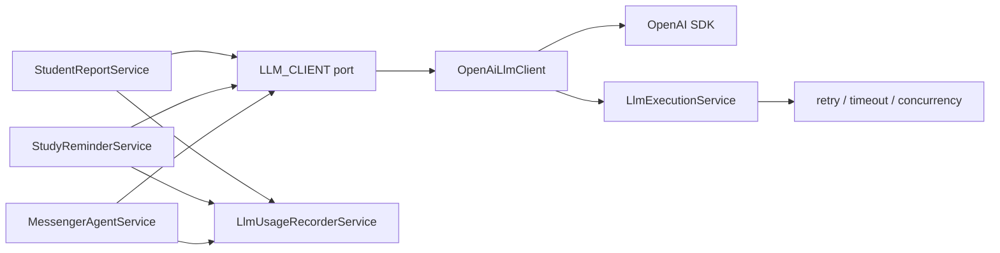

# LLM Provider Abstraction Plan

## 1. Document purpose

This document analyzes the codebase's current hard dependency on the OpenAI SDK and proposes an intermediate interface so that in the future, switching to a different LLM provider requires minimal changes.

The scope of this document is analysis and implementation planning. No runtime code changes in this phase.

Main objectives:

- Reduce direct coupling between business services and the OpenAI SDK.
- Preserve the current behavior of the chatbot, learning reports, and study reminders in the initial phase.
- Separate the "model call" layer from the Messenger, Student Report, and Study Reminder business logic.
- Lay the groundwork for using OpenAI-compatible endpoints or other providers such as Anthropic, Gemini, local LLM, or internal gateways.
- Do not break existing Clean Architecture layers.

## 1b. Design decisions already finalized

These three points have been analyzed and decided — **no need to re-discuss during implementation**:

| # | Issue | Decision |
|---|-------|----------|
| 1 | `LlmFeature` / `LlmUsageFeature` / `LlmExecutionFeature` — 3 types with the same values | Consolidate in Phase 1: canonical `LlmFeature` in `llm-execution/domain`, the two old types become backward-compat aliases, delete after migration is complete |
| 2 | `LlmExecutionService.run()` signature | Keep `run<T>(fn, context?)` unchanged — no changes to avoid modifying all callers. Pseudo code in the document has been updated to match |
| 3 | Where `OpenAiLlmClient` reads config from | Inject `LlmExecutionConfigService`, add `getApiKey()` / `getModel()` / `getBaseUrl()` to it — single source of truth, no separate `ConfigService` injection in the adapter |

## 2. Problem statement

Currently the project uses OpenAI at multiple points in application services. This works well for the POC, but if we want to switch providers later, many places need modification:

- Change where the SDK is initialized.
- Change message format.
- Change tool/function calling format.
- Change response parsing.
- Change usage token tracking.
- Change retry/error detection.
- Change test mocks because tests use the OpenAI response shape.

In short: the business logic knows too much about OpenAI.

The biggest problem isn't just `new OpenAI(...)`. The harder part is that services depend on OpenAI's "communication language":

- `chat.completions.create(...)`
- `response_format: { type: 'json_object' }`
- `tools: [{ type: 'function', function: ... }]`
- `choice.message.tool_calls`
- `toolCall.function.arguments`
- `ChatCompletionMessageParam`
- `ChatCompletionToolMessageParam`
- `ChatCompletion`
- `usage.prompt_tokens`, `usage.completion_tokens`, `usage.total_tokens`

If switching to a model that only supports text completion, or a provider with a different function calling format, the agent layer will require the most changes.

## 3. Current coupling status in the codebase

### 3.1. Student Report

Main files:

- `src/modules/student-report/application/services/student-report.service.ts`

Current state of this service:

- Directly imports `OpenAI` from the `openai` package.
- Reads `OPENAI_API_KEY`.
- Reads `OPENAI_MODEL`.
- Creates its own client with `new OpenAI({ apiKey })`.
- Calls `client.chat.completions.create(...)`.
- Uses `response_format: { type: 'json_object' }`.
- Parses `response.choices[0]?.message?.content`.
- Calls `llmUsageRecorder.recordFromCompletion(...)` with raw OpenAI completion.

Coupling level: medium.

Reason: the service only needs JSON output. If there were a `generateJson(...)` interface, this part would be fairly easy to separate.

### 3.2. Study Reminder

Main files:

- `src/modules/study-reminder/application/services/study-reminder.service.ts`

This service is similar to Student Report:

- Directly imports `OpenAI`.
- Reads `OPENAI_API_KEY`, `OPENAI_MODEL`.
- Creates its own OpenAI client.
- Calls Chat Completions with JSON mode.
- Records usage from raw completion.
- Falls back to template when API key is missing or LLM fails.

Coupling level: medium.

Reason: same as Student Report — this is a JSON generation use case, less complex than an agent with tools.

### 3.3. Messenger Agent

Main files:

- `src/modules/messenger/application/agent/messenger-agent.service.ts`
- `src/modules/messenger/application/agent/messenger-agent.tools.ts`

Current agent:

- Directly imports `OpenAI`.
- Imports OpenAI message types:
  - `ChatCompletionMessageParam`
  - `ChatCompletionToolMessageParam`
- Caches `OpenAI` client within the service.
- Builds messages according to OpenAI role format.
- Calls `client.chat.completions.create(...)`.
- Passes `tools: MESSENGER_AGENT_TOOLS`.
- Uses `tool_choice: 'auto'`.
- Reads `choice.tool_calls`.
- Reads `toolCall.function.name`.
- Reads `toolCall.function.arguments`.
- Pushes assistant messages and tool messages in OpenAI format.
- Records usage per tool round using raw OpenAI completion.

Coupling level: high.

Reason: the agent doesn't just call the LLM once. It has a multi-round tool calling loop, using the OpenAI message shape to maintain conversation state. This is the part that requires the most careful design.

### 3.4. Tool schema

Main files:

- `src/modules/messenger/application/agent/messenger-agent.tools.ts`

Current tool schema exports typed:

```ts
import type { ChatCompletionTool } from 'openai/resources/chat/completions';

export const MESSENGER_AGENT_TOOLS: ChatCompletionTool[] = [
  {
    type: 'function',
    function: {
      name: 'get_user_profile',
      description: '...',
      parameters: { ... },
    },
  },
];
```

This causes the application layer to be tied to OpenAI types even though tool definitions are fundamentally a domain/application concept.

Coupling level: high but easy to fix with an adapter approach.

Solution: define tools in a provider-neutral format:

```ts
export interface LlmToolDefinition {
  name: string;
  description: string;
  parameters: Record<string, unknown>;
}
```

The OpenAI adapter maps to:

```ts
{
  type: 'function',
  function: {
    name,
    description,
    parameters,
  },
}
```

### 3.5. LLM usage tracking

Main files:

- `src/modules/llm-usage/application/services/llm-usage-recorder.service.ts`

This service currently imports:

```ts
import type { ChatCompletion } from 'openai/resources/chat/completions';
```

And the main method:

```ts
recordFromCompletion(input: {
  response: Pick<ChatCompletion, 'id' | 'usage'>;
})
```

Coupling level: medium.

Issues:

- The usage recorder currently knows the raw OpenAI completion.
- The DB field is named `openaiResponseId`.
- The cost config has "OpenAI invoice" wording.

Phase 1 solution:

- Keep `recordFromCompletion(...)` to avoid overly large diffs.
- Add a new method `recordFromLlmUsage(...)` or use the existing `recordUsage(...)`.
- Adapter returns normalized usage.
- New services call `recordUsage(...)` with normalized data.

Phase 2 solution:

- Rename the semantic field in the domain to `providerResponseId`.
- Keep the old DB column if no migration is desired yet, or add a separate migration if data normalization is needed.

### 3.6. Retry/error utils

Main files:

- `src/shared/utils/openai-error.utils.ts`
- `src/modules/llm-execution/application/services/llm-execution.service.ts`

Current `LlmExecutionService` uses:

```ts
isOpenAiRetryableError(error)
```

Coupling level: medium.

If using an OpenAI-compatible provider, this may still work short-term since HTTP errors are generally similar. But when switching to a different provider, retry logic should be based on normalized errors:

- rate limit
- timeout
- server error
- network error
- provider overloaded

Phase 2 solution:

- Rename `openai-error.utils.ts` to `llm-error.utils.ts`.
- Adapter can expose `normalizeError(error): LlmProviderError`.
- `LlmExecutionService` retries based on `LlmProviderError.retryable`.

### 3.7. Metrics wording

Main files:

- `src/modules/metrics/metrics.service.ts`

Current comments/help text use OpenAI wording:

- `Raw OpenAI API call duration`
- `OpenAI API call duration per feature, model, and tool round`

Coupling level: low.

This is primarily naming/observability. Can be changed to "LLM provider API call duration" in a cleanup phase.

### 3.8. Env config

Main files:

- `.env.example`
- `AGENTS.md`
- `docs/project-overview.md`

Current env vars:

- `OPENAI_API_KEY`
- `OPENAI_MODEL`
- `OPENAI_MAX_TOOL_ROUNDS`
- `OPENAI_MAX_CONTEXT_CHARS`
- `LLM_OPENAI_RETRY_MAX_ATTEMPTS`
- `LLM_OPENAI_RETRY_BACKOFF_MS`

Coupling level: medium.

Incremental solution recommended:

- Phase 1: don't change env vars to avoid breaking deploys.
- Phase 2: add generic env vars:
  - `LLM_PROVIDER=openai`
  - `LLM_API_KEY=...`
  - `LLM_MODEL=...`
  - `LLM_BASE_URL=...`
  - `LLM_MAX_TOOL_ROUNDS=...`
  - `LLM_MAX_CONTEXT_CHARS=...`
  - `LLM_RETRY_MAX_ATTEMPTS=...`
  - `LLM_RETRY_BACKOFF_MS=...`
- Keep `OPENAI_*` aliases for a while.
- Recommended precedence: `LLM_*` takes priority over `OPENAI_*`, but if `LLM_*` is missing, fall back to `OPENAI_*`.

## 4. Design objectives

### 4.1. Separate application from provider SDK

After completing the main phases, business services should not import the `openai` package.

Objective:

- `StudentReportService` only calls `LlmClientPort.generateJson(...)`.
- `StudyReminderService` only calls `LlmClientPort.generateJson(...)`.
- `MessengerAgentService` only calls `LlmClientPort.chatWithTools(...)`.
- `messenger-agent.tools.ts` does not import OpenAI types.

### 4.2. Preserve current behavior

Phase 1 should keep:

- Current prompts.
- Current JSON parsing and validation.
- Current fallback templates.
- Current tool execution flow.
- Current safety checks.
- Current rate limit/quota flow.
- Current or equivalent LLM usage tracking.

Do not change prompt/model behavior while doing abstraction. Doing so makes debugging harder if output changes.

### 4.3. Small interface, correct use case

Do not design an overly broad "support everything" interface. The current codebase has 2 use case groups:

1. Generate JSON for proactive content:
   - Student Report
   - Study Reminder

2. Chat agent with tool calling:
   - Free-form Messenger chat

So the initial interface only needs to cover 2 operations:

- `generateJson(request)`
- `chatWithTools(request)`

If embeddings, images, streaming, rerank, or speech are needed later, add separate interfaces.

### 4.4. Adapter responsible for provider-specific mapping

The OpenAI adapter should be the only place that knows:

- OpenAI SDK objects.
- OpenAI Chat Completion request shape.
- OpenAI tool schema shape.
- OpenAI response shape.
- OpenAI token usage shape.
- OpenAI retryable error shape (if needed).

Application services only see normalized types.

### 4.5. Do not remove safety boundaries

The current code has many important safety boundaries:

- `sanitizeUntrustedTextForLlm`
- `sanitizeToolResultContent`
- JSON output validation
- Fallback templates
- Grounding check for free-form chat
- Prompt injection detection before calling the model

The new interface must not bypass these steps.

Principles:

- Input sanitization stays in the application service or existing helper.
- The adapter does not sanitize business data itself.
- The adapter only maps the request to the provider.
- Business JSON parsing/validation stays in the service or existing parser helper.

## 5. Non-goals

Things that should NOT be done in the first abstraction phase:

- Do not switch providers immediately.
- Do not change the default model.
- Do not change prompts.
- Do not change Messenger reply format.
- Do not change the rate limit flow.
- Do not add new queues.
- Do not refactor the entire LLM usage schema immediately.
- Do not change DB migrations unless necessary.
- Do not remove `OPENAI_*` env vars immediately.
- Do not build complex multi-provider routing from the start.

## 6. Proposed architecture

### 6.1. Overview

The proposal adds a provider port within the existing LLM module, prioritizing expansion of `LlmExecutionModule` since this module already handles concurrency, timeout, and retry for LLM calls.

Diagram:



There are two design options:

### 6.2. Option A: Adapter only calls provider, service wraps execution/usage itself

Flow:

- Service builds request.
- Service calls `llmExecution.run(...)`.
- Inside the callback, service calls `llmClient.generateJson(...)` or `llmClient.chatWithTools(...)`.
- Service records usage from the normalized response itself.

Advantages:

- Small diff.
- Keeps current control in the service.
- Easy to migrate service by service.
- Lower risk of circular module dependencies.

Disadvantages:

- Each service still duplicates some execution/usage code.
- Adapter is not yet a full gateway.

Suitable for Phase 1.

### 6.3. Option B: Create a full LlmGatewayService orchestration

Flow:

- Service calls `llmGateway.generateJson(...)`.
- Gateway handles execution, retry, metrics, usage.
- Adapter only maps the provider.

Advantages:

- Cleaner business services.
- Centralized metrics/usage/error handling.
- Easy to add provider routing later.

Disadvantages:

- Larger diff.
- Easier to create circular dependencies with `LlmUsageModule`, `MetricsModule`.
- Requires more careful module boundary design.

Suitable for Phase 2 after the adapter is successfully separated.

### 6.4. Recommendation

Start with Option A, then gradually upgrade to Option B if too much logic is duplicated.

Reason:

- The codebase already has a working `LlmExecutionService`.
- `LlmUsageRecorderService` already exists and is injected into each service.
- Phase 1 needs to reduce lock-in, not rewrite orchestration.
- Lower regression risk.

## 7. Proposed interfaces

### 7.1. Provider token

Proposed file:

- `src/modules/llm-execution/application/ports/llm-client.port.ts`

```ts
export const LLM_CLIENT = Symbol('LLM_CLIENT');

export interface LlmClientPort {
  isConfigured(): boolean;
  getDefaultModel(): string;
  generateJson(request: LlmJsonRequest): Promise<LlmJsonResponse>;
  chatWithTools(request: LlmToolChatRequest): Promise<LlmToolChatResponse>;
}
```

### 7.2. Common types

Proposed file:

- `src/modules/llm-execution/domain/entities/llm.types.ts`

```ts
export type LlmProvider = 'openai' | 'openai-compatible' | 'anthropic' | 'gemini' | 'local';

export type LlmFeature =
  | 'FREE_FORM_CHAT'
  | 'STUDENT_REPORT'
  | 'STUDY_REMINDER';

export interface LlmUsage {
  promptTokens: number;
  completionTokens: number;
  totalTokens: number;
}

export interface LlmProviderMetadata {
  provider: LlmProvider | string;
  model: string;
  responseId?: string;
  usage?: LlmUsage;
}
```

**Decision on `LlmFeature` / `LlmUsageFeature` / `LlmExecutionFeature` — consolidate in Phase 1:**

The codebase currently has **3 types with the same values**:

| Type | Current file |
|------|-------------|
| `LlmExecutionFeature` | `llm-execution/application/services/llm-execution.service.ts` |
| `LlmUsageFeature` | `llm-usage/domain/entities/llm-usage.types.ts` |
| `LlmFeature` (new) | `llm-execution/domain/entities/llm.types.ts` |

To avoid having 3 types coexist, **Phase 1 consolidates immediately**:

1. Define the canonical type at `src/modules/llm-execution/domain/entities/llm.types.ts`:

```ts
export type LlmFeature =
  | 'FREE_FORM_CHAT'
  | 'STUDENT_REPORT'
  | 'STUDY_REMINDER';
```

2. `llm-execution.service.ts` — remove `LlmExecutionFeature`, alias it:

```ts
import type { LlmFeature } from '../../domain/entities/llm.types';
export type LlmExecutionFeature = LlmFeature; // backward compat alias, delete later
```

3. `llm-usage/domain/entities/llm-usage.types.ts` — remove `LlmUsageFeature`, alias it:

```ts
import type { LlmFeature } from '../../../llm-execution/domain/entities/llm.types';
export type LlmUsageFeature = LlmFeature; // backward compat alias, delete later
```

4. Current callers (`llm-usage-recorder.service.ts`, `student-report.service.ts`, etc.) don't need immediate changes because the aliases maintain type compatibility. Clean up alias names after the full migration is complete.

Acceptable dependency direction: `llm-usage/domain` → `llm-execution/domain` (type-only import, does not pull in NestJS DI). If the two modules are deployed separately later, extract to `src/shared/llm/`.

### 7.3. JSON generation request/response

```ts
export interface LlmJsonRequest {
  feature: LlmFeature;
  model?: string;
  correlationId?: string;
  systemPrompt: string;
  userContent: string;
  temperature?: number;
  maxOutputTokens?: number;
}

export interface LlmJsonResponse {
  content: string;
  metadata: LlmProviderMetadata;
}
```

OpenAI mapping:

```ts
client.chat.completions.create({
  model,
  response_format: { type: 'json_object' },
  messages: [
    { role: 'system', content: request.systemPrompt },
    { role: 'user', content: request.userContent },
  ],
});
```

Other providers may map differently:

- Anthropic: separate system, separate messages, JSON instruction in prompt or tool schema.
- Gemini: JSON response mime type if supported.
- Local LLM: prompt instruction + parser fallback.

### 7.4. Tool chat types

```ts
export type LlmMessageRole = 'system' | 'user' | 'assistant' | 'tool';

export interface LlmToolDefinition {
  name: string;
  description: string;
  parameters: Record<string, unknown>;
}

export interface LlmToolCall {
  id: string;
  name: string;
  argumentsJson: string;
}

export interface LlmMessage {
  role: LlmMessageRole;
  content?: string;
  toolCalls?: LlmToolCall[];
  toolCallId?: string;
}

export interface LlmToolChatRequest {
  feature: LlmFeature;
  model?: string;
  correlationId?: string;
  messages: LlmMessage[];
  tools: LlmToolDefinition[];
  toolChoice?: 'auto' | 'none';
  temperature?: number;
  maxOutputTokens?: number;
}

export interface LlmToolChatResponse {
  /**
   * Full assistant message for the caller to push into history for the next round.
   * message.toolCalls contains the list of tool calls if any.
   * Callers should not read tool calls from two places — only use message.toolCalls.
   */
  message: LlmMessage;
  /** Final text reply from the model if there is no tool call. */
  content?: string;
  metadata: LlmProviderMetadata;
}
```

**Reason for removing top-level `toolCalls`:**

The previous response had two redundant fields: `message.toolCalls` and top-level `toolCalls`. Callers didn't know which to read — especially in multi-round loops, this could cause silent bugs. The design is finalized: tool calls are only read from `response.message.toolCalls`. The `message` field is also what callers push into `messages[]` for the next round, so no need to separate it.

Pattern used in the agent loop:

```ts
// round ends with tool call
if (response.message.toolCalls?.length) {
  messages.push(response.message);
  for (const tc of response.message.toolCalls) { ... }
}

// round ends with text
if (!response.message.toolCalls?.length) {
  return this.finalizeAssistantContent(response.content);
}
```

OpenAI mapping:

- `LlmMessage.role = 'tool'` maps to OpenAI tool message.
- `LlmToolDefinition` maps to `ChatCompletionTool`.
- `LlmToolCall.argumentsJson` maps from `toolCall.function.arguments`.
- `LlmToolCall.name` maps from `toolCall.function.name`.
- `LlmToolCall.id` maps from `toolCall.id`.

### 7.5. Error model

Phase 1 can keep `isOpenAiRetryableError`.

Phase 2 should have:

```ts
export interface LlmProviderError {
  provider: string;
  status?: number;
  code?: string;
  retryable: boolean;
  reason:
    | 'rate_limit'
    | 'timeout'
    | 'server_error'
    | 'network'
    | 'auth'
    | 'bad_request'
    | 'unknown';
}
```

Adapter can have a helper:

```ts
normalizeLlmError(error: unknown): LlmProviderError;
```

Then `LlmExecutionService` retries based on `retryable`.

## 8. Detailed file plan

### 8.1. Add neutral LLM types

New file:

- `src/modules/llm-execution/domain/entities/llm.types.ts`

Contents:

- `LlmProvider`
- `LlmFeature` or reuse `LlmUsageFeature`
- `LlmUsage`
- `LlmProviderMetadata`
- `LlmJsonRequest`
- `LlmJsonResponse`
- `LlmMessage`
- `LlmToolDefinition`
- `LlmToolCall`
- `LlmToolChatRequest`
- `LlmToolChatResponse`

Implementation notes:

- Types must not import OpenAI.
- Types must not import NestJS.
- Types must not contain provider-specific required fields.
- For raw debugging, use optional `raw?: unknown`, but limit exposure to the application layer.

### 8.2. Add LLM client port

New file:

- `src/modules/llm-execution/application/ports/llm-client.port.ts`

Contents:

- `LLM_CLIENT` token.
- `LlmClientPort` interface.

Reason for placing in `application/ports`:

- Business services inject the port.
- Concrete implementation lives in infrastructure.
- Follows Clean Architecture: application depends on abstraction, infrastructure implements.

### 8.3. Add OpenAI adapter

New file:

- `src/modules/llm-execution/infrastructure/openai/openai-llm-client.service.ts`

Responsibilities:

- Reads config from `LlmExecutionConfigService` — **does not inject `ConfigService` directly**.
- Creates and caches OpenAI client.
- Implements `isConfigured()`, `getDefaultModel()`, `generateJson(...)`, `chatWithTools(...)`.
- Maps neutral tools/messages to OpenAI request via mapper.
- Maps OpenAI response to neutral response.
- Does not contain business prompts, does not sanitize, does not validate JSON output.

**Why use `LlmExecutionConfigService` instead of `ConfigService`:**

`LlmExecutionConfigService` is the single source of truth for LLM config in this module (retry, timeout, concurrency). If `OpenAiLlmClient` injected its own `ConfigService`, there would be two places reading the same env, causing drift when new env vars are added. Add `getApiKey()` and `getModel()` to `LlmExecutionConfigService` to centralize.

**Add to `LlmExecutionConfigService`:**

```ts
getApiKey(): string | undefined {
  return (
    this.configService.get<string>('LLM_API_KEY')?.trim() ||
    this.configService.get<string>('OPENAI_API_KEY')?.trim() ||
    undefined
  );
}

getModel(): string {
  return (
    this.configService.get<string>('LLM_MODEL')?.trim() ||
    this.configService.get<string>('OPENAI_MODEL')?.trim() ||
    'gpt-4o'
  );
}

getBaseUrl(): string | undefined {
  return this.configService.get<string>('LLM_BASE_URL')?.trim() || undefined;
}
```

Precedence: `LLM_*` takes priority over `OPENAI_*`, falls back to default if both are missing.

**Adapter pseudo code:**

```ts
@Injectable()
export class OpenAiLlmClient implements LlmClientPort {
  private client: OpenAI | null = null;

  constructor(private readonly config: LlmExecutionConfigService) {}

  isConfigured(): boolean {
    return Boolean(this.config.getApiKey());
  }

  getDefaultModel(): string {
    return this.config.getModel();
  }

  private getClientOrThrow(): OpenAI {
    if (!this.client) {
      const apiKey = this.config.getApiKey();
      if (!apiKey) throw new Error('LLM provider not configured: missing API key');
      this.client = new OpenAI({
        apiKey,
        baseURL: this.config.getBaseUrl(),
      });
    }
    return this.client;
  }

  async generateJson(request: LlmJsonRequest): Promise<LlmJsonResponse> {
    const client = this.getClientOrThrow();
    const model = request.model ?? this.getDefaultModel();

    const response = await client.chat.completions.create({
      model,
      response_format: { type: 'json_object' },
      messages: [
        { role: 'system', content: request.systemPrompt },
        { role: 'user', content: request.userContent },
      ],
    });

    const content = response.choices[0]?.message?.content;
    if (!content) {
      throw new Error('LLM returned empty content');
    }

    return {
      content,
      metadata: {
        provider: 'openai',
        model,
        responseId: response.id,
        usage: fromOpenAiUsage(response.usage),
      },
    };
  }
}
```

### 8.4. Add mapper for OpenAI messages/tools

New file, optional but recommended for isolated testing:

- `src/modules/llm-execution/infrastructure/openai/openai-llm.mapper.ts`

Contents:

- `toOpenAiMessages(messages: LlmMessage[])`
- `toOpenAiTools(tools: LlmToolDefinition[])`
- `fromOpenAiMessage(message)`
- `fromOpenAiUsage(usage)`

Reason for separating the mapper:

- Tool calling mapping is error-prone.
- Can be unit tested without mocking the OpenAI SDK.
- When adding other providers, the pattern is clear.

### 8.5. Update LlmExecutionModule provider binding

Modified file:

- `src/modules/llm-execution/llm-execution.module.ts`

Add provider and export:

```ts
import { OpenAiLlmClient } from './infrastructure/openai/openai-llm-client.service';
import { LLM_CLIENT } from './application/ports/llm-client.port';

@Module({
  providers: [
    LlmExecutionConfigService,
    LlmExecutionService,
    OpenAiLlmClient,
    {
      provide: LLM_CLIENT,
      useClass: OpenAiLlmClient,
    },
  ],
  exports: [LlmExecutionService, LlmExecutionConfigService, LLM_CLIENT],
})
export class LlmExecutionModule {}
```

`OpenAiLlmClient` is declared in `providers` so NestJS DI injects `LlmExecutionConfigService` into it — no manual instance creation in the factory.

Phase 2 if multi-provider via config is needed:

```ts
{
  provide: LLM_CLIENT,
  useFactory: (config: LlmExecutionConfigService, openai: OpenAiLlmClient) => {
    const provider = config.getProvider(); // 'openai' | 'openai-compatible'
    return openai; // currently only one adapter
  },
  inject: [LlmExecutionConfigService, OpenAiLlmClient],
}
```

Factory injects instances already resolved by NestJS — avoids losing the DI chain. When adding `AnthropicLlmClient`, inject it into the factory without modifying business code.

### 8.6. Update StudentReportService

Modified file:

- `src/modules/student-report/application/services/student-report.service.ts`

Changes:

- Remove `OpenAI` import.
- Inject `@Inject(LLM_CLIENT) private readonly llmClient: LlmClientPort`.
- Check `this.llmClient.isConfigured()` instead of reading `OPENAI_API_KEY` directly.
- Get model from `this.llmClient.getDefaultModel()` or let adapter default.
- Call `this.llmExecution.run(...)` as before.
- Inside callback, call `this.llmClient.generateJson(...)`.
- Record usage via `recordUsage(...)` from normalized response.

Pseudo code — keeps current `run<T>(fn, context?)` signature unchanged:

```ts
if (!this.llmClient.isConfigured()) {
  this.logger.warn('LLM provider missing, using fallback report content');
  return this.buildFallbackReport(...);
}

const response = await this.llmExecution.run(
  () =>
    this.llmClient.generateJson({
      feature: 'STUDENT_REPORT',
      systemPrompt,
      userContent,
      correlationId,
    }),
  { feature: 'STUDENT_REPORT', correlationId },
);

this.recordLlmUsage({
  feature: 'STUDENT_REPORT',
  userId,
  psid,
  response,
});
```

Tests to update:

- Do not mock the OpenAI SDK directly.
- Mock `LlmClientPort`.
- Assert service calls `generateJson(...)`.
- Assert fallback when `isConfigured()` returns false.
- Assert usage recorder receives normalized usage.

### 8.7. Update StudyReminderService

Modified file:

- `src/modules/study-reminder/application/services/study-reminder.service.ts`

Changes similar to Student Report.

Tests to update:

- Mock `LlmClientPort`.
- Keep fallback tests.
- Keep output parse/validate tests.
- Keep usage tests.

### 8.8. Update Messenger agent tools

Modified file:

- `src/modules/messenger/application/agent/messenger-agent.tools.ts`

Changes:

- Remove `ChatCompletionTool` import.
- Export `LlmToolDefinition[]`.

Before:

```ts
export const MESSENGER_AGENT_TOOLS: ChatCompletionTool[] = [...]
```

After:

```ts
export const MESSENGER_AGENT_TOOLS: LlmToolDefinition[] = [
  {
    name: 'get_user_profile',
    description: '...',
    parameters: { ... },
  },
];
```

The OpenAI adapter is responsible for wrapping into:

```ts
{
  type: 'function',
  function: tool,
}
```

### 8.9. Update MessengerAgentService

Modified file:

- `src/modules/messenger/application/agent/messenger-agent.service.ts`

This is the highest-risk phase.

Changes:

- Remove `OpenAI` import.
- Remove OpenAI-specific message types.
- Inject `LLM_CLIENT`.
- Build messages as `LlmMessage[]`.
- Call `llmClient.chatWithTools(...)`.
- Read `response.toolCalls`.
- After tool calls complete, push:
  - assistant message from `response.message`
  - tool message `{ role: 'tool', toolCallId, content }`
- Record usage from `response.metadata.usage`.

Pseudo flow:

```ts
const messages: LlmMessage[] = [
  { role: 'system', content: systemPrompt },
  ...historyMessages,
  { role: 'user', content: sanitizedUserText },
];

for (let round = 1; round <= maxToolRounds; round += 1) {
  const response = await this.llmExecution.run(
    () =>
      this.llmClient.chatWithTools({
        feature: 'FREE_FORM_CHAT',
        messages,
        tools: MESSENGER_AGENT_TOOLS,
        toolChoice: 'auto',
      }),
    { feature: 'FREE_FORM_CHAT', correlationId },
  );

  this.recordLlmUsage(response, round);

  // Tool calls only read from response.message.toolCalls — no top-level toolCalls.
  const toolCalls = response.message.toolCalls ?? [];

  if (toolCalls.length === 0) {
    return this.finalizeAssistantContent(response.content);
  }

  messages.push(response.message);

  for (const toolCall of toolCalls) {
    const toolResult = await this.executeToolCall(toolCall);
    messages.push({
      role: 'tool',
      toolCallId: toolCall.id,
      content: sanitizeToolResultContent(toolResult),
    });
  }
}
```

Points of caution:

- OpenAI requires assistant messages containing `tool_calls` to appear before the corresponding tool messages. Neutral messages should maintain this invariant as well.
- `toolCall.id` must be preserved exactly.
- `argumentsJson` remains a string to keep the current parsing logic.
- If another provider returns arguments as an object, the adapter stringifies to JSON string.
- If a provider doesn't natively support tool calling, a separate phase is needed to emulate tool calling via JSON protocol. Do not do this in this phase.

### 8.10. Update LlmUsageRecorderService

Modified file:

- `src/modules/llm-usage/application/services/llm-usage-recorder.service.ts`

Phase 1 adds a new method:

```ts
recordFromLlmResponse(input: {
  feature: LlmFeature;
  psid?: string;
  userId?: number;
  model: string;
  responseId?: string;
  usage?: LlmUsage;
  correlationId?: string;
  toolRound?: number;
}): void
```

This method calls `recordUsage(...)` internally.

Keep `recordFromCompletion(...)` temporarily so unmigrated parts still pass.

**Cleanup deadline:** `recordFromCompletion(...)` must be deleted **before Phase 3 ends**. If two usage-writing paths run in parallel indefinitely, it will be difficult to debug usage discrepancies between migrated and unmigrated services. Add `@deprecated` JSDoc to the method immediately when adding the new method so IDEs warn.

After all migrations are complete:

- Remove OpenAI imports from the usage recorder.
- Delete `recordFromCompletion(...)`.

### 8.11. Update tests

Tests that import OpenAI types need modification:

- `src/modules/student-report/application/services/student-report.service.spec.ts`
- `src/modules/study-reminder/application/services/study-reminder.service.spec.ts`
- `src/modules/messenger/application/agent/messenger-agent.service.spec.ts`
- `src/modules/llm-usage/application/services/llm-usage-recorder.service.spec.ts`

New tests to add:

- `src/modules/llm-execution/infrastructure/openai/openai-llm.mapper.spec.ts`
- `src/modules/llm-execution/infrastructure/openai/openai-llm-client.service.spec.ts`

**Why `OpenAiLlmClient` needs its own tests:**

Service tests (student-report, study-reminder, messenger-agent) mock `LlmClientPort` — they don't test the adapter. If `OpenAiLlmClient.chatWithTools(...)` is missing the `type: 'function'` wrapper in the tool schema, or maps the message order incorrectly, service tests still pass because they mock the port. Bugs only appear in real execution. Adapter-level tests are needed to catch issues early.

**Test split:**

`openai-llm.mapper.spec.ts` — tests pure mapping functions, no SDK mocking:

- `toOpenAiMessages(...)` preserves correct role/content/toolCallId
- `toOpenAiTools(...)` wraps correctly as `{ type: 'function', function: tool }`
- `fromOpenAiMessage(...)` maps correctly to `LlmMessage`
- `fromOpenAiUsage(...)` maps correctly when usage is `null` or `undefined`
- Tool call id is preserved exactly through round-trip

`openai-llm-client.service.spec.ts` — mocks OpenAI SDK client (does not mock `LlmClientPort`):

```ts
const mockCreate = jest.fn();
jest.mock('openai', () => ({
  default: jest.fn().mockImplementation(() => ({
    chat: { completions: { create: mockCreate } },
  })),
}));
```

Test cases to cover:

- `isConfigured()` returns false when API key is missing
- `generateJson(...)` returns `LlmJsonResponse` with complete metadata
- `generateJson(...)` throws when content is empty
- `chatWithTools(...)` with tool call response → `message.toolCalls` has all fields `id/name/argumentsJson`
- `chatWithTools(...)` with text response → `message.toolCalls` is `undefined` or empty array
- Fallback model when neither `LLM_MODEL` nor `OPENAI_MODEL` is set
- `fromOpenAiUsage` doesn't crash when SDK returns `usage: null`

Prioritize mapper tests first since they don't need SDK mocking. Add client spec tests after the mapper is stable.

### 8.12. Update docs/env

When code actually changes env vars or behavior, update:

- `.env.example`
- `AGENTS.md`
- `docs/project-overview.md`
- Optionally update `docs/llm-usage-tracking-plan.md` if usage field/provider semantics change.

For phases that only add interfaces and still use `OPENAI_*`, no `.env.example` changes needed yet.

## 9. Proposed implementation phases

### Phase 0: Design document

Objective:

- Document the current coupling status.
- Finalize the interface direction.
- Finalize the implementation phases.

Deliverable:

- `docs/llm-provider-abstraction-plan.md`

Risk:

- No runtime risk since no code is changed.

### Phase 1: Extract JSON generation for Student Report and Study Reminder

Objective:

- Create `LlmClientPort`.
- Create `OpenAiLlmClient`.
- Support `generateJson(...)`.
- Migrate `StudentReportService`.
- Migrate `StudyReminderService`.

Files:

- Add `src/modules/llm-execution/domain/entities/llm.types.ts`
- Add `src/modules/llm-execution/application/ports/llm-client.port.ts`
- Add `src/modules/llm-execution/infrastructure/openai/openai-llm-client.service.ts`
- Modify `src/modules/llm-execution/llm-execution.module.ts`
- Modify `src/modules/student-report/application/services/student-report.service.ts`
- Modify `src/modules/study-reminder/application/services/study-reminder.service.ts`
- Modify corresponding specs.

Acceptance criteria:

- `student-report.service.ts` does not import `OpenAI`.
- `study-reminder.service.ts` does not import `OpenAI`.
- Fallback behavior remains the same.
- JSON validation remains the same.
- Usage tracking still records tokens.
- Tests pass.

Risks:

- Usage tracking loses response id if mapping is incomplete.
- Old test error messages may need wording updated from "OpenAI" to "LLM provider".
- Some tests mocking the OpenAI SDK need rewriting.

Estimate:

- Small to medium.
- Should be done first because it's lower risk than the agent.

### Phase 2: Extract tool schema and Messenger Agent

Objective:

- Convert `MESSENGER_AGENT_TOOLS` to provider-neutral `LlmToolDefinition[]`.
- Implement `chatWithTools(...)` in the OpenAI adapter.
- Migrate `MessengerAgentService` to neutral `LlmMessage[]`.
- No more OpenAI types in Messenger agent application code.

Files:

- Modify `src/modules/messenger/application/agent/messenger-agent.tools.ts`
- Modify `src/modules/messenger/application/agent/messenger-agent.service.ts`
- Add or expand OpenAI mapper.
- Modify `messenger-agent.service.spec.ts`.

Acceptance criteria:

- `messenger-agent.service.ts` does not import `OpenAI`.
- `messenger-agent.tools.ts` does not import `ChatCompletionTool`.
- Multi-round tool calling still passes tests.
- Grounding warning logic still works.
- Tool result sanitization still runs.
- Context truncation still runs.
- Usage tracking still records per tool round.

Risks:

- Incorrect assistant/tool message ordering.
- Lost `tool_call_id`.
- Arguments parsed differently due to incorrect adapter stringification.
- Provider response empty handling has different wording.
- Many existing agent tests, rewrites need care.

Estimate:

- Medium to large.
- Should be done after Phase 1 to reduce blast radius.

### Phase 3: Normalize usage, retry, metrics wording

Objective:

- Remove OpenAI types from `LlmUsageRecorderService`.
- Change retry utility from OpenAI-specific to LLM provider generic.
- Change metrics help/comment to provider-neutral.
- Maintain compatibility with current DB.

Files:

- Modify `src/modules/llm-usage/application/services/llm-usage-recorder.service.ts`
- Modify `src/shared/utils/openai-error.utils.ts` or add `llm-error.utils.ts`
- Modify `src/modules/llm-execution/application/services/llm-execution.service.ts`
- Modify `src/modules/metrics/metrics.service.ts`
- Modify corresponding specs.

Acceptance criteria:

- No more OpenAI imports in `llm-usage` application service.
- Retry still covers 429 and 5xx.
- Metric names can be kept to avoid breaking dashboards, but help text is more generic.
- Existing tests pass.

Risks:

- Dashboard/alert if metric names change. Recommendation: don't change metric names in this phase, only change descriptions/comments.
- DB column `openaiResponseId` still has old naming. Renaming requires a separate migration, don't rush.

### Phase 4: Add OpenAI-compatible provider config

Objective:

- Allow using providers with OpenAI-compatible APIs via config.
- No business code changes.

Proposed env vars:

```env
LLM_PROVIDER=openai
LLM_API_KEY=...
LLM_MODEL=gpt-5.4
LLM_BASE_URL=
```

OpenAI-compatible:

```env
LLM_PROVIDER=openai-compatible
LLM_API_KEY=...
LLM_MODEL=...
LLM_BASE_URL=https://...
```

Compatibility:

- If `LLM_API_KEY` is missing, fall back to `OPENAI_API_KEY`.
- If `LLM_MODEL` is missing, fall back to `OPENAI_MODEL`.
- If `LLM_PROVIDER` is missing, default to `openai`.

Acceptance criteria:

- Current OpenAI setup still works without changing env vars.
- OpenAI-compatible endpoints work when `LLM_BASE_URL` is set.
- Docs clearly update env precedence.

Risks:

- Some OpenAI-compatible providers don't support tool calling correctly.
- Some providers don't support JSON mode.
- Usage tokens may be missing or have different fields.

Suggestions:

- Adapter should degrade gracefully:
  - If provider doesn't return usage, log a warning and record 0 tokens or skip usage per current policy.
  - If JSON mode is unsupported, can configure `LLM_JSON_MODE=prompt` in a later phase.

### Phase 5: Add non-OpenAI-compatible providers

Objective:

- Add real adapter for a different provider.
- No business service changes.

Examples:

- `AnthropicLlmClient`
- `GeminiLlmClient`
- `LocalHttpLlmClient`

Issues to resolve:

- Message mapping.
- System prompt mapping.
- Tool calling mapping.
- JSON output mode.
- Usage mapping.
- Retry/error mapping.

Acceptance criteria:

- Provider selected via `LLM_PROVIDER`.
- Business services unchanged.
- Adapter tests cover mapping.
- Manual smoke test with separate env vars.

Risks:

- Native tool calling differs per provider.
- Local models may not comply with JSON/tool protocol.
- Token usage/cost estimates are not comparable.
- Different model behavior may affect Vietnamese language quality.

Suggestions:

- Providers without native tool calling should be a separate phase.
- May need a `ToolCallingStrategy`:
  - `native`
  - `json-protocol`
  - `disabled`

## 10. Important implementation details

### 10.1. Do not leak raw provider types into application

Desired rule after migration:

```bash
rg "from 'openai'|from \"openai\"|openai/resources" src/modules/*/application src/modules/*/domain
```

Desired result:

- No OpenAI imports in application/domain, unless the file is within adapter infrastructure.

Adapter infrastructure allowed:

```bash
src/modules/llm-execution/infrastructure/openai/**
```

### 10.2. Preserve correlation id

Current LLM calls use correlation for logging/debugging usage.

The new interface should pass:

```ts
correlationId?: string;
```

The adapter doesn't necessarily send correlation to the provider, but response metadata/logging should keep correlation at the caller.

### 10.3. Preserve model in usage

Usage cost is currently estimated by model.

Normalized response must have:

```ts
metadata.model
```

Services should not try to guess the model after the call, because the adapter may choose a fallback model or the provider may rewrite the model name.

### 10.4. Preserve response id

OpenAI has `response.id`. Other providers may have different ids or none.

Normalized metadata:

```ts
responseId?: string;
```

The usage recorder in Phase 1 can map to the `openaiResponseId` DB field temporarily.

DB field names don't need to be renamed immediately since renaming is a separate scope.

### 10.5. JSON mode is not universal

OpenAI supports:

```ts
response_format: { type: 'json_object' }
```

Other providers may:

- Have their own JSON mode.
- Have schema mode.
- Have no JSON mode.

Therefore the interface should say "generateJson" at the contract level, not "response_format".

Adapter is responsible for using the best approach of the provider.

If the provider doesn't guarantee JSON, the adapter still returns text, and the current service parses/validates and falls back on invalid output.

**Contract on markdown fence:**

The adapter does **not** strip markdown fence (` ```json ... ``` `) from output before returning. Reason: the current parser helper in application services handles fences, and stripping in the adapter creates a hidden transformation that's hard to debug. The service knows the expected format, so the service handles it.

If a specific adapter needs to pre-process output (e.g., a provider always returns fences even with JSON mode), handle it in that adapter and document clearly in the adapter class.

### 10.6. Tool calling is not universal

OpenAI tool calling has this shape:

```ts
tool_calls: [
  {
    id,
    type: 'function',
    function: {
      name,
      arguments,
    },
  },
]
```

Other providers may use:

- `tool_use`
- `functionCall`
- JSON block
- Plain text protocol

Neutral `LlmToolCall` should keep minimum fields:

```ts
id: string;
name: string;
argumentsJson: string;
```

If the provider has no id, the adapter generates a fallback id based on position in the current response: `tool_call_${index}` with `index` counted from 0 in the `tool_calls` array of **that response**, not a global counter. A global counter would cause id mismatches if the request is retried because the adapter would continue counting while the agent loop has already reset messages to the previous state.

```ts
// Correct — index in the current response
const toolCalls = rawToolCalls.map((tc, index) => ({
  id: tc.id ?? `tool_call_${index}`,
  ...
}));
```

The caller ensures tool result messages use the correct id from the returned response, not regenerate it.

### 10.7. Fallback behavior

Current fallback when API key is missing:

- Student Report: fallback report content.
- Study Reminder: fallback reminder.
- Messenger Agent: fallback chat reply.

After abstraction, wording should change from:

- `OPENAI_API_KEY missing`

to:

- `LLM provider missing`

But consider that tests may assert the message. If a small diff is desired, keep the old message in Phase 1 and clean up later.

### 10.8. Config precedence

When adding generic env vars, recommended:

1. `LLM_*`
2. `OPENAI_*`
3. Default in code

Example:

```ts
const model =
  config.get<string>('LLM_MODEL')?.trim()
  || config.get<string>('OPENAI_MODEL')?.trim()
  || 'gpt-5.4';
```

Reason:

- Doesn't break current deploys.
- Allows gradual migration.
- When switching providers, no service changes needed.

### 10.9. Module dependency

Currently services already use:

- `LlmExecutionModule`
- `LlmUsageModule`
- `MetricsModule`

Avoid having `LlmExecutionModule` import `LlmUsageModule` in Phase 1, as it easily creates circular dependencies.

Therefore Phase 1 should let services call the usage recorder themselves as they do now.

If creating an `LlmGatewayService` later, design the module as:

```text
LlmGatewayModule
  imports:
    LlmExecutionModule
    LlmUsageModule
    MetricsModule
  exports:
    LlmGatewayService
```

Business modules import `LlmGatewayModule` instead of importing many individual services.

### 10.10. Test strategy

Tests should shift from "mock OpenAI completion" to "mock LlmClientPort response".

Example JSON response:

```ts
const llmJsonResponse = {
  content: '{"message":"..."}',
  metadata: {
    provider: 'openai',
    model: 'gpt-5.4',
    responseId: 'chatcmpl_test',
    usage: {
      promptTokens: 10,
      completionTokens: 5,
      totalTokens: 15,
    },
  },
};
```

Tool response test (tool calls only in `message.toolCalls`, no top-level `toolCalls`):

```ts
const toolResponse: LlmToolChatResponse = {
  message: {
    role: 'assistant',
    toolCalls: [
      {
        id: 'call_1',
        name: 'get_user_profile',
        argumentsJson: '{"userId":123}',
      },
    ],
  },
  content: undefined,
  metadata: {
    provider: 'openai',
    model: 'gpt-5.4',
    responseId: 'chatcmpl_test',
    usage: {
      promptTokens: 20,
      completionTokens: 8,
      totalTokens: 28,
    },
  },
};
```

Mapper tests should assert:

- Neutral tool maps correctly to OpenAI tool.
- OpenAI tool call maps correctly to neutral tool call.
- Tool arguments remain string.
- Missing usage doesn't crash.
- Empty content is handled by adapter or service per the chosen contract.

## 11. Migration checklist

### After Phase 1

```bash
rg "import OpenAI|openai/resources" src/modules/student-report src/modules/study-reminder
```

Desired result:

- No more direct OpenAI imports in these two modules.

Run:

```bash
npm run format:check
npm run lint
npm run typecheck
npm run test
npm run build
```

### After Phase 2

```bash
rg "import OpenAI|openai/resources|ChatCompletion" src/modules/messenger/application
```

Desired result:

- No more OpenAI imports/types in the Messenger application layer.

Additionally run:

```bash
npm run test -- messenger-agent.service.spec.ts
```

Then run the full gate:

```bash
npm run format:check
npm run lint
npm run typecheck
npm run test
npm run build
```

### After Phase 3

```bash
rg "openai/resources|ChatCompletion" src/modules/llm-usage src/modules/llm-execution src/shared
```

Desired result:

- Only in the OpenAI adapter or adapter tests.

### After Phase 4

Manual smoke test needs env vars:

```env
LLM_PROVIDER=openai-compatible
LLM_API_KEY=...
LLM_MODEL=...
LLM_BASE_URL=...
```

Smoke test use cases:

- Send free-form chat text without tool use.
- Send free-form chat text requiring tool use.
- Generate student report.
- Generate study reminder.
- Check usage log has records.
- Check fallback when provider errors.

## 12. Overall acceptance criteria

Abstraction can be considered complete when:

- No OpenAI SDK imports in business application services.
- OpenAI SDK only in `src/modules/llm-execution/infrastructure/openai/**`.
- Tool definitions in Messenger agent don't use OpenAI types.
- Usage recorder can receive normalized usage.
- Old `OPENAI_*` env vars still work.
- Generic `LLM_*` config path exists for new providers.
- Existing tests pass.
- Build passes.
- Docs updated.

Verification command:

```bash
rg "from 'openai'|from \"openai\"|openai/resources|ChatCompletion" src
```

Final desired result:

- Only in:
  - `src/modules/llm-execution/infrastructure/openai/**`
  - Adapter specs
  - Possibly legacy tests if final cleanup phase hasn't been done

## 13. Major risks and mitigation

### 13.1. Tool calling behavior changes slightly

Risk:

- Agent doesn't call tools when needed.
- Agent calls tools but with wrong arguments.
- Agent loop exceeds round limit.
- Tool result message doesn't match call id.

Mitigation:

- Migrate tool calling in a separate phase.
- Multi-round unit tests.
- Test cases with missing/invalid tool arguments.
- Test cases where model returns final answer after tool use.
- Keep `OPENAI_MAX_TOOL_ROUNDS` alias.

### 13.2. JSON output less stable with other providers

Risk:

- Provider doesn't support JSON mode.
- Output has markdown fence.
- Output missing fields.

Mitigation:

- Phase 1 still uses OpenAI JSON mode.
- Current parser/validator unchanged.
- For other providers, add adapter-specific JSON strategy.
- Don't trust output if validation fails, use fallback.

### 13.3. Usage tracking missing tokens

Risk:

- Provider doesn't return usage.
- Usage field has different name.
- Cost estimate wrong if model name differs.

Mitigation:

- `LlmUsage` optional in metadata.
- If usage is missing, log warning.
- Cost config uses normalized model key.
- Don't block user-facing flows due to usage tracking errors.

### 13.4. Retry with wrong provider

Risk:

- Retrying auth errors causes spam.
- New provider's 429/5xx not retried.

Mitigation:

- Normalize error by status/code.
- Test 429/5xx/401/400.
- Keep backoff env vars.

### 13.5. Module circular dependency

Risk:

- `LlmExecutionModule` imports `LlmUsageModule`, while another service imports both, creating a cycle.

Mitigation:

- Phase 1 adapter doesn't depend on usage.
- Usage stays at the caller.
- If gateway is needed, create a separate module.

## 14. Recommended specific implementation order

1. Add neutral types and `LLM_CLIENT` port.
2. Add OpenAI adapter supporting only `generateJson(...)`.
3. Bind `LLM_CLIENT` in `LlmExecutionModule`.
4. Migrate `StudentReportService`.
5. Migrate `StudyReminderService`.
6. Update tests for both services.
7. Run full verify.
8. Add tool/chat types and OpenAI mapper.
9. Migrate `MESSENGER_AGENT_TOOLS`.
10. Migrate `MessengerAgentService`.
11. Update agent tests.
12. Run full verify.
13. Normalize usage recorder.
14. Cleanup retry/metrics naming.
15. Add generic `LLM_*` env vars and docs.
16. Add OpenAI-compatible baseURL config.
17. Only after stabilizing, add other providers.

## 15. Implementation recommendation for the current repo

For the current codebase, the most reasonable approach is:

- Do Phase 1 first because it's lower risk and proves the interface works.
- Don't touch the Messenger agent in the same PR as Phase 1.
- Keep `OPENAI_*` env vars in Phase 1 to avoid breaking deploys.
- Add `recordFromLlmResponse(...)` but don't delete `recordFromCompletion(...)` yet.
- Write mapper tests before migrating the agent in Phase 2.
- Only rename OpenAI wording to LLM after application services no longer have direct OpenAI imports.

If speed is a priority, a small part of Phase 1 and Phase 3 can be combined:

- Add `recordFromLlmResponse(...)`.
- Let Student Report/Study Reminder use the new method.

But don't combine Phase 2 at the same time because agent tool-calling has the largest blast radius.

## 16. Conclusion

It's true that the project currently has a fairly hard dependency on OpenAI, especially in the Messenger agent because function calling directly uses OpenAI message/tool shapes.

However, lock-in can be reduced incrementally:

- Extract JSON generation first.
- Extract tool calling later.
- Normalize usage/retry/metrics last.
- Keep the OpenAI adapter as the first implementation so behavior doesn't change.

This approach makes it possible to switch to a different provider later mainly by adding a new adapter and config, rather than modifying individual business services.