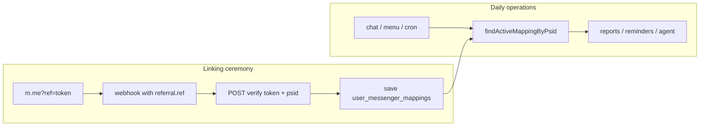

# Messenger ↔ WISPACE Linking — Current Flow, Security Flow & Wispace API

This document explains **what is currently done**, **what changes after L4**, who is responsible for which part, and the **API contract** the WISPACE team needs to implement.

Related: [messenger-link-security.md](./messenger-link-security.md) (solution trade-offs), [edge-cases-roadmap.md §1](./edge-cases-roadmap.md#1-liên-kết-messenger--wispace) (phase **L4**).

---

## Example Characters

| Character | Role |
|-----------|------|
| **Lan** | WISPACE student, `userId = 143` |
| **Hung** | Someone attempting to map their PSID to another person's account |
| **Bot** | Messenger POC (`demo_send_message_fb`) |
| **WISPACE** | App + student backend |

---

## 1. Current Behavior (not yet secure)

### Step 1 — WISPACE creates a link

```text
https://m.me/Page?ref=143&topic=IELTS&cadence=WEEKLY
                      ^^^
                      userId exposed directly in URL
```

### Step 2 — Lan opens the link → Meta sends webhook to Bot

```json
{
  "sender": { "id": "PSID_LAN" },
  "referral": { "ref": "143" }
}
```

### Step 3 — Bot trusts it without question

```typescript
// src/shared/config/poc.constants.ts — current
parseUserIdFromRef("143") → 143  // just parses number

// src/modules/messenger/application/services/messenger.service.ts
linkPsidFromContext("PSID_LAN", { userId: 143, ... })
// → INSERT user_messenger_mappings: PSID_LAN ↔ 143
```

### The Problem

Hung changes the URL to `ref=999`, opens it with his Messenger → Bot maps **PSID_HUNG ↔ 999** (another person's account).

Potential consequences include: the victim's study reminders / reports being sent to Hung's Messenger, and the chat agent misidentifying the account owner.

---

## 2. After Security Fix — Core Idea

> **Bot no longer trusts `ref` as `userId`.**
> `ref` is only a **temporary ticket (token)** issued by WISPACE for **exactly one logged-in user**.
> Bot **asks WISPACE**: "Who does this token belong to?" **before** saving the mapping.

---

## 3. New Flow — Step by Step

### Part A — WISPACE (user clicks button in app)

Lan is logged into WISPACE and clicks **「Connect Messenger」**.

```text
WISPACE App
    │
    ▼
POST /api/messenger/link-token    ← Lan's session; backend knows userId=143
    │
    ▼
WISPACE DB:
  token     = "abc-xyz-random"
  user_id   = 143
  expires_at = now + 30 minutes
  used_at   = NULL
    │
    ▼
Returns to app:
  url = "https://m.me/Page?ref=abc-xyz-random&topic=IELTS&cadence=WEEKLY"
```

**Key point:** `ref` is **no longer `143`** — it is a random string. If Hung changes `ref=999` on the URL, it **will not** map to a different userId (verify fails). Guessing a UUID token is practically impossible.

---

### Part B — User opens Messenger (Meta handles)

Lan clicks the link → opens Facebook Messenger → Meta sends webhook to Bot (same as before), but `ref` is now a **token**:

```json
{
  "sender": { "id": "PSID_LAN" },
  "referral": { "ref": "abc-xyz-random" }
}
```

---

### Part C — Bot verifies BEFORE saving mapping (main change in POC)

**Before (current code):**

```text
ref "143" → parseInt → userId=143 → save to DB
```

**After (new code):**

```text
ref "abc-xyz-random"
    │
    ▼
POST WISPACE /internal/messenger/verify-link-token
Body: { "token": "abc-xyz-random", "psid": "PSID_LAN" }
Header: X-Internal-Api-Key: {secret}
    │
    ▼
WISPACE checks:
  ✓ token exists?
  ✓ not expired (expires_at)?
  ✓ used_at = NULL? (not yet used — one-time)
    │
    ▼
Returns: { "valid": true, "userId": 143, "topic": "IELTS", "cadence": "WEEKLY" }
     + marks used_at = now()
    │
    ▼
Bot: linkPsidFromContext("PSID_LAN", { userId: 143, ... })
     → saves to user_messenger_mappings
```

**POC code idea** (not yet implemented — phase L4):

```typescript
async function resolveLinkFromRef(ref: string, psid: string) {
  const result = await wispaceClient.verifyLinkToken({ token: ref, psid });
  if (!result.valid) {
    return undefined; // no link; send message "link expired, reopen from app"
  }
  return {
    userId: result.userId,
    topic: result.topic,
    cadence: result.cadence,
    ref,
  };
}
```

Wire into the places calling `parseMessengerLinkContext` / `linkPsidFromContext` in `messenger.service.ts` (webhook opt-in, referral, messages with referral).

---

### Part D — Block relink (additional layer on top of POC)

Even if the token is valid, if **PSID is already mapped to user A** but the token belongs to **user B**:

```text
PSID_HUNG already mapped to user 100
New token for user 999 → verify OK → userId=999
    │
    ▼
MessengerMappingService: REJECT
  "This PSID is already linked to another account"
  (only ops can relink via POST /messenger/mapping/relink + API key)
```

Modify `relinkPsidToUserId` — **no** free-form upsert when `previousUserId !== newUserId`.

---

## 4. What If Hung Attacks?

| Attack method | Result |
|---------------|--------|
| Change `ref=999` (userId number) | Bot does not parse numbers → verify returns `NOT_FOUND` |
| Guess random token | Practically impossible (UUID/CSPRNG) |
| Steal Lan's link and forward it | Token is **one-time** — Lan uses it first → Hung gets `USED` |
| Token older than 30 minutes | `EXPIRED` → message to reopen from WISPACE app |

---

## 5. Who Does What

```text
┌─────────────────────────────────────────────────────────────┐
│  WISPACE (must implement)                                    │
│  • API to create token when user LOGS IN                    │
│  • messenger_link_tokens table                               │
│  • Verify API: receive token + psid → return userId, mark   │
│    used                                                      │
│  • App: do not construct ref=userId on the frontend          │
└─────────────────────────────────────────────────────────────┘
                            ▲
                            │ POST verify { token, psid }
                            │
┌─────────────────────────────────────────────────────────────┐
│  Messenger POC (our side)                                    │
│  • Webhook receives ref as before                            │
│  • REPLACE parseInt(ref) → call WISPACE verify API           │
│  • Block relink PSID to different user                       │
│  • Save mapping psid ↔ userId as before                      │
└─────────────────────────────────────────────────────────────┘
```

Messenger **does not** generate tokens on its own — it does not know who is logged into WISPACE. It only **asks WISPACE back** when the webhook contains `referral.ref`.

---

## 6. Comparison with Current Code

| | Current | After security fix (L4) |
|--|---------|------------------------|
| What does `ref` mean? | `userId` | Temporary ticket (token) |
| Who decides `userId`? | Bot self-parses via `parseInt` | **WISPACE** returns after verify |
| What does Bot send to WISPACE when linking? | Nothing | `{ token, psid }` |
| When is verify API called? | — | **Once** when webhook has `referral.ref` |
| Chat / reports / reminders afterward | Read from DB mapping | **No change** |

---

## 7. End-to-End Example

1. Lan logs into WISPACE → clicks 「Connect Messenger」
2. WISPACE creates token `t1`, attaches `userId=143`
3. Lan opens `m.me?ref=t1`
4. Meta webhook: `ref=t1`, `psid=111`
5. Bot → WISPACE: `{ "token": "t1", "psid": "111" }`
6. WISPACE: OK, `userId=143`, marks `t1` as used
7. Bot saves: `psid 111 ↔ user 143`
8. Lan chats 「check progress」→ bot reads mapping, **does not** call verify again

---

## 8. WISPACE Requirements — New APIs

WISPACE needs **2 APIs**: one for the **app** (create link), one for the **Messenger POC** (verify). Both use the `messenger_link_tokens` table.

### 8.1 Data Table (WISPACE DB)

```sql
CREATE TABLE messenger_link_tokens (
  token       VARCHAR(64) PRIMARY KEY,
  user_id     INTEGER NOT NULL,
  topic       VARCHAR(32) NOT NULL DEFAULT 'IELTS',
  cadence     VARCHAR(16) NOT NULL DEFAULT 'WEEKLY',
  expires_at  TIMESTAMPTZ NOT NULL,
  used_at     TIMESTAMPTZ,
  created_at  TIMESTAMPTZ NOT NULL DEFAULT now()
);

CREATE INDEX idx_messenger_link_tokens_user_id ON messenger_link_tokens (user_id);
CREATE INDEX idx_messenger_link_tokens_expires ON messenger_link_tokens (expires_at)
  WHERE used_at IS NULL;
```

| Column | Notes |
|--------|-------|
| `token` | UUID v4 or CSPRNG 32+ bytes, opaque |
| `user_id` | From session — **do not** accept from client |
| `expires_at` | Recommended `now() + 30 minutes` |
| `used_at` | Set when verify succeeds (one-time) |

---

### 8.2 API 1 — Create Link Token (called by WISPACE app)

Used when a student clicks 「Connect Messenger」in the app **while logged in**.

| | |
|--|--|
| **Method / path** | `POST /api/messenger/link-token` |
| **Auth** | Session cookie or `Authorization: Bearer {user_jwt}` — user must be logged in |
| **Who calls** | WISPACE frontend → WISPACE backend |
| **Messenger POC** | **Does not** call this API |

#### Request body (optional)

```json
{
  "topic": "IELTS",
  "cadence": "WEEKLY"
}
```

| Field | Required | Description |
|-------|----------|-------------|
| `topic` | No | Default `"IELTS"` |
| `cadence` | No | `DAILY` \| `WEEKLY` \| `MONTHLY`, default `WEEKLY` |

**Do not send `userId`** — backend gets it from the session.

#### Response `200 OK`

```json
{
  "token": "a1b2c3d4-e5f6-7890-abcd-ef1234567890",
  "expiresAt": "2026-06-14T15:30:00+07:00",
  "url": "https://m.me/YourFacebookPageId?ref=a1b2c3d4-e5f6-7890-abcd-ef1234567890&topic=IELTS&cadence=WEEKLY"
}
```

| Field | Type | Description |
|-------|------|-------------|
| `token` | string | Value placed in `ref` on `m.me` |
| `expiresAt` | ISO 8601 | Token expiration |
| `url` | string | Full link for the app to open / copy |

#### Error Responses

| HTTP | Example body | When |
|------|-------------|------|
| `401` | `{ "error": "UNAUTHORIZED" }` | Not logged in |
| `429` | `{ "error": "RATE_LIMITED" }` | Token creation too fast (optional) |

---

### 8.3 API 2 — Verify Link Token (called by Messenger POC)

Used **once** when Meta webhook reports a user just opened a link (`referral.ref`).

| | |
|--|--|
| **Method / path** | `POST /internal/messenger/verify-link-token` |
| **Auth** | `X-Internal-Api-Key: {INTERNAL_API_KEY}` or `Authorization: Bearer {INTERNAL_API_KEY}` |
| **Who calls** | **Messenger POC** |
| **Content-Type** | `application/json` |

#### Request body — **this is the payload Messenger sends**

```json
{
  "token": "a1b2c3d4-e5f6-7890-abcd-ef1234567890",
  "psid": "1234567890123456"
}
```

| Field | Required | Source (Messenger side) |
|-------|----------|-------------------------|
| `token` | Yes | `event.referral.ref` (or `optin.ref`, `message.referral.ref`) from Meta webhook |
| `psid` | Yes | `event.sender.id` from Meta webhook |

**Messenger does not send `userId`** — WISPACE looks it up from the token table.

#### Success Response `200 OK` (current WISPACE contract)

```json
{
  "success": true,
  "userId": 143,
  "username": "Tab Valenskyeee",
  "email": "billbonny29@gmail.com"
}
```

| Field | Type | Description |
|-------|------|-------------|
| `success` | boolean | `true` when token is valid |
| `userId` | number | Account owner linked to the token |
| `username` | string | Display name (optional, POC does not store) |
| `email` | string | Email (optional, POC does not store) |

Messenger POC maps default `topic` / `cadence` (`IELTS` / `WEEKLY`) when the API does not return those fields.

#### Success Response (old L4 draft — for reference)

```json
{
  "valid": true,
  "userId": 143,
  "topic": "IELTS",
  "cadence": "WEEKLY"
}
```

**Side effect (required):** in the same transaction, set `used_at = now()` for the token — **one-time**.

#### Failure Response

HTTP `400 Bad Request` or `409 Conflict` — uniform body:

```json
{
  "valid": false,
  "reason": "NOT_FOUND"
}
```

| `reason` | Meaning |
|----------|---------|
| `NOT_FOUND` | Token does not exist or `ref` is a legacy numeric userId |
| `EXPIRED` | `now() > expires_at` |
| `USED` | `used_at` already set — token already consumed |
| `INVALID_FORMAT` | Token is empty / malformed |

Messenger POC maps `reason` → user-facing message (e.g., 「Link expired, please reopen from the WISPACE app」).

#### Auth Error Response

| HTTP | Body |
|------|------|
| `401` / `403` | `{ "error": "UNAUTHORIZED" }` — wrong `X-Internal-Api-Key` |

---

### 8.4 Messenger POC Configuration (reference)

```env
MESSENGER_LINK_MODE=token
WISPACE_API_VERIFY_MESSENGER_TOKEN_URL=https://backend.aihubproduction.com/api/User/verify-messenger-token
WISPACE_INTERNAL_KEY=...
```

POC calls verify at points in `MessengerService.handleEvent` before `linkPsidFromContext`.

---

### 8.5 Two-Team Communication Checklist

**WISPACE:**

- [ ] `POST /api/messenger/link-token` (session auth)
- [ ] `messenger_link_tokens` table
- [ ] `POST /internal/messenger/verify-link-token` (API key)
- [ ] App uses `url` from API — does not build `ref={userId}` client-side
- [ ] Issues `INTERNAL_API_KEY` to Messenger service (or separate secret)

**Messenger POC (L4):**

- [ ] HTTP client calls verify with `{ token, psid }`
- [ ] Replace `parseUserIdFromRef` when `MESSENGER_LINK_MODE=token`
- [ ] Block relink PSID → different userId
- [ ] Feature flag `legacy` → `token` when WISPACE is ready

---

## 9. Operational Decisions (for discussion)

Team alignment notes — detailed security policy: [messenger-link-security.md §7](./messenger-link-security.md#7-quyết-định-thiết-kế-bàn-luận).

### 9.1 One-time Binding — No Per-Message Verify



After step 7 in [§7](#7-end-to-end-example) (mapping `psid ↔ userId` saved), all subsequent interactions **only read the DB** — no more `verify-link-token` calls.

### 9.2 Webhook Event Table — Who Verifies, Who Reads DB

| Event | Has `referral.ref`? | Calls WISPACE verify? | `userId` source | POC code (reference) |
|-------|---------------------|----------------------|-----------------|----------------------|
| Open `m.me?ref=token` first time | Yes | **Yes** (L4) | WISPACE returns after verify | `handleEvent` → `linkPsidFromContext` |
| `optin` with ref | Yes | **Yes** (L4) | As above | `event.optin` branch |
| Get Started immediately after link | Usually yes (`postback.referral`) | **Yes** if ref still present | As above | `handlePostbackEvent` |
| Get Started later (already linked) | Usually **no** | **No** | `resolveLinkContext` → DB | `handlePostbackEvent` |
| Menu 「Register for reports」 | **No** | **No** | DB mapping | `REGISTER_LEARNING_REPORT` → `registerForScheduledReports` |
| Free-form chat | **No** | **No** | `resolveUserId` → DB | `MessengerChatQueueService.enqueue` |
| Cron reports / dispatch reminders | — | **No** | Mapping by `psid` / `userId` | `ReportCronService`, `StudyReminderDispatchService` |

**Get Started** is usually the moment a user clicks for the first time after `m.me`, but the verify trigger is **the `ref` in the webhook**, not the `GET_STARTED` payload itself.

### 9.3 Menu 「Register for reports」— Expected Behavior

Persistent menu (`messenger-profile.service.ts` — payload `REGISTER_LEARNING_REPORT`):

1. `handlePostbackEvent` calls `resolveLinkContext(psid, event)`.
2. Postback **does not** carry `referral` → fallback to `findActiveMappingByPsid`.
3. Mapping exists → `registerForScheduledReports` (upsert subscription topic/cadence).
4. No mapping → `getMissingUserRefMessage()` — user must open link from WISPACE app.

**Does not** call verify when menu is clicked: no token; menu is an action on a PSID **already bound** previously. Same applies to chat, reports, reminders.

### 9.4 Relink — Current vs L4

| | Current code (L3) | After L4 |
|--|-------------------|----------|
| PSID mapped to A, webhook ref/token from user B | **Upsert** to B + `MAPPING_USER_ID_RELINK` | **Reject** + log `MAPPING_RELINK_BLOCKED` |
| Support account change | `POST /messenger/mapping/relink` | Unchanged (ops-only) |
| User self-change (production) | Not safe | WISPACE app: unlink → new token → re-link |

See [messenger-link-security.md §7.4](./messenger-link-security.md#74-policy-relink--l3-hiện-tại-vs-l4) for three relink approaches (ops / self-service / confirm).

### 9.5 Token TTL & Expiry UX

| Phase | Suggested `expires_at` |
|-------|----------------------|
| Pilot | `now() + 30 minutes` |
| Production | **15–30 minutes** + 「Regenerate link」button in app |

| Scenario | Result |
|----------|--------|
| Lan forwards link, Hung opens **before** Lan | Hung consumes token; Lan gets `USED` on verify |
| Token `EXPIRED` before first webhook | Bot reports expiry; user creates new link — **cannot** fix via menu/Get Started |
| Token `USED`, PSID already mapped | Reopening old URL → verify `USED`; chat/menu **still OK** via DB mapping |

One-time (`used_at`) is far more important than a very short TTL — TTL mainly reduces the window for unused links being forwarded.

### 9.6 Decision Matrix (Summary)

```text
Webhook event
│
├─ Has referral.ref (new token, not used)?
│   ├─ PSID not mapped → verify WISPACE → link
│   ├─ PSID mapped to same userId → idempotent (topic/cadence)
│   └─ PSID mapped to different userId → REJECT (except ops relink)
│
└─ No ref
    ├─ Has ACTIVE mapping → userId from DB
    └─ No mapping → MISSING_USER_REF
```

---

## 10. One-Line Summary

**WISPACE** issues a ticket (`token`) when user logs in; **Messenger** receives `ref` from Meta then sends `{ token, psid }` to WISPACE for verify — **once at link time**; afterward chat / menu / cron only read DB mapping.