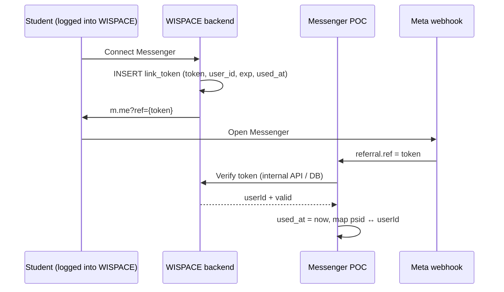

# Messenger ↔ WISPACE Link Security (`ref` / `userId`)

This document describes the **vulnerability** when passing a raw `userId` via the `ref` parameter on `m.me` links, possible **solutions**, **trade-offs**, and a **recommended roadmap** for production deployment.

Related: [project-overview.md](./project-overview.md) (link flow), [edge-cases-roadmap.md §1](./edge-cases-roadmap.md#1-liên-kết-messenger--wispace), code `src/shared/config/poc.constants.ts`, `MessengerMappingService`.

---

## 1. The Problem

### 1.1 Current POC State

The Messenger link from WISPACE looks like:

```text
https://m.me/{pageId}?ref={userId}&topic=IELTS&cadence=WEEKLY
```

Meta webhook sends `referral.ref` → POC parses integer → saves to `user_messenger_mappings` (`psid` ↔ `user_id`).

```typescript
// poc.constants.ts — trusts ref is a valid userId if it parses to a positive integer
parseUserIdFromRef(ref) → Number.parseInt(ref, 10)
```

**There is no verification step** that the person opening the link has the right to own that `userId`.

### 1.2 Risk (IDOR on Account Linking)

| Scenario | Consequence |
|----------|-------------|
| Change `ref=143` → `ref=999` on `m.me` URL, then open with own Messenger | Attacker's PSID maps to **victim's account** |
| PSID already linked to user A, open link with `ref` of user B | **Relink** to user B (L3 — `MAPPING_USER_ID_RELINK`) |
| Forward / leak link with valid `ref` | Someone else opens it first → takes over mapping |

**Data that could be exposed or misattributed:**

- **Study reminders:** sync job by `userId`, proactive message by mapped `psid` → user B's schedule could reach a stranger's Messenger.
- **AI reports:** cron sends by mapping; wrong `userId` context across the entire pipeline.
- **Chat agent:** tool/context misidentifies account owner (name, goals, calendar actions).
- Some Wispace APIs use `x-psid` — **not sufficient** to be considered safe; POC + shared DB still couples by `user_id` in many places.

### 1.3 Encoding / Obfuscation is **Not** a Solution

| Method | Prevents userId change? |
|--------|------------------------|
| `ref=143` (current) | No |
| Base64 / hex `userId` | No — decodable, or the full string can be copied |
| Hash `userId` (unsigned) | No — cannot verify, easy to brute-force small numbers |

**Proof of issuance from WISPACE** is needed (server-side signature or token), not just "hiding" the `userId`.

---

## 2. Solutions & Trade-offs

### 2.1 Keep `ref = userId` (status quo)

**Description:** No change; trust every positive-number `ref` from webhook.

| Pros | Cons |
|------|------|
| Simplest | **Not safe** for production |
| No additional Wispace coordination needed | `userId` enumeration, account takeover via relink |
| Easy to debug | No audit/revoke for links |

**Verdict:** Only acceptable for internal demos; **not** for real user go-live.

---

### 2.2 HMAC Signed Ref

**Description:** WISPACE (logged-in user) signs a payload; Messenger POC verifies before linking.

```text
ref = {userId}.{expUnix}.{signature}
signature = HMAC-SHA256("{userId}.{expUnix}", MESSENGER_LINK_SIGNING_SECRET)
```

**Flow:**

1. User logs into WISPACE → backend creates `ref` with `exp` (e.g., 24h).
2. User opens `m.me?ref=...`.
3. POC verifies signature + not expired → then `upsertPsidUserLink`.

| Pros | Cons |
|------|------|
| Fast to implement (~0.5–1 day) | `userId` is still **exposed** on URL |
| No DB token table needed immediately | Link can still be **shared/forwarded** within TTL |
| Shared secret — simple to sync between 2 services | Hard to **revoke** individual links (wait for `exp`) |
| Prevents `userId` tampering without the secret | Need additional policy to **block relink** of already-mapped PSID |

**Verdict:** **Temporary bridge** for urgent POC / pilot; should not be the production end state.

---

### 2.3 Opaque One-Time Token (recommended for production)

**Description:** `ref` is a random string (UUID / CSPRNG). `userId` **does not appear** on the URL. WISPACE stores the token server-side; POC verifies via internal API or shared DB.



**Suggested schema (WISPACE DB):**

```sql
CREATE TABLE messenger_link_tokens (
  token         VARCHAR(64) PRIMARY KEY,
  user_id       INTEGER NOT NULL,
  expires_at    TIMESTAMPTZ NOT NULL,
  used_at       TIMESTAMPTZ,
  created_at    TIMESTAMPTZ NOT NULL DEFAULT now()
);
CREATE INDEX idx_messenger_link_tokens_user ON messenger_link_tokens (user_id);
```

**Mandatory rules:**

| Rule | Reason |
|------|--------|
| Token is **one-time** (`used_at` set after successful link) | Prevents reuse / forwarding |
| Short TTL (15–30 minutes) | Reduces attack window |
| Only create token when WISPACE session is valid | Ensures account ownership |
| PSID mapped to user A + token from user B → **reject** | Prevents unauthorized relink |
| Ops relink via `POST /messenger/mapping/relink` + `INTERNAL_API_KEY` | Support use case |

| Pros | Cons |
|------|------|
| No `userId` exposure; per-token revoke | Needs table + verify API (WISPACE implements) |
| One-time + TTL — strongest for go-live | Adds 1 verify round-trip on webhook link |
| Clear audit (`created_at`, `used_at`) | POC depends on Wispace (or shared DB) |
| More GDPR / privacy-friendly than signed ref | Slightly higher effort than HMAC (~1–2 days total across 2 teams) |

**Verdict:** **Production end state** for real user deployment.

---

### 2.4 Short-Lived JWT in `ref` (optional, future phase)

**Description:** `ref` = JWT (claims: `sub=userId`, `exp`, `jti`), signed with secret or JWKS.

| Pros | Cons |
|------|------|
| Stateless verify (POC does not need DB token) | Meta `ref` limited to ~250 chars — JWT can be long |
| Industry standard | Still needs `jti` blacklist for one-time / revoke |
| | `userId` may still be in payload (if not encrypted) |

**Verdict:** Consider when JWKS infra exists; for current POC, **opaque token + DB** is simpler and clearer.

---

## 3. Comparison Summary

| Criteria | Raw `userId` | HMAC signed | One-time token |
|----------|-------------|-------------|----------------|
| Prevents change to different user | ✗ | ✓ | ✓ |
| Does not expose userId | ✗ | ✗ | ✓ |
| One-time / prevents forwarding | ✗ | ✗ | ✓ |
| Revoke individual link | ✗ | △ (wait for exp) | ✓ |
| Wispace effort | — | Low | Medium |
| Messenger POC effort | — | Low | Medium |
| Production ready | ✗ | △ (temporary) | ✓ |

---

## 4. Recommended Roadmap

### Phase L4 — Link Security (not yet implemented)

| Step | Task | Owner |
|------|------|-------|
| **L4.1** | `messenger_link_tokens` table + token creation API (login required) | WISPACE |
| **L4.2** | `POST /internal/messenger/verify-link-token` or query shared DB | WISPACE / POC |
| **L4.3** | POC: replace `parseUserIdFromRef` → verify token; reject raw numeric ref (feature flag) | POC |
| **L4.4** | Block relink PSID → different userId (except ops endpoint) | POC |
| **L4.5** | Log `LINK_TOKEN_OK` / `LINK_TOKEN_REJECT` / `MAPPING_RELINK_BLOCKED`; alert ops | POC |

**Urgent hotfix (before L4):** HMAC signed ref + block relink — max 1 day, with plan to remove once L4 is complete.

### Suggested Feature Flag

```env
MESSENGER_LINK_MODE=token
WISPACE_API_VERIFY_TOKEN_URL=...
WISPACE_INTERNAL_KEY=...
```

POC **only** supports `token` — `legacy` / `signed` has been removed; startup fails if verify URL is missing or `MESSENGER_LINK_MODE` is not `token`.

---

## 5. POC Code Changes (when implementing L4)

| File / module | Change |
|---------------|--------|
| `src/shared/config/poc.constants.ts` | `parseMessengerLinkContext` calls verify token instead of `parseInt(ref)` |
| `MessengerMappingService` | Reject relink if PSID is already ACTIVE and `userId` differs |
| `MessengerService.handleEvent` | Link only when verify OK; message `MISSING_USER_REF` / `LINK_TOKEN_INVALID` |
| `.env.example` | `MESSENGER_LINK_*` variables |
| WISPACE app | Generate `m.me` only via backend API, do not build URL client-side with `userId` |

**Internal verify API (suggested):**

```http
POST /internal/messenger/verify-link-token
Authorization: Bearer {INTERNAL_API_KEY}
Content-Type: application/json

{ "token": "8f3c...", "psid": "1234567890" }
```

```json
// 200
{ "valid": true, "userId": 143 }

// 400 / 409
{ "valid": false, "reason": "EXPIRED|USED|NOT_FOUND|PSID_ALREADY_LINKED" }
```

---

## 6. QA Checklist (before go-live)

- [ ] Open link with correct user → mapping `psid` ↔ `userId` correct
- [ ] Change `ref` / use another user's token → **no** link (or no relink)
- [ ] Reuse token that already has `used_at` → reject
- [ ] Expired token → reject + guide to create new link from app
- [ ] PSID linked to A, token from B → reject + log `MAPPING_RELINK_BLOCKED`
- [ ] Ops relink via API key still works
- [ ] Reminders / reports only go to correct PSID after valid link
- [ ] Click menu 「Register for reports」when already linked → uses DB mapping, **does not** call verify
- [ ] Click Get Started after already linked (no `referral.ref`) → uses DB mapping
- [ ] Token `USED` but PSID already mapped → chat/menu still OK; only rejects if attempting to re-link with old token

---

## 7. Design Decisions (for discussion)

Team alignment notes after reviewing the link flow — supplements to the above, **not yet implemented** (L4).

### 7.1 Two Phases: Binding vs Daily Behavior

| Phase | Purpose | Calls WISPACE verify? |
|-------|---------|----------------------|
| **Binding** (linking ceremony) | Prove which WISPACE user the Meta PSID belongs to | **Yes — once** when webhook has `referral.ref` / unused token |
| **Daily behavior** | Chat, menu, cron reports, reminders | **No** — reads `user_messenger_mappings` |

**Does not** verify every chat message: high latency, depends on WISPACE, adds no security if mapping is already correct. Similar to OAuth model — login once, then trust the persisted session (mapping).

Other Wispace APIs (e.g., `UserCalendar` via `x-psid`) are **data APIs**, not a replacement for **link verify**.

### 7.2 When to Trigger Verify? (Not Just Get Started)

Meta may send `referral.ref` in various webhook types — POC calls verify at **every location** where `linkPsidFromContext` is about to be called when `ref` is a new token:

| Webhook source | May have `ref`? |
|----------------|-----------------|
| `event.optin` | Yes (`optin.ref`) |
| `event.referral` alone | Yes |
| `event.message` + `message.referral` | Yes |
| `event.postback` (including `GET_STARTED`) + `postback.referral` | Yes — commonly seen **first** time opening thread from `m.me` |

Get Started **usually** coincides with the first-time binding, but the correct boundary is **「webhook carrying an unconsumed token」**, not the `GET_STARTED` payload itself. On subsequent visits Meta usually **does not** re-send `referral.ref` → bot falls back to `findActiveMappingByPsid`.

### 7.3 Menu / Post-Link After Already Linked — **No** Re-verify

Persistent menu 「Register for reports」(`REGISTER_LEARNING_REPORT`) and other postbacks **do not** carry `referral.ref`. Current code: `resolveLinkContext` → if event has no ref, reads DB mapping (`MessengerService.resolveLinkContext`).

| Behavior | `userId` source | Calls WISPACE verify? |
|----------|-----------------|----------------------|
| Report registration menu (already linked) | DB mapping | **No** |
| Menu when not linked | — | **No** (no token) → `MISSING_USER_REF`, guide to open link from app |
| Free-form chat | DB mapping | **No** |

Verify at menu click **does not help** users who never linked — there is no token to send. If concerned about stale mapping ownership: handle via **block relink (7.4)** + **revoke/unlink** on WISPACE, not per-menu verify.

*Future phase option:* if mapping is stale → send message to reopen app link — still **no** verify called from postback menu.

### 7.4 Relink Policy — Current L3 vs L4

**Current (L3):** `MessengerMappingService.relinkPsidToUserId` **allows** changing `userId` for the same PSID when webhook carries a new `ref`/token → logs `MAPPING_USER_ID_RELINK`. This is an IDOR vector when `ref=userId` is raw.

**L4 (recommended):**

| Scenario | Behavior |
|----------|----------|
| PSID not mapped + valid token | Link OK |
| PSID mapped to user A + token from user A (reopen link / update topic) | **Idempotent** — allow metadata update; if token already has `used_at`, skip verify, trust mapping |
| PSID mapped to user A + token from user B | **Reject** — `PSID_ALREADY_LINKED` / `MAPPING_RELINK_BLOCKED` |
| Genuine account change (support) | `POST /messenger/mapping/relink` + `INTERNAL_API_KEY` (already exists) |

**Three valid relink approaches (choose by phase):**

| Approach | Description | When to use |
|----------|-------------|-------------|
| **A — Ops-only** | Support verifies out-of-band → calls `mapping/relink` | Pilot / POC → initial production |
| **B — Self-service** | WISPACE app: 「Disconnect」→ revoke mapping → new token → re-link | Production scale |
| **C — Confirm on Messenger** | Postback confirmation before relink | Rarely needed; complex UX — **not** recommended as default |

### 7.5 Token TTL — Trade-offs

Doc recommends **15–30 minutes**. Balance:

| | Short TTL (5–15 min) | TTL 15–30 min (recommended) | Long TTL (HMAC bridge ~24h) |
|--|----------------------|----------------------------|-----------------------------|
| Window for unused forwarded link | Small | Medium | Large |
| UX (user opens link then does something else) | Easy `EXPIRED` | Balanced | Comfortable |
| One-time (`used_at`) | Blocks reuse even with long TTL | Same | None — only temporary HMAC |

**Note:** Meta does not send `referral.ref` forever. Token expires **before** first webhook → verify `EXPIRED` → user must create new link in app; **cannot** fix via Get Started/menu alone.

Token already `USED` but user reopens old URL: verify rejects, but if PSID is already mapped → chat/menu/cron **still uses DB mapping**.

WISPACE app should have a **「Regenerate link」** button for expiry.

### 7.6 Webhook Decision Matrix (POC)

```text
Webhook event
│
├─ Has referral.ref (new token, not used)?
│   ├─ PSID not mapped → verify WISPACE → link
│   ├─ PSID mapped to same userId → update topic/cadence if needed (idempotent)
│   └─ PSID mapped to different userId → REJECT (except ops relink)
│
└─ No ref (chat / menu / later Get Started)
    ├─ Has ACTIVE mapping → userId from DB
    └─ No mapping → MISSING_USER_REF / guide to open link from app
```

Detailed event flow per webhook type: [messenger-link-integration.md §9](./messenger-link-integration.md#9-quyết-định-vận-hành-bàn-luận).

---

## 8. One-Line Summary

**Production:** use **opaque one-time tokens** issued by WISPACE when user is logged in, POC verifies before mapping; **do not** trust `ref=userId` and **do not** allow free-form relink. **HMAC** is only a stopgap if shipping fast before L4.