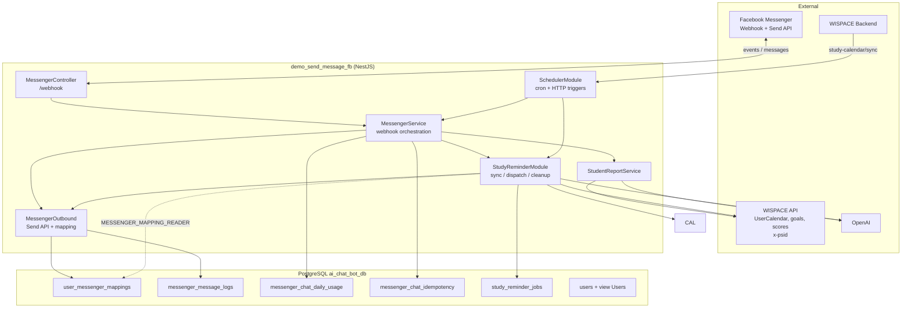

# POC Overview — WISPACE Messenger Bot

NestJS service connecting **WISPACE** (IELTS Writing learning platform) with **Facebook Messenger**: students link accounts via `m.me`, receive AI progress reports and study session reminders.

This is a **POC** — prioritizing fast shipping, separate PostgreSQL DB (`ai_chat_bot_db`) + Wispace HTTP API, not yet split into standalone microservices.

---

## 1. Current Features

### 1.1. Messenger ↔ WISPACE Linking

- Students open `m.me/{page}?ref={userId}&topic=...&cadence=...` links from WISPACE.
- Messenger webhook receives events → saves `user_id` ↔ `psid` to `user_messenger_mappings`.
- Bot menu (persistent menu): register for reports, view progress, preview upcoming study reminders.

### 1.2. Learning Reports (Exam Reminder Report)

- **Automatic:** cron **08:00** daily — sends reports to registered users within the **2–3 day** window before exam date (`WISPACE_REPORT_DAYS_BEFORE_EXAM_*`).
- **Manual:** menu **"View learning progress"** or `POST /messenger/send-reports`.
- Data: Wispace API (`TaskScoreAverage`, `User/goals`) → OpenAI → Vietnamese message.

### 1.3. Study Session Reminders

- **Automatic:** sync schedule → `study_reminder_jobs` table → dispatch **30 minutes** before class time (configurable via `.env`).
- **On schedule change:** Wispace calls `POST /messenger/study-calendar/sync` with `{ userId }` right after POST/DELETE `UserCalendar`.
- **Preview:** menu **"Upcoming study session"**.
- Schedule source: `UserCalendar` API (`x-psid`) — API-only (I3 ✓).
- Details: [study-session-reminder.md](./study-session-reminder.md).

### 1.4. Free-form Chat + Rate Limit (FREE_FORM)

- Users linked to WISPACE can **send text** → bot replies via LLM agent (`MessengerChatQueueService` debounce → `MessengerAgentService`).
- **Daily quota** per `(psid, usage_date)` ICT — `messenger_chat_daily_usage`; idempotency `message.mid` — `messenger_chat_idempotency`.
- **Burst** `CHAT_BURST_PER_MINUTE`/min; **hard cap** concurrent (H3); **hint** "X remaining" (Phase 6).
- Menu postback, cron reminders, proactive reports — **not** counted against quota.
- **1 instance:** `CHAT_QUEUE_STORE=memory` (RAM debounce). **≥2 pods:** `CHAT_QUEUE_STORE=redis` or `postgres` (`CHAT_QUEUE_SHARED=true` → postgres).
- Details + runbook: [chat-rate-limit-quota.md](./chat-rate-limit-quota.md), section 12 below.

---

## 2. Architecture



### Main Flows

| Flow | Trigger | Result |
|------|---------|--------|
| Registration / webhook | Meta sends POST `/webhook` | Save mapping, reply to message |
| Scheduled report | Cron 08:00 or postback | LLM report → Messenger |
| Schedule change | Wispace `POST /messenger/study-calendar/sync` | Sync jobs by `userId` |
| Study reminder (automatic) | 30-min cron sync + adaptive dispatch (S2) | Job queue → LLM reminder → Messenger |
| Free-form chat (text) | Webhook text → debounce queue | Reserve quota → LLM agent → Messenger |
| Ops / test | `POST /messenger/*` | Full sync, manual send |

### Responsibility Boundaries

| Component | This POC | WISPACE (External) |
|-----------|----------|-------------------|
| Messenger messages, bot menu | ✓ | |
| Mapping + logs + jobs tables | ✓ (migration) | |
| `UserCalendars`, user profiles | Read | ✓ owns data |
| Sync on schedule change | `POST /messenger/study-calendar/sync` | ✓ Wispace calls after POST/DELETE schedule |
| `UserCalendar` API, goals, scores | Call (x-psid) | ✓ hosts API |
| Call sync after schedule change | Receive `POST study-calendar/sync` | ✓ calls after POST/DELETE schedule |

---

## 3. Code Structure

Repo uses **Clean Architecture** — each feature in `src/modules/<name>/` has 4 layers: `domain` → `application` → `infrastructure` → `presentation`. Detailed rules: [AGENTS.md § Clean Architecture](../AGENTS.md#clean-architecture) and `.claude/rules/clean-architecture.md`.

```
demo_send_message_fb/
├── AGENTS.md                 # Guidelines for AI agents (Cursor, Claude, Codex)
├── docs/
├── scripts/                  # CLI utilities (not run during app runtime)
├── src/
│   ├── main.ts, app.module.ts
│   ├── shared/
│   │   ├── config/poc.constants.ts     # m.me links, parse ref/userId
│   │   ├── common/                     # InternalApiKeyGuard
│   │   └── prompts/                    # *.system.txt, load-system-prompt.ts
│   ├── infrastructure/database/
│   │   ├── database.module.ts
│   │   ├── data-source.ts              # TypeORM CLI → dist/infrastructure/database/
│   │   ├── typeorm.options.ts
│   │   ├── entities/
│   │   └── migrations/
│   └── modules/
│       ├── messenger/          # domain | application | infrastructure | presentation
│       │   └── messenger-outbound.module.ts   # Send API + mapping (breaks cycle)
│       ├── chat-rate-limit/    # daily quota + idempotency mid
│       ├── student-report/
│       ├── study-reminder/
│       └── scheduler/          # report cron + HTTP ops /messenger/*
├── .env.example
└── package.json
```

### NestJS Modules

| Module | Role |
|--------|------|
| `DatabaseModule` | TypeORM + PostgreSQL, auto migration on start |
| `MessengerOutboundModule` | Send API, `MessengerRepository`, ports `MESSAGE_SENDER`, `MESSENGER_MAPPING_READER` |
| `MessengerModule` | Webhook orchestration, profile menu, chat queue + agent |
| `ChatRateLimitModule` | FREE_FORM quota: `checkQuota`, `reserve`, `refund`, `.env` config |
| `StudentReportModule` | Wispace goals/scores → `StudentReportService` (LLM report) |
| `StudyReminderModule` | Schedule sync, job dispatch, cleanup, LLM study reminders |
| `SchedulerModule` | `ReportCronService`, HTTP ops endpoints |

`AppModule` imports `StudyReminderModule` directly. `StudyReminderModule` imports `MessengerOutboundModule` (not `forwardRef` with `MessengerModule`). Study reminder dispatch sends messages via port `MESSAGE_SENDER`, not by calling `MessengerService` directly.

---

## 4. Database

### Tables Created by POC (Migration)

| Table | Purpose |
|-------|---------|
| `user_messenger_mappings` | `user_id`, `psid`, `cadence`, `topic`, `status` |
| `messenger_message_logs` | Audit of sent / failed messages |
| `messenger_chat_daily_usage` | FREE_FORM chat quota counter per `(psid, usage_date)` |
| `messenger_chat_idempotency` | Idempotency `message.mid` on quota reserve |
| `study_reminder_jobs` | Study reminder queue (`pending` → `sent` / …) |
| `users` + view `"Users"` | Display name / exam date cache — only `user_id` with Messenger mapping; Redis `cache:user:display:{userId}` when R5 enabled |

Migration: `1717747200008-CreateMessengerUsersCacheTable`.

### WISPACE (HTTP API — no local tables except `users` cache)

| Source | Used For |
|--------|----------|
| `UserCalendar` API (`x-psid`) | Upcoming study schedule (API-only, I3 ✓) |
| `User/goals`, `TaskScoreAverage` API | Reports, exam date |

---

## 5. HTTP API

### Messenger (Public / Meta)

| Method | Path | Description |
|--------|------|-------------|
| GET | `/webhook` | Meta webhook verification |
| POST | `/webhook` | Receive messaging events (guard `X-Hub-Signature-256` when `MESSENGER_WEBHOOK_SIGNATURE_VERIFY` enabled) |
| POST | `/messenger/profile/setup` | Configure get started + persistent menu (requires `INTERNAL_API_KEY`) |

`m.me` links are only issued by the **WISPACE backend** (opaque token) — no more `GET /messenger/m-me-link`.

### Operations & Wispace Integration

All endpoints below require header **`X-Internal-Api-Key`** (or `Authorization: Bearer …`) matching `INTERNAL_API_KEY` in `.env`.

| Method | Path | Body | Description |
|--------|------|------|-------------|
| POST | `/messenger/study-calendar/sync` | `{ "userId": number }` | **Wispace calls** after POST/DELETE `UserCalendar` |
| POST | `/messenger/send-reports` | `{ "psid"?: string, "allowDuplicate"?: boolean }` | Ops send report: bypass exam window; default skips already sent today |
| POST | `/messenger/send-reports/retry-dispatch` | — | Manually run R5 outbox dispatch |
| POST | `/messenger/sync-study-reminders` | — | Sync all users (ops / fallback cron) |
| POST | `/messenger/send-study-reminders` | — | Sync + dispatch due jobs |
| POST | `/messenger/profile/setup` | — | Configure bot menu (ops) |
| GET | `/messenger/ops/llm-usage/summary` | Query: `psid` **or** `userId`; `from`/`to` (YYYY-MM-DD, default today) | Total tokens + estimated USD by feature for one student |
| GET | `/messenger/ops/llm-usage/fleet` | Query: `date` (YYYY-MM-DD, default today) | Total tokens + estimated USD fleet-wide by feature |

Internal cron (30-min sync, adaptive dispatch) does **not** go through HTTP — no API key needed.

---

## 6. Cron Jobs

| Name | Schedule | Service |
|------|----------|---------|
| `exam-reminder-report` | `0 8 * * *` (08:00) | `ReportCronService` |
| `study-reminder-sync` | Every 30 minutes | `StudyReminderWorkerService` |
| `study-reminder-dispatch` | Adaptive 30s–3.5 min (`STUDY_REMINDER_POLL_*`) | `StudyReminderWorkerService` — S2 ✓ |
| `study-reminder-cleanup` | `0 0 3 * * *` (03:00) | Delete old terminal jobs |
| `messenger-message-log-cleanup` | `0 0 3 1 * *` (03:00 1st of each month, ICT) | Delete `messenger_message_logs` older than `MESSENGER_MESSAGE_LOG_RETENTION_DAYS` (default 90) |
| `messenger-chat-queue-flush` | Every 2 seconds (when `CHAT_QUEUE_STORE` ≠ memory) | Poll redis buffer → flush |

Study reminder sync also runs **on server start** (`onModuleInit`).

---

## 7. OpenAI & Prompts

System prompts are in `src/shared/prompts/*.system.txt`, loaded via `load-system-prompt.ts`. Nest copies them to `dist/shared/prompts/` on build (`nest-cli.json` → `assets`).

| File | Used By |
|------|---------|
| `student-report.system.txt` | `modules/student-report/application/services/student-report.service.ts` |
| `study-reminder.system.txt` | `modules/study-reminder/application/services/study-reminder.service.ts` |
| `messenger-chat.system.txt` | `modules/messenger/application/agent/messenger-agent.service.ts` |

Missing `OPENAI_API_KEY` → falls back to hardcoded template in service (no API call).

All `chat.completions.create` calls go through **`LlmExecutionService`** (`src/modules/llm-execution/`) — in-process concurrency cap (`p-limit`, `LLM_MAX_CONCURRENT`), 429/5xx retry (`LLM_OPENAI_RETRY_*`). Disable gate: `LLM_EXECUTION_ENABLED=false`. Scale ≥2 pods: in-memory gate is **not** shared cross-pod — need Redis gate later.

LLM safety:

- `MessengerAgentService` blocks English/Vietnamese prompt-injection before OpenAI, redacts malicious history, caps context and sanitizes JSON tool results.
- External data from WISPACE/user profiles for reminders/reports must be sanitized via `src/shared/utils/prompt-injection.utils.ts`.
- JSON output from OpenAI must be parsed + shape-validated via `src/shared/utils/llm-json-output.utils.ts`; malformed output falls back to template, no direct type-cast formatting.

---

## 8. `.env` Configuration

See `.env.example`. Main groups:

- **Meta:** `PAGE_ACCESS_TOKEN`, `VERIFY_TOKEN`, `MESSENGER_APP_SECRET`, `MESSENGER_WEBHOOK_SIGNATURE_VERIFY`, `MESSENGER_PAGE_ID`, `GRAPH_API_VERSION`
- **OpenAI:** `OPENAI_API_KEY`, `OPENAI_MODEL`
- **LLM execution gate:** `LLM_EXECUTION_ENABLED`, `LLM_MAX_CONCURRENT`, `LLM_OPENAI_RETRY_MAX_ATTEMPTS`, `LLM_OPENAI_RETRY_BACKOFF_MS`
- **LLM usage (C2):** `LLM_USAGE_*`, `LLM_USAGE_BULLMQ_*`; USD estimate: `LLM_COST_USD_PER_1M_INPUT_TOKENS_<MODEL>` / `LLM_COST_USD_PER_1M_OUTPUT_TOKENS_<MODEL>` (e.g. `gpt-5.4` → `GPT_5_4`: input `2.50`, output `15.00` per [OpenAI pricing](https://developers.openai.com/api/docs/pricing); ≠ actual invoice)
- **Wispace API:** `WISPACE_API_USER_CALENDAR_URL`, `WISPACE_API_USER_GOALS_URL`, `WISPACE_API_TASK_SCORE_URL`, `WISPACE_INTERNAL_KEY` — auth: `x-psid` + `X-Internal-Key`
- **Study reminder:** `STUDY_REMINDER_*` — **mandatory**, no hardcoded fallbacks in code
- **Chat rate limit:** `CHAT_RATE_LIMIT_ENABLED`, `CHAT_FREE_FORM_DAILY_LIMIT`, `CHAT_BURST_PER_MINUTE`, `CHAT_BURST_STORE` (R3), `CHAT_USAGE_TIMEZONE`, `CHAT_RATE_LIMIT_WHITELIST_PSIDS`, `CHAT_QUOTA_REMAINING_HINT_THRESHOLD`, `CHAT_IDEMPOTENCY_STUCK_RESERVED_MS` (H2), `CHAT_MERGED_TEXT_MAX_CHARS` / `CHAT_BURST_COUNT_REFUNDED` (H5), `CHAT_IDEMPOTENCY_RETENTION_DAYS` (H6)
- **Chat queue:** `CHAT_DEBOUNCE_MS`, `CHAT_MAX_BUBBLES`, `CHAT_BUBBLE_MAX_CHARS`, `CHAT_QUEUE_STORE` (R4), `CHAT_QUEUE_SHARED` (H7 legacy), `CHAT_HISTORY_STORE` (R1), `CHAT_DEDUPE_STORE` (R2), `CHAT_QUEUE_PROCESSING_STUCK_MS`, `CHAT_WEBHOOK_DEDUPE_RETENTION_MS`, `CHAT_HISTORY_TTL_MS`, `CHAT_HISTORY_MAX_MESSAGES`
- **Ops API:** `INTERNAL_API_KEY` — header `X-Internal-Api-Key` for sync / send-reports / profile setup
- **Exam reports:** `WISPACE_REPORT_DAYS_BEFORE_EXAM_MIN/MAX`
- **DB:** `DB_HOST`, `DB_PORT`, `DB_NAME` (`ai_chat_bot_db`), `DB_USER`, `DB_PASSWORD`, `DB_MIGRATIONS_RUN`
- **Redis (optional, VPS):** `REDIS_ENABLED`, `REDIS_HOST`, `REDIS_PORT`, `REDIS_PASSWORD` — R0–R4 stores + R5 user display cache; `GET /health/redis` when enabled
  - Redis runs **standalone on VPS** (folder `~/redis`, Docker publish `6379`) — not in the app repo. Local + prod share `REDIS_HOST` = VPS IP.
- **User display cache (R5):** `USER_DISPLAY_NAME_CACHE_ENABLED`, `USER_DISPLAY_NAME_CACHE_TTL_SECONDS`

---

## 9. NPM Scripts

```bash
npm run start:dev              # Dev server
npm run build                  # Compile + copy prompts
npm run migration:run          # Run migrations
npm run db:inspect             # Explore DB
npm run db:explore-study-schedule
npm run study-reminder:sync    # Build + migrate + sync + dispatch
npm run study-reminder:sync-only
npm run study-reminder:jobs    # Print jobs in DB
npm run study-reminder:jobs -- --failed   # S1: terminal failed
npm run study-reminder:jobs -- --stuck    # S1: stuck processing
npm run ops:health             # I1+S1 combined ops snapshot
npm run chat-quota:status      # Query chat quota (psid / userId / day)
npm run chat-quota:status -- --ops   # I1 fleet summary
npm run chat-quota:status -- --psid=<psid> --date=2026-06-15
npm run chat-quota:recover-stuck   # H2: refund stuck reserved
npm run chat-quota:cleanup         # H6: delete old completed/refunded idempotency
npm run llm-usage:status           # Query LLM tokens (--psid, --user-id, --ops)
npm run chat-quota:rebuild         # Q1: rebuild daily counter from events
# Ops DB migrate (one-time):
node scripts/migrate-hub-to-chat-bot-db.mjs   # copy POC tables hub → ai_chat_bot_db
node scripts/drop-poc-tables-old-db.mjs       # drop POC + migrations on writing_ai_hub_db
```

---

## 10. POC Scope & Limitations

- **Single instance** — `CRON_LEADER_ENABLED=false` (default); enable `CHAT_RATE_LIMIT_ENABLED=true` on prod.
- **Scale ≥2 instances** — chat: `CHAT_QUEUE_SHARED=true` (H7); 08:00 report: `CRON_LEADER_ENABLED` + `messenger_scheduled_report_claims` table (R4 ✓). Prep runbook: [scale-phase-b-runbook.md](./scale-phase-b-runbook.md).
- **Messenger only** — users without mapped `psid` receive no messages.
- **Schedule integration** — Wispace calls `POST /messenger/study-calendar/sync` on schedule change (S0 ✓); 30-min cron is fallback only.
- **UserCalendar API** — requires `WISPACE_API_USER_CALENDAR_URL`; no more DB fallback.
- **Chat rate limit** — V1 + H1–H7 ✓; remaining project-wide gaps: [edge-cases-roadmap.md](./edge-cases-roadmap.md)

Detailed trade-offs for study reminders: section 11 in [study-session-reminder.md](./study-session-reminder.md).

---

## 12. Runbook — Chat Rate Limit (V1)

| Parameter | POC Recommended | Env |
|-----------|----------------|-----|
| FREE_FORM / day | 15–20 | `CHAT_FREE_FORM_DAILY_LIMIT` |
| Burst | 3/min | `CHAT_BURST_PER_MINUTE` |
| Timezone reset | 00:00 ICT | `CHAT_USAGE_TIMEZONE=Asia/Ho_Chi_Minh` |
| Enable enforcement | Prod POC | `CHAT_RATE_LIMIT_ENABLED=true` |
| QA unlimited PSIDs | Per team | `CHAT_RATE_LIMIT_WHITELIST_PSIDS` (comma-separated) |

**Ops quota query:**

```bash
npm run chat-quota:status
npm run chat-quota:status -- --psid=<PSID>
npm run chat-quota:status -- --user-id=143 --date=2026-06-15
```

**Quick disable on incident:** set `CHAT_RATE_LIMIT_ENABLED=false` and restart — no code revert needed.

**No quota deduction:** menu postback, cron reminders, 08:00 report, `CHAT_QUOTA_DENIED` / system error messages.

**Hardening H1–H7:** ✓ done — H2 recover stuck, H3 hard cap, H4 send semantics, H5 abuse caps, H6 retention/logs, H7 shared queue. Details: [§5.10](./chat-rate-limit-quota.md#510-edge-cases-thực-tế--roadmap-hardening-h1h7).

**Recover stuck reserved (H2):**

```bash
npm run chat-quota:status              # view stuckReserved + idempotency stats
npm run chat-quota:recover-stuck -- --dry-run
npm run chat-quota:recover-stuck
```

**Idempotency retention (H6):**

```bash
npm run chat-quota:cleanup -- --dry-run
npm run chat-quota:cleanup
# override: npm run chat-quota:cleanup -- --retention-days=60
```

Log grep (H6 / I1): `CHAT_QUOTA_DENY`, `CHAT_QUOTA_REFUND`, `CHAT_QUOTA_RECOVERED`, `OPS_HEALTH_ALERT`, `OPS_HEALTH_OK`.

**I1 — fleet ops summary:**

```bash
npm run chat-quota:status -- --ops
npm run ops:health
npm run ops:health -- --warn-only   # exit 1 on alert (external cron)
```

App log grep (Docker / PM2 / file):

```bash
grep CHAT_QUOTA_DENY /path/to/app.log | tail -20
grep CHAT_QUOTA_REFUND /path/to/app.log | tail -20
grep CHAT_QUOTA_RECOVERED /path/to/app.log | tail -20
grep OPS_HEALTH_ALERT /path/to/app.log | tail -20
```

Internal cron: `OpsHealthCronService` runs **09:00 ICT** daily (`OPS_HEALTH_ALERT_ENABLED=true`).

**S1 — failed / stuck reminders:**

```bash
npm run study-reminder:jobs -- --summary
npm run study-reminder:jobs -- --failed
npm run study-reminder:jobs -- --stuck
npm run study-reminder:jobs -- --failed --hours=48 --limit=20
```

Combined I1+S1 snapshot: `npm run ops:health`.

**Scale ≥2 instances (H7):**

```env
CHAT_QUEUE_SHARED=true
npm run migration:run
```

Each pod runs 2s cron poll buffer; debounce/history/`mid` dedupe stored in PostgreSQL.

Architecture details: [chat-rate-limit-quota.md](./chat-rate-limit-quota.md).

---

## 11. Quick Local Setup

```bash
cp .env.example .env   # fill in real tokens
npm install
npm run migration:run
npm run start:dev
```

Or **Doppler** (no `.env` on disk needed): see [doppler-secrets.md](./doppler-secrets.md) → `doppler setup` + `npm run start:dev:doppler`.

Meta webhook points to public URL (ngrok / tunnel) → `POST /webhook`.

After first deploy: `POST /messenger/profile/setup`.

Bootstrap study reminder jobs: `npm run study-reminder:sync`.

---

## 12. VPS Deploy (Docker + GHCR + Doppler)

GitHub Actions (push `main`): [`.github/workflows/deploy.yml`](../.github/workflows/deploy.yml) — **only builds image** when `src/`, `Dockerfile`, `package*.json` change; otherwise VPS reuses `:latest`. Env-only: Doppler webhook or [`sync-env.yml`](../.github/workflows/sync-env.yml) / `npm run env:sync-prod`.

| GitHub Secret | Purpose |
|---------------|---------|
| `VPS_HOST`, `VPS_USER`, `SSH_PRIVATE_KEY` | SSH deploy |
| `GHCR_PULL_TOKEN` | PAT `read:packages` — VPS `docker login ghcr.io` to pull private image |
| `DOPPLER_TOKEN` | Service token for **prd** config — downloads env → VPS on each deploy |

Image: `ghcr.io/<owner>/messenger-ai-for-student:latest` (tagged additionally with `:commit-sha`).

On VPS: `docker-compose.prod.yml` + `.env` at `/home/ngoc_anh/messenger-bot/`. Legacy PM2 `publish/` no longer used after migration.

**Prod public URL:** `https://aiassist.aihubproduction.com` (Nginx → `127.0.0.1:5007`). Docker binds **localhost only** — port `:5007` not exposed to internet. Nginx: `client_max_body_size` + rate limit on `POST /webhook` — see [`deploy/nginx/README.md`](../deploy/nginx/README.md).

When `DOPPLER_TOKEN` is present: CI `doppler secrets download` → SCP `production.env` → `.env`. No need to SSH-edit env manually.

Detailed project/config setup for `dev` + `prd`: [doppler-secrets.md](./doppler-secrets.md).
