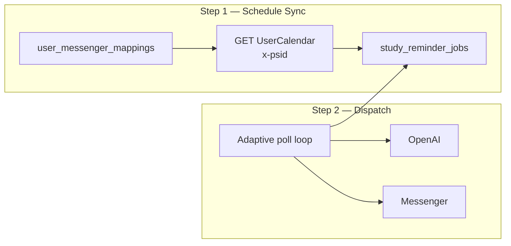
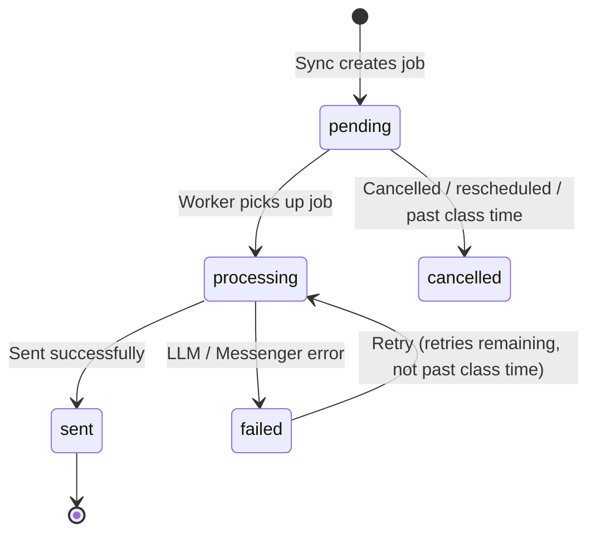
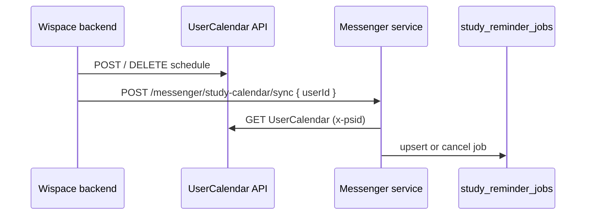
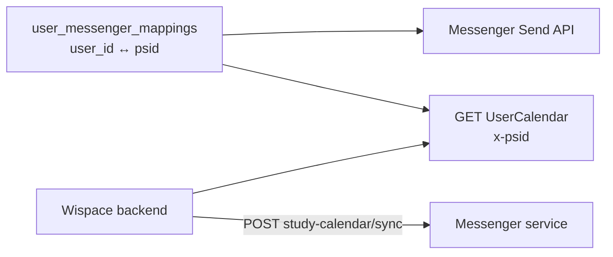
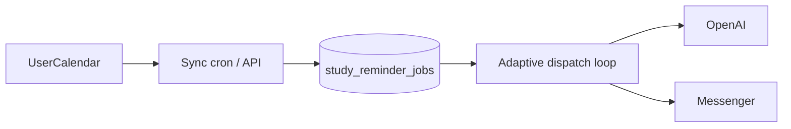

# Study Session Reminder via Messenger

This document describes the approach for delivering **friendly study session reminders** to IELTS students via Facebook Messenger, with content generated by LLM.

---

## 1. Goals

- Automatically remind students before class time (`STUDY_REMINDER_MINUTES_BEFORE` in `.env`, default 30 minutes).
- Personalized content: name, class time, suggested tasks, target band…
- Only sent to users who have **linked their Messenger** to a WISPACE account.
- Support **quick testing** via bot menu, without waiting for the automatic schedule.

---

## 2. Approach — Overview

The idea is to **write reminder jobs to DB first**, then **send messages via Messenger** at the right time. If sending fails, **retry** — the job remains in DB, it's not lost.



| Step | Frequency | What It Does |
|------|-----------|-------------|
| **Sync** | **API on schedule change** + 30-min cron (fallback) + on server start + **23:00 rollover** | Scan 14-day horizon → write/update `study_reminder_jobs` |
| **Dispatch** | **Adaptive** 30s–3.5 min (`STUDY_REMINDER_POLL_*`) | Job reaches `remind_at` → LLM generates content → send via Messenger |
| **Evening rollover** | **23:00** (`STUDY_REMINDER_TIMEZONE`) | Delete **`sent`** jobs → re-sync 14-day horizon |
| **Cleanup** | Daily at 03:00 | Delete `cancelled` / `failed` jobs with exhausted retries older than `JOB_RETENTION_DAYS` |
| **Preview** | On demand (bot menu) | Read schedule directly from API/DB — send immediately, no job queue |

---

## 3. Detailed Flow

### 3.1. Sync — Create Jobs from Study Schedule

There are **two sync modes** (same internal logic):

| Mode | Trigger | Scope |
|------|---------|-------|
| **Per user** | `POST /messenger/study-calendar/sync` `{ userId }` | Single user — Wispace calls after schedule change |
| **All users** | 30-min cron, server start, `POST /messenger/sync-study-reminders` | All ACTIVE mappings with `psid` |

For each synced user:

1. Fetch upcoming sessions from the **`UserCalendar` API** (header `x-psid`) — no more DB fallback.
2. For each session within the horizon (`STUDY_REMINDER_SYNC_HORIZON_HOURS`, default 14 days):
   - Calculate `remind_at = scheduled_at - STUDY_REMINDER_MINUTES_BEFORE`
   - UPSERT into `study_reminder_jobs` (`status = pending`)
3. Sessions that are cancelled / no longer on the schedule → `status = cancelled`

> **Integration Note (Required):** The 30-minute cron is only a safety net. Every time the study schedule changes (POST/DELETE `UserCalendar` or DB write) — the WISPACE system **must call the sync API** below immediately after commit. If only the cron is relied upon, students may receive reminders at the wrong time or not receive a reminder until 30 minutes after the schedule change.

**First-time bootstrap** (jobs table empty but DB has old schedule data):

```bash
npm run study-reminder:sync
```

### 3.2. Dispatch — Send Messages on Time

Every minute, fetch jobs matching:

- `status` = `pending` or `failed` (retries remaining)
- `remind_at <= now`
- `scheduled_at` still before class time (`> now + MIN_LEAD_MINUTES`)
- `next_retry_at` has arrived (if currently retrying)

For each job:



- Generate content via LLM (`StudyReminderService`) → send via port `MESSAGE_SENDER` (`MessengerOutboundService`)
- Success → `status = sent`
- Error → `retry_count++`, `next_retry_at = now + RETRY_BACKOFF_MINUTES` (up to `MAX_RETRIES`)
- Past class time → `cancelled`, no send

### 3.3. Cleanup & Evening Rollover

The `study_reminder_jobs` table is a **snapshot outbox** (send queue), not a historical store. Message audit lives in `messenger_message_logs`.

#### Evening Rollover (23:00, timezone `STUDY_REMINDER_TIMEZONE`)

Default sync horizon is **14 days** (`STUDY_REMINDER_SYNC_HORIZON_HOURS=336`). End of day:

1. **Delete all `sent` jobs** (already messaged today).
2. **Re-sync** all ACTIVE mappings → create `pending` jobs for sessions within the next 14 days.

Cron runs automatically; or invoke manually:

```http
POST /messenger/study-reminder/evening-rollover
X-Internal-Api-Key: ...
```

Rollover hour configured via `STUDY_REMINDER_EVENING_ROLLOVER_HOUR` (default **23**).

#### Deep Cleanup (03:00)

Delete terminal **`cancelled`** / **`failed`** (retries exhausted) jobs older than `STUDY_REMINDER_JOB_RETENTION_DAYS` (default 7 days). `pending` / `processing` / `failed` jobs with remaining retries are **not** touched.

#### When User Changes Schedule (Wispace)

| Flow | How Updated |
|------|-------------|
| **Outbox (T-30)** | `POST /messenger/study-calendar/sync` `{ "userId": 143 }` right after schedule commit |
| **Preview (menu)** | Reads directly from UserCalendar API/DB — always sees the latest schedule, no job sync needed |

Per-user sync will upsert `pending` jobs, cancel stale jobs, and **reopen `pending` jobs** when:

- A `sent` session has its **class time changed** (same `session_key`);
- A `cancelled` session **reappears** in the synced schedule (even at the same time).

`sent` is preserved if class time hasn't changed — avoids duplicate reminders.

### 3.4. Content Generation — LLM

`StudyReminderService` assembles context (schedule, goals, Task 1/2 band, **name from `Users.DisplayName`**) → calls **OpenAI** → formats message.

Display name: reads `Users` table by `user_id` (or maps `psid` → `user_id`). Fallback order: `DisplayName` → `Username` → `"Chào bạn nha"`.

Both automatic dispatch and menu preview use the same service. Missing `OPENAI_API_KEY` → falls back to template.

### 3.5. Quick Testing

| Method | Description |
|--------|-------------|
| Menu **"Upcoming study session"** | Sends preview of the very next session immediately |
| `POST /messenger/study-calendar/sync` | **Wispace calls after schedule change** (by `userId`) |
| `POST /messenger/sync-study-reminders` | Sync all users (ops / fallback) |
| `POST /messenger/send-study-reminders` | Sync + dispatch due jobs |
| `npm run study-reminder:jobs` | View job list in DB |

### 3.6. Sync API When Study Schedule Changes

`study_reminder_jobs` reflects a **snapshot** of the schedule at sync time. If the schedule changes without a timely sync call, old jobs remain `pending` → reminders sent at wrong times or for cancelled sessions.

**Requirement:** After each create / update / delete operation on the schedule (`POST` / `DELETE` `UserCalendar`), **Wispace must call** the Messenger service API:

```http
POST /messenger/study-calendar/sync
Content-Type: application/json

{ "userId": 2597 }
```

| Schedule Action | Wispace Does | Sync Service Does |
|----------------|-------------|-------------------|
| Create / change time | Call sync API with `userId` | GET `UserCalendar` (x-psid) → UPSERT jobs |
| Delete session | Call sync API with `userId` | Session no longer in API → `cancelled` |

Sample response:

```json
{
  "scope": "user",
  "userId": 2597,
  "linked": true,
  "mappings": 1,
  "upserted": 2,
  "cancelled": 1,
  "skipped": 0,
  "failures": []
}
```

`linked: false` — user has no Messenger mapping → no jobs created (200 OK, no error).

Sync is **per `userId`** — does not scan all mappings. 30-min cron + `POST /messenger/sync-study-reminders` are still used as fallback / ops tools.

**Example call from Wispace (after POST/DELETE `/api/UserCalendar`):**

```bash
curl -X POST https://{messenger-service}/messenger/study-calendar/sync \
  -H "Content-Type: application/json" \
  -H "X-Internal-Api-Key: ${INTERNAL_API_KEY}" \
  -d '{"userId": 2597}'
```

Or `Authorization: Bearer ${INTERNAL_API_KEY}`. The key value comes from `.env` (`INTERNAL_API_KEY`) — the **same secret** the WISPACE backend configures when calling this service.



---

## 4. Data Sources

### 4.1. `UserCalendar` API (Primary)

All requests use the **`x-psid`** header (Messenger PSID). Base URL: `WISPACE_API_USER_CALENDAR_URL`.

**GET** — list study sessions:

```http
GET /api/UserCalendar
x-psid: {messenger_psid}
```

```json
{
  "data": [
    {
      "id": 12,
      "userId": 2597,
      "eventDate": "2026-06-10T00:00:00Z",
      "time": "08:30",
      "createdAt": "2026-06-09T15:00:00Z"
    }
  ],
  "count": 1
}
```

**POST** — create study session:

```http
POST /api/UserCalendar
x-psid: {messenger_psid}
Content-Type: application/json

{ "eventDate": "2026-06-10T00:00:00Z", "time": "08:30" }
```

**DELETE** — delete study session:

```http
DELETE /api/UserCalendar/{id}
x-psid: {messenger_psid}
```

POC code: `UserCalendarApiService` (GET/POST/DELETE) + `UserCalendarScheduleService` (normalizes → `session_key: calendar:{id}`, combines `eventDate` + `time` per `STUDY_REMINDER_TIMEZONE`).

Every schedule change (POST/DELETE) **must call** `POST /messenger/study-calendar/sync` — see section [3.6](#36-api-sync-khi-lịch-học-thay-đổi).

### 4.2. Data for LLM

| API | Purpose |
|-----|---------|
| `WISPACE_API_USER_GOALS_URL` | `targetScore`, `examDate` |
| `WISPACE_API_TASK_SCORE_URL` | Task 1/2 band |

### 4.3. User Linking



Both Messenger and the Wispace API need **`psid`**. The `user_messenger_mappings` table is the bridge.

---

## 5. `study_reminder_jobs` Table

```sql
CREATE TABLE study_reminder_jobs (
  id              SERIAL PRIMARY KEY,
  psid            VARCHAR(64) NOT NULL,
  user_id         INTEGER,
  session_key     VARCHAR(128) NOT NULL,
  scheduled_at    TIMESTAMPTZ NOT NULL,
  remind_at       TIMESTAMPTZ NOT NULL,
  topic           VARCHAR(255),
  status          VARCHAR(20) NOT NULL DEFAULT 'pending',
  retry_count     INTEGER NOT NULL DEFAULT 0,
  max_retries     INTEGER NOT NULL DEFAULT 3,
  next_retry_at   TIMESTAMPTZ,
  last_error      TEXT,
  sent_at         TIMESTAMPTZ,
  created_at      TIMESTAMPTZ NOT NULL DEFAULT NOW(),
  updated_at      TIMESTAMPTZ NOT NULL DEFAULT NOW(),
  UNIQUE (psid, session_key)
);
```

| `status` | Meaning |
|----------|---------|
| `pending` | Waiting until `remind_at` |
| `processing` | Currently being sent |
| `sent` | Sent successfully |
| `failed` | Error — awaiting retry |
| `cancelled` | Cancelled / rescheduled / past class time |

Terminal jobs (`sent`, `cancelled`, `failed` with exhausted retries) are **permanently deleted** after `STUDY_REMINDER_JOB_RETENTION_DAYS` — see section 3.3.

---

## 6. Sample Message (LLM)

**OpenAI input** includes: name, class time, topic, target band, Task 1/2 band…

**Output** formatted as:

```
⏰ Time to Study!

Xin chào bạn,

Đây là lời nhắc thân thiện rằng bạn có buổi học sắp diễn ra:

📅 Hôm nay lúc 10:30

Don't forget to:
• Ôn lại các bài essay gần đây
• Luyện viết theo chủ đề IELTS Writing
• ...

Kiên trì luyện tập mỗi ngày sẽ giúp bạn tiến gần hơn tới mục tiêu IELTS.

Cố lên nhé! 💪
```

---

## 7. Code Structure

`study-reminder` module following Clean Architecture (see [AGENTS.md](../AGENTS.md#clean-architecture)):

```
src/modules/study-reminder/
├── study-reminder.module.ts
├── domain/
│   ├── entities/                      # study-schedule.types, study-reminder-job.types, …
│   └── repositories/
│       └── study-reminder-job.repository.port.ts
├── application/
│   ├── ports/
│   │   └── messenger-mapping.port.ts  # MESSENGER_MAPPING_READER — doesn't import MessengerModule
│   ├── services/
│   │   ├── study-reminder-sync.service.ts       # Sync schedule → jobs (all | per userId)
│   │   ├── study-reminder-dispatch.service.ts   # Dispatch + retry (MESSAGE_SENDER)
│   │   ├── study-reminder-cleanup.service.ts
│   │   ├── study-reminder-worker.service.ts     # Cron sync / dispatch / rollover
│   │   ├── study-reminder.service.ts            # LLM
│   │   ├── study-reminder-schedule.service.ts   # Calculate remind_at
│   │   ├── study-session-source.service.ts
│   │   └── user-display-name.service.ts
│   ├── messages/study-reminder.messages.ts
│   └── utils/study-reminder.utils.ts
└── infrastructure/
    ├── persistence/study-reminder-job.repository.ts
    └── wispace/
        ├── user-calendar-api.service.ts         # GET UserCalendar (x-psid)
        └── user-calendar-schedule.service.ts    # Normalize schedule from API (I3 API-only)

src/modules/scheduler/presentation/controllers/
  scheduler.controller.ts                # POST study-calendar/sync, sync-study-reminders, …

src/modules/messenger/
  application/services/messenger.service.ts      # Webhook + menu preview reminders
  application/services/messenger-outbound.service.ts  # Send API (MESSAGE_SENDER)
  infrastructure/meta/messenger-profile.service.ts

src/shared/prompts/
  study-reminder.system.txt              # OpenAI system prompt
```

**Dispatch:** `StudyReminderDispatchService` calls `StudyReminderService.generateReminderForSession` then `MESSAGE_SENDER.sendTextViaPsid` — does not import `MessengerService`.

---

## 8. `.env` Configuration

```env
WISPACE_API_USER_CALENDAR_URL=https://backend.aihubproduction.com/api/UserCalendar

STUDY_REMINDER_MINUTES_BEFORE=30
STUDY_REMINDER_MIN_LEAD_MINUTES=1
STUDY_REMINDER_SYNC_HORIZON_HOURS=336
STUDY_REMINDER_MAX_RETRIES=3
STUDY_REMINDER_RETRY_BACKOFF_MINUTES=2
STUDY_REMINDER_JOB_RETENTION_DAYS=7
STUDY_REMINDER_EVENING_ROLLOVER_HOUR=23
STUDY_REMINDER_TIMEZONE=Asia/Ho_Chi_Minh

OPENAI_API_KEY=sk-...
OPENAI_MODEL=gpt-5.4

# Ops / Wispace → sync, send-reports (header X-Internal-Api-Key)
INTERNAL_API_KEY=replace-with-a-long-random-secret
```

All time values are **mandatory in `.env`** — no hardcoding in code.

---

## 9. Deployment

```bash
# First time: migration + sync old schedule data into jobs
npm run study-reminder:sync

# View jobs
npm run study-reminder:jobs

# Update bot menu
POST /messenger/profile/setup
```

**Operations:**

- **Required:** Wispace calls `POST /messenger/study-calendar/sync` after every schedule change (see section 3.6).
- **Fallback:** Server sync on startup + 30-min cron.
- **Adaptive dispatch poll** (S2 ✓) — details: section [11.6](#116-worker-dispatch-polling--db-load-concerns--risk-mitigation).
- Evening rollover at 23:00 — delete `sent` jobs + re-sync horizon.
- Cleanup cron at 03:00 daily — delete terminal jobs older than `JOB_RETENTION_DAYS`.

---

## 10. Messenger Logging

| `message_type` | Meaning |
|----------------|---------|
| `STUDY_REMINDER:{timestamp}` | Automatic reminder via dispatch |
| `STUDY_SESSION_REMINDER_PREVIEW` | Menu test |
| `STUDY_SESSION_REMINDER_EMPTY` | No upcoming sessions |

Primary send status: `study_reminder_jobs.status`. `messenger_message_logs` used for audit.

---

## 11. Trade-offs — Strengths, Weaknesses & Improvement Directions

The **outbox table (`study_reminder_jobs`) + cron sync/dispatch** approach suits the Messenger POC: separate **`ai_chat_bot_db`** DB, small user scale, retry + audit without needing a separate message queue.

### 11.1. Why This Approach Makes Sense Now

| Advantage | Brief Explanation |
|-----------|-------------------|
| **Minimal new infrastructure** | No Redis/RabbitMQ needed; jobs live in the same Postgres as the app |
| **Clear retry & state** | `pending` → `sent` / `failed` / `cancelled` — easy to debug, no jobs lost on send errors |
| **Leverages Wispace API** | `UserCalendar` via `x-psid` — API-only (I3 ✓) |
| **Per-user sync** | Wispace calls one API after schedule change — no event bus / webhook needed |
| **Flexible LLM** | Personalized reminder content based on goals/band without maintaining multiple templates |
| **Separates sync from sending** | Schedule changes only need to re-sync jobs; no Messenger/LLM calls during schedule writes |

### 11.2. Weaknesses / Risks to Be Aware Of

| Issue | Description | Current Impact Level |
|-------|-------------|---------------------|
| **Schedule and jobs not instantly in sync** | Snapshot at last sync. If Wispace forgets to call sync API → up to ~30 min lag (cron fallback) | Low — **S0 ✓** wired sync after schedule change |
| **Depends on Wispace integration** | Wispace calls `POST /messenger/study-calendar/sync` after every schedule change | **Done (S0)** — keep monitoring if deploying new environments |
| **Depends on UserCalendar API** | Sync/dispatch needs stable Wispace API; no more DB `UserCalendars` reads | Medium — monitor 5xx |
| **Send time accuracy** | Adaptive poll: near `remind_at` → minimum 30s; no jobs → up to ~3.5 min | Low — acceptable with 30-min advance reminder |
| **Horizon limit** | Only syncs sessions within `SYNC_HORIZON_HOURS` (14 days). Further sessions don't have jobs until the next sync enters the window | Low for weekly schedules |
| **LLM called at dispatch** | Each job = 1 OpenAI call + goals/score API call → cost, latency, model errors can delay or fail reminders | Medium — has retry and template fallback |
| **Non-deterministic content** | Two reminders for the same session (preview vs auto) may have different wording due to LLM | Low |
| **Messenger channel only** | Users who haven't linked `psid` or blocked the bot → no reminders | High for unmapped users — by design |
| **Full-scan sync (cron)** | 30-min cron still scans **all** mappings — it's only a fallback; main flow syncs per `userId` | Low with few users; increases with scale |
| **Multiple app instances** | `claimJob` via DB prevents duplicate sends, but cron runs on every instance — needs monitoring on horizontal scale | Low at single instance |
| **Dispatch polling** | ~~Fixed 1 minute~~ → **S2 ✓ adaptive** — fewer queries when no jobs are due | Low in POC; reduces scale risk — see section [11.6](#116-worker-dispatch-polling--db-load-concerns--risk-mitigation) |

### 11.3. Comparison with Other Approaches (Summary)

| Approach | Pros | Cons vs Current |
|----------|------|-----------------|
| **Cron poll every N min, send immediately** | Simple, no jobs table | No durable retry, hard to audit, high DB/API load when scanning users |
| **External queue (BullMQ, SQS…)** | Good scale, precise delay | Added infrastructure, operations — overkill for POC |
| **Messenger scheduled messages** | Meta sends on behalf | No dynamic LLM, limited policy/templates |
| **Push/email multi-channel** | Reaches non-Messenger users | Outside current integration scope |

### 11.4. Improvement Directions (Priority Order)

1. ~~**Wispace wire sync API**~~ ✓ (S0) — `POST /messenger/study-calendar/sync` + header `X-Internal-Api-Key` (section 3.6).
2. ~~**Remove DB fallback**~~ ✓ (I3) — single source `UserCalendar` via `x-psid`.
3. **Monitor `failed` jobs** — alert when `retry_count` exhausted or `processing` jobs stuck too long.
4. **Pre-generate or cache LLM content** at sync time (optional) — reduces dispatch latency, more stable content.
5. ~~**Adaptive dispatch polling**~~ ✓ (S2) — `StudyReminderWorkerService` + `findNextDueTime` + `STUDY_REMINDER_POLL_*`.
6. **Dedicated queue** (BullMQ, pg_cron by `remind_at`…) — when job count / instance count grows significantly.
7. **Expand channels** — email/push in-app for users who haven't linked Messenger (if product requires).

### 11.6. Worker Dispatch Polling — DB Load Concerns & Risk Mitigation

The dispatch worker (`StudyReminderWorkerService`) runs an **adaptive poll loop** (S2 ✓), no longer fixed every 1 minute. Each tick calls `StudyReminderDispatchService.dispatchDueReminders()`, gets `nextDueAt` from `findNextDueTime()`, then `setTimeout` for the next tick.

#### 11.6.1. Adaptive Mechanism (S2 ✓)

```text
delay = clamp(msTilDue - STUDY_REMINDER_POLL_LEAD_MS,
              STUDY_REMINDER_POLL_MIN_MS,
              STUDY_REMINDER_POLL_MAX_MS)
```

| Env | Default | Behavior |
|-----|---------|----------|
| `STUDY_REMINDER_POLL_MIN_MS` | 30_000 (30s) | Fastest poll when job is about to be due |
| `STUDY_REMINDER_POLL_MAX_MS` | 210_000 (3.5 min) | Slowest poll when no jobs |
| `STUDY_REMINDER_POLL_LEAD_MS` | 60_000 (60s) | Wake 1 minute before `remind_at` / `next_retry_at` |

`findNextDueTime(after)` — SQL `MIN(CASE WHEN next_retry_at > after THEN next_retry_at WHEN remind_at > after THEN remind_at END)` on `pending`/`failed` jobs.

Multi-pod: each instance runs its own loop; `claimJob` (atomic `UPDATE … WHERE status IN (pending, failed)`) ensures only one pod processes each job — **no** advisory lock needed for dispatch.

#### 11.6.2. Outbox vs Worker Polling (Summary)

| Concept | In the POC |
|---------|-----------|
| **Outbox** | `study_reminder_jobs` table — snapshot of "T-30 reminders to send", not yet calling Messenger |
| **Sync worker** | Writes/updates outbox from `UserCalendar` (30-min cron, API sync, 23:00 rollover) |
| **Dispatch worker** | **Adaptive poll** reads outbox: any job with `remind_at <= now` gets sent |

**Menu "Upcoming study session"** does not go through the outbox — reads schedule directly and sends immediately (preview).



#### 11.6.3. What Does Each Poll Actually Query?

**Not** `SELECT * FROM study_reminder_jobs` or a full table scan of all history.

`findDueJobs()` (simplified):

```sql
WHERE status IN ('pending', 'failed')
  AND remind_at <= :now
  AND scheduled_at > :now + MIN_LEAD_MINUTES
  AND (next_retry_at IS NULL OR next_retry_at <= :now)
ORDER BY remind_at ASC
LIMIT 50
```

| Characteristic | Meaning |
|----------------|---------|
| Index `(status, remind_at)` | Postgres only scans **the due-job portion**, doesn't read the entire table |
| `LIMIT 50` | Max 50 jobs per poll — caps load per dispatch tick |
| `scheduled_at` condition | Skips jobs past class time |

**Frequency:** Not fixed at 1 minute. No jobs → up to ~**576 queries/day** (3.5 min intervals × 24h); due jobs → denser polling (minimum 30s). With proper indexes and a few hundred `pending` jobs, the cost is small on `ai_chat_bot_db`.

The **30-min sync cron** is a **different** load profile (reads UserCalendar per `psid`, UPSERTs outbox) — heavier per run but **fewer** (48 times/day).

#### 11.6.4. When Does Polling Become a Concern?

| Situation | Why It's Risky | Symptoms |
|-----------|----------------|----------|
| **Outbox bloats** | Hundreds of thousands / millions of `sent`, `cancelled` rows not cleaned | Large index, slow vacuum, due queries slow down |
| **Many `pending` jobs due at once** | One minute must process > `LIMIT 50` | Late reminders pushed to the next minute |
| **Many Nest instances** | Each pod runs its own adaptive dispatch loop | Competing claims; `claimJob` is atomic (already handled) |
| **Dedicated DB** | POC queries isolated to `ai_chat_bot_db` | No longer contends with Wispace hub for resources |
| **Absolute T-30 precision expectation** | Adaptive poll → max delay ~`pollMinMs` + lead when job is close to due | Acceptable with 30-minute advance reminders |

**Practical conclusion:** S2 reduces idle query load; remaining risk is mainly in **outbox size** and **burst of due jobs**. With a POC of a few dozen users, 14-day horizon, evening rollover deleting `sent` → **not an issue yet**.

#### 11.6.5. Already in Code to Mitigate Risk

| Mechanism | File / Config |
|-----------|---------------|
| **Adaptive poll (S2)** | `StudyReminderWorkerService.scheduleNextDispatch`, `computePollDelay`, env `STUDY_REMINDER_POLL_*` |
| `findNextDueTime` | `StudyReminderJobRepository` — schedules wake per next job |
| Dispatch index | `idx_study_reminder_jobs_dispatch` on `(status, remind_at)` |
| `LIMIT 50` per tick | `StudyReminderJobRepository.findDueJobs()` |
| Claim job | `pending`/`failed` → `processing` before send — prevents duplicates (single instance) |
| Reset stuck jobs | `resetStuckProcessingJobs` after 10 minutes |
| Evening rollover **23:00** | Deletes all `sent` jobs + re-syncs horizon |
| Cleanup **03:00** | Deletes `cancelled` / `failed` exhausted-retry jobs older than `JOB_RETENTION_DAYS` |
| 14-day horizon | Only keeps jobs within the sync window — no year-long snapshot |

#### 11.6.6. Load Comparison: Dispatch Poll vs Other Crons

| Cron / Loop | Frequency | What It Reads | Notes |
|-------------|-----------|--------------|-------|
| **dispatch (adaptive)** | 30s–3.5 min | Due jobs in outbox (`LIMIT 50`) + `findNextDueTime` | S2 ✓ — fewer idle queries |
| **sync** | 30 min | UserCalendar API × number of ACTIVE mappings | Heavier **per run**, but only 48 times/day |
| **evening rollover** | 1x/day | DELETE `sent` + full sync | Keeps outbox small |
| **cleanup** | 1x/day | DELETE old terminal rows | Reduces dead rows |

#### 11.6.7. Scale-Up Approaches (Not Yet Implemented — Reference)

| Approach | Description | Trade-off |
|----------|-------------|-----------|
| ~~**B. Adaptive polling**~~ | ✓ S2 — see 11.6.1 | Already done |
| **C. `FOR UPDATE SKIP LOCKED`** | Safer multi-worker/pod job claiming | `claimJob` UPDATE sufficient for moderate scale |
| **D. Delayed job queue** | BullMQ / SQS / pg_cron fires at exact `remind_at` | No polling; adds Redis/ops overhead |
| **E. Poll schedule instead of outbox** | Every N min read UserCalendar, send if in T-30 window | Poor retry, high Wispace API load |

For **IELTS students + 30-minute advance reminders**, the combination of **small outbox + nightly `sent` cleanup + indexes + S2 adaptive** is usually sufficient up to tens of thousands of active `pending` jobs. Approaches D/E are only needed when the product requires second-precise timing or extremely high volume.

#### 11.6.8. Relation to Chat Rate Limit (Future)

The proposed `messenger_chat_daily_usage` table (see [chat-rate-limit-quota.md](./chat-rate-limit-quota.md)) does **not** use dispatch polling — it only reads **1 row** when a user sends a message. Polling concerns **only apply** to the **automatic reminder (dispatch)** flow, not the menu preview or chat AI.

### 11.7. Short Conclusion

The current solution is **good enough to ship the POC and operate early**: in-DB job queue, retry, preview, per-user sync API, and fallback cron. The main weakness isn't in the dispatch code but in **whether Wispace calls the sync API on time** and users have linked Messenger. When the product scales or requires higher time precision / multi-channel, improve per section 11.4 rather than changing the architecture from scratch.
