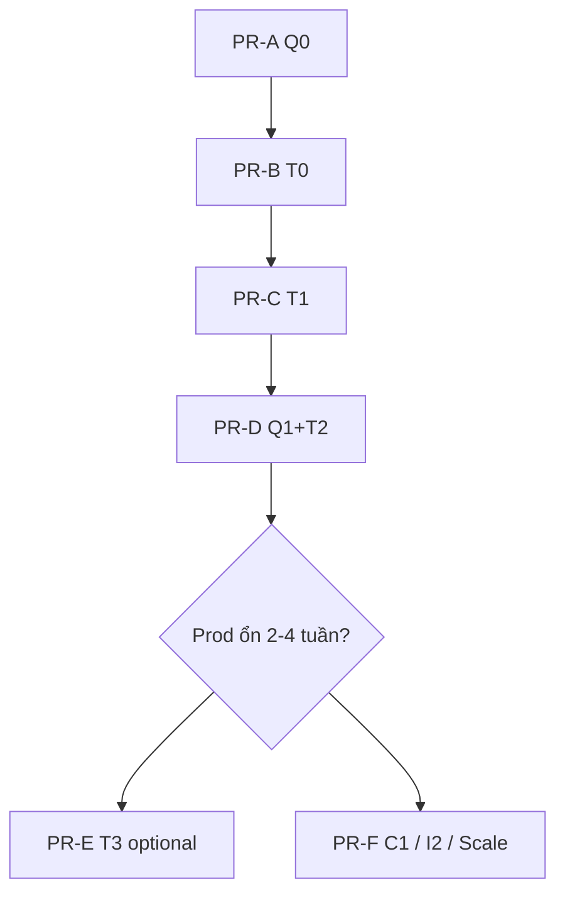

# Master plan — C2 Quota hybrid + LLM usage (+ roadmap sau)

**Trạng thái:** IMPLEMENTED (PR-A → PR-D trên nhánh `docs/c2-master-plan-and-ops-runbooks`).

Tài liệu **đầy đủ một chỗ**: kiến trúc, schema, từng PR, file sửa, test, deploy, ops, phase sau (C1 / I2 / scale). Implement **theo thứ tự §D**, không nhảy phase.

Liên quan: [chat-rate-limit-quota.md](./chat-rate-limit-quota.md), [llm-usage-tracking-plan.md](./llm-usage-tracking-plan.md) (bản rút gọn), [scale-phase-b-runbook.md](./scale-phase-b-runbook.md), [edge-cases-roadmap.md](./edge-cases-roadmap.md).

---

## A. Tóm tắt điều hành

| | |
|---|---|
| **Vấn đề** | Không audit token LLM theo user; đổi quota (15→20) không rebuild counter; khó làm tier sau |
| **Giải pháp** | Hai bảng event: `messenger_chat_events` (quota hybrid) + `llm_usage_events` (token) |
| **Kiến trúc chốt** | **Hybrid Q0** — dual-write event + counter; **không** full event sourcing |
| **Effort core** | ~5–7 ngày dev (PR-A → PR-D) + ~1 ngày QA/deploy |
| **Không làm đợt này** | Full ES, billing invoice, dashboard UI, scale 2 pod, C1 tier code |

---

## B. Quyết định đã chốt (frozen)

1. **Quota:** `messenger_chat_events` + giữ `messenger_chat_daily_usage` (H3 transaction).  
2. **LLM:** `llm_usage_events` riêng — không gộp quota events.  
3. **Thứ tự:** **Q0 → T0 → T1 → Q1+T2** (PR-A → B → C → D).  
4. **Đọc quota runtime:** vẫn counter O(1) — không replay mỗi request.  
5. **Rebuild:** script ops sau đổi rule — không tự động khi đổi env.  
6. **Full event sourcing:** từ chối đợt này; strangler sau nếu cần (§N).  
7. **Scale 2 instance:** runbook sẵn; chỉ khi metric CPU/latency (§N.3).

---

## C. Phạm vi

### C.1. Trong scope (đợt implement chính)

| ID | Deliverable |
|----|-------------|
| Q0 | Dual-write quota events |
| Q1 | `chat-quota:rebuild` |
| Q2 | Doc + env `CHAT_QUOTA_WINDOW` stub (daily mặc định; weekly document) |
| T0 | Schema + `LlmUsageRecorderService` |
| T1 | Wire 3 OpenAI call sites |
| T2 | `llm-usage:status` + retention cron |
| — | Tests, migration, `.env.example`, agent docs |

### C.2. Ngoài scope (phase sau — §N)

| ID | Ghi chú |
|----|---------|
| T3 | USD estimate từ env pricing |
| C1 | Tier limit theo gói Wispace API |
| I2 | Slack alert tổng hợp |
| Scale B | 2 pod + Nginx upstream |
| Billing | Charge user / invoice |

---

## D. Lộ trình & PR (thứ tự bắt buộc)



| PR | Phase | Effort | Merge khi |
|----|-------|--------|-----------|
| **PR-A** | Q0 | ~1 ngày | Migration + dual-write + test transaction |
| **PR-B** | T0 | ~0.5 ngày | Module `llm-usage` + migration |
| **PR-C** | T1 | ~1–1.5 ngày | 3 feature ghi token |
| **PR-D** | Q1+T2 | ~1.5 ngày | Rebuild script + llm-usage:status + cron |
| PR-E | T3 | ~0.5 ngày | Product/finance cần USD |
| PR-F | C1/I2/Scale | tùy | §N |

**Gate CI mỗi PR:** `npm ci` → `lint` → `test` → `build`.

---

## E. Schema database

### E.1. `messenger_chat_events` (quota — PR-A)

```sql
CREATE TABLE messenger_chat_events (
  id               BIGSERIAL PRIMARY KEY,
  aggregate_id     VARCHAR(64) NOT NULL,          -- psid
  aggregate_type   VARCHAR(32) NOT NULL DEFAULT 'chat_quota',
  event_type       VARCHAR(64) NOT NULL,
  payload          JSONB NOT NULL DEFAULT '{}',
  occurred_at      TIMESTAMPTZ NOT NULL DEFAULT now(),
  usage_date       DATE NOT NULL,                   -- ICT, denormalize
  user_id          INT NULL,
  idempotency_key  VARCHAR(128) NULL,               -- mid khi reserve/release
  CONSTRAINT uq_chat_events_idempotency UNIQUE (idempotency_key)
);

CREATE INDEX idx_chat_events_aggregate_time
  ON messenger_chat_events (aggregate_id, occurred_at);

CREATE INDEX idx_chat_events_usage_date
  ON messenger_chat_events (usage_date, event_type);
```

**`idempotency_key`:** chỉ set cho `CHAT_QUOTA_RESERVED` (message.mid) — `DENIED` không cần unique; `RELEASED` dùng `{mid}:released` hoặc NULL + payload.

#### Event types & payload

| `event_type` | Khi nào | `payload` (JSON) |
|--------------|---------|------------------|
| `CHAT_QUOTA_RESERVED` | Sau hard-cap reserve OK | `{ "limit": 15, "used_after": 3, "idempotency_key": "mid..." }` |
| `CHAT_QUOTA_RELEASED` | `refundFreeFormSlot` / H2 recover | `{ "reason": "send_failed" \| "stuck_recover", "used_after": 2 }` |
| `CHAT_QUOTA_DENIED` | Daily hoặc burst deny | `{ "reason": "DAILY_LIMIT" \| "BURST_LIMIT", "limit": 15, "used": 15 }` |

**Lưu ý:** `CHAT_QUOTA_DENIED` **không** tăng counter — chỉ audit.

### E.2. `llm_usage_events` (PR-B)

```sql
CREATE TABLE llm_usage_events (
  id                 BIGSERIAL PRIMARY KEY,
  occurred_at        TIMESTAMPTZ NOT NULL DEFAULT now(),
  usage_date         DATE NOT NULL,
  feature            VARCHAR(32) NOT NULL,
  psid               VARCHAR(64) NULL,
  user_id            INT NULL,
  model              VARCHAR(64) NOT NULL,
  prompt_tokens      INT NOT NULL DEFAULT 0,
  completion_tokens  INT NOT NULL DEFAULT 0,
  total_tokens       INT NOT NULL DEFAULT 0,
  openai_response_id VARCHAR(128) NULL,
  correlation_id     VARCHAR(128) NULL,
  tool_round         SMALLINT NULL,
  status             VARCHAR(16) NOT NULL DEFAULT 'ok',
  error_message      TEXT NULL,
  estimated_cost_usd NUMERIC(12, 6) NULL
);

CREATE INDEX idx_llm_usage_user_date ON llm_usage_events (user_id, usage_date)
  WHERE user_id IS NOT NULL;
CREATE INDEX idx_llm_usage_psid_date ON llm_usage_events (psid, usage_date)
  WHERE psid IS NOT NULL;
CREATE INDEX idx_llm_usage_feature_date ON llm_usage_events (feature, usage_date);
```

| `feature` | Nguồn |
|-----------|--------|
| `FREE_FORM_CHAT` | `messenger-agent.service.ts` (mỗi tool round) |
| `STUDENT_REPORT` | `student-report.service.ts` |
| `STUDY_REMINDER` | `study-reminder.service.ts` |

### E.3. Bảng giữ nguyên (không thay semantics)

- `messenger_chat_daily_usage` — projection quota  
- `messenger_chat_idempotency` — H2 idempotency  
- `messenger_message_logs` — audit tin Messenger (không token)

---

## F. PR-A — Q0 chi tiết implement

### F.1. Module / file

| Hành động | Path |
|-----------|------|
| Migration | `src/infrastructure/database/migrations/*-CreateMessengerChatEvents.ts` |
| Entity | `src/infrastructure/database/entities/messenger-chat-event.entity.ts` |
| Port + repo | `src/modules/chat-rate-limit/domain|infrastructure/.../chat-quota-event.*` |
| Recorder | `ChatQuotaEventRecorderService` (application) |
| Wire transaction | `chat-rate-limit.repository.ts` — trong `reserveFreeFormSlotInTransaction`, `refundReservedSlot` |
| Deny path | `chat-rate-limit.service.ts` — trước return `DAILY_LIMIT` / `BURST_LIMIT` |
| Config | `CHAT_QUOTA_EVENTS_ENABLED` — default `true` prod |
| Module | `ChatRateLimitModule` providers |

### F.2. Transaction (bắt buộc cùng DB transaction)

```text
reserveFreeFormSlotInTransaction:
  1. idempotency insert (hiện có)
  2. daily usage hard cap (hiện có)
  3. INSERT messenger_chat_events CHAT_QUOTA_RESERVED   ← mới
  4. commit

refundReservedSlot:
  1. idempotency → refunded (hiện có)
  2. decrement daily (hiện có)
  3. INSERT CHAT_QUOTA_RELEASED                       ← mới

deny (no transaction với counter):
  INSERT CHAT_QUOTA_DENIED (best-effort; fail → log warn)
```

### F.3. Test (PR-A)

| Case | Kỳ vọng |
|------|---------|
| Reserve OK | 1 event RESERVED + count +1 |
| Refund H4 | 1 event RELEASED + count -1 |
| Daily deny | 1 event DENIED; count không đổi |
| Burst deny | 1 event DENIED `BURST_LIMIT` |
| `CHAT_QUOTA_EVENTS_ENABLED=false` | Không insert event; quota vẫn hoạt động |
| Concurrent reserve at limit | H3 vẫn pass (existing spec) |

### F.4. Deploy PR-A

```bash
npm run migration:run
npm run build
# VPS: deploy image + Doppler; không cần đổi limit ngay
```

---

## G. PR-D (phần Q1) — Rebuild algorithm

Script: `scripts/chat-quota-rebuild.mjs` → `npm run chat-quota:rebuild`.

```text
Input: --from=YYYY-MM-DD --to=YYYY-MM-DD (default today ICT)
       --daily-limit=N (override env cho projection)
       --dry-run

Per (psid, usage_date):
  used = 0
  FOR event IN events ORDER BY occurred_at:
    IF event_type == RESERVED:  used += 1
    IF event_type == RELEASED: used = max(used - 1, 0)
    IF event_type == DENIED:    (skip)
  UPSERT messenger_chat_daily_usage.free_form_count = used
```

**Ops playbook đổi 15 → 20:**

1. Deploy Q0 đã chạy ≥ vài ngày (có events).  
2. Đổi `CHAT_FREE_FORM_DAILY_LIMIT=20` trên Doppler.  
3. (Tuỳ chọn) `npm run chat-quota:rebuild -- --from=<ngày bật Q0> --daily-limit=20 --dry-run`  
4. Chạy thật rebuild nếu cần siết counter.  
5. `npm run chat-quota:status -- --ops` verify.

**Trước Q0:** rebuild chính xác không có — fallback đếm `idempotency` completed (§12.2 plan cũ).

---

## H. PR-B / PR-C — LLM tracking

### H.1. Module `src/modules/llm-usage/`

```
domain/entities/llm-usage.types.ts
domain/repositories/llm-usage.repository.port.ts
application/services/llm-usage-recorder.service.ts
application/services/llm-usage-query.service.ts      # PR-D
infrastructure/persistence/llm-usage.repository.ts
llm-usage.module.ts
```

Import `LlmUsageModule` từ: `MessengerModule`, `StudentReportModule`, `StudyReminderModule`.

### H.2. Wire points (PR-C)

| File | Vị trí | `feature` | `correlation_id` |
|------|--------|-----------|------------------|
| `messenger-agent.service.ts` | Sau mỗi `chat.completions.create` trong for-loop | `FREE_FORM_CHAT` | `message.mid` (batch) |
| `student-report.service.ts` | Sau `generateAiReport` response | `STUDENT_REPORT` | `psid` + report date |
| `study-reminder.service.ts` | Sau `generateAiReminder` response | `STUDY_REMINDER` | `job.id` |

**Không ghi:** fallback template, off-topic skip, fast reschedule, no API key.

### H.3. Recorder semantics

- `LLM_USAGE_ENABLED=false` → no-op  
- Insert fail → `Logger.error`, **không** throw  
- `response.usage` missing → tokens 0 + warn  

### H.4. PR-D scripts

| Script | npm |
|--------|-----|
| `scripts/llm-usage-status.mjs` | `llm-usage:status` |
| `scripts/chat-quota-rebuild.mjs` | `chat-quota:rebuild` |

Pattern: copy structure từ `scripts/chat-quota-status.mjs`.

Cron retention: `LlmUsageCleanupCronService` — advisory lock; `LLM_USAGE_RETENTION_DAYS` (default 180).  
Quota events retention (tuỳ chọn PR-D): `CHAT_QUOTA_EVENTS_RETENTION_DAYS`.

---

## I. Ma trận test

| PR | Unit | Integration |
|----|------|-------------|
| A | `chat-rate-limit.repository.spec.ts` events in txn | — |
| A | `chat-rate-limit.service.spec.ts` deny emits | — |
| B | `llm-usage.repository.spec.ts` insert | — |
| C | `messenger-agent` / report / reminder specs mock usage | Manual chat 1 tin |
| D | rebuild dry-run fixture events | `chat-quota:status` + `llm-usage:status` |

**Regression:** toàn bộ existing `chat-rate-limit.service.spec.ts`, H2–H7 specs pass.

---

## J. Biến môi trường (tổng hợp)

```env
# PR-A — Quota events
CHAT_QUOTA_EVENTS_ENABLED=true
CHAT_QUOTA_EVENTS_RETENTION_DAYS=365

# PR-B/C/D — LLM usage
LLM_USAGE_ENABLED=true
LLM_USAGE_TIMEZONE=Asia/Ho_Chi_Minh
LLM_USAGE_RETENTION_DAYS=180

# Q2 doc — chưa enforce weekly trong code đợt 1
# CHAT_QUOTA_WINDOW=daily

# T3 (PR-E) — sau
# LLM_COST_USD_PER_1M_INPUT_TOKENS_<model>=
# LLM_COST_USD_PER_1M_OUTPUT_TOKENS_<model>=

# Đã có — không đổi
CHAT_FREE_FORM_DAILY_LIMIT=15
CHAT_BURST_PER_MINUTE=3
CHAT_USAGE_TIMEZONE=Asia/Ho_Chi_Minh
CHAT_RATE_LIMIT_ENABLED=true
```

Cập nhật `.env.example` + `docs/project-overview.md` mỗi PR.

---

## K. Docs cập nhật khi merge

| PR | Files |
|----|-------|
| A | `AGENTS.md`, `chat-rate-limit-quota.md` §event, `.claude/rules/chat-rate-limit.md` |
| B/C | `llm-usage-tracking-plan.md` tick T0/T1, `project-overview.md` |
| D | `AGENTS.md` scripts table, `edge-cases-roadmap.md` C2 MVP ✓ |
| E | `project-overview.md` USD disclaimer |

---

## L. Definition of Done — đợt chính (PR-A → D)

### L.1. Quota

- [ ] `messenger_chat_events` trên prod  
- [ ] Reserve/refund/deny ghi event đúng §F.2  
- [ ] `chat-quota:rebuild` dry-run + live  
- [ ] Runbook đổi limit trong plan + `project-overview.md`  

### L.2. LLM

- [ ] `llm_usage_events` trên prod  
- [ ] 3 feature ghi token  
- [ ] `llm-usage:status --ops`  
- [ ] Retention cron  

### L.3. Chung

- [ ] `npm run verify` local pass  
- [ ] Deploy VPS: migration + health `/health/db`  
- [ ] Không regression chat quota menu/postback  

---

## M. Checklist trước khi bắt đầu implement

Tick **product/tech** trước PR-A:

- [ ] Đồng ý hybrid Q0 (không full ES) — §B  
- [ ] Đồng ý thứ tự PR-A → D — §D  
- [ ] Snapshot Doppler `prd` / backup `.env` VPS  
- [ ] Cửa sổ deploy: tránh giờ chat cao (tối sau thông báo)  
- [ ] Chốt ngày dự kiến đổi limit (15→20) nếu có — Q0 phải prod **trước** ngày đó  
- [ ] Dev có DB local `ai_chat_bot_db` + migration test  

**Sau khi tick:** bắt đầu **PR-A** theo §F.

---

## N. Phase sau đợt chính (chỉ plan, chưa implement)

### N.1. PR-E — T3 USD (~0.5 ngày)

- Tính `estimated_cost_usd` khi insert `llm_usage_events`  
- `llm-usage:status --ops` hiển thị USD  
- Disclaimer ≠ invoice OpenAI  

### N.2. PR-F — C1 Tier Wispace (~2+ ngày)

- API Wispace → limit per `user_id`  
- `ChatRateLimitConfigService` đọc tier  
- Rebuild + tier change playbook  

### N.3. I2 Slack ops (~1 ngày)

- Webhook từ `ops:health` / log spike `CHAT_QUOTA_DENIED`  

### N.4. Scale Giai đoạn B (khi metric)

- [scale-phase-b-runbook.md](./scale-phase-b-runbook.md) — `CHAT_QUEUE_SHARED`, Nginx upstream  

### N.5. Full event sourcing (chỉ nếu cần)

- Strangler: reconcile event↔counter → counter chỉ projection  
- Không big-bang  

---

## O. Timeline gợi ý (1 dev)

| Tuần | Việc |
|------|------|
| 1 | PR-A + PR-B merge; deploy staging/prod |
| 2 | PR-C + PR-D merge; QA manual + ops scripts |
| 3 | Buffer fix + prod monitor; chuẩn bị đổi limit nếu cần |
| 4+ | PR-E / C1 / I2 theo product |

---

## P. Rủi ro tổng hợp

| Rủi ro | Mitigation |
|--------|------------|
| Event/counter lệch | Cùng transaction PR-A; Q1 rebuild; test |
| Events trước Q0 mất | Rebuild thô từ idempotency; chấp nhận gap |
| LLM insert chậm | Fail silent; không block reply |
| Đổi limit không rebuild | Runbook §G — ops responsibility |
| Multi-pod | Insert events độc lập; cron cleanup advisory lock |

---

*Master plan v1 — implement theo §D sau khi §M tick. File rút gọn: [llm-usage-tracking-plan.md](./llm-usage-tracking-plan.md).*
