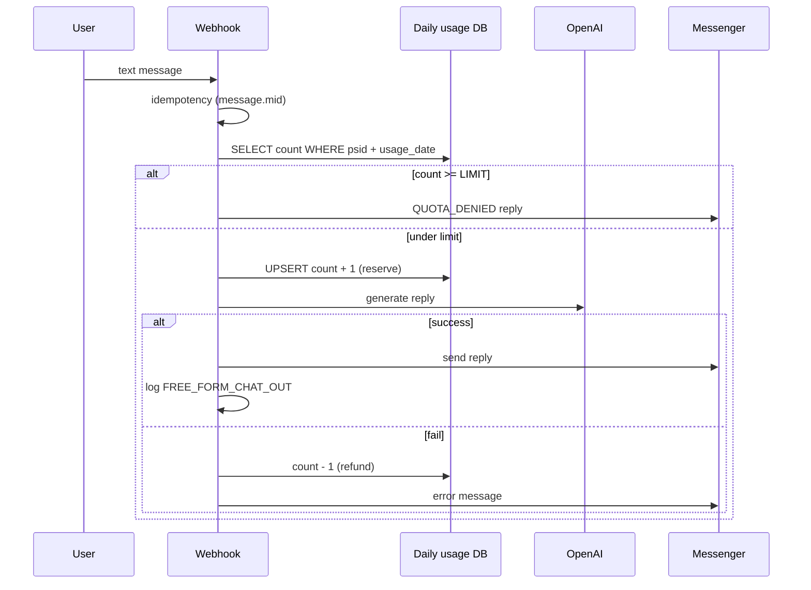
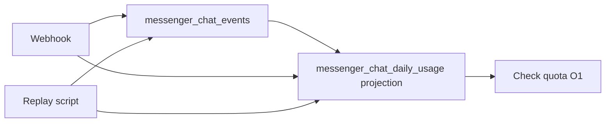
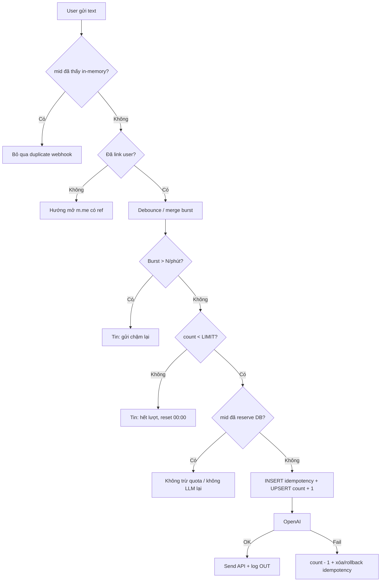
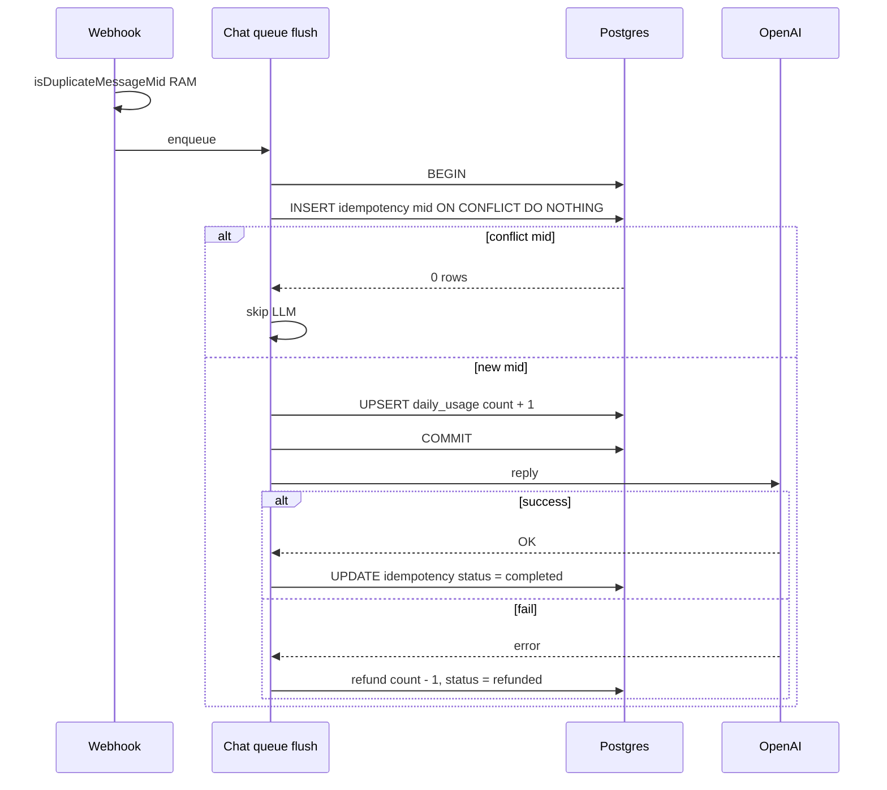
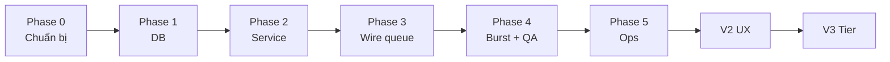

# Rate limit chat Messenger — Lưu quota & giới hạn lượt nhắn tin

Tài liệu nghiên cứu **3 hướng lưu trữ quota** khi bật chatbot hai chiều (user nhắn ↔ bot trả lời bằng LLM), phân tích trade-off và **đề xuất triển khai** cho POC WISPACE.

Liên quan: [project-overview.md](./project-overview.md), [study-session-reminder.md](./study-session-reminder.md) (pattern outbox tương tự `study_reminder_jobs`).

---

## 1. Bối cảnh

### 1.1. Tính năng sắp tới

- User có thể **nhắn tin tự do** với bot (không chỉ menu postback).
- Mỗi tin user có thể kích hoạt **1 lần gọi OpenAI + 1 lần Send API**.
- Cần **giới hạn số lượt chat/ngày** theo user để:
  - Kiểm soát chi phí LLM.
  - Chống spam / lạm dụng.
  - UX rõ ràng (“còn X lượt hôm nay”).

### 1.2. Trạng thái code hiện tại

| Thành phần | Trạng thái |
|------------|------------|
| Chat AI hai chiều (`MessengerChatQueueService` → agent + tools) | ✓ Đã có |
| Dedupe webhook `message.mid` (in-memory, TTL 1h) | ✓ Đã có — `MessengerService.isDuplicateMessageMid` |
| Dedupe postback (`psid:payload`, TTL 15s) | ✓ Đã có |
| Rate limit / `messenger_chat_daily_usage` | ✓ V1 — `ChatRateLimitModule` |
| Idempotency DB cho quota (`message.mid`) | ✓ V1 — `messenger_chat_idempotency` |
| Burst / whitelist / ops script | ✓ Phase 4–5 |

Luồng chat text hiện tại: webhook → dedupe `mid` (RAM) → enqueue → debounce → LLM → Send API. **Chưa** trừ quota.

Bảng `messenger_message_logs` đã có — dùng audit tin gửi/nhận (`message_type`, `psid`, `user_id`, `created_at`).

### 1.3. Meta (Facebook) giới hạn gì?

Meta **không** cung cấp API “user được nhắn bot tối đa X tin/ngày”. Giới hạn platform chủ yếu ở **phía bot gửi đi**:

| Giới hạn | Mô tả |
|----------|--------|
| Send API (text) | ~300 tin/giây / Page |
| Rolling 24h | `200 × số Engaged Users` (tổng call app) |
| Per-thread | Có thể throttle nếu gửi quá nhiều vào **một** hội thoại |
| 24h messaging window | User phải nhắn bot trong 24h gần nhất để bot trả lời kiểu `RESPONSE` |

→ **Quota chat/ngày do ứng dụng tự implement** trên Postgres (hoặc cache), không trông Meta.

Tài liệu Meta: [Messenger Platform rate limits](https://developers.facebook.com/docs/messenger-platform/overview/rate-limiting).

---

## 2. Phạm vi quota — Bucket tách riêng

Không gộp mọi tương tác vào một counter. Đề xuất:

| Bucket | Ví dụ | Tính vào quota chat? |
|--------|--------|----------------------|
| **FREE_FORM_CHAT** | User gõ text → LLM trả lời | **Có** (chặt nhất) |
| **MENU_POSTBACK** | Nhắc lịch, Xem tiến độ, Đăng ký báo cáo | **Không** (hoặc bucket riêng, limit rộng) |
| **PROACTIVE** | Nhắc T-30, báo cáo cron | **Không** — hệ thống gửi |
| **SYSTEM_REPLY** | Welcome, hết lượt, lỗi | **Không** |

**Cửa sổ thời gian đề xuất:** calendar day theo `Asia/Ho_Chi_Minh` (khớp `STUDY_REMINDER_TIMEZONE`), reset nửa đêm — dễ giải thích với học viên.

**Burst (chống spam nhanh):** tối đa N tin/phút (vd `3`) — kiểm tra trước quota ngày.

**Env gợi ý:**

```env
CHAT_FREE_FORM_DAILY_LIMIT=15
CHAT_BURST_PER_MINUTE=3
CHAT_USAGE_TIMEZONE=Asia/Ho_Chi_Minh
```

---

## 3. Ba hướng lưu quota

### Option A — Bảng counter ngày `messenger_chat_daily_usage` (đề xuất)

#### Ý tưởng

Mỗi user (`psid`) mỗi **ngày ICT** có **một dòng** với cột `free_form_count`. Mỗi lần chat tự do thành công → `+1` bằng UPSERT atomic. Sang ngày mới → row mới (lazy insert khi có tin đầu tiên).

#### Schema đề xuất

```sql
CREATE TABLE messenger_chat_daily_usage (
  id               SERIAL PRIMARY KEY,
  psid             VARCHAR(64) NOT NULL,
  user_id          INT NULL,
  usage_date       DATE NOT NULL,           -- ngày theo CHAT_USAGE_TIMEZONE
  free_form_count  INT NOT NULL DEFAULT 0,
  created_at       TIMESTAMPTZ NOT NULL DEFAULT now(),
  updated_at       TIMESTAMPTZ NOT NULL DEFAULT now(),
  CONSTRAINT uq_chat_daily_usage_psid_date UNIQUE (psid, usage_date)
);

CREATE INDEX idx_chat_daily_usage_user_date
  ON messenger_chat_daily_usage (user_id, usage_date)
  WHERE user_id IS NOT NULL;
```

| Cột | Ý nghĩa |
|-----|---------|
| `psid` | Khóa chính — luôn có từ webhook Messenger |
| `user_id` | Copy từ `user_messenger_mappings` khi đã link (báo cáo, ops) |
| `usage_date` | Ngày ICT dạng `2026-06-15` — **không** dùng UTC tuỳ ý |
| `free_form_count` | Số lượt FREE_FORM đã tiêu trong ngày |

#### Luồng xử lý



#### UPSERT atomic (chống race)

```sql
INSERT INTO messenger_chat_daily_usage (psid, user_id, usage_date, free_form_count)
VALUES ($1, $2, $3, 1)
ON CONFLICT (psid, usage_date)
DO UPDATE SET
  free_form_count = messenger_chat_daily_usage.free_form_count + 1,
  user_id = COALESCE(EXCLUDED.user_id, messenger_chat_daily_usage.user_id),
  updated_at = now()
RETURNING free_form_count;
```

#### Idempotency webhook Meta

Facebook có thể gửi webhook **trùng** cùng `message.mid`. Khi bật quota, **bắt buộc** idempotency ở DB — chi tiết đầy đủ tại [§5.3 Idempotency](#53-idempotency--bắt-buộc-khi-bật-quota).

Tóm tắt: dedupe in-memory hiện có **chưa đủ** cho `messenger_chat_daily_usage` (mất state khi restart, không chia sẻ giữa nhiều instance). Reserve quota phải gắn `idempotency_key = message.mid` (unique) trước khi gọi LLM.

#### Reserve vs refund

| Chiến lược | Mô tả | Khi nào |
|------------|--------|---------|
| **Reserve trước LLM** | `+1` trước khi gọi OpenAI | Chống abuse cost — **khuyến nghị** |
| **Refund khi fail** | `-1` nếu LLM hoặc Send API lỗi | UX công bằng |
| **Chỉ +1 sau success** | User không mất lượt khi lỗi | Dễ bị spam làm tốn LLM |

#### Tính `usage_date` (ICT)

```ts
function todayUsageDate(timezone: string, now = new Date()): string {
  return new Intl.DateTimeFormat('en-CA', {
    timeZone: timezone,
    year: 'numeric',
    month: '2-digit',
    day: '2-digit',
  }).format(now); // "2026-06-15"
}
```

Reset quota = tự nhiên khi `usage_date` đổi — **không cần cron xóa counter**.

#### Ví dụ dữ liệu

User `psid=27291166300574332` (user 143), limit 15:

| psid | usage_date | free_form_count |
|------|------------|-----------------|
| 27291166300574332 | 2026-06-15 | 7 |
| 27291166300574332 | 2026-06-16 | 2 |

#### Module code gợi ý

```
src/chat-rate-limit/
  chat-rate-limit.module.ts
  chat-rate-limit.service.ts       # check(), reserve(), refund()
  chat-daily-usage.repository.ts
  chat-daily-usage.entity.ts
```

Hook: **`MessengerChatQueueService.flush()`** — trước LLM; webhook giữ dedupe RAM. Postback **không** qua rate limit.

#### Kết hợp với log hiện có

Counter = **đọc nhanh** quota. `messenger_message_logs` = **audit** nội dung:

| message_type | Khi nào |
|--------------|---------|
| `FREE_FORM_CHAT_IN` | User gửi (optional, trước LLM) |
| `FREE_FORM_CHAT_OUT` | Bot trả lời LLM thành công |
| `CHAT_QUOTA_DENIED` | Hết lượt / burst |

---

### Option B — Event sourcing + replay

#### Ý tưởng

Không lưu trực tiếp `free_form_count = 7`. Lưu **chuỗi sự kiện bất biến** (append-only). Trạng thái quota = **project** từ events (replay).

#### Event types tối thiểu

```ts
type ChatEventType =
  | 'FREE_FORM_MESSAGE_RECEIVED'
  | 'CHAT_QUOTA_RESERVED'
  | 'CHAT_QUOTA_DENIED'
  | 'CHAT_QUOTA_RELEASED'      // LLM / Send fail → hoàn lượt
  | 'LLM_REPLY_SENT'
  | 'MENU_POSTBACK_RECEIVED'; // optional, không trừ quota
```

#### Schema event store

```sql
CREATE TABLE messenger_chat_events (
  id              BIGSERIAL PRIMARY KEY,
  aggregate_id    VARCHAR(64) NOT NULL,   -- psid
  aggregate_type  VARCHAR(32) NOT NULL DEFAULT 'chat_quota',
  event_type      VARCHAR(64) NOT NULL,
  payload         JSONB NOT NULL,
  occurred_at     TIMESTAMPTZ NOT NULL DEFAULT now(),
  idempotency_key VARCHAR(128) NULL UNIQUE
);

CREATE INDEX idx_chat_events_aggregate_time
  ON messenger_chat_events (aggregate_id, occurred_at);
```

#### Replay (derive state)

```ts
function projectDailyUsage(events: ChatEvent[], usageDate: string): number {
  let count = 0;
  for (const e of events) {
    if (e.occurredDateIct !== usageDate) continue;
    if (e.type === 'CHAT_QUOTA_RESERVED') count += 1;
    if (e.type === 'CHAT_QUOTA_RELEASED') count -= 1;
  }
  return count;
}
```

#### Kiến trúc thực tế (không replay mỗi request)



Runtime **vẫn cần projection** (Option A) để check quota O(1). Event store = source of truth cho audit và rebuild khi đổi rule.

#### Khi replay hữu ích

- Debug: “vì sao user báo hết lượt?”
- Đổi rule (15 → 20, reset theo tuần) → rebuild projection từ events cũ
- Billing / compliance cần chứng minh từng quyết định grant/deny

---

### Option C — Đếm từ `messenger_message_logs`

#### Ý tưởng

Không bảng counter. Mỗi tin chat log với `message_type` cố định. Quota hôm nay = `COUNT(*)` trên log.

#### Query ví dụ

```sql
SELECT COUNT(*)::int AS used_today
FROM messenger_message_logs
WHERE psid = $1
  AND message_type = 'FREE_FORM_CHAT_IN'
  AND status = 'SENT'
  AND (created_at AT TIME ZONE 'Asia/Ho_Chi_Minh')::date = $2::date;
```

Burst 1 phút:

```sql
SELECT COUNT(*) FROM messenger_message_logs
WHERE psid = $1
  AND message_type = 'FREE_FORM_CHAT_IN'
  AND created_at > NOW() - INTERVAL '1 minute';
```

#### Luồng

```
Webhook → COUNT logs hôm nay → nếu < LIMIT → LLM → INSERT log IN + OUT
```

Không có UPSERT counter — mỗi hành động chỉ append log.

---

## 4. So sánh trade-off

### 4.1. Bảng tổng hợp

| Tiêu chí | **A. `messenger_chat_daily_usage`** | **B. Event sourcing** | **C. Đếm từ log** |
|----------|-------------------------------------|------------------------|-------------------|
| **Độ phức tạp triển khai** | Thấp | Cao (store + projection + replay) | Thấp nhất (không migration mới) |
| **Độ phức tạp vận hành** | Thấp | Cao — team phải hiểu replay | Trung bình — log phình theo thời gian |
| **Performance đọc quota** | O(1) — 1 row | O(1) nếu có projection; O(n) nếu replay mỗi request | O(n) — COUNT mỗi tin |
| **Performance ghi** | 1 UPSERT | 1 INSERT event + update projection | 1 INSERT log (×2 nếu IN+OUT) |
| **Race condition / concurrent** | Tốt — UPSERT atomic | Tốt nếu transaction event+projection | Kém — double COUNT trước khi INSERT |
| **Audit chi tiết** | Trung bình — cần log kèm | Rất tốt — full event history | Tốt — nếu log đủ type |
| **Replay / rebuild state** | Không native | **Điểm mạnh chính** | Có thể COUNT lại — chậm, không có reserve/release semantics |
| **Storage theo thời gian** | ~1 row/user/ngày | N event/action — lớn nhất | 1+ row/tin — lớn |
| **Đổi rule quota sau này** | Chỉ áp dụng forward | Rebuild projection từ events | Khó — log cũ không có semantics reserve |
| **Khớp stack POC hiện tại** | Giống `study_reminder_jobs` (snapshot state) | Pattern mới, học curve | Tận dụng bảng có sẵn |
| **Phù hợp scale học viên IELTS** | **Rất phù hợp** | Overkill giai đoạn đầu | OK &lt; 50 user active chat |

### 4.2. Chi phí thực tế cần tối ưu

Bottleneck chính **không phải** đọc Postgres — mà **OpenAI + Send API**. Vì vậy:

- Cần **reserve trước LLM** (atomic) → Option A và B (có projection) làm tốt; Option C dễ lỗ race.
- Event sourcing không giảm tiền LLM — chỉ giúp audit/rebuild.

### 4.3. Khi nào nên nâng từ A lên B

Chỉ khi có **ít nhất hai** điều:

1. Billing theo token / gói Premium / quota khác nhau theo `user_id`
2. Cần rebuild quota thường xuyên sau khi đổi business rule
3. Compliance yêu cầu chứng minh từng lần deny/grant

Lúc đó: thêm `messenger_chat_events` **bên cạnh** `messenger_chat_daily_usage`, không thay hot path.

### 4.4. Vì sao không chọn C làm production

- Mỗi tin chat = `COUNT(*)` trên bảng log đang lớn → latency tăng theo thời gian.
- Index `(psid, message_type, created_at)` giúp nhưng vẫn nặng hơn đọc 1 row counter.
- Khó mô hình hóa **reserve / refund** khi LLM fail (đếm IN hay OUT?).
- Webhook retry Meta dễ double-count nếu không có idempotency riêng.

**C vẫn OK** cho spike demo nhanh (&lt; 1 tuần, vài user) trước khi migration Option A.

---

## 5. Đề xuất chính thức: Option A — `messenger_chat_daily_usage`

### 5.1. Tóm tắt quyết định

| Quyết định | Lựa chọn |
|------------|----------|
| Lưu quota | Bảng **`messenger_chat_daily_usage`** |
| Key | `(psid, usage_date)` unique |
| Timezone | `CHAT_USAGE_TIMEZONE` = `Asia/Ho_Chi_Minh` |
| Đếm | `free_form_count` — chỉ bucket FREE_FORM |
| Ghi | UPSERT atomic; reserve trước LLM, refund khi fail |
| Idempotency | **DB** — `message.mid` unique khi reserve (§5.3); giữ dedupe RAM ở webhook |
| Audit | Giữ `messenger_message_logs` với `message_type` chuẩn |
| Event sourcing | **Không** giai đoạn 1; có thể bổ sung sau |
| Đếm từ log | **Không** trên hot path |

### 5.2. Luồng end-to-end đề xuất



**Postback menu** (`VIEW_UPCOMING_STUDY_SESSION`, …) đi nhánh riêng — **không** qua `ChatRateLimitService`.

Hook reserve: **`MessengerChatQueueService.flush()`** — sau debounce, **trước** `MessengerAgentService.reply()`. Webhook chỉ dedupe RAM + enqueue.

### 5.3. Idempotency — bắt buộc khi bật quota

Meta có thể **retry webhook** cùng payload (cùng `message.mid`). Nếu mỗi lần retry đều `free_form_count + 1`, user mất lượt oan hoặc bot gọi LLM trùng.

#### Đã có trong code (chưa đủ cho quota)

`MessengerService` dedupe `message.mid` trong **Map in-memory** (`MESSAGE_MID_DEDUPE_MS` = 1 giờ):

- File: `src/modules/messenger/application/services/messenger.service.ts` — `isDuplicateMessageMid()`
- Chạy **trước** `messengerChatQueueService.enqueue()`
- Postback: dedupe riêng `psid:payload` (15s) — **không** liên quan quota chat

| Dedupe RAM | Đủ cho | Chưa đủ cho |
|------------|--------|-------------|
| Tránh xử lý webhook trùng trên **cùng process** | Giảm double LLM trên 1 server POC | Quota chính xác sau **restart** |
| | | **Nhiều instance** (scale ngang) — mỗi pod Map riêng |
| | | **Reserve** ở queue flush — cần record DB “mid này đã trừ lượt” |

→ Khi triển khai `messenger_chat_daily_usage`, **bắt buộc thêm idempotency DB** tại bước **reserve**, không chỉ dựa vào Map RAM.

#### Schema đề xuất — bảng idempotency

```sql
CREATE TABLE messenger_chat_idempotency (
  idempotency_key  VARCHAR(128) PRIMARY KEY,  -- message.mid từ Meta
  psid             VARCHAR(64) NOT NULL,
  user_id          INT NULL,
  usage_date       DATE NOT NULL,
  reserved_at      TIMESTAMPTZ NOT NULL DEFAULT now(),
  status           VARCHAR(16) NOT NULL DEFAULT 'reserved'
                   CHECK (status IN ('reserved', 'completed', 'refunded'))
);

CREATE INDEX idx_chat_idempotency_psid_date
  ON messenger_chat_idempotency (psid, usage_date);
```

| Cột | Ý nghĩa |
|-----|---------|
| `idempotency_key` | `message.mid` — unique toàn hệ thống |
| `status` | `reserved` → LLM đang chạy; `completed` → đã gửi reply; `refunded` → hoàn lượt sau lỗi |

**Phương án gọn hơn (POC):** unique `(idempotency_key)` trên `messenger_message_logs` khi `message_type = 'FREE_FORM_CHAT_IN'` — reserve + insert log trong một transaction. Không insert được → mid đã xử lý, skip LLM.

#### Luồng reserve có idempotency



#### Debounce vs idempotency

`MessengerChatQueueService` gộp nhiều tin liên tiếp (`CHAT_DEBOUNCE_MS`) thành **một** lần gọi LLM.

| Quy ước | Mô tả |
|---------|--------|
| **Khuyến nghị** | **1 lượt quota / 1 lần flush** (một reply bot), không trừ theo từng `mid` trong burst |
| Idempotency key khi merge | Dùng `mid` của **tin cuối** trong batch, hoặc hash `(psid, mergedText, windowStart)` — chốt một cách khi implement |
| Burst user gửi 5 tin / 2s | User nhận 1 reply → trừ **1** lượt (UX công bằng) |

Ghi rõ quy ước này trong code + test để tránh tranh cãi “5 tin = 5 lượt hay 1 lượt”.

#### Giữ dedupe RAM song song

| Lớp | Vai trò |
|-----|---------|
| **RAM** (`isDuplicateMessageMid`) | Fast path — bỏ webhook trùng ngay, không enqueue |
| **DB** (idempotency + reserve) | Source of truth quota — survive restart, multi-instance |

Hai lớp **bổ sung**, không thay thế nhau.

### 5.4. API service nội bộ (gợi ý)

```ts
interface ChatQuotaCheckResult {
  allowed: boolean;
  used: number;
  limit: number;
  remaining: number;
  reason?: 'DAILY_LIMIT' | 'BURST_LIMIT' | 'NOT_LINKED';
  usageDate: string;
}

class ChatRateLimitService {
  async checkQuota(psid: string, userId?: number): Promise<ChatQuotaCheckResult>;
  /** Trả allowed=false nếu mid đã reserve (idempotency conflict). */
  async reserveFreeFormSlot(
    psid: string,
    params: { userId?: number; idempotencyKey: string },
  ): Promise<ChatQuotaCheckResult>;
  async refundFreeFormSlot(
    psid: string,
    usageDate: string,
    idempotencyKey: string,
  ): Promise<void>;
  async markCompleted(idempotencyKey: string): Promise<void>;
}
```

### 5.5. Tin nhắn khi hết quota (UX)

> Hôm nay bạn đã dùng hết **15 lượt chat** với WISPACE. Lượt mới reset lúc **00:00** (giờ Việt Nam).  
> Bạn vẫn có thể dùng **Menu**: Nhắc lịch học, Xem tiến độ, Đăng ký báo cáo.

`message_type`: `CHAT_QUOTA_DENIED`.

### 5.6. Gợi ý số liệu POC

| Tier | FREE_FORM / ngày | Burst |
|------|------------------|-------|
| POC / demo | 15–20 | 3/phút |
| Production nhẹ | 30 | 5/phút |
| Whitelist QA | unlimited (config `psid` list) | — |

### 5.7. Checklist triển khai (V1 — done)

- [x] Migration `messenger_chat_daily_usage`
- [x] Migration `messenger_chat_idempotency` (hoặc unique `message.mid` trên log IN)
- [x] Entity + repository + `ChatRateLimitService` (`reserve` / `refund` / `markCompleted`)
- [x] Wire **`MessengerChatQueueService.flush()`** — reserve + idempotency **trước** LLM; refund trong `catch`
- [x] Giữ dedupe RAM `isDuplicateMessageMid` ở webhook (fast path)
- [x] Quy ước debounce: **1 lượt / 1 flush**; document idempotency key khi merge burst
- [x] `message_type` mới: `FREE_FORM_CHAT_IN`, `FREE_FORM_CHAT_OUT`, `CHAT_QUOTA_DENIED`
- [x] Env: `CHAT_FREE_FORM_DAILY_LIMIT`, `CHAT_BURST_PER_MINUTE`, `CHAT_USAGE_TIMEZONE`
- [x] Script ops: `npm run chat-quota:status` — query usage + idempotency theo `psid` / `user_id` / ngày
- [x] Test: retry webhook cùng `mid` → count không tăng; LLM fail → refund
- [x] Cập nhật [project-overview.md](./project-overview.md) khi merge code

### 5.8. Lộ trình sau (optional — sau V1 production)

| Giai đoạn | Việc làm |
|-----------|----------|
| **V2** | Hiển thị “còn X lượt” trong reply |
| **V3** | Tier theo `user_id` / gói Wispace |
| **V4** | Thêm `messenger_chat_events` nếu cần replay / billing |

### 5.9. Kế hoạch triển khai theo phase (full rate limit)

Roadmap từ **chưa có code** → **V1 chạy production POC**. Mỗi phase có thể merge PR riêng; phase sau phụ thuộc phase trước.



#### Phase 0 — Chuẩn bị (≈ 0.5 ngày)

**Mục tiêu:** Cấu hình và khung module, chưa chặn user.

| Việc | Done khi |
|------|----------|
| Thêm env vào `.env.example`: `CHAT_FREE_FORM_DAILY_LIMIT`, `CHAT_BURST_PER_MINUTE`, `CHAT_USAGE_TIMEZONE` | Dev biết biến bắt buộc |
| Tạo module `src/modules/chat-rate-limit/` (module + service stub) | Nest boot, inject được |
| `readRequiredPositiveNumber` / config reader giống `StudyReminderScheduleService` | Limit đọc từ env, không hardcode |
| (Tuỳ chọn) `CHAT_RATE_LIMIT_ENABLED=true` — tắt nhanh khi debug | Rollback không cần revert code |

**Không làm:** wire queue, migration.

---

#### Phase 1 — Schema & repository (≈ 1 ngày)

**Mục tiêu:** Postgres sẵn sàng, test repository độc lập.

| Việc | Done khi |
|------|----------|
| Migration `messenger_chat_daily_usage` | `npm run migration:run` OK |
| Migration `messenger_chat_idempotency` | Unique `idempotency_key` |
| Entity TypeORM + repository (UPSERT daily, INSERT idempotency) | Spec: concurrent UPSERT → count đúng |
| Index `(psid, usage_date)` | Explain query nhanh |

**Không làm:** gọi từ chat queue.

---

#### Phase 2 — `ChatRateLimitService` core (≈ 1–1.5 ngày)

**Mục tiêu:** Logic quota + idempotency trong transaction, chưa hook UI.

| Việc | Done khi |
|------|----------|
| `todayUsageDate(timezone)` — ICT `en-CA` | Khớp `STUDY_REMINDER_TIMEZONE` |
| `checkQuota(psid)` → `{ allowed, used, limit, remaining, usageDate }` | Unit test under/at/over limit |
| `reserveFreeFormSlot(psid, { idempotencyKey, userId })` trong **một transaction**: INSERT idempotency → UPSERT count +1 | Conflict `mid` → `allowed: false`, count không tăng |
| `refundFreeFormSlot(psid, usageDate, idempotencyKey)` | count -1, status `refunded` |
| `markCompleted(idempotencyKey)` | status `completed` |
| Reserve **trước** LLM; refund khi LLM/Send fail | Document trong service |

**Test bắt buộc:**

- Hai `reserve` cùng `mid` → một thành công, một conflict.
- Reserve → refund → count về như cũ.

---

#### Phase 3 — Tích hợp chat queue (≈ 1 ngày)

**Mục tiêu:** User thật bị chặn khi hết lượt; chat bình thường vẫn chạy.

| Việc | Done khi |
|------|----------|
| Hook `MessengerChatQueueService.flush()`: sau debounce, **trước** `MessengerAgentService.reply()` | Reserve gọi đúng chỗ |
| Truyền `idempotencyKey` = `message.mid` tin **cuối** trong batch debounce (quy ước §5.3) | 5 tin burst → 1 lượt |
| Hết lượt → `sendTextViaPsid` tin §5.5, `message_type=CHAT_QUOTA_DENIED` | Không gọi OpenAI |
| Thành công → `markCompleted`; `catch` → `refund` | LLM lỗi không mất lượt oan |
| Log `FREE_FORM_CHAT_IN` (optional) trước LLM | Audit trong `messenger_message_logs` |
| Giữ `isDuplicateMessageMid` RAM ở webhook | Fast path không đổi |

**Test thủ công:**

- User chưa link → tin hướng dẫn (không reserve hoặc skip — chốt một cách).
- Gửi chat bình thường dưới limit → OK.
- Postback / cron nhắc học → **không** tăng `free_form_count`.

---

#### Phase 4 — Burst, edge cases & hardening (≈ 1 ngày)

**Mục tiêu:** Chống spam nhanh + ổn định production POC.

| Việc | Done khi |
|------|----------|
| `CHAT_BURST_PER_MINUTE` — check trước daily reserve | Tin “gửi chậm lại” khi spam |
| Retry webhook cùng `mid` (simulate) → không double LLM / double count | QA pass |
| Restart server + retry `mid` → DB idempotency vẫn chặn | Khác RAM-only |
| `CHAT_RATE_LIMIT_ENABLED=false` bypass (nếu có flag Phase 0) | Ops tắt nhanh |
| Whitelist PSID QA (env list, optional) | Team test không bị limit |

**Không làm:** tier theo gói, event store.

---

#### Phase 5 — Ops, docs & sign-off V1 (≈ 0.5–1 ngày)

**Mục tiêu:** Vận hành và bàn giao POC.

| Việc | Done khi |
|------|----------|
| Script `npm run chat-quota:status` (psid / userId / ngày) | Ops tra usage |
| Cập nhật [project-overview.md](./project-overview.md), gap `AGENTS.md` | Doc khớp code |
| Checklist §5.7 tick hết mục V1 | Review merge |
| Ghi limit production đề xuất (15–20/ngày, burst 3) vào runbook | Wispace biết con số |

**Definition of done V1:** Chat text → reserve → LLM → send; hết lượt / burst / duplicate `mid` / LLM fail đều đúng; postback & proactive không trừ quota.

---

#### Phase 6 — V2 UX (optional, ≈ 0.5 ngày)

| Việc | Done khi |
|------|----------|
| Sau reply thành công, append “Hôm nay còn X lượt chat” (nếu X ≤ 3 hoặc luôn hiện) | UX rõ quota |
| Không hiện số khi unlimited / whitelist | Không làm phiền QA |

---

#### Phase 7 — V3 Tier & Wispace (optional, ≈ 2+ ngày)

| Việc | Done khi |
|------|----------|
| Limit theo `user_id` / gói (Premium vs free) | Config hoặc API Wispace |
| Đồng bộ tier khi user upgrade | Không cần redeploy |

---

#### Phase 8 — Event store / billing (optional, V4)

| Việc | Done khi |
|------|----------|
| Bảng `messenger_chat_events` + replay rebuild projection | Audit & đổi rule quota |
| Billing theo token (nếu product yêu cầu) | Ngoài scope POC |

---

#### Tóm tắt effort V1 (Phase 0–5)

| Phase | Effort ước lượng | Có thể ship độc lập? |
|-------|------------------|----------------------|
| 0 Chuẩn bị | 0.5 ngày | ✓ |
| 1 DB | 1 ngày | ✓ (chưa chặn user) |
| 2 Service | 1–1.5 ngày | ✓ (chưa chặn user) |
| 3 Wire queue | 1 ngày | ✓ **bật rate limit thật** |
| 4 Hardening | 1 ngày | Khuyến nghị trước prod |
| 5 Ops | 0.5–1 ngày | Sign-off V1 |
| **Tổng V1** | **~5–6 ngày dev** | |

Phase **6–8** làm sau khi V1 đã chạy ổn với user thật.

---

## 6. Tham chiếu

| Tài nguyên | Link / path |
|------------|-------------|
| Meta rate limits | https://developers.facebook.com/docs/messenger-platform/overview/rate-limiting |
| Log tin nhắn hiện tại | `src/infrastructure/database/entities/messenger-message-log.entity.ts` |
| Webhook handler + dedupe RAM | `src/modules/messenger/application/services/messenger.service.ts` |
| Chat queue (hook reserve tại đây) | `src/modules/messenger/application/services/messenger-chat-queue.service.ts` |
| Gửi tin (Send API) | `src/modules/messenger/application/services/messenger-outbound.service.ts` |
| Pattern outbox tương tự | `study_reminder_jobs` — [study-session-reminder.md](./study-session-reminder.md) |

---

*Tài liệu này ghi nhận quyết định kiến trúc; triển khai code theo checklist §5.7 và roadmap phase §5.9.*
