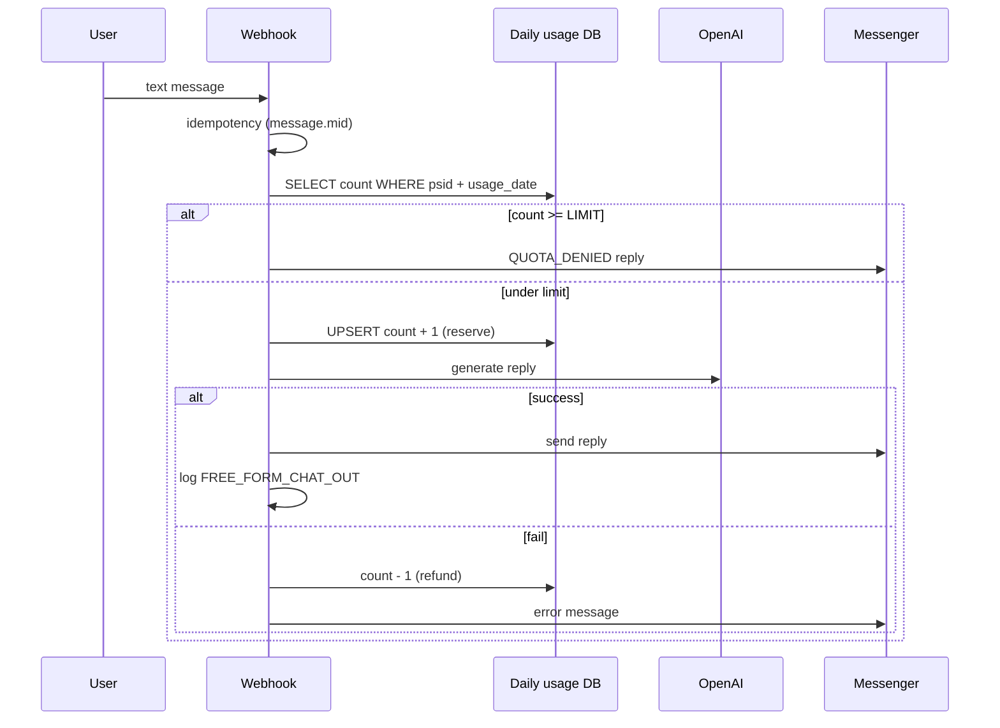
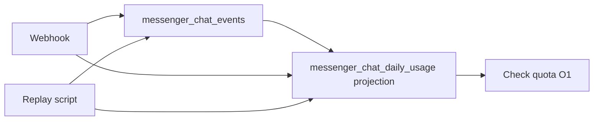
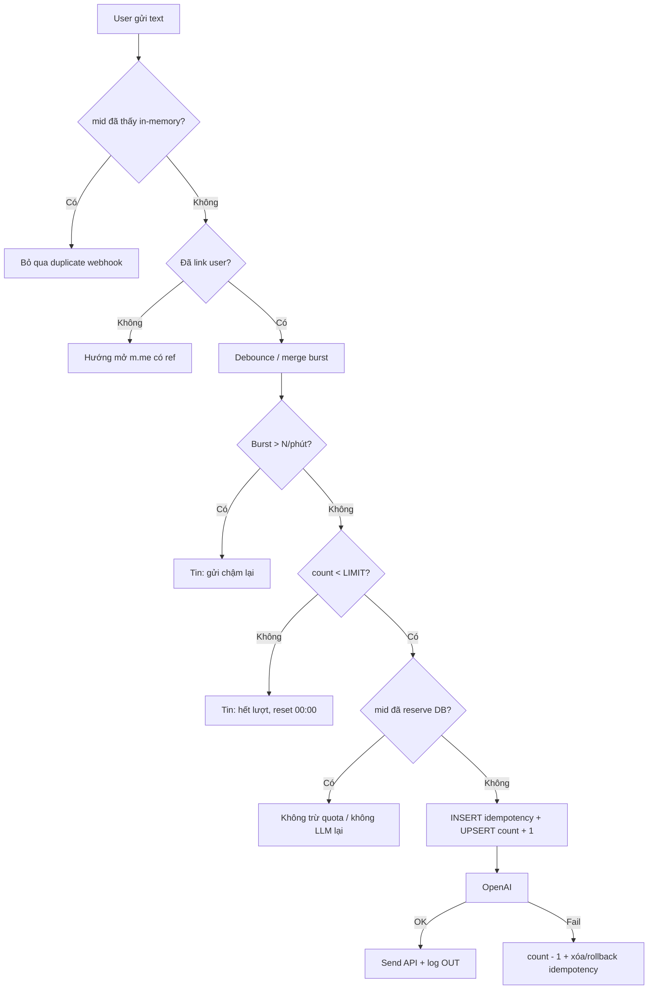
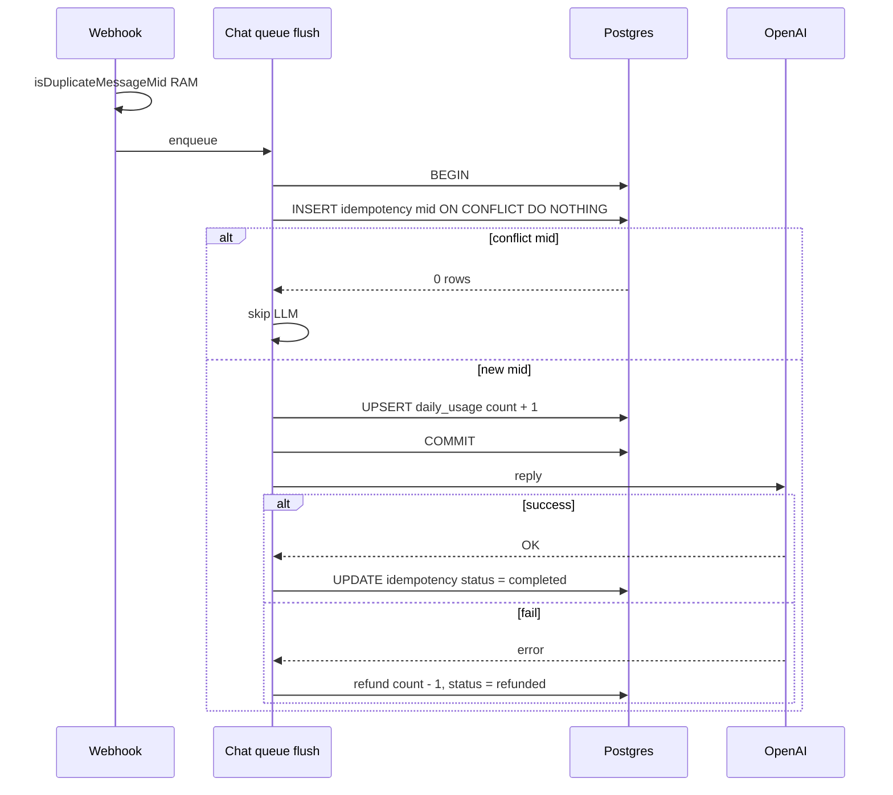
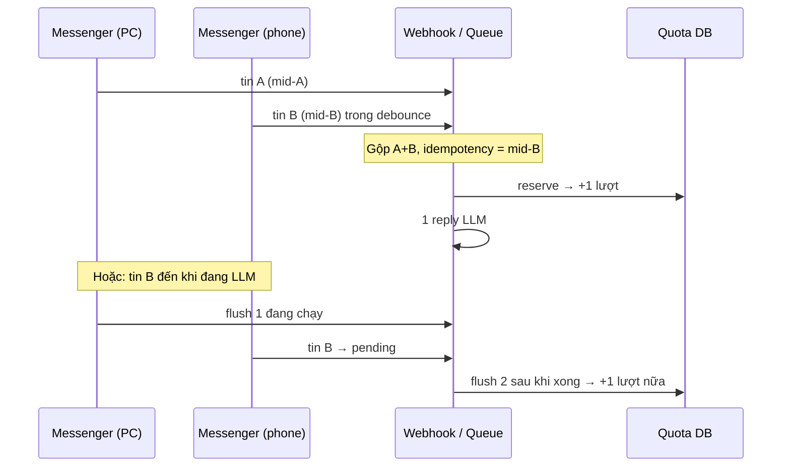
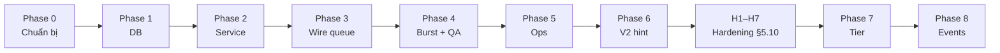
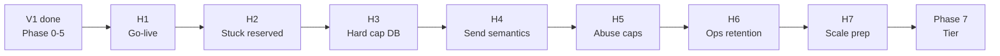

# Rate limit chat Messenger — Lưu quota & giới hạn lượt nhắn tin

Tài liệu nghiên cứu **3 hướng lưu trữ quota** khi bật chatbot hai chiều (user nhắn ↔ bot trả lời bằng LLM), phân tích trade-off và **đề xuất triển khai** cho POC WISPACE.

Liên quan: [project-overview.md](./project-overview.md), [study-session-reminder.md](./study-session-reminder.md) (pattern outbox tương tự `study_reminder_jobs`).

---

## 1. Bối cảnh

### 1.1. Tính năng

- User **đã link WISPACE** có thể nhắn text tự do → bot trả lời qua LLM agent (`MessengerChatQueueService` + tools).
- Mỗi flush debounce (gộp nhiều tin liên tiếp) = **1 lượt** khi `CHAT_RATE_LIMIT_ENABLED=true`.
- Kiểm soát chi phí: quota ngày, burst/phút, whitelist PSID QA, hint “còn X lượt”.

### 1.2. Trạng thái code (V1 + hardening H1–H7 ✓)

| Thành phần | Trạng thái |
|------------|------------|
| Chat AI hai chiều (`MessengerChatQueueService` → agent + tools) | ✓ |
| Dedupe webhook `message.mid` | ✓ RAM (mặc định) hoặc DB khi `CHAT_QUEUE_SHARED=true` |
| Dedupe postback (`psid:payload`, TTL 15s) | ✓ |
| Rate limit / `messenger_chat_daily_usage` | ✓ `ChatRateLimitModule` |
| Idempotency DB quota (`message.mid`) | ✓ `messenger_chat_idempotency` |
| Hard cap daily trong transaction (H3) | ✓ |
| Stuck `reserved` / retry `mid` (H2) | ✓ |
| LLM vs Send semantics, abuse caps (H4–H5) | ✓ |
| Ops retention + logs (H6) | ✓ |
| Shared queue/history cross-pod (H7) | ✓ khi `CHAT_QUEUE_SHARED=true` |

Luồng chat text:

```
webhook → dedupe mid → enqueue (RAM hoặc DB buffer)
  → debounce flush → reserve quota (DB) → LLM → Send API
  → markCompleted; lỗi trước gửi → refund
```

Bật enforcement: `CHAT_RATE_LIMIT_ENABLED=true`. Tắt nhanh: `false` hoặc `CHAT_RATE_LIMIT_WHITELIST_PSIDS`.

Bảng `messenger_message_logs` đã có — dùng audit tin gửi/nhận (`message_type`, `psid`, `user_id`, `created_at`).

### 1.3. Meta (Facebook) giới hạn gì?

Meta **không** cung cấp API “user được nhắn bot tối đa X tin/ngày”. Giới hạn platform chủ yếu ở **phía bot gửi đi**:

| Giới hạn | Mô tả |
|----------|--------|
| Send API (text) | ~300 tin/giây / Page |
| Rolling 24h | `200 × số Engaged Users` (tổng call app) |
| Per-thread | Có thể throttle nếu gửi quá nhiều vào **một** hội thoại |
| 24h messaging window | User phải nhắn bot trong 24h gần nhất để bot trả lời kiểu `RESPONSE` |

→ **Quota chat/ngày do ứng dụng tự implement** trên Postgres (hoặc cache), không trông Meta.

Tài liệu Meta: [Messenger Platform rate limits](https://developers.facebook.com/docs/messenger-platform/overview/rate-limiting).

---

## 2. Phạm vi quota — Bucket tách riêng

Không gộp mọi tương tác vào một counter. Đề xuất:

| Bucket | Ví dụ | Tính vào quota chat? |
|--------|--------|----------------------|
| **FREE_FORM_CHAT** | User gõ text → LLM trả lời | **Có** (chặt nhất) |
| **MENU_POSTBACK** | Nhắc lịch, Xem tiến độ, Đăng ký báo cáo | **Không** (hoặc bucket riêng, limit rộng) |
| **PROACTIVE** | Nhắc T-30, báo cáo cron | **Không** — hệ thống gửi |
| **SYSTEM_REPLY** | Welcome, hết lượt, lỗi | **Không** |

**Cửa sổ thời gian đề xuất:** calendar day theo `Asia/Ho_Chi_Minh` (khớp `STUDY_REMINDER_TIMEZONE`), reset nửa đêm — dễ giải thích với học viên.

**Burst (chống spam nhanh):** tối đa N tin/phút (vd `3`) — kiểm tra trước quota ngày.

**Env gợi ý:**

```env
CHAT_FREE_FORM_DAILY_LIMIT=15
CHAT_BURST_PER_MINUTE=3
CHAT_USAGE_TIMEZONE=Asia/Ho_Chi_Minh
```

---

## 3. Ba hướng lưu quota

### Option A — Bảng counter ngày `messenger_chat_daily_usage` (đề xuất)

#### Ý tưởng

Mỗi user (`psid`) mỗi **ngày ICT** có **một dòng** với cột `free_form_count`. Mỗi lần chat tự do thành công → `+1` bằng UPSERT atomic. Sang ngày mới → row mới (lazy insert khi có tin đầu tiên).

#### Schema đề xuất

```sql
CREATE TABLE messenger_chat_daily_usage (
  id               SERIAL PRIMARY KEY,
  psid             VARCHAR(64) NOT NULL,
  user_id          INT NULL,
  usage_date       DATE NOT NULL,           -- ngày theo CHAT_USAGE_TIMEZONE
  free_form_count  INT NOT NULL DEFAULT 0,
  created_at       TIMESTAMPTZ NOT NULL DEFAULT now(),
  updated_at       TIMESTAMPTZ NOT NULL DEFAULT now(),
  CONSTRAINT uq_chat_daily_usage_psid_date UNIQUE (psid, usage_date)
);

CREATE INDEX idx_chat_daily_usage_user_date
  ON messenger_chat_daily_usage (user_id, usage_date)
  WHERE user_id IS NOT NULL;
```

| Cột | Ý nghĩa |
|-----|---------|
| `psid` | Khóa chính — luôn có từ webhook Messenger |
| `user_id` | Copy từ `user_messenger_mappings` khi đã link (báo cáo, ops) |
| `usage_date` | Ngày ICT dạng `2026-06-15` — **không** dùng UTC tuỳ ý |
| `free_form_count` | Số lượt FREE_FORM đã tiêu trong ngày |

#### Luồng xử lý



#### UPSERT atomic (chống race)

```sql
INSERT INTO messenger_chat_daily_usage (psid, user_id, usage_date, free_form_count)
VALUES ($1, $2, $3, 1)
ON CONFLICT (psid, usage_date)
DO UPDATE SET
  free_form_count = messenger_chat_daily_usage.free_form_count + 1,
  user_id = COALESCE(EXCLUDED.user_id, messenger_chat_daily_usage.user_id),
  updated_at = now()
RETURNING free_form_count;
```

**Lưu ý:** UPSERT đảm bảo **counter không sai** khi nhiều request ghi đồng thời. **H3 ✓** thêm `WHERE free_form_count < limit` trong cùng transaction với idempotency — daily cap không vượt khi multi-instance. **H7 ✓** persist debounce + history + webhook dedupe qua DB khi `CHAT_QUEUE_SHARED=true`.

#### Idempotency webhook Meta

Facebook có thể gửi webhook **trùng** cùng `message.mid`. Hệ thống dùng **dedupe webhook** (RAM hoặc DB H7) + **idempotency quota** tại reserve — chi tiết [§5.3](#53-idempotency--đã-triển-khai-v1--h2).

Tóm tắt: reserve gắn `idempotency_key = message.mid` (unique) trước LLM; conflict → skip hoặc recover (H2). Multi-pod: `CHAT_QUEUE_SHARED=true`.

#### Reserve vs refund

| Chiến lược | Mô tả | Khi nào |
|------------|--------|---------|
| **Reserve trước LLM** | `+1` trước khi gọi OpenAI | Chống abuse cost — **khuyến nghị** |
| **Refund khi fail** | `-1` nếu LLM hoặc Send API lỗi | UX công bằng |
| **Chỉ +1 sau success** | User không mất lượt khi lỗi | Dễ bị spam làm tốn LLM |

#### Tính `usage_date` (ICT)

```ts
function todayUsageDate(timezone: string, now = new Date()): string {
  return new Intl.DateTimeFormat('en-CA', {
    timeZone: timezone,
    year: 'numeric',
    month: '2-digit',
    day: '2-digit',
  }).format(now); // "2026-06-15"
}
```

Reset quota = tự nhiên khi `usage_date` đổi — **không cần cron xóa counter**.

#### Ví dụ dữ liệu

User `psid=27291166300574332` (user 143), limit 15:

| psid | usage_date | free_form_count |
|------|------------|-----------------|
| 27291166300574332 | 2026-06-15 | 7 |
| 27291166300574332 | 2026-06-16 | 2 |

#### Module code gợi ý

```
src/chat-rate-limit/
  chat-rate-limit.module.ts
  chat-rate-limit.service.ts       # check(), reserve(), refund()
  chat-daily-usage.repository.ts
  chat-daily-usage.entity.ts
```

Hook: **`MessengerChatQueueService.flush()`** — trước LLM; webhook giữ dedupe RAM. Postback **không** qua rate limit.

#### Kết hợp với log hiện có

Counter = **đọc nhanh** quota. `messenger_message_logs` = **audit** nội dung:

| message_type | Khi nào |
|--------------|---------|
| `FREE_FORM_CHAT_IN` | User gửi (optional, trước LLM) |
| `FREE_FORM_CHAT_OUT` | Bot trả lời LLM thành công |
| `CHAT_QUOTA_DENIED` | Hết lượt / burst |

---

### Option B — Event sourcing + replay

#### Ý tưởng

Không lưu trực tiếp `free_form_count = 7`. Lưu **chuỗi sự kiện bất biến** (append-only). Trạng thái quota = **project** từ events (replay).

#### Event types tối thiểu

```ts
type ChatEventType =
  | 'FREE_FORM_MESSAGE_RECEIVED'
  | 'CHAT_QUOTA_RESERVED'
  | 'CHAT_QUOTA_DENIED'
  | 'CHAT_QUOTA_RELEASED'      // LLM / Send fail → hoàn lượt
  | 'LLM_REPLY_SENT'
  | 'MENU_POSTBACK_RECEIVED'; // optional, không trừ quota
```

#### Schema event store

```sql
CREATE TABLE messenger_chat_events (
  id              BIGSERIAL PRIMARY KEY,
  aggregate_id    VARCHAR(64) NOT NULL,   -- psid
  aggregate_type  VARCHAR(32) NOT NULL DEFAULT 'chat_quota',
  event_type      VARCHAR(64) NOT NULL,
  payload         JSONB NOT NULL,
  occurred_at     TIMESTAMPTZ NOT NULL DEFAULT now(),
  idempotency_key VARCHAR(128) NULL UNIQUE
);

CREATE INDEX idx_chat_events_aggregate_time
  ON messenger_chat_events (aggregate_id, occurred_at);
```

#### Replay (derive state)

```ts
function projectDailyUsage(events: ChatEvent[], usageDate: string): number {
  let count = 0;
  for (const e of events) {
    if (e.occurredDateIct !== usageDate) continue;
    if (e.type === 'CHAT_QUOTA_RESERVED') count += 1;
    if (e.type === 'CHAT_QUOTA_RELEASED') count -= 1;
  }
  return count;
}
```

#### Kiến trúc thực tế (không replay mỗi request)



Runtime **vẫn cần projection** (Option A) để check quota O(1). Event store = source of truth cho audit và rebuild khi đổi rule.

#### Khi replay hữu ích

- Debug: “vì sao user báo hết lượt?”
- Đổi rule (15 → 20, reset theo tuần) → rebuild projection từ events cũ
- Billing / compliance cần chứng minh từng quyết định grant/deny

---

### Option C — Đếm từ `messenger_message_logs`

#### Ý tưởng

Không bảng counter. Mỗi tin chat log với `message_type` cố định. Quota hôm nay = `COUNT(*)` trên log.

#### Query ví dụ

```sql
SELECT COUNT(*)::int AS used_today
FROM messenger_message_logs
WHERE psid = $1
  AND message_type = 'FREE_FORM_CHAT_IN'
  AND status = 'SENT'
  AND (created_at AT TIME ZONE 'Asia/Ho_Chi_Minh')::date = $2::date;
```

Burst 1 phút:

```sql
SELECT COUNT(*) FROM messenger_message_logs
WHERE psid = $1
  AND message_type = 'FREE_FORM_CHAT_IN'
  AND created_at > NOW() - INTERVAL '1 minute';
```

#### Luồng

```
Webhook → COUNT logs hôm nay → nếu < LIMIT → LLM → INSERT log IN + OUT
```

Không có UPSERT counter — mỗi hành động chỉ append log.

---

## 4. So sánh trade-off

### 4.1. Bảng tổng hợp

| Tiêu chí | **A. `messenger_chat_daily_usage`** | **B. Event sourcing** | **C. Đếm từ log** |
|----------|-------------------------------------|------------------------|-------------------|
| **Độ phức tạp triển khai** | Thấp | Cao (store + projection + replay) | Thấp nhất (không migration mới) |
| **Độ phức tạp vận hành** | Thấp | Cao — team phải hiểu replay | Trung bình — log phình theo thời gian |
| **Performance đọc quota** | O(1) — 1 row | O(1) nếu có projection; O(n) nếu replay mỗi request | O(n) — COUNT mỗi tin |
| **Performance ghi** | 1 UPSERT | 1 INSERT event + update projection | 1 INSERT log (×2 nếu IN+OUT) |
| **Race condition / concurrent** | Tốt — UPSERT atomic | Tốt nếu transaction event+projection | Kém — double COUNT trước khi INSERT |
| **Audit chi tiết** | Trung bình — cần log kèm | Rất tốt — full event history | Tốt — nếu log đủ type |
| **Replay / rebuild state** | Không native | **Điểm mạnh chính** | Có thể COUNT lại — chậm, không có reserve/release semantics |
| **Storage theo thời gian** | ~1 row/user/ngày | N event/action — lớn nhất | 1+ row/tin — lớn |
| **Đổi rule quota sau này** | Chỉ áp dụng forward | Rebuild projection từ events | Khó — log cũ không có semantics reserve |
| **Khớp stack POC hiện tại** | Giống `study_reminder_jobs` (snapshot state) | Pattern mới, học curve | Tận dụng bảng có sẵn |
| **Phù hợp scale học viên IELTS** | **Rất phù hợp** | Overkill giai đoạn đầu | OK &lt; 50 user active chat |

### 4.2. Chi phí thực tế cần tối ưu

Bottleneck chính **không phải** đọc Postgres — mà **OpenAI + Send API**. Vì vậy:

- Cần **reserve trước LLM** (atomic) → Option A và B (có projection) làm tốt; Option C dễ lỗ race.
- Event sourcing không giảm tiền LLM — chỉ giúp audit/rebuild.

### 4.3. Khi nào nên nâng từ A lên B

Chỉ khi có **ít nhất hai** điều:

1. Billing theo token / gói Premium / quota khác nhau theo `user_id`
2. Cần rebuild quota thường xuyên sau khi đổi business rule
3. Compliance yêu cầu chứng minh từng lần deny/grant

Lúc đó: thêm `messenger_chat_events` **bên cạnh** `messenger_chat_daily_usage`, không thay hot path.

### 4.4. Vì sao không chọn C làm production

- Mỗi tin chat = `COUNT(*)` trên bảng log đang lớn → latency tăng theo thời gian.
- Index `(psid, message_type, created_at)` giúp nhưng vẫn nặng hơn đọc 1 row counter.
- Khó mô hình hóa **reserve / refund** khi LLM fail (đếm IN hay OUT?).
- Webhook retry Meta dễ double-count nếu không có idempotency riêng.

**C vẫn OK** cho spike demo nhanh (&lt; 1 tuần, vài user) trước khi migration Option A.

---

## 5. Đề xuất chính thức: Option A — `messenger_chat_daily_usage`

### 5.1. Tóm tắt quyết định

| Quyết định | Lựa chọn |
|------------|----------|
| Lưu quota | Bảng **`messenger_chat_daily_usage`** |
| Key | `(psid, usage_date)` unique |
| Timezone | `CHAT_USAGE_TIMEZONE` = `Asia/Ho_Chi_Minh` |
| Đếm | `free_form_count` — chỉ bucket FREE_FORM |
| Ghi | UPSERT atomic; reserve trước LLM, refund khi fail |
| Idempotency | **DB** — `message.mid` unique khi reserve (§5.3); giữ dedupe RAM ở webhook |
| Audit | Giữ `messenger_message_logs` với `message_type` chuẩn |
| Event sourcing | **Không** giai đoạn 1; có thể bổ sung sau |
| Đếm từ log | **Không** trên hot path |

### 5.2. Luồng end-to-end đề xuất



**Postback menu** (`VIEW_UPCOMING_STUDY_SESSION`, …) đi nhánh riêng — **không** qua `ChatRateLimitService`.

Hook reserve: **`MessengerChatQueueService.processChatBatch()`** (gọi từ `flush`) — sau debounce, **trước** `MessengerAgentService.reply()`. Webhook dedupe + enqueue; reserve tại flush.

### 5.3. Idempotency — đã triển khai (V1 + H2)

Meta có thể **retry webhook** cùng payload (cùng `message.mid`). Hệ thống chống trừ quota / gọi LLM trùng bằng **hai lớp**:

| Lớp | Khi nào | Cơ chế |
|-----|---------|--------|
| Webhook dedupe | Trước enqueue | RAM 1h (`MessengerService`) hoặc `messenger_chat_webhook_seen` khi `CHAT_QUEUE_SHARED=true` |
| Quota idempotency | Tại flush | `messenger_chat_idempotency` — unique `idempotency_key = message.mid` |

Postback: dedupe riêng `psid:payload` (15s) — **không** liên quan quota chat.

| Dedupe | 1 instance (`CHAT_QUEUE_SHARED=false`) | Multi-pod (`CHAT_QUEUE_SHARED=true`) |
|--------|----------------------------------------|--------------------------------------|
| Webhook `mid` | RAM Map | DB `messenger_chat_webhook_seen` |
| Debounce queue | RAM `Map` per process | DB `messenger_chat_queue_buffer` |
| Chat history LLM | RAM 30 phút | DB `messenger_chat_history` |
| Quota reserve | DB idempotency + hard cap H3 | Giống — shared PostgreSQL |

#### Schema — bảng idempotency (đã migration)

```sql
CREATE TABLE messenger_chat_idempotency (
  idempotency_key  VARCHAR(128) PRIMARY KEY,  -- message.mid từ Meta
  psid             VARCHAR(64) NOT NULL,
  user_id          INT NULL,
  usage_date       DATE NOT NULL,
  reserved_at      TIMESTAMPTZ NOT NULL DEFAULT now(),
  status           VARCHAR(16) NOT NULL DEFAULT 'reserved'
                   CHECK (status IN ('reserved', 'completed', 'refunded'))
);

CREATE INDEX idx_chat_idempotency_psid_date
  ON messenger_chat_idempotency (psid, usage_date);
```

| Cột | Ý nghĩa |
|-----|---------|
| `idempotency_key` | `message.mid` — unique toàn hệ thống |
| `status` | `reserved` → LLM đang chạy; `completed` → đã gửi reply; `refunded` → hoàn lượt sau lỗi |

**Phương án gọn hơn (POC):** unique `(idempotency_key)` trên `messenger_message_logs` khi `message_type = 'FREE_FORM_CHAT_IN'` — reserve + insert log trong một transaction. Không insert được → mid đã xử lý, skip LLM.

#### Luồng reserve có idempotency



#### Debounce vs idempotency

`MessengerChatQueueService` gộp nhiều tin liên tiếp (`CHAT_DEBOUNCE_MS`) thành **một** lần gọi LLM.

| Quy ước | Mô tả |
|---------|--------|
| **Khuyến nghị** | **1 lượt quota / 1 lần flush** (một reply bot), không trừ theo từng `mid` trong burst |
| Idempotency key khi merge | `mid` của **tin cuối** trong batch debounce (đã implement trong `MessengerChatQueueService.flush()`) |
| Burst user gửi 5 tin / 2s | User nhận 1 reply → trừ **1** lượt (UX công bằng) |

Ghi rõ quy ước này trong code + test để tránh tranh cãi “5 tin = 5 lượt hay 1 lượt”.

#### Giữ dedupe RAM song song

| Lớp | Vai trò |
|-----|---------|
| **RAM** (`isDuplicateMessageMid`) | Fast path — bỏ webhook trùng ngay, không enqueue |
| **DB** (idempotency + reserve) | Source of truth quota — survive restart, multi-instance |

Hai lớp **bổ sung**, không thay thế nhau.

#### Nhiều thiết bị — cùng tài khoản Messenger

Học viên thường nhắn bot từ **máy tính** (Messenger web / desktop) và **điện thoại** (app Messenger) **cùng lúc** hoặc xen kẽ. Meta gán **một PSID** cho mỗi người ↔ Page — **không** tách quota theo thiết bị. Máy tính và điện thoại **dùng chung** bucket `(psid, usage_date)` và chung hàng đợi debounce trong process.

**Cách code xử lý hiện tại (V1):**

| Tầng | Hành vi |
|------|---------|
| **Webhook** | Mỗi tin = một `message.mid` riêng (PC và phone luôn khác `mid`). Dedupe RAM chỉ bỏ **retry trùng** cùng `mid`, không gộp hai thiết bị. |
| **Queue** (`MessengerChatQueueService`) | Một `Map` entry **theo PSID** — không phân biệt nguồn thiết bị. Cờ `processing` đảm bảo **tối đa một flush** (một lần reserve + LLM) chạy cho PSID đó trên **cùng instance**. |
| **Debounce** | Tin từ PC + phone đến **trong** `CHAT_DEBOUNCE_MS` (trước khi flush) → gộp `texts[]` → **một** reply bot → **trừ 1 lượt**. |
| **Pending khi đang xử lý** | Tin đến **trong lúc** bot đang gọi LLM (`processing = true`) → vào `pendingWhileProcessing` → sau flush xong, **flush tiếp** → **trừ thêm 1 lượt** (hai lần nhắn hợp lệ). |
| **Quota DB** | Reserve theo `idempotency_key` = `mid` tin cuối của batch flush; counter `free_form_count` theo PSID + ngày ICT. |
| **Burst** | Đếm số bản ghi `messenger_chat_idempotency` với `reserved_at` trong 60 giây gần nhất — **mọi thiết bị** cộng chung vào cùng PSID. |

**Kịch bản minh họa:**



| Tình huống | Kết quả UX / quota (1 instance POC) |
|------------|-------------------------------------|
| Gõ PC + phone **gần như cùng lúc** (trong debounce) | 1 câu trả lời (nội dung gộp), **1 lượt** |
| Gõ phone **khi** bot đang trả lời tin PC | 2 câu trả lời lần lượt, **2 lượt** |
| Cùng PSID, đã **hết quota ngày** | Tin sau (dù từ thiết bị nào) → `CHAT_QUOTA_DENIED` |
| Vượt **burst** (3/phút mặc định POC) | Tin sau → deny burst; áp dụng chung PSID, không theo thiết bị |

**Race condition — mức độ thực tế:**

- **Một process (`CHAT_QUEUE_SHARED=false`):** Cùng PSID flush **xếp hàng** (`processing` + `pendingWhileProcessing`). Overshoot daily hiếm.
- **Nhiều instance:** Bật **`CHAT_QUEUE_SHARED=true`** (H7) — debounce/history/`mid` dedupe qua PostgreSQL; claim buffer `FOR UPDATE`. Daily cap: **H3** hard cap trong transaction — không vượt limit khi concurrent reserve.

**Không làm trong V1:**

- Quota riêng theo thiết bị / session — Meta không expose device id ổn định cho use case này.
- Gộp quota theo `user_id` thay PSID — mapping PSID↔user đã có nhưng counter hot path vẫn keyed PSID (đúng với webhook).

### 5.4. API service nội bộ (gợi ý)

```ts
interface ChatQuotaCheckResult {
  allowed: boolean;
  used: number;
  limit: number;
  remaining: number;
  reason?: 'DAILY_LIMIT' | 'BURST_LIMIT' | 'NOT_LINKED';
  usageDate: string;
}

class ChatRateLimitService {
  async checkQuota(psid: string, userId?: number): Promise<ChatQuotaCheckResult>;
  /** Trả allowed=false nếu mid đã reserve (idempotency conflict). */
  async reserveFreeFormSlot(
    psid: string,
    params: { userId?: number; idempotencyKey: string },
  ): Promise<ChatQuotaCheckResult>;
  async refundFreeFormSlot(
    psid: string,
    usageDate: string,
    idempotencyKey: string,
  ): Promise<void>;
  async markCompleted(idempotencyKey: string): Promise<void>;
}
```

### 5.5. Tin nhắn khi hết quota (UX)

> Hôm nay bạn đã dùng hết **15 lượt chat** với WISPACE. Lượt mới reset lúc **00:00** (giờ Việt Nam).  
> Bạn vẫn có thể dùng **Menu**: Nhắc lịch học, Xem tiến độ, Đăng ký báo cáo.

`message_type`: `CHAT_QUOTA_DENIED`.

### 5.6. Gợi ý số liệu POC

| Tier | FREE_FORM / ngày | Burst |
|------|------------------|-------|
| POC / demo | 15–20 | 3/phút |
| Production nhẹ | 30 | 5/phút |
| Whitelist QA | unlimited (config `psid` list) | — |

### 5.7. Checklist triển khai (V1 — done)

- [x] Migration `messenger_chat_daily_usage`
- [x] Migration `messenger_chat_idempotency` (hoặc unique `message.mid` trên log IN)
- [x] Entity + repository + `ChatRateLimitService` (`reserve` / `refund` / `markCompleted`)
- [x] Wire **`MessengerChatQueueService.flush()`** — reserve + idempotency **trước** LLM; refund trong `catch`
- [x] Giữ dedupe RAM `isDuplicateMessageMid` ở webhook (fast path)
- [x] Quy ước debounce: **1 lượt / 1 flush**; document idempotency key khi merge burst
- [x] Document **nhiều thiết bị** cùng tài khoản (§5.3) — chung PSID/quota, debounce vs pending
- [x] `message_type` mới: `FREE_FORM_CHAT_IN`, `FREE_FORM_CHAT_OUT`, `CHAT_QUOTA_DENIED`
- [x] Env: `CHAT_FREE_FORM_DAILY_LIMIT`, `CHAT_BURST_PER_MINUTE`, `CHAT_USAGE_TIMEZONE`
- [x] Script ops: `npm run chat-quota:status` — query usage + idempotency theo `psid` / `user_id` / ngày
- [x] Test: retry webhook cùng `mid` → count không tăng; LLM fail → refund
- [x] Cập nhật [project-overview.md](./project-overview.md) khi merge code

### 5.8. Lộ trình sau (optional — sau V1 production)

| Giai đoạn | Việc làm | Trạng thái |
|-----------|----------|------------|
| **V2 UX** | Hint “còn X lượt” khi `remaining ≤ threshold` | ✓ Phase 6 (code) |
| **V3 Tier** | Limit theo `user_id` / gói Wispace | Chưa |
| **V4 Event store** | `messenger_chat_events` + replay / billing | Chưa |
| **H1–H7** | Hardening edge cases vận hành (§5.10, sau §5.9) | H1 ✓; H2 ✓; H4 ✓; H5 ✓; **H3 ✓**; **H6 ✓**; **H7 ✓** |

### 5.9. Kế hoạch triển khai theo phase (full rate limit)

Roadmap triển khai **V1 (Phase 0–5 ✓)** và hardening **H1–H7 ✓** — giữ làm tài liệu lịch sử / onboarding. Phase 7–8 (tier, event store) chưa làm.



#### Phase 0 — Chuẩn bị (≈ 0.5 ngày)

**Mục tiêu:** Cấu hình và khung module, chưa chặn user.

| Việc | Done khi |
|------|----------|
| Thêm env vào `.env.example`: `CHAT_FREE_FORM_DAILY_LIMIT`, `CHAT_BURST_PER_MINUTE`, `CHAT_USAGE_TIMEZONE` | Dev biết biến bắt buộc |
| Tạo module `src/modules/chat-rate-limit/` (module + service stub) | Nest boot, inject được |
| `readRequiredPositiveNumber` / config reader giống `StudyReminderScheduleService` | Limit đọc từ env, không hardcode |
| (Tuỳ chọn) `CHAT_RATE_LIMIT_ENABLED=true` — tắt nhanh khi debug | Rollback không cần revert code |

**Không làm:** wire queue, migration.

---

#### Phase 1 — Schema & repository (≈ 1 ngày)

**Mục tiêu:** Postgres sẵn sàng, test repository độc lập.

| Việc | Done khi |
|------|----------|
| Migration `messenger_chat_daily_usage` | `npm run migration:run` OK |
| Migration `messenger_chat_idempotency` | Unique `idempotency_key` |
| Entity TypeORM + repository (UPSERT daily, INSERT idempotency) | Spec: concurrent UPSERT → count đúng |
| Index `(psid, usage_date)` | Explain query nhanh |

**Không làm:** gọi từ chat queue.

---

#### Phase 2 — `ChatRateLimitService` core (≈ 1–1.5 ngày)

**Mục tiêu:** Logic quota + idempotency trong transaction, chưa hook UI.

| Việc | Done khi |
|------|----------|
| `todayUsageDate(timezone)` — ICT `en-CA` | Khớp `STUDY_REMINDER_TIMEZONE` |
| `checkQuota(psid)` → `{ allowed, used, limit, remaining, usageDate }` | Unit test under/at/over limit |
| `reserveFreeFormSlot(psid, { idempotencyKey, userId })` trong **một transaction**: INSERT idempotency → UPSERT count +1 | Conflict `mid` → `allowed: false`, count không tăng |
| `refundFreeFormSlot(psid, usageDate, idempotencyKey)` | count -1, status `refunded` |
| `markCompleted(idempotencyKey)` | status `completed` |
| Reserve **trước** LLM; refund khi LLM/Send fail | Document trong service |

**Test bắt buộc:**

- Hai `reserve` cùng `mid` → một thành công, một conflict.
- Reserve → refund → count về như cũ.

---

#### Phase 3 — Tích hợp chat queue (≈ 1 ngày)

**Mục tiêu:** User thật bị chặn khi hết lượt; chat bình thường vẫn chạy.

| Việc | Done khi |
|------|----------|
| Hook `MessengerChatQueueService.flush()`: sau debounce, **trước** `MessengerAgentService.reply()` | Reserve gọi đúng chỗ |
| Truyền `idempotencyKey` = `message.mid` tin **cuối** trong batch debounce (quy ước §5.3) | 5 tin burst → 1 lượt |
| Hết lượt → `sendTextViaPsid` tin §5.5, `message_type=CHAT_QUOTA_DENIED` | Không gọi OpenAI |
| Thành công → `markCompleted`; `catch` → `refund` | LLM lỗi không mất lượt oan |
| Log `FREE_FORM_CHAT_IN` (optional) trước LLM | Audit trong `messenger_message_logs` |
| Giữ `isDuplicateMessageMid` RAM ở webhook | Fast path không đổi |

**Test thủ công:**

- User chưa link → tin hướng dẫn (không reserve hoặc skip — chốt một cách).
- Gửi chat bình thường dưới limit → OK.
- Postback / cron nhắc học → **không** tăng `free_form_count`.

---

#### Phase 4 — Burst, edge cases & hardening (≈ 1 ngày)

**Mục tiêu:** Chống spam nhanh + ổn định production POC.

| Việc | Done khi |
|------|----------|
| `CHAT_BURST_PER_MINUTE` — check trước daily reserve | Tin “gửi chậm lại” khi spam |
| Retry webhook cùng `mid` (simulate) → không double LLM / double count | QA pass |
| Restart server + retry `mid` → DB idempotency vẫn chặn | Khác RAM-only |
| `CHAT_RATE_LIMIT_ENABLED=false` bypass (nếu có flag Phase 0) | Ops tắt nhanh |
| Whitelist PSID QA (env list, optional) | Team test không bị limit |

**Không làm:** tier theo gói, event store.

---

#### Phase 5 — Ops, docs & sign-off V1 (≈ 0.5–1 ngày)

**Mục tiêu:** Vận hành và bàn giao POC.

| Việc | Done khi |
|------|----------|
| Script `npm run chat-quota:status` (psid / userId / ngày) | Ops tra usage |
| Cập nhật [project-overview.md](./project-overview.md), gap `AGENTS.md` | Doc khớp code |
| Checklist §5.7 tick hết mục V1 | Review merge |
| Ghi limit production đề xuất (15–20/ngày, burst 3) vào runbook | Wispace biết con số |

**Definition of done V1:** Chat text → reserve → LLM → send; hết lượt / burst / duplicate `mid` / LLM fail đều đúng; postback & proactive không trừ quota.

---

#### Phase 6 — V2 UX (optional, ≈ 0.5 ngày) — ✓ done

| Việc | Done khi |
|------|----------|
| Sau reply thành công, gửi hint “còn X lượt” khi `remaining ≤ CHAT_QUOTA_REMAINING_HINT_THRESHOLD` | `CHAT_QUOTA_REMAINING_HINT` |
| Không hiện khi unlimited / whitelist / enforcement tắt | Spec queue pass |

**Tiếp theo (optional):** Phase 7 tier Wispace, Phase 8 event store — §5.8.

---

#### Phase 7 — V3 Tier & Wispace (optional, ≈ 2+ ngày)

| Việc | Done khi |
|------|----------|
| Limit theo `user_id` / gói (Premium vs free) | Config hoặc API Wispace |
| Đồng bộ tier khi user upgrade | Không cần redeploy |

---

#### Phase 8 — Event store / billing (optional, V4)

| Việc | Done khi |
|------|----------|
| Bảng `messenger_chat_events` + replay rebuild projection | Audit & đổi rule quota |
| Billing theo token (nếu product yêu cầu) | Ngoài scope POC |

---

#### Tóm tắt effort V1 (Phase 0–5)

| Phase | Effort ước lượng | Có thể ship độc lập? |
|-------|------------------|----------------------|
| 0 Chuẩn bị | 0.5 ngày | ✓ |
| 1 DB | 1 ngày | ✓ (chưa chặn user) |
| 2 Service | 1–1.5 ngày | ✓ (chưa chặn user) |
| 3 Wire queue | 1 ngày | ✓ **bật rate limit thật** |
| 4 Hardening | 1 ngày | Khuyến nghị trước prod |
| 5 Ops | 0.5–1 ngày | Sign-off V1 |
| **Tổng V1** | **~5–6 ngày dev** | |

Phase **6** (V2 hint) ✓. **H1–H7** (§5.10) ✓. **Tiếp theo optional:** Phase **7–8** (tier, event store) khi product cần.

---

### 5.10. Edge cases thực tế — roadmap hardening (H1–H7)

Sau V1 (Phase 0–5 ✓), các gap còn lại khi chạy user thật — tách phase để merge PR nhỏ. **H** = hardening (không trùng Phase 7 tier ở trên).



#### Bảng map — vấn đề → phase

| Vấn đề thực tế | Mức | Phase | Ghi chú hiện tại |
|----------------|-----|-------|------------------|
| `CHAT_RATE_LIMIT_ENABLED=false` — quên bật prod | Cao | **H1** | Không giới hạn chi phí |
| Crash/restart giữa flush → `reserved` kẹt, retry `mid` im lặng | Cao | **H2** | User mất lượt, không reply |
| Multi-instance / concurrent reserve vượt daily cap | Cao | **H3** | Pre-check ngoài transaction |
| LLM OK, Send API fail giữa bubble → refund toàn bộ | TB | **H4** | UX: reply cắt đôi + hoàn lượt |
| Rich follow-up / hint fail sau bubble chính → refund | TB | **H4** | Tương tự H4 |
| Debounce gộp nhiều tin dài → 1 lượt, token LLM lớn | TB | **H5** | Quota đếm lần, không độ dài |
| Burst đếm cả `refunded` trong 60s | TB | **H5** | User retry sau lỗi dễ ăn burst |
| Webhook thiếu `message.mid` → skip reserve, vẫn LLM | TB | **H5** | Lỗ hổng nếu Meta không gửi `mid` |
| `messenger_chat_idempotency` tăng mãi, không retention | Thấp | **H6** | Ops / storage |
| Queue + history RAM không shared giữa pod | Thấp | **H7** | Chỉ khi scale ngang |
| Nhiều thiết bị cùng PSID | — | *(doc §5.3)* | Đã document; H3 nếu multi-pod |
| Đúng nửa đêm ICT, pending khi hết quota, sticker-only | Thấp | **H1** (runbook) | Document QA, không cần code |

#### H1 — Go-live & QA production (≈ 0.5 ngày)

**Mục tiêu:** Bật enforcement an toàn; team biết cách kiểm tra trước khi hardening sâu.

| Việc | Done khi |
|------|----------|
| `CHAT_RATE_LIMIT_ENABLED=true` trên env prod/staging | Counter tăng khi chat |
| Checklist QA: dưới limit, hết ngày, burst, postback không trừ, whitelist | Ghi trong runbook §12 `project-overview.md` |
| `npm run chat-quota:status` trước/sau test user | Ops tra được |
| Document: reset quota 00:00 ICT, `usage_date` tính lúc **reserve** | Support trả lời user |
| Document: pending + hết quota → flush sau có thể deny | Kỳ vọng UX rõ |

**Không làm:** sửa stuck reserved, hard cap transaction.

#### H2 — Stuck `reserved` & retry `mid` (≈ 1–1.5 ngày) — ✓ done

**Mục tiêu:** Crash/restart hoặc timeout giữa reserve và `markCompleted` không làm user mất lượt vĩnh viễn.

| Việc | Done khi |
|------|----------|
| Env `CHAT_IDEMPOTENCY_STUCK_RESERVED_MS` (default 600000) | `.env.example` |
| `ChatRateLimitService`: conflict → `recoverIdempotencyForRetry` → reserve lại nếu `reopened` | `reserveSlotOrRecoverOnConflict` |
| `refunded` row → delete → Meta retry cùng `mid` gọi LLM lại | Repository transaction |
| `reserved` quá TTL → refund count + delete → retry | Repository + service |
| `reserved` trong TTL → `in_flight` → skip (flush đang chạy) | Log + `IDEMPOTENCY_CONFLICT` |
| `completed` → skip duplicate webhook | Log |
| Ops `npm run chat-quota:recover-stuck` (+ `--dry-run`) | Script |
| `chat-quota:status` in `stuckReserved` | Ops |

**Test:** `chat-rate-limit.service.spec.ts`, `chat-rate-limit.repository.spec.ts`.

**Phụ thuộc:** H1.

#### H3 — Hard cap daily trong transaction (≈ 1 ngày) — ✓ done

**Mục tiêu:** Không vượt `CHAT_FREE_FORM_DAILY_LIMIT` khi concurrent reserve (multi-pod).

| Việc | Done khi |
|------|----------|
| `reserveFreeFormSlotInTransaction` + `dailyLimit` | UPSERT `WHERE free_form_count < $limit` |
| 0 row → `daily_limit_exceeded`, transaction rollback (không kẹt idempotency) | `DailyLimitExceededError` |
| Service map → `DAILY_LIMIT` deny | `ChatRateLimitService.reserveFreeFormSlot` |
| Pre-check `usedBefore` giữ làm fast-path | Transaction là source of truth |
| Test concurrent tại limit−1 → chỉ 1 reserve | `chat-rate-limit.repository.spec.ts` |

**Liên quan:** §5.3 multi-device khi scale ngang. **H7 ✓** persist debounce cross-pod (`CHAT_QUEUE_SHARED=true`).

#### H4 — Semantics LLM vs Send (≈ 1 ngày) — ✓ done

**Mục tiêu:** Tránh refund oan khi user đã nhận phần lớn reply; xử lý Meta 24h window.

| Việc | Done khi |
|------|----------|
| `markCompleted` ngay sau **bubble chính đầu tiên** gửi thành công | `deliverMainReplyBubbles` + `finalizeQuota` |
| Send fail **trước** bubble nào → refund + `FREE_FORM_CHAT_ERROR` | `catch` khi `!mainReplyDelivered` |
| `MessengerPartialSendError` (bubble 1 OK, bubble 2 fail) → **không** refund | `MessengerOutboundService.sendTextBubblesViaPsid` |
| Rich follow-up / hint fail → log warn, **không** refund / không tin lỗi chính | `deliverOptionalChatExtras` |
| Meta 24h window → tin user-facing riêng | `chat-delivery.messages.ts` |

**Policy:** Quota = 1 lượt khi LLM chạy xong **và** ít nhất một bubble `FREE_FORM_CHAT_OUT` đã gửi (hoặc LLM trả text rỗng → vẫn finalize như trước).

**Test:** `messenger-chat-queue.service.spec.ts`, `chat-delivery.messages.spec.ts`.

#### H5 — Abuse caps & burst refinement (≈ 0.5–1 ngày) — ✓ done

| Việc | Done khi |
|------|----------|
| `CHAT_MERGED_TEXT_MAX_CHARS` — `capMergedChatUserText` trước LLM | `messenger-text.utils.ts` + flush |
| Webhook thiếu `mid` + enforcement → không enqueue, `CHAT_MISSING_MID` | `MessengerService` + flush guard |
| Burst mặc định **không** đếm `refunded` (`CHAT_BURST_COUNT_REFUNDED=false`) | `countRecentReservations` |
| Debounce merge vẫn 1 lượt / flush | Regression spec giữ nguyên |

**Env:** `CHAT_MERGED_TEXT_MAX_CHARS`, `CHAT_BURST_COUNT_REFUNDED`.

#### H6 — Ops retention & observability (≈ 0.5 ngày) — ✓ done

| Việc | Done khi |
|------|----------|
| Retention idempotency (xóa completed/refunded > N ngày) | `npm run chat-quota:cleanup` (+ `--dry-run`) |
| `chat-quota:status` + stuck `reserved` + idempotency stats | Debug H2/H6 |
| Log grep: `CHAT_QUOTA_DENY`, `CHAT_QUOTA_REFUND`, `CHAT_QUOTA_RECOVERED` | Ops grep |

**Env:** `CHAT_IDEMPOTENCY_RETENTION_DAYS` (default 90). Script **không** xóa `status=reserved`.

#### H7 — Scale ngang (≥ 2 instance, ≈ 2+ ngày) — ✓ done (Option C)

| Phương án | Khi nào |
|-----------|---------|
| **A** — 1 instance POC | Mặc định `CHAT_QUEUE_SHARED=false` |
| **B** — sticky webhook / external queue | Không implement — dùng C |
| **C** — persist debounce cross-pod | `CHAT_QUEUE_SHARED=true` + migration |

| Việc | Done khi |
|------|----------|
| Bảng `messenger_chat_queue_buffer` | Debounce merge cross-pod |
| Bảng `messenger_chat_history` | LLM context shared |
| Bảng `messenger_chat_webhook_seen` | Dedupe `mid` cross-pod |
| Cron poll flush (2s) + stuck processing recovery | `MessengerChatQueueWorkerService` |
| Claim buffer `FOR UPDATE` | Một pod flush / PSID |

**Env:** `CHAT_QUEUE_SHARED`, `CHAT_QUEUE_PROCESSING_STUCK_MS`, `CHAT_WEBHOOK_DEDUPE_RETENTION_MS`, `CHAT_HISTORY_TTL_MS`, `CHAT_HISTORY_MAX_MESSAGES`.

**Phụ thuộc:** H3 trước scale; H2 khuyến nghị.

#### Tóm tắt effort hardening

| Phase | Effort | Ưu tiên POC 1 instance |
|-------|--------|-------------------------|
| H1 Go-live | 0.5 ngày | **Bắt buộc** |
| H2 Stuck reserved | 1–1.5 ngày | **Cao** |
| H3 Hard cap DB | 1 ngày | Khi >1 pod |
| H4 Send semantics | 1 ngày | Trung bình |
| H5 Abuse caps | 0.5–1 ngày | Trung bình |
| H6 Ops retention | 0.5 ngày | Thấp–TB |
| H7 Scale | 2+ ngày | Khi ≥2 pod — bật `CHAT_QUEUE_SHARED` |
| **Tổng H1–H7** | **~4–6 ngày** | ✓ Done |

**Thứ tự đã triển khai:** H1 → H2 → H5 → H4 → H3 → H6 → H7. **Tiếp theo:** Phase 7 tier.

---

## 6. Tham chiếu

| Tài nguyên | Link / path |
|------------|-------------|
| Meta rate limits | https://developers.facebook.com/docs/messenger-platform/overview/rate-limiting |
| Log tin nhắn hiện tại | `src/infrastructure/database/entities/messenger-message-log.entity.ts` |
| Webhook handler + dedupe | `src/modules/messenger/application/services/messenger.service.ts` |
| Chat queue + reserve hook | `src/modules/messenger/application/services/messenger-chat-queue.service.ts` |
| Shared queue worker (H7) | `src/modules/messenger/application/services/messenger-chat-queue-worker.service.ts` |
| Shared state repository (H7) | `src/modules/messenger/infrastructure/persistence/messenger-chat-shared-state.repository.ts` |
| Quota service | `src/modules/chat-rate-limit/application/services/chat-rate-limit.service.ts` |
| Ops scripts | `scripts/chat-quota-status.mjs`, `chat-quota-recover-stuck.mjs`, `chat-quota-cleanup-idempotency.mjs` |
| Gửi tin (Send API) | `src/modules/messenger/application/services/messenger-outbound.service.ts` |
| Pattern outbox tương tự | `study_reminder_jobs` — [study-session-reminder.md](./study-session-reminder.md) |

---

*Tài liệu này ghi nhận quyết định kiến trúc; triển khai code theo checklist §5.7, roadmap §5.9, hardening edge cases §5.10.*
