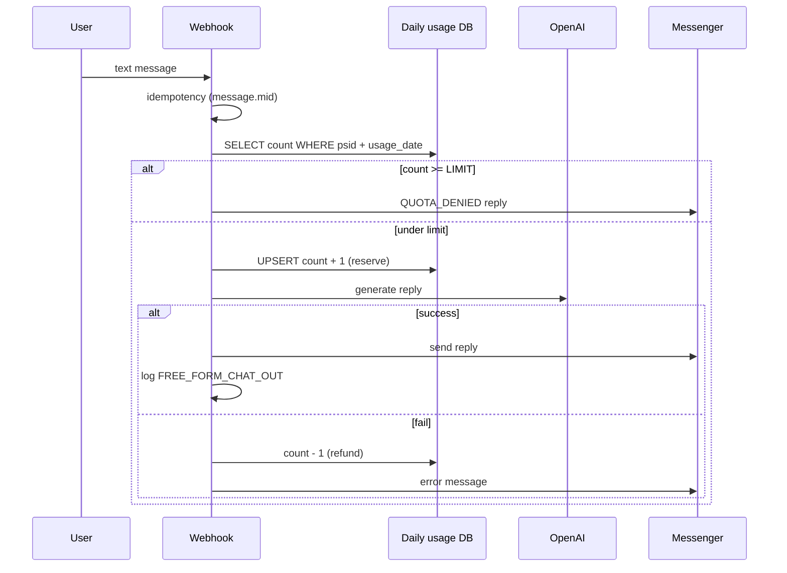
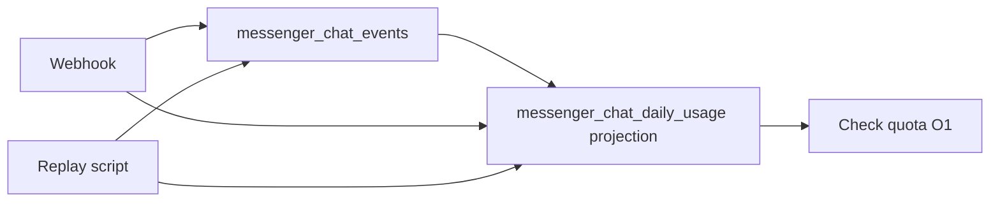
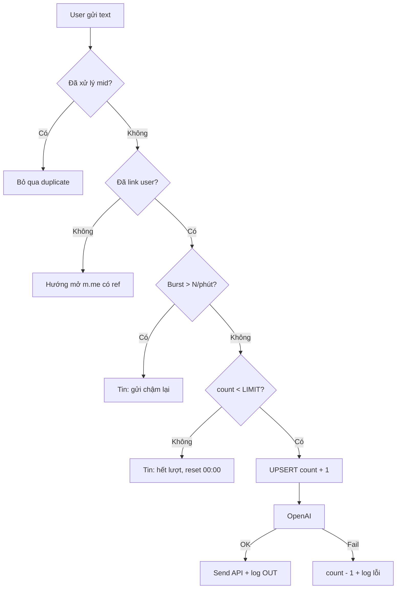

# Rate limit chat Messenger — Lưu quota & giới hạn lượt nhắn tin

Tài liệu nghiên cứu **3 hướng lưu trữ quota** khi bật chatbot hai chiều (user nhắn ↔ bot trả lời bằng LLM), phân tích trade-off và **đề xuất triển khai** cho POC WISPACE.

Liên quan: [project-overview.md](./project-overview.md), [study-session-reminder.md](./study-session-reminder.md) (pattern outbox tương tự `study_reminder_jobs`).

---

## 1. Bối cảnh

### 1.1. Tính năng sắp tới

- User có thể **nhắn tin tự do** với bot (không chỉ menu postback).
- Mỗi tin user có thể kích hoạt **1 lần gọi OpenAI + 1 lần Send API**.
- Cần **giới hạn số lượt chat/ngày** theo user để:
  - Kiểm soát chi phí LLM.
  - Chống spam / lạm dụng.
  - UX rõ ràng (“còn X lượt hôm nay”).

### 1.2. Trạng thái code hiện tại

Trong `MessengerService`, mọi `message.text` từ user hiện chỉ trả **welcome cố định** — chưa LLM, chưa rate limit:

```ts
if (event.message?.text) {
  // ... link psid nếu có ref ...
  await this.sendTextViaPsid({ text: await this.buildWelcomeMessage(...) });
}
```

Bảng `messenger_message_logs` đã có — dùng audit tin gửi/nhận (`message_type`, `psid`, `user_id`, `created_at`).

### 1.3. Meta (Facebook) giới hạn gì?

Meta **không** cung cấp API “user được nhắn bot tối đa X tin/ngày”. Giới hạn platform chủ yếu ở **phía bot gửi đi**:

| Giới hạn | Mô tả |
|----------|--------|
| Send API (text) | ~300 tin/giây / Page |
| Rolling 24h | `200 × số Engaged Users` (tổng call app) |
| Per-thread | Có thể throttle nếu gửi quá nhiều vào **một** hội thoại |
| 24h messaging window | User phải nhắn bot trong 24h gần nhất để bot trả lời kiểu `RESPONSE` |

→ **Quota chat/ngày do ứng dụng tự implement** trên Postgres (hoặc cache), không trông Meta.

Tài liệu Meta: [Messenger Platform rate limits](https://developers.facebook.com/docs/messenger-platform/overview/rate-limiting).

---

## 2. Phạm vi quota — Bucket tách riêng

Không gộp mọi tương tác vào một counter. Đề xuất:

| Bucket | Ví dụ | Tính vào quota chat? |
|--------|--------|----------------------|
| **FREE_FORM_CHAT** | User gõ text → LLM trả lời | **Có** (chặt nhất) |
| **MENU_POSTBACK** | Nhắc lịch, Xem tiến độ, Đăng ký báo cáo | **Không** (hoặc bucket riêng, limit rộng) |
| **PROACTIVE** | Nhắc T-30, báo cáo cron | **Không** — hệ thống gửi |
| **SYSTEM_REPLY** | Welcome, hết lượt, lỗi | **Không** |

**Cửa sổ thời gian đề xuất:** calendar day theo `Asia/Ho_Chi_Minh` (khớp `STUDY_REMINDER_TIMEZONE`), reset nửa đêm — dễ giải thích với học viên.

**Burst (chống spam nhanh):** tối đa N tin/phút (vd `3`) — kiểm tra trước quota ngày.

**Env gợi ý:**

```env
CHAT_FREE_FORM_DAILY_LIMIT=15
CHAT_BURST_PER_MINUTE=3
CHAT_USAGE_TIMEZONE=Asia/Ho_Chi_Minh
```

---

## 3. Ba hướng lưu quota

### Option A — Bảng counter ngày `messenger_chat_daily_usage` (đề xuất)

#### Ý tưởng

Mỗi user (`psid`) mỗi **ngày ICT** có **một dòng** với cột `free_form_count`. Mỗi lần chat tự do thành công → `+1` bằng UPSERT atomic. Sang ngày mới → row mới (lazy insert khi có tin đầu tiên).

#### Schema đề xuất

```sql
CREATE TABLE messenger_chat_daily_usage (
  id               SERIAL PRIMARY KEY,
  psid             VARCHAR(64) NOT NULL,
  user_id          INT NULL,
  usage_date       DATE NOT NULL,           -- ngày theo CHAT_USAGE_TIMEZONE
  free_form_count  INT NOT NULL DEFAULT 0,
  created_at       TIMESTAMPTZ NOT NULL DEFAULT now(),
  updated_at       TIMESTAMPTZ NOT NULL DEFAULT now(),
  CONSTRAINT uq_chat_daily_usage_psid_date UNIQUE (psid, usage_date)
);

CREATE INDEX idx_chat_daily_usage_user_date
  ON messenger_chat_daily_usage (user_id, usage_date)
  WHERE user_id IS NOT NULL;
```

| Cột | Ý nghĩa |
|-----|---------|
| `psid` | Khóa chính — luôn có từ webhook Messenger |
| `user_id` | Copy từ `user_messenger_mappings` khi đã link (báo cáo, ops) |
| `usage_date` | Ngày ICT dạng `2026-06-15` — **không** dùng UTC tuỳ ý |
| `free_form_count` | Số lượt FREE_FORM đã tiêu trong ngày |

#### Luồng xử lý



#### UPSERT atomic (chống race)

```sql
INSERT INTO messenger_chat_daily_usage (psid, user_id, usage_date, free_form_count)
VALUES ($1, $2, $3, 1)
ON CONFLICT (psid, usage_date)
DO UPDATE SET
  free_form_count = messenger_chat_daily_usage.free_form_count + 1,
  user_id = COALESCE(EXCLUDED.user_id, messenger_chat_daily_usage.user_id),
  updated_at = now()
RETURNING free_form_count;
```

#### Idempotency webhook Meta

Facebook có thể gửi webhook **trùng**. Dùng `message.mid` làm `idempotency_key` (bảng phụ hoặc unique constraint trên log) — không tăng counter hai lần cho cùng một tin user.

#### Reserve vs refund

| Chiến lược | Mô tả | Khi nào |
|------------|--------|---------|
| **Reserve trước LLM** | `+1` trước khi gọi OpenAI | Chống abuse cost — **khuyến nghị** |
| **Refund khi fail** | `-1` nếu LLM hoặc Send API lỗi | UX công bằng |
| **Chỉ +1 sau success** | User không mất lượt khi lỗi | Dễ bị spam làm tốn LLM |

#### Tính `usage_date` (ICT)

```ts
function todayUsageDate(timezone: string, now = new Date()): string {
  return new Intl.DateTimeFormat('en-CA', {
    timeZone: timezone,
    year: 'numeric',
    month: '2-digit',
    day: '2-digit',
  }).format(now); // "2026-06-15"
}
```

Reset quota = tự nhiên khi `usage_date` đổi — **không cần cron xóa counter**.

#### Ví dụ dữ liệu

User `psid=27291166300574332` (user 143), limit 15:

| psid | usage_date | free_form_count |
|------|------------|-----------------|
| 27291166300574332 | 2026-06-15 | 7 |
| 27291166300574332 | 2026-06-16 | 2 |

#### Module code gợi ý

```
src/chat-rate-limit/
  chat-rate-limit.module.ts
  chat-rate-limit.service.ts       # check(), reserve(), refund()
  chat-daily-usage.repository.ts
  chat-daily-usage.entity.ts
```

Hook: `MessengerService` — nhánh `message.text` (trước LLM), **không** hook postback menu.

#### Kết hợp với log hiện có

Counter = **đọc nhanh** quota. `messenger_message_logs` = **audit** nội dung:

| message_type | Khi nào |
|--------------|---------|
| `FREE_FORM_CHAT_IN` | User gửi (optional, trước LLM) |
| `FREE_FORM_CHAT_OUT` | Bot trả lời LLM thành công |
| `CHAT_QUOTA_DENIED` | Hết lượt / burst |

---

### Option B — Event sourcing + replay

#### Ý tưởng

Không lưu trực tiếp `free_form_count = 7`. Lưu **chuỗi sự kiện bất biến** (append-only). Trạng thái quota = **project** từ events (replay).

#### Event types tối thiểu

```ts
type ChatEventType =
  | 'FREE_FORM_MESSAGE_RECEIVED'
  | 'CHAT_QUOTA_RESERVED'
  | 'CHAT_QUOTA_DENIED'
  | 'CHAT_QUOTA_RELEASED'      // LLM / Send fail → hoàn lượt
  | 'LLM_REPLY_SENT'
  | 'MENU_POSTBACK_RECEIVED'; // optional, không trừ quota
```

#### Schema event store

```sql
CREATE TABLE messenger_chat_events (
  id              BIGSERIAL PRIMARY KEY,
  aggregate_id    VARCHAR(64) NOT NULL,   -- psid
  aggregate_type  VARCHAR(32) NOT NULL DEFAULT 'chat_quota',
  event_type      VARCHAR(64) NOT NULL,
  payload         JSONB NOT NULL,
  occurred_at     TIMESTAMPTZ NOT NULL DEFAULT now(),
  idempotency_key VARCHAR(128) NULL UNIQUE
);

CREATE INDEX idx_chat_events_aggregate_time
  ON messenger_chat_events (aggregate_id, occurred_at);
```

#### Replay (derive state)

```ts
function projectDailyUsage(events: ChatEvent[], usageDate: string): number {
  let count = 0;
  for (const e of events) {
    if (e.occurredDateIct !== usageDate) continue;
    if (e.type === 'CHAT_QUOTA_RESERVED') count += 1;
    if (e.type === 'CHAT_QUOTA_RELEASED') count -= 1;
  }
  return count;
}
```

#### Kiến trúc thực tế (không replay mỗi request)



Runtime **vẫn cần projection** (Option A) để check quota O(1). Event store = source of truth cho audit và rebuild khi đổi rule.

#### Khi replay hữu ích

- Debug: “vì sao user báo hết lượt?”
- Đổi rule (15 → 20, reset theo tuần) → rebuild projection từ events cũ
- Billing / compliance cần chứng minh từng quyết định grant/deny

---

### Option C — Đếm từ `messenger_message_logs`

#### Ý tưởng

Không bảng counter. Mỗi tin chat log với `message_type` cố định. Quota hôm nay = `COUNT(*)` trên log.

#### Query ví dụ

```sql
SELECT COUNT(*)::int AS used_today
FROM messenger_message_logs
WHERE psid = $1
  AND message_type = 'FREE_FORM_CHAT_IN'
  AND status = 'SENT'
  AND (created_at AT TIME ZONE 'Asia/Ho_Chi_Minh')::date = $2::date;
```

Burst 1 phút:

```sql
SELECT COUNT(*) FROM messenger_message_logs
WHERE psid = $1
  AND message_type = 'FREE_FORM_CHAT_IN'
  AND created_at > NOW() - INTERVAL '1 minute';
```

#### Luồng

```
Webhook → COUNT logs hôm nay → nếu < LIMIT → LLM → INSERT log IN + OUT
```

Không có UPSERT counter — mỗi hành động chỉ append log.

---

## 4. So sánh trade-off

### 4.1. Bảng tổng hợp

| Tiêu chí | **A. `messenger_chat_daily_usage`** | **B. Event sourcing** | **C. Đếm từ log** |
|----------|-------------------------------------|------------------------|-------------------|
| **Độ phức tạp triển khai** | Thấp | Cao (store + projection + replay) | Thấp nhất (không migration mới) |
| **Độ phức tạp vận hành** | Thấp | Cao — team phải hiểu replay | Trung bình — log phình theo thời gian |
| **Performance đọc quota** | O(1) — 1 row | O(1) nếu có projection; O(n) nếu replay mỗi request | O(n) — COUNT mỗi tin |
| **Performance ghi** | 1 UPSERT | 1 INSERT event + update projection | 1 INSERT log (×2 nếu IN+OUT) |
| **Race condition / concurrent** | Tốt — UPSERT atomic | Tốt nếu transaction event+projection | Kém — double COUNT trước khi INSERT |
| **Audit chi tiết** | Trung bình — cần log kèm | Rất tốt — full event history | Tốt — nếu log đủ type |
| **Replay / rebuild state** | Không native | **Điểm mạnh chính** | Có thể COUNT lại — chậm, không có reserve/release semantics |
| **Storage theo thời gian** | ~1 row/user/ngày | N event/action — lớn nhất | 1+ row/tin — lớn |
| **Đổi rule quota sau này** | Chỉ áp dụng forward | Rebuild projection từ events | Khó — log cũ không có semantics reserve |
| **Khớp stack POC hiện tại** | Giống `study_reminder_jobs` (snapshot state) | Pattern mới, học curve | Tận dụng bảng có sẵn |
| **Phù hợp scale học viên IELTS** | **Rất phù hợp** | Overkill giai đoạn đầu | OK &lt; 50 user active chat |

### 4.2. Chi phí thực tế cần tối ưu

Bottleneck chính **không phải** đọc Postgres — mà **OpenAI + Send API**. Vì vậy:

- Cần **reserve trước LLM** (atomic) → Option A và B (có projection) làm tốt; Option C dễ lỗ race.
- Event sourcing không giảm tiền LLM — chỉ giúp audit/rebuild.

### 4.3. Khi nào nên nâng từ A lên B

Chỉ khi có **ít nhất hai** điều:

1. Billing theo token / gói Premium / quota khác nhau theo `user_id`
2. Cần rebuild quota thường xuyên sau khi đổi business rule
3. Compliance yêu cầu chứng minh từng lần deny/grant

Lúc đó: thêm `messenger_chat_events` **bên cạnh** `messenger_chat_daily_usage`, không thay hot path.

### 4.4. Vì sao không chọn C làm production

- Mỗi tin chat = `COUNT(*)` trên bảng log đang lớn → latency tăng theo thời gian.
- Index `(psid, message_type, created_at)` giúp nhưng vẫn nặng hơn đọc 1 row counter.
- Khó mô hình hóa **reserve / refund** khi LLM fail (đếm IN hay OUT?).
- Webhook retry Meta dễ double-count nếu không có idempotency riêng.

**C vẫn OK** cho spike demo nhanh (&lt; 1 tuần, vài user) trước khi migration Option A.

---

## 5. Đề xuất chính thức: Option A — `messenger_chat_daily_usage`

### 5.1. Tóm tắt quyết định

| Quyết định | Lựa chọn |
|------------|----------|
| Lưu quota | Bảng **`messenger_chat_daily_usage`** |
| Key | `(psid, usage_date)` unique |
| Timezone | `CHAT_USAGE_TIMEZONE` = `Asia/Ho_Chi_Minh` |
| Đếm | `free_form_count` — chỉ bucket FREE_FORM |
| Ghi | UPSERT atomic; reserve trước LLM, refund khi fail |
| Audit | Giữ `messenger_message_logs` với `message_type` chuẩn |
| Event sourcing | **Không** giai đoạn 1; có thể bổ sung sau |
| Đếm từ log | **Không** trên hot path |

### 5.2. Luồng end-to-end đề xuất



**Postback menu** (`VIEW_UPCOMING_STUDY_SESSION`, …) đi nhánh riêng — **không** qua `ChatRateLimitService`.

### 5.3. API service nội bộ (gợi ý)

```ts
interface ChatQuotaCheckResult {
  allowed: boolean;
  used: number;
  limit: number;
  remaining: number;
  reason?: 'DAILY_LIMIT' | 'BURST_LIMIT' | 'NOT_LINKED';
  usageDate: string;
}

class ChatRateLimitService {
  async checkQuota(psid: string, userId?: number): Promise<ChatQuotaCheckResult>;
  async reserveFreeFormSlot(psid: string, userId?: number): Promise<ChatQuotaCheckResult>;
  async refundFreeFormSlot(psid: string, usageDate: string): Promise<void>;
}
```

### 5.4. Tin nhắn khi hết quota (UX)

> Hôm nay bạn đã dùng hết **15 lượt chat** với WISPACE. Lượt mới reset lúc **00:00** (giờ Việt Nam).  
> Bạn vẫn có thể dùng **Menu**: Nhắc lịch học, Xem tiến độ, Đăng ký báo cáo.

`message_type`: `CHAT_QUOTA_DENIED`.

### 5.5. Gợi ý số liệu POC

| Tier | FREE_FORM / ngày | Burst |
|------|------------------|-------|
| POC / demo | 15–20 | 3/phút |
| Production nhẹ | 30 | 5/phút |
| Whitelist QA | unlimited (config `psid` list) | — |

### 5.6. Checklist triển khai

- [ ] Migration `messenger_chat_daily_usage`
- [ ] Entity + repository + `ChatRateLimitService`
- [ ] Wire `MessengerService` nhánh free-form chat (sau khi có LLM handler)
- [ ] Idempotency `message.mid` (bảng hoặc unique trên log)
- [ ] `message_type` mới trong `messenger_message_logs`
- [ ] Env: `CHAT_FREE_FORM_DAILY_LIMIT`, `CHAT_BURST_PER_MINUTE`, `CHAT_USAGE_TIMEZONE`
- [ ] Script ops: query usage theo `psid` / `user_id` / ngày
- [ ] Cập nhật [project-overview.md](./project-overview.md) khi merge code

### 5.7. Lộ trình sau (optional)

| Giai đoạn | Việc làm |
|-----------|----------|
| **V1** | Option A — counter + log audit |
| **V2** | Hiển thị “còn X lượt” trong reply |
| **V3** | Tier theo `user_id` / gói Wispace |
| **V4** | Thêm `messenger_chat_events` nếu cần replay / billing |

---

## 6. Tham chiếu

| Tài nguyên | Link / path |
|------------|-------------|
| Meta rate limits | https://developers.facebook.com/docs/messenger-platform/overview/rate-limiting |
| Log tin nhắn hiện tại | `src/database/entities/messenger-message-log.entity.ts` |
| Webhook handler | `src/messenger/messenger.service.ts` |
| Pattern outbox tương tự | `study_reminder_jobs` — [study-session-reminder.md](./study-session-reminder.md) |

---

*Tài liệu này ghi nhận quyết định kiến trúc; implementation code theo checklist §5.6.*
