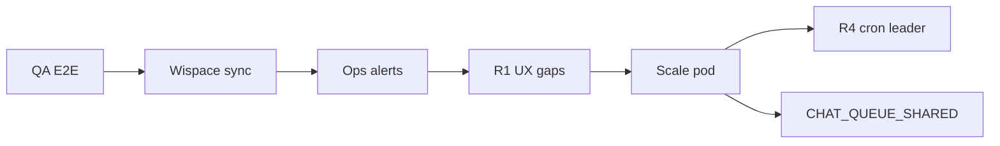

# Edge cases & gap — roadmap khắc phục

Tài liệu ghi **điểm yếu / chưa xử lý** của POC `demo_send_message_fb` (toàn bộ chức năng, không chỉ rate limit) và **cách khắc phục** theo **phase nhỏ** — merge PR độc lập.

**Trạng thái baseline:** Chat rate limit **V1 + H1–H7 ✓**. DB POC **tách** sang `ai_chat_bot_db` (✓). Các mục dưới là gap còn lại hoặc cải thiện tùy quy mô.

Liên quan: [project-overview.md](./project-overview.md), [study-session-reminder.md](./study-session-reminder.md), [chat-rate-limit-quota.md](./chat-rate-limit-quota.md), [AGENTS.md](../AGENTS.md) (bảng Integration gaps).

---

## Bảng phase (tóm tắt)

| Phase | Tên | Effort ước lượng | Ưu tiên POC 1 instance |
|-------|-----|------------------|-------------------------|
| **Q1** ✓ | QA E2E 4 luồng | 0.5 ngày | **Cao** — trước go-live |
| **L1** ✓ | Tin không phải text → reply hướng dẫn | 0.5 ngày | Trung bình |
| **L2** ✓ | Policy Send 24h cho báo cáo / nhắc lịch | 0.5–1 ngày | Trung bình |
| **L3** ✓ | Mapping đổi `user_id` (PSID giữ nguyên) | 1 ngày | Thấp (hiếm) |
| **L4** | Bảo mật link `ref` — token one-time / HMAC | 1–2 ngày | **Cao** — trước go-live user thật |
| **R1** ✓ | Báo cáo: empty score → tin thân thiện | 0.5 ngày | Trung bình |
| **R2** ✓ | Báo cáo: chia bubble dài | 0.5 ngày | Thấp |
| **R3** ✓ | Báo cáo: phân loại lỗi Wispace (defer cron / UX menu) | 1–1.5 ngày | Trung bình |
| **R5** ✓ | Báo cáo: outbox retry 5xx (như nhắc lịch) | 1–1.5 ngày | Khi Wispace hay 503 |
| **R4** ✓ | Báo cáo 08:00: idempotency / cron leader (≥2 pod) | 1 ngày | Chỉ khi scale |
| **S0** ✓ | Wispace wire `study-calendar/sync` | 0.5 ngày (Wispace) | **Cao** — tích hợp |
| **S1** ✓ | Alert ops job `failed` / stuck nhắc lịch | 0.5 ngày | Trung bình |
| **S2** ✓ | Adaptive dispatch poll (scale) | 1–2 ngày | Khi outbox lớn |
| **C1** | Tier quota theo gói Wispace | 2+ ngày | Product sau |
| **C2** | Event store / billing LLM | 2+ ngày | Product sau |
| **I1** ✓ | Alert / grep `CHAT_QUOTA_*` + runbook | 0.5 ngày | Trung bình |
| **DL** ✓ | Dead-letter webhook + auto-retry cron | 1.5 ngày | Multi-pod / production |
| **I2** | Monitor tổng hợp (Slack/webhook ops) | 1 ngày | Khi có user thật |
| **I3** | Bỏ fallback DB `UserCalendars` | 1 ngày | Khi API ổn định (sau tách `ai_chat_bot_db` fallback DB thường không khả dụng) |

**Thứ tự khuyến nghị:** ~~Q1/S0/I1/S1/L1/R1/L2/R2/R3/L3/R4/R5/S2~~ (✓) → `CHAT_QUEUE_SHARED` khi scale → phần còn lại theo feedback user.



---

## 1. Liên kết Messenger ↔ WISPACE

### Đã có ✓

| Hành vi | Code / ghi chú |
|---------|-----------------|
| Opt-in / `referral.ref` | `MessengerService` → `user_messenger_mappings` |
| **Đổi `user_id` cùng PSID** | **L3** ✓ — `MessengerMappingService`, `MAPPING_USER_ID_UPDATED`, ops relink |
| Đăng ký báo cáo trùng topic/cadence | `SUBSCRIPTION_ALREADY_ACTIVE` |
| Postback dedupe 15s | `isDuplicatePostback` |
| **POST webhook signature** | `MessengerWebhookSignatureGuard` + `MESSENGER_APP_SECRET` / `X-Hub-Signature-256` |
| Chat chưa link | `MISSING_USER_REF` |
| Tin **không phải text** (sticker, ảnh, file) | **L1** — `UNSUPPORTED_MESSAGE_TYPE`, `isUnsupportedUserMessage` |
| User **chặn bot** / **Meta 24h window** | **L2** ✓ — `*_MESSENGER_24H` log, nhắc lịch terminal fail, cron báo cáo skip |

### Gap & khắc phục

| Gap | Ảnh hưởng | Khắc phục | Phase |
|-----|-----------|-----------|-------|
| **`ref` = `userId` thuần — không verify chủ tài khoản** | IDOR: đổi `ref` → map PSID vào user khác; relink; lộ nhắc lịch/báo cáo | One-time token (production) hoặc HMAC tạm; chặn relink tự do — [messenger-link-security.md](./messenger-link-security.md), luồng + API: [messenger-link-integration.md](./messenger-link-integration.md) | **L4** |
| ~~POST `/webhook` không verify chữ ký Meta~~ | Payload giả nếu lộ URL webhook | **Done** — `MessengerWebhookSignatureGuard`, `MESSENGER_APP_SECRET`, `rawBody` | Done |
| ~~Webhook Meta retry; lỗi 1 event~~ | ~~Event khác vẫn xử lý (đúng); event lỗi mất~~ | **DL** ✓ — `messenger_webhook_dead_letters` + auto-retry cron 5 phút + advisory lock + script ops | Done |

---

## 2. Báo cáo học tập AI

### Đã có ✓

| Hành vi | Ghi chú |
|---------|---------|
| Cron 08:00, cửa sổ 2–3 ngày trước thi | `ReportScheduleService` |
| Skip đã gửi hôm nay | `hasSentScheduledReportToday` |
| Lỗi từng user không chặn batch | `report-cron.service` try/catch per mapping |
| Thiếu OpenAI key | Fallback template |
| Menu + ops `send-reports` | `forceSend` bypass cửa sổ; mặc định **skip** đã gửi hôm nay; `{ psid }` gửi một user |
| **TaskScoreAverage rỗng** | **R1** — `StudentReportNoScoreDataError` → tin hướng dẫn làm bài, không throw |
| **Báo cáo bubble dài** | **R2** ✓ — `sendTextBubblesViaPsid` + `CHAT_MAX_BUBBLES` |
| **Wispace API lỗi** | **R3** ✓ + **R5** ✓ — 5xx: outbox `report_send_jobs`, cron retry 15 phút đến `daysUntilExam >= 0`; menu tin “thử lại sau”; 4xx tin “chưa đủ dữ liệu” |
| **Meta 24h proactive** | **L2** ✓ — `*_MESSENGER_24H` log; cron `windowClosed` / `deferred` |
| **Multi-pod cron 08:00** | **R4** ✓ — `messenger_scheduled_report_claims`, advisory lock, `CRON_LEADER_*` |
| **Outbox retry báo cáo 5xx** | **R5** ✓ — `report_send_jobs`, `ReportSendRetryDispatchService` cron `*/15` ICT |

### Gap & khắc phục

| Gap | Ảnh hưởng | Khắc phục | Phase |
|-----|-----------|-----------|-------|
| Menu 503 — chỉ UX, không auto-retry | User phải bấm lại «Xem tiến độ» | Chấp nhận POC; optional hẹn retry postback | Backlog |

### 2.1 R3 + R5 — Hành vi báo cáo (đã có ✓)

**R5** bổ sung outbox `report_send_jobs` (unique `psid` + `exam_date`): cron 08:00 ghi job khi 5xx → poll **15 phút** retry đến khi gửi thành công hoặc `daysUntilExam < 0` / hết `REPORT_SEND_MAX_RETRIES`.

#### So sánh nhanh

| | Nhắc lịch | Báo cáo cron + R5 outbox | Menu «Xem tiến độ» |
|--|-----------|--------------------------|---------------------|
| Wispace **5xx** | Retry backoff phút, `study_reminder_jobs` | **R5** — `report_send_jobs`, retry đến ngày trước thi (`daysUntilExam >= 0`) | Tin `*_API_DEFERRED`; user tự bấm lại |
| Ngày cuối cửa sổ + 503 | Retry trong ngày | **R5** — retry 8:15, 8:30… và **ngày 13** (1 ngày trước thi) nếu còn retry | — |

Code: `ReportSendJobRepository`, `ReportSendRetryDispatchService`, `ReportCronService.retryQueued`, env `REPORT_SEND_*`.

#### Ví dụ — Lan thi **ngày 14**, 503 ngày cuối cửa sổ (đã fix R5)

| Thời điểm | Việc xảy ra |
|-----------|-------------|
| **12** 8:00 | Cron 503 → job `report_send_jobs`, `next_retry_at` 8:15 |
| **12** 8:15 | Retry dispatch → OK → Lan nhận báo cáo ✓ |
| (hoặc 503 cả ngày 12) | **13** 8:15 retry vẫn chạy (`daysUntilExam=1`) → có cơ hội gửi dù cron 8:00 ngày 13 skip cửa sổ |

#### R5 — env

```env
REPORT_SEND_MAX_RETRIES=3
REPORT_SEND_RETRY_BACKOFF_MINUTES=15
REPORT_SEND_RETRY_POLL_MINUTES=15   # khớp cron */15 ICT
```

Ops dự phòng (không trùng báo cáo):

```bash
# Một user bị deferred / R5 hết retry
POST /messenger/send-reports
{ "psid": "<PSID>" }

# Chạy tay outbox retry
POST /messenger/send-reports/retry-dispatch

# Gửi lại cả lô (skip người đã nhận hôm nay)
POST /messenger/send-reports
{}

# Bắt buộc gửi lại dù đã nhận (hiếm)
POST /messenger/send-reports
{ "allowDuplicate": true }
```

---

## 3. Nhắc lịch học

### Đã có ✓

Outbox `study_reminder_jobs`, retry/backoff, reset stuck `processing`, upsert đổi giờ, cancel stale, preview menu, LLM fallback, `claimJob` multi-instance.

| Hành vi | Ghi chú |
|---------|---------|
| **Wispace wire sync** | **S0** ✓ — `POST /messenger/study-calendar/sync` sau POST/DELETE `UserCalendar` |
| **Adaptive dispatch poll** | **S2** ✓ — `StudyReminderWorkerService` vòng `setTimeout`; `findNextDueTime`; env `STUDY_REMINDER_POLL_*` |

### Gap & khắc phục

| Gap | Ảnh hưởng | Khắc phục | Phase |
|-----|-----------|-----------|-------|
| Horizon **14 ngày** | Buổi xa chưa có job | Document; tăng `STUDY_REMINDER_SYNC_HORIZON_HOURS` nếu product cần | Config / doc |
| User chưa link PSID | Không nhắc | By design — optional kênh khác (email) ngoài scope | — |
| Job **failed** hết retry | Học viên không nhắc, ops không biết | **S1** ✓ — `study-reminder:jobs --failed`, cron `OPS_HEALTH_ALERT`, `npm run ops:health` | Done |
| 24h window nhắc lịch | Send fail | **L2** ✓ — `STUDY_SESSION_REMINDER_*_MESSENGER_24H`, terminal fail | Done |

### 3.1 S2 — Adaptive dispatch poll (đã có ✓)

Thay cron cố định **1 phút**, worker dùng vòng lặp thích ứng:

1. `dispatchDueReminders()` → trả `nextDueAt` (`findNextDueTime` — MIN `remind_at` / `next_retry_at`)
2. Delay lần poll tiếp: `clamp(msTilDue - pollLeadMs, pollMinMs, pollMaxMs)`

| Env | Mặc định | Ý nghĩa |
|-----|----------|---------|
| `STUDY_REMINDER_POLL_MIN_MS` | 30s | Poll nhanh nhất (job sắp due) |
| `STUDY_REMINDER_POLL_MAX_MS` | 210s (3.5 phút) | Poll chậm nhất (không có job) |
| `STUDY_REMINDER_POLL_LEAD_MS` | 60s | Wake sớm hơn job 1 phút |

- **Không có job** → ~3.5 phút/lần (giảm tải DB khi scale)
- **Job due sau 10 phút** → poll lại ~9 phút sau
- Multi-pod: mỗi pod chạy loop riêng; `claimJob` atomic — không cần advisory lock dispatch

Chi tiết: [study-session-reminder.md §11.6](./study-session-reminder.md#116-worker-dispatch-polling--trở-ngại-tải-db--giảm-rủi-ro).

---

## 4. Chat AI + agent

### Đã có ✓

Rate limit V1 + **H1–H7**, agent tools, history RAM/DB, delivery semantics H4.

### Gap & khắc phục

| Gap | Ảnh hưởng | Khắc phục | Phase |
|-----|-----------|-----------|-------|
| Tier theo gói Wispace | Mọi user cùng `CHAT_FREE_FORM_DAILY_LIMIT` | Phase 7: limit theo `user_id` / API gói — [§5.8](./chat-rate-limit-quota.md) | **C1** |
| Event store / billing | Khó audit chi phí LLM theo tháng | `messenger_chat_events` + projection — Phase 8 | **C2** |
| Tool đổi lịch qua chat | Phụ thuộc đã link + sync Wispace | Đã có tool; harden error message khi API lỗi | — |

---

## 5. Hạ tầng & vận hành

| Edge case | Hiện trạng | Khắc phục | Phase |
|-----------|------------|-----------|-------|
| **1 instance POC** | Phù hợp | Giữ `CHAT_QUEUE_SHARED=false` | — |
| **≥2 pod chat** | Queue/history tách pod | `CHAT_QUEUE_SHARED=true` + migration — H7 ✓; `appendChatHistoryTurn` atomic ✓ | Done (bật env) |
| **≥2 pod cron báo cáo** | ~~Risk gửi trùng 08:00~~ | **R4** ✓ claim + advisory lock + optional cron leader | Done |
| **≥2 pod cron nhắc** | `claimJob` ✓ + **cron pg_advisory_lock** ✓ | `upsertPendingJob` TOCTOU fixed ✓ (`pg_advisory_xact_lock`) | Done |
| Cron webhook dedupe cleanup multi-pod | N×DELETE | **pg_advisory_lock** ✓ — chỉ 1 pod chạy mỗi 15 phút | Done |
| Monitor / alert | Log + scripts | **I1** ✓ runbook + `ops:health`; **S1** ✓ failed/stuck jobs; **DL** ✓ dead-letter cron; **I2** Slack alert | **I2** |
| Wispace **schema** đổi | Fallback DB `UserCalendars` | API-only khi ổn định — **I3** | **I3** |

### I1 — Ops alert nhẹ (không cần Prometheus) ✓

| Việc | Done khi |
|------|----------|
| Runbook grep `CHAT_QUOTA_DENY`, `REFUND`, `RECOVERED` | `project-overview.md` §12 |
| `chat-quota:status --ops` + `study-reminder:jobs --failed` / `--stuck` | Script ops |
| Cron 09:00 ICT + `npm run ops:health` | `OPS_HEALTH_ALERT` trong app log |

### S1 — Nhắc lịch failed / stuck ✓

| Việc | Done khi |
|------|----------|
| `npm run study-reminder:jobs -- --failed` | Terminal failed (retry hết) |
| `npm run study-reminder:jobs -- --stuck` | Processing > 10 phút |
| `npm run ops:health` / cron nội bộ | `OPS_HEALTH_ALERT` khi có spike |

---

## Q1 — Checklist QA E2E (không cần code) ✓

Đã chạy manual test trước go-live (Messenger + `.env` prod).

### Q1.1 Link

- [x] Mở `m.me` có `ref={userId}` từ WISPACE
- [x] Kiểm tra `user_messenger_mappings` có `psid` + `user_id`
- [x] Menu persistent hiển thị (đã `profile/setup`)

### Q1.2 Báo cáo

- [x] Postback “Xem tiến độ” → nhận tin, log `LEARNING_PROGRESS`
- [x] (Tuỳ chọn) User trong cửa sổ 2–3 ngày trước thi → cron hoặc `POST /messenger/send-reports`

### Q1.3 Nhắc lịch

- [x] Có buổi trong `UserCalendar` trong horizon
- [x] `npm run study-reminder:jobs` thấy job `pending` → `remind_at` đúng
- [x] Sau sync (API hoặc cron) → đến giờ nhận tin nhắc
- [x] Postback preview “Nhắc lịch sắp tới” hoạt động

### Q1.4 Chat quota

- [x] `CHAT_RATE_LIMIT_ENABLED=true`
- [x] Nhắn text → bot reply, `chat-quota:status` tăng `used`
- [x] Burst / hết ngày → `CHAT_QUOTA_DENIED`
- [x] Menu postback **không** tăng quota

```bash
npm run chat-quota:status -- --psid=<PSID>
npm run study-reminder:jobs
```

---

## Cập nhật tài liệu khi đóng phase

| Khi merge phase | Cập nhật |
|-----------------|----------|
| Bất kỳ | Tick ✓ trong bảng phase đầu file này |
| S0 | `AGENTS.md` Integration gaps, `study-session-reminder.md` |
| S2 | `study-session-reminder.md` §11.6, `project-overview.md` §6 |
| R4, H7 scale | `project-overview.md` §10 |
| L1, R1, L2, R2, R3, … | Mục tương ứng trong file này → chuyển sang “Đã có” ✓ |

---

*POC ưu tiên ship — không implement hết roadmap; chọn phase theo feedback user thật và quy mô deploy.*
