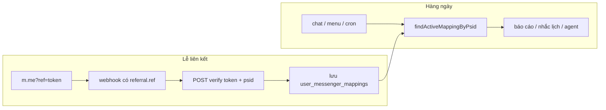

# Liên kết Messenger ↔ WISPACE — luồng hiện tại, luồng bảo mật & API Wispace

Tài liệu giải thích **đang làm gì**, **sau L4 làm gì**, ai chịu trách nhiệm phần nào, và **contract API** team WISPACE cần triển khai.

Liên quan: [messenger-link-security.md](./messenger-link-security.md) (trade-off giải pháp), [edge-cases-roadmap.md §1](./edge-cases-roadmap.md#1-liên-kết-messenger--wispace) (phase **L4**).

---

## Nhân vật ví dụ

| Nhân vật | Vai trò |
|----------|---------|
| **Lan** | Học viên WISPACE, `userId = 143` |
| **Hùng** | Người cố gắng map PSID của mình vào tài khoản người khác |
| **Bot** | Messenger POC (`demo_send_message_fb`) |
| **WISPACE** | App + backend học viên |

---

## 1. Hiện tại đang làm gì? (chưa bảo mật)

### Bước 1 — WISPACE tạo link

```text
https://m.me/Page?ref=143&topic=IELTS&cadence=WEEKLY
                      ^^^
                      userId lộ thẳng trên URL
```

### Bước 2 — Lan mở link → Meta gửi webhook về Bot

```json
{
  "sender": { "id": "PSID_LAN" },
  "referral": { "ref": "143" }
}
```

### Bước 3 — Bot tin luôn, không hỏi thêm

```typescript
// src/shared/config/poc.constants.ts — hiện tại
parseUserIdFromRef("143") → 143  // chỉ parse số

// src/modules/messenger/application/services/messenger.service.ts
linkPsidFromContext("PSID_LAN", { userId: 143, ... })
// → INSERT user_messenger_mappings: PSID_LAN ↔ 143
```

### Vấn đề

Hùng sửa URL thành `ref=999`, mở bằng Messenger của Hùng → Bot map **PSID_HÙNG ↔ 999** (tài khoản người khác).

Hậu quả có thể gồm: nhắc lịch / báo cáo của nạn nhân gửi sang Messenger Hùng, chat agent hiểu sai chủ tài khoản.

---

## 2. Sau khi bảo mật — ý tưởng cốt lõi

> **Bot không còn tin `ref` là `userId`.**  
> `ref` chỉ là **vé tạm (token)** do WISPACE phát cho **đúng một user đang login**.  
> Bot **hỏi WISPACE**: “vé này của ai?” **trước khi** lưu mapping.

---

## 3. Luồng mới — từng bước

### Phần A — WISPACE (user bấm nút trong app)

Lan đã login WISPACE, bấm **「Kết nối Messenger」**.

```text
App WISPACE
    │
    ▼
POST /api/messenger/link-token    ← session Lan; backend biết userId=143
    │
    ▼
WISPACE DB:
  token     = "abc-xyz-random"
  user_id   = 143
  expires_at = now + 30 phút
  used_at   = NULL
    │
    ▼
Trả về app:
  url = "https://m.me/Page?ref=abc-xyz-random&topic=IELTS&cadence=WEEKLY"
```

**Điểm quan trọng:** `ref` **không còn là `143`** — là chuỗi random. Hùng sửa `ref=999` trên URL sẽ **không** còn map được sang userId khác (verify fail). Đoán token UUID gần như không khả thi.

---

### Phần B — User mở Messenger (Meta xử lý)

Lan bấm link → mở Facebook Messenger → Meta gửi webhook về Bot (như cũ), nhưng `ref` giờ là **token**:

```json
{
  "sender": { "id": "PSID_LAN" },
  "referral": { "ref": "abc-xyz-random" }
}
```

---

### Phần C — Bot verify TRƯỚC KHI lưu mapping (thay đổi chính ở POC)

**Trước (code hiện tại):**

```text
ref "143" → parseInt → userId=143 → lưu DB
```

**Sau (code mới):**

```text
ref "abc-xyz-random"
    │
    ▼
POST WISPACE /internal/messenger/verify-link-token
Body: { "token": "abc-xyz-random", "psid": "PSID_LAN" }
Header: X-Internal-Api-Key: {secret}
    │
    ▼
WISPACE kiểm tra:
  ✓ token tồn tại?
  ✓ chưa hết hạn (expires_at)?
  ✓ used_at = NULL? (chưa ai dùng — one-time)
    │
    ▼
Trả: { "valid": true, "userId": 143, "topic": "IELTS", "cadence": "WEEKLY" }
     + đánh dấu used_at = now()
    │
    ▼
Bot: linkPsidFromContext("PSID_LAN", { userId: 143, ... })
     → lưu user_messenger_mappings
```

**Ý tưởng code POC** (chưa implement — phase L4):

```typescript
async function resolveLinkFromRef(ref: string, psid: string) {
  const result = await wispaceClient.verifyLinkToken({ token: ref, psid });
  if (!result.valid) {
    return undefined; // không link; gửi tin "link hết hạn, mở lại từ app"
  }
  return {
    userId: result.userId,
    topic: result.topic,
    cadence: result.cadence,
    ref,
  };
}
```

Gắn vào các chỗ gọi `parseMessengerLinkContext` / `linkPsidFromContext` trong `messenger.service.ts` (webhook opt-in, referral, tin nhắn kèm referral).

---

### Phần D — Chặn relink (thêm một lớp trên POC)

Kể cả token hợp lệ, nếu **PSID đã map user A** mà token của **user B**:

```text
PSID_HÙNG đã map user 100
Token mới của user 999 → verify OK → userId=999
    │
    ▼
MessengerMappingService: TỪ CHỐI
  "PSID này đã liên kết tài khoản khác"
  (chỉ ops relink qua POST /messenger/mapping/relink + API key)
```

Sửa `relinkPsidToUserId` — **không** upsert tự do khi `previousUserId !== newUserId`.

---

## 4. Hùng tấn công thì sao?

| Cách tấn công | Kết quả |
|---------------|---------|
| Sửa `ref=999` (số userId) | Bot không parse số → verify `NOT_FOUND` |
| Đoán token random | Gần như không khả thi (UUID/CSPRNG) |
| Cướp link Lan forward | Token **one-time** — Lan dùng trước → Hùng nhận `USED` |
| Token quá 30 phút | `EXPIRED` → nhắn mở lại từ app WISPACE |

---

## 5. Ai làm phần nào

```text
┌─────────────────────────────────────────────────────────────┐
│  WISPACE (phải làm)                                         │
│  • API tạo token khi user LOGIN                             │
│  • Bảng messenger_link_tokens                               │
│  • API verify: nhận token + psid → trả userId, đánh used    │
│  • App: không tự ghép ref=userId trên frontend                │
└─────────────────────────────────────────────────────────────┘
                            ▲
                            │ POST verify { token, psid }
                            │
┌─────────────────────────────────────────────────────────────┐
│  Messenger POC (bên mình)                                   │
│  • Webhook nhận ref như cũ                                  │
│  • THAY parseInt(ref) → gọi API verify WISPACE              │
│  • Chặn relink PSID sang user khác                          │
│  • Lưu mapping psid ↔ userId như cũ                           │
└─────────────────────────────────────────────────────────────┘
```

Messenger **không** tự phát token — không biết ai đang login WISPACE. Chỉ **hỏi lại WISPACE** khi webhook có `referral.ref`.

---

## 6. So với code hiện tại

| | Hiện tại | Sau bảo mật (L4) |
|--|----------|------------------|
| `ref` nghĩa là gì? | `userId` | Vé tạm (token) |
| Ai quyết định `userId`? | Bot tự `parseInt` | **WISPACE** trả sau verify |
| Bot gửi gì sang WISPACE lúc link? | Không gửi | `{ token, psid }` |
| Khi nào gọi API verify? | — | **Một lần** khi webhook có `referral.ref` |
| Chat / báo cáo / nhắc lịch sau đó | Đọc mapping DB | **Không đổi** |

---

## 7. Ví dụ end-to-end

1. Lan login WISPACE → bấm 「Kết nối Messenger」
2. WISPACE tạo token `t1`, gắn `userId=143`
3. Lan mở `m.me?ref=t1`
4. Meta webhook: `ref=t1`, `psid=111`
5. Bot → WISPACE: `{ "token": "t1", "psid": "111" }`
6. WISPACE: OK, `userId=143`, đánh dấu `t1` đã dùng
7. Bot lưu: `psid 111 ↔ user 143`
8. Lan chat 「xem tiến độ」→ bot đọc mapping, **không** gọi verify nữa

---

## 8. Yêu cầu WISPACE — API mới

WISPACE cần **2 API**: một cho **app** (tạo link), một cho **Messenger POC** (verify). Cùng bảng `messenger_link_tokens`.

### 8.1 Bảng dữ liệu (WISPACE DB)

```sql
CREATE TABLE messenger_link_tokens (
  token       VARCHAR(64) PRIMARY KEY,
  user_id     INTEGER NOT NULL,
  topic       VARCHAR(32) NOT NULL DEFAULT 'IELTS',
  cadence     VARCHAR(16) NOT NULL DEFAULT 'WEEKLY',
  expires_at  TIMESTAMPTZ NOT NULL,
  used_at     TIMESTAMPTZ,
  created_at  TIMESTAMPTZ NOT NULL DEFAULT now()
);

CREATE INDEX idx_messenger_link_tokens_user_id ON messenger_link_tokens (user_id);
CREATE INDEX idx_messenger_link_tokens_expires ON messenger_link_tokens (expires_at)
  WHERE used_at IS NULL;
```

| Cột | Ghi chú |
|-----|---------|
| `token` | UUID v4 hoặc CSPRNG 32+ byte, opaque |
| `user_id` | Từ session — **không** nhận từ client |
| `expires_at` | Khuyến nghị `now() + 30 phút` |
| `used_at` | Set khi verify thành công (one-time) |

---

### 8.2 API 1 — Tạo link token (WISPACE app gọi)

Dùng khi học viên bấm 「Kết nối Messenger」trong app **đã đăng nhập**.

| | |
|--|--|
| **Method / path** | `POST /api/messenger/link-token` |
| **Auth** | Session cookie hoặc `Authorization: Bearer {user_jwt}` — user phải login |
| **Ai gọi** | WISPACE frontend → WISPACE backend |
| **Messenger POC** | **Không** gọi API này |

#### Request body (optional)

```json
{
  "topic": "IELTS",
  "cadence": "WEEKLY"
}
```

| Field | Bắt buộc | Mô tả |
|-------|----------|-------|
| `topic` | Không | Mặc định `"IELTS"` |
| `cadence` | Không | `DAILY` \| `WEEKLY` \| `MONTHLY`, mặc định `WEEKLY` |

**Không gửi `userId`** — backend lấy từ session.

#### Response `200 OK`

```json
{
  "token": "a1b2c3d4-e5f6-7890-abcd-ef1234567890",
  "expiresAt": "2026-06-14T15:30:00+07:00",
  "url": "https://m.me/YourFacebookPageId?ref=a1b2c3d4-e5f6-7890-abcd-ef1234567890&topic=IELTS&cadence=WEEKLY"
}
```

| Field | Kiểu | Mô tả |
|-------|------|-------|
| `token` | string | Giá trị đặt vào `ref` trên `m.me` |
| `expiresAt` | ISO 8601 | Hết hạn vé |
| `url` | string | Link đầy đủ cho app mở / copy |

#### Response lỗi

| HTTP | Body ví dụ | Khi nào |
|------|------------|---------|
| `401` | `{ "error": "UNAUTHORIZED" }` | Chưa login |
| `429` | `{ "error": "RATE_LIMITED" }` | Tạo token quá nhanh (optional) |

---

### 8.3 API 2 — Verify link token (Messenger POC gọi)

Dùng **một lần** khi Meta webhook báo user vừa mở link (`referral.ref`).

| | |
|--|--|
| **Method / path** | `POST /internal/messenger/verify-link-token` |
| **Auth** | `X-Internal-Api-Key: {INTERNAL_API_KEY}` hoặc `Authorization: Bearer {INTERNAL_API_KEY}` |
| **Ai gọi** | **Messenger POC** |
| **Content-Type** | `application/json` |

#### Request body — **đây là payload Messenger gửi đi**

```json
{
  "token": "a1b2c3d4-e5f6-7890-abcd-ef1234567890",
  "psid": "1234567890123456"
}
```

| Field | Bắt buộc | Nguồn (phía Messenger) |
|-------|----------|-------------------------|
| `token` | Có | `event.referral.ref` (hoặc `optin.ref`, `message.referral.ref`) từ webhook Meta |
| `psid` | Có | `event.sender.id` từ webhook Meta |

**Messenger không gửi `userId`** — WISPACE tra từ bảng token.

#### Response thành công `200 OK`

```json
{
  "valid": true,
  "userId": 143,
  "topic": "IELTS",
  "cadence": "WEEKLY"
}
```

| Field | Kiểu | Mô tả |
|-------|------|-------|
| `valid` | boolean | Luôn `true` khi HTTP 200 |
| `userId` | number | Chủ tài khoản gắn với token |
| `topic` | string | Copy từ row token (hoặc default) |
| `cadence` | string | `DAILY` \| `WEEKLY` \| `MONTHLY` |

**Side effect (bắt buộc):** trong cùng transaction, set `used_at = now()` cho token — **one-time**.

#### Response thất bại

HTTP `400 Bad Request` hoặc `409 Conflict` — body thống nhất:

```json
{
  "valid": false,
  "reason": "NOT_FOUND"
}
```

| `reason` | Ý nghĩa |
|----------|---------|
| `NOT_FOUND` | Token không tồn tại hoặc `ref` là số userId cũ (legacy) |
| `EXPIRED` | `now() > expires_at` |
| `USED` | `used_at` đã set — vé đã dùng |
| `INVALID_FORMAT` | Token rỗng / sai định dạng |

Messenger POC map `reason` → tin user-facing (vd. 「Link hết hạn, vui lòng mở lại từ app WISPACE」).

#### Response lỗi auth

| HTTP | Body |
|------|------|
| `401` / `403` | `{ "error": "UNAUTHORIZED" }` — sai `X-Internal-Api-Key` |

---

### 8.4 Cấu hình phía Messenger POC (tham chiếu)

```env
MESSENGER_LINK_MODE=token
WISPACE_LINK_VERIFY_URL=https://backend.aihubproduction.com/internal/messenger/verify-link-token
INTERNAL_API_KEY=...   # secret dùng chung với các ops API khác
```

POC gọi verify tại các điểm trong `MessengerService.handleEvent` trước `linkPsidFromContext`.

---

### 8.5 Checklist giao tiếp 2 team

**WISPACE:**

- [ ] `POST /api/messenger/link-token` (session auth)
- [ ] Bảng `messenger_link_tokens`
- [ ] `POST /internal/messenger/verify-link-token` (API key)
- [ ] App dùng `url` từ API — không build `ref={userId}` trên client
- [ ] Cấp `INTERNAL_API_KEY` cho Messenger service (hoặc secret riêng)

**Messenger POC (L4):**

- [ ] Client HTTP gọi verify với `{ token, psid }`
- [ ] Thay `parseUserIdFromRef` khi `MESSENGER_LINK_MODE=token`
- [ ] Chặn relink PSID → userId khác
- [ ] Feature flag `legacy` → `token` khi WISPACE sẵn sàng

---

## 9. Quyết định vận hành (bàn luận)

Ghi chú align team — chi tiết policy bảo mật: [messenger-link-security.md §7](./messenger-link-security.md#7-quyết-định-thiết-kế-bàn-luận).

### 9.1 Binding một lần — không verify mỗi message



Sau bước 7 trong [§7](#7-ví-dụ-end-to-end) (đã map `psid ↔ userId`), mọi tương tác sau **chỉ đọc DB** — không gọi `verify-link-token` nữa.

### 9.2 Bảng sự kiện webhook — ai verify, ai đọc DB

| Sự kiện | `referral.ref`? | Gọi WISPACE verify? | Nguồn `userId` | Code POC (tham chiếu) |
|---------|-----------------|---------------------|----------------|------------------------|
| Mở `m.me?ref=token` lần đầu | Có | **Có** (L4) | WISPACE trả sau verify | `handleEvent` → `linkPsidFromContext` |
| `optin` kèm ref | Có | **Có** (L4) | Như trên | `event.optin` branch |
| Get Started ngay sau link | Thường có (`postback.referral`) | **Có** nếu còn ref | Như trên | `handlePostbackEvent` |
| Get Started lần sau (đã link) | Thường **không** | **Không** | `resolveLinkContext` → DB | `handlePostbackEvent` |
| Menu 「Đăng ký báo cáo」 | **Không** | **Không** | DB mapping | `REGISTER_LEARNING_REPORT` → `registerForScheduledReports` |
| Chat tự do | **Không** | **Không** | `resolveUserId` → DB | `MessengerChatQueueService.enqueue` |
| Cron báo cáo / dispatch nhắc lịch | — | **Không** | Mapping theo `psid` / `userId` | `ReportCronService`, `StudyReminderDispatchService` |

**Get Started** thường là moment user bấm lần đầu sau `m.me`, nhưng trigger verify là **`ref` trong webhook**, không phải payload `GET_STARTED`.

### 9.3 Menu 「Đăng ký báo cáo」— hành vi mong đợi

Persistent menu (`messenger-profile.service.ts` — payload `REGISTER_LEARNING_REPORT`):

1. `handlePostbackEvent` gọi `resolveLinkContext(psid, event)`.
2. Postback **không** mang `referral` → fallback `findActiveMappingByPsid`.
3. Có mapping → `registerForScheduledReports` (upsert subscription topic/cadence).
4. Không mapping → `getMissingUserRefMessage()` — user phải mở link từ app WISPACE.

**Không** gọi verify lúc bấm menu: không có token; menu là thao tác trên PSID **đã** được binding trước đó. Tương tự chat, báo cáo, nhắc lịch.

### 9.4 Relink — hiện tại vs L4

| | Code hiện tại (L3) | Sau L4 |
|--|-------------------|--------|
| PSID map A, webhook ref/token user B | **Upsert** sang B + `MAPPING_USER_ID_RELINK` | **Từ chối** + log `MAPPING_RELINK_BLOCKED` |
| Support đổi tài khoản | `POST /messenger/mapping/relink` | Giữ nguyên (ops-only) |
| User tự đổi (production) | Không an toàn | WISPACE app: unlink → token mới → link lại |

Xem [messenger-link-security.md §7.4](./messenger-link-security.md#74-policy-relink--l3-hiện-tại-vs-l4) cho ba hướng relink (ops / self-service / confirm).

### 9.5 Token TTL & UX hết hạn

| Giai đoạn | `expires_at` gợi ý |
|-----------|-------------------|
| Pilot | `now() + 30 phút` |
| Production | **15–30 phút** + nút 「Tạo lại link」trong app |

| Tình huống | Kết quả |
|------------|---------|
| Lan forward link, Hùng mở **trước** Lan | Hùng ăn token; Lan nhận `USED` khi verify |
| Token `EXPIRED` trước webhook đầu | Bot báo hết hạn; user tạo link mới — **không** fix bằng menu/Get Started |
| Token `USED`, PSID đã map | Mở lại URL cũ → verify `USED`; chat/menu **vẫn OK** qua mapping DB |

One-time (`used_at`) quan trọng hơn TTL rất ngắn — TTL chủ yếu giảm cửa sổ link **chưa ai dùng** bị forward.

### 9.6 Ma trận quyết định (tóm tắt)

```text
Webhook event
│
├─ Có referral.ref (token mới, chưa used)?
│   ├─ PSID chưa map → verify WISPACE → link
│   ├─ PSID map cùng userId → idempotent (topic/cadence)
│   └─ PSID map userId khác → REJECT (trừ ops relink)
│
└─ Không có ref
    ├─ Có mapping ACTIVE → userId từ DB
    └─ Không mapping → MISSING_USER_REF
```

---

## 10. Tóm tắt một dòng

**WISPACE** phát vé (`token`) khi user login; **Messenger** nhận `ref` từ Meta rồi gửi `{ token, psid }` lên WISPACE verify — **một lần lúc link**; sau đó chat / menu / cron chỉ đọc mapping DB.
