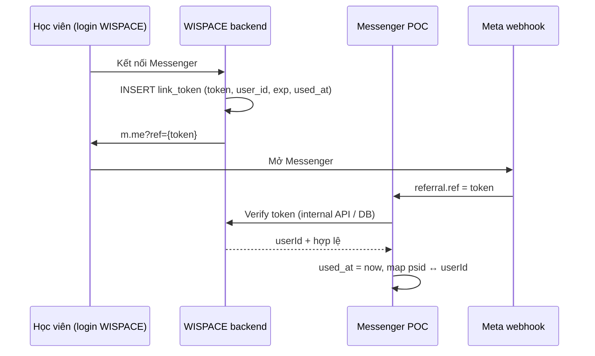

# Bảo mật liên kết Messenger ↔ WISPACE (`ref` / `userId`)

Tài liệu mô tả **lỗ hổng** khi truyền `userId` thuần qua tham số `ref` trên link `m.me`, các **giải pháp** khả thi, **trade-off**, và **lộ trình khuyến nghị** khi đưa ra dùng thật.

Liên quan: [project-overview.md](./project-overview.md) (luồng link), [edge-cases-roadmap.md §1](./edge-cases-roadmap.md#1-liên-kết-messenger--wispace), code `src/shared/config/poc.constants.ts`, `MessengerMappingService`.

---

## 1. Vấn đề

### 1.1 Hiện trạng POC

Link mở Messenger từ WISPACE có dạng:

```text
https://m.me/{pageId}?ref={userId}&topic=IELTS&cadence=WEEKLY
```

Webhook Meta gửi `referral.ref` → POC parse số nguyên → lưu `user_messenger_mappings` (`psid` ↔ `user_id`).

```typescript
// poc.constants.ts — tin ref là userId hợp lệ nếu parse được số dương
parseUserIdFromRef(ref) → Number.parseInt(ref, 10)
```

**Không có bước xác minh** người mở link có quyền sở hữu `userId` đó.

### 1.2 Rủi ro (IDOR trên account linking)

| Kịch bản | Hậu quả |
|----------|---------|
| Sửa `ref=143` → `ref=999` trên URL `m.me` rồi mở bằng Messenger của mình | PSID của kẻ tấn công map vào **tài khoản nạn nhân** |
| PSID đã link user A, mở link `ref` của user B | **Relink** sang user B (L3 — `MAPPING_USER_ID_RELINK`) |
| Forward / leak link có `ref` hợp lệ | Người khác mở trước → ăn mapping |

**Dữ liệu có thể lộ / sai chủ:**

- **Nhắc lịch học:** sync job theo `userId`, gửi tin proactive theo `psid` đã map → lịch học viên B có thể tới Messenger của người lạ.
- **Báo cáo AI:** cron gửi theo mapping; context `userId` sai trên toàn pipeline.
- **Chat agent:** tool/context hiểu sai chủ tài khoản (tên, mục tiêu, thao tác lịch).
- Một số API Wispace dùng `x-psid` — **không đủ** để coi an toàn; POC + DB shared vẫn coupling theo `user_id` ở nhiều chỗ.

### 1.3 Encode / obfuscate **không** phải giải pháp

| Cách | Chống đổi userId? |
|------|-------------------|
| `ref=143` (hiện tại) | Không |
| Base64 / hex `userId` | Không — decode được, hoặc copy nguyên chuỗi |
| Hash `userId` (không ký) | Không — không verify được, dễ brute số nhỏ |

Cần **bằng chứng phát hành từ WISPACE** (chữ ký hoặc token server-side), không chỉ “che” `userId`.

---

## 2. Giải pháp & trade-off

### 2.1 Giữ `ref = userId` (status quo)

**Mô tả:** Không đổi; tin tưởng mọi `ref` số dương từ webhook.

| Ưu | Nhược |
|----|-------|
| Đơn giản nhất | **Không an toàn** cho production |
| Không cần phối hợp Wispace thêm | Enumeration `userId`, account takeover qua relink |
| Debug dễ | Không audit/revoke link |

**Verdict:** Chỉ chấp nhận được demo nội bộ; **không** go-live user thật.

---

### 2.2 HMAC signed ref

**Mô tả:** WISPACE (user đã login) ký payload; Messenger POC verify trước khi link.

```text
ref = {userId}.{expUnix}.{signature}
signature = HMAC-SHA256("{userId}.{expUnix}", MESSENGER_LINK_SIGNING_SECRET)
```

**Luồng:**

1. User login WISPACE → backend tạo `ref` có `exp` (vd. 24h).
2. User mở `m.me?ref=...`.
3. POC verify chữ ký + chưa hết hạn → mới `upsertPsidUserLink`.

| Ưu | Nhược |
|----|-------|
| Implement nhanh (~0.5–1 ngày) | `userId` vẫn **lộ** trên URL |
| Không cần bảng DB token ngay | Link **share/forward** vẫn dùng được trong TTL |
| Shared secret — 2 service đồng bộ đơn giản | Khó **revoke** từng link (chờ hết `exp`) |
| Chống sửa `userId` nếu không có secret | Cần thêm policy **chặn relink** PSID đã map |

**Verdict:** **Bridge tạm** POC / pilot gấp; không nên là đích cuối production.

---

### 2.3 Opaque one-time token (khuyến nghị production)

**Mô tả:** `ref` là chuỗi ngẫu nhiên (UUID / CSPRNG). `userId` **không** xuất hiện trên URL. WISPACE lưu token server-side; POC verify qua API nội bộ hoặc DB shared.



**Schema gợi ý (WISPACE DB):**

```sql
CREATE TABLE messenger_link_tokens (
  token         VARCHAR(64) PRIMARY KEY,
  user_id       INTEGER NOT NULL,
  expires_at    TIMESTAMPTZ NOT NULL,
  used_at       TIMESTAMPTZ,
  created_at    TIMESTAMPTZ NOT NULL DEFAULT now()
);
CREATE INDEX idx_messenger_link_tokens_user ON messenger_link_tokens (user_id);
```

**Quy tắc bắt buộc:**

| Rule | Lý do |
|------|-------|
| Token **one-time** (`used_at` set sau link thành công) | Chống reuse / forward link |
| TTL ngắn (15–30 phút) | Giảm cửa sổ tấn công |
| Chỉ tạo token khi session WISPACE hợp lệ | Đảm bảo chủ tài khoản |
| PSID đã map user A + token user B → **từ chối** | Chốn relink trái phép |
| Ops relink qua `POST /messenger/mapping/relink` + `INTERNAL_API_KEY` | Trường hợp support |

| Ưu | Nhược |
|----|-------|
| Không lộ `userId`; revoke từng token | Cần bảng + API verify (WISPACE làm) |
| One-time + TTL — mạnh nhất cho go-live | Thêm 1 round-trip verify khi webhook link |
| Audit rõ (`created_at`, `used_at`) | POC phụ thuộc Wispace (hoặc DB shared) |
| Phù hợp GDPR / privacy hơn signed ref | Effort cao hơn HMAC một chút (~1–2 ngày tổng 2 team) |

**Verdict:** **Đích cuối** khi đưa ra dùng thật.

---

### 2.4 JWT ngắn hạn trong `ref` (optional, phase sau)

**Mô tả:** `ref` = JWT (claims: `sub=userId`, `exp`, `jti`), ký bằng secret hoặc JWKS.

| Ưu | Nhược |
|----|-------|
| Stateless verify (POC không cần DB token) | Meta `ref` giới hạn ~250 ký tự — JWT dài |
| Chuẩn industry | Vẫn cần `jti` blacklist để one-time / revoke |
| | `userId` có thể vẫn trong payload (nếu không mã hóa) |

**Verdict:** Cân nhắc khi đã có JWKS infra; với POC hiện tại **token opaque + DB** đơn giản và rõ ràng hơn.

---

## 3. So sánh tổng hợp

| Tiêu chí | `userId` thuần | HMAC signed | One-time token |
|----------|----------------|-------------|----------------|
| Chống đổi sang user khác | ✗ | ✓ | ✓ |
| Không lộ userId | ✗ | ✗ | ✓ |
| One-time / chống forward | ✗ | ✗ | ✓ |
| Revoke từng link | ✗ | △ (chờ exp) | ✓ |
| Effort Wispace | — | Thấp | Trung bình |
| Effort Messenger POC | — | Thấp | Trung bình |
| Phù hợp production | ✗ | △ (tạm) | ✓ |

---

## 4. Khuyến nghị lộ trình

### Phase L4 — Link security (chưa làm)

| Bước | Việc làm | Owner |
|------|----------|-------|
| **L4.1** | Bảng `messenger_link_tokens` + API tạo token (login required) | WISPACE |
| **L4.2** | `POST /internal/messenger/verify-link-token` hoặc query DB shared | WISPACE / POC |
| **L4.3** | POC: thay `parseUserIdFromRef` → verify token; từ chối ref số thuần (feature flag) | POC |
| **L4.4** | Chặn relink PSID → userId khác (trừ ops endpoint) | POC |
| **L4.5** | Log `LINK_TOKEN_OK` / `LINK_TOKEN_REJECT` / `MAPPING_RELINK_BLOCKED`; alert ops | POC |

**Hotfix gấp (trước L4):** HMAC signed ref + chặn relink — tối đa 1 ngày, có kế hoạch bỏ khi L4 xong.

### Feature flag gợi ý

```env
MESSENGER_LINK_MODE=legacy|signed|token
MESSENGER_LINK_SIGNING_SECRET=...   # mode signed
MESSENGER_LINK_TOKEN_VERIFY_URL=... # mode token
```

Rollout: `legacy` → `signed` (pilot) → `token` (production).

---

## 5. Thay đổi code POC (khi implement L4)

| File / module | Thay đổi |
|---------------|----------|
| `src/shared/config/poc.constants.ts` | `parseMessengerLinkContext` gọi verify token thay vì `parseInt(ref)` |
| `MessengerMappingService` | Từ chối relink nếu PSID đã ACTIVE và `userId` khác |
| `MessengerService.handleEvent` | Link chỉ khi verify OK; message `MISSING_USER_REF` / `LINK_TOKEN_INVALID` |
| `.env.example` | Biến `MESSENGER_LINK_*` |
| WISPACE app | Generate `m.me` chỉ qua API backend, không build URL client-side với `userId` |

**API verify nội bộ (gợi ý):**

```http
POST /internal/messenger/verify-link-token
Authorization: Bearer {INTERNAL_API_KEY}
Content-Type: application/json

{ "token": "8f3c...", "psid": "1234567890" }
```

```json
// 200
{ "valid": true, "userId": 143 }

// 400 / 409
{ "valid": false, "reason": "EXPIRED|USED|NOT_FOUND|PSID_ALREADY_LINKED" }
```

---

## 6. Checklist QA (trước go-live)

- [ ] Mở link đúng user → mapping `psid` ↔ `userId` đúng
- [ ] Sửa `ref` / dùng token user khác → **không** link (hoặc không relink)
- [ ] Dùng lại token đã `used_at` → từ chối
- [ ] Token hết hạn → từ chối + hướng dẫn tạo link mới từ app
- [ ] PSID đã link A, token của B → từ chối + log `MAPPING_RELINK_BLOCKED`
- [ ] Ops relink qua API key vẫn hoạt động
- [ ] Nhắc lịch / báo cáo chỉ tới đúng PSID sau link hợp lệ

---

## 7. Tóm tắt một dòng

**Production:** dùng **opaque one-time token** do WISPACE phát hành khi user đã login, POC verify trước khi map; **không** tin `ref=userId` và **không** relink tự do. **HMAC** chỉ là bước đệm nếu cần ship nhanh trước L4.
