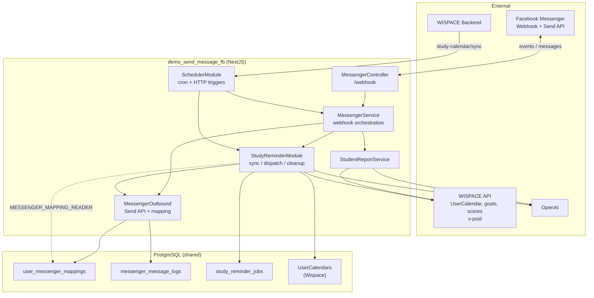

# Tổng quan POC — WISPACE Messenger Bot

Service NestJS kết nối **WISPACE** (nền tảng học IELTS Writing) với **Facebook Messenger**: học viên liên kết tài khoản qua `m.me`, nhận báo cáo tiến độ AI và lời nhắc buổi học sắp tới.

Đây là **POC** — ưu tiên ship nhanh, tái sử dụng PostgreSQL và API Wispace hiện có, chưa tách microservice riêng.

---

## 1. Tính năng hiện có

### 1.1. Liên kết Messenger ↔ WISPACE

- Học viên mở link `m.me/{page}?ref={userId}&topic=...&cadence=...` từ WISPACE.
- Webhook Messenger nhận sự kiện → lưu `user_id` ↔ `psid` vào `user_messenger_mappings`.
- Menu bot (persistent menu): đăng ký báo cáo, xem tiến độ, preview nhắc lịch học.

### 1.2. Báo cáo học tập (Exam reminder report)

- **Tự động:** cron **08:00** mỗi ngày — gửi báo cáo cho user đã đăng ký, trong cửa sổ **2–3 ngày** trước ngày thi (`WISPACE_REPORT_DAYS_BEFORE_EXAM_*`).
- **Thủ công:** menu **"Xem tiến độ học tập"** hoặc `POST /messenger/send-reports`.
- Dữ liệu: API Wispace (`TaskScoreAverage`, `User/goals`) → OpenAI → tin nhắn tiếng Việt.

### 1.3. Nhắc lịch học (Study session reminder)

- **Tự động:** sync lịch → bảng `study_reminder_jobs` → dispatch trước giờ học **30 phút** (cấu hình `.env`).
- **Khi đổi lịch:** Wispace gọi `POST /messenger/study-calendar/sync` với `{ userId }` ngay sau POST/DELETE `UserCalendar`.
- **Preview:** menu **"Nhắc lịch học sắp tới"**.
- Nguồn lịch: API `UserCalendar` (`x-psid`); fallback bảng `UserCalendars` nếu API lỗi.
- Chi tiết: [study-session-reminder.md](./study-session-reminder.md).

---

## 2. Kiến trúc



### Luồng chính

| Luồng | Trigger | Kết quả |
|-------|---------|---------|
| Đăng ký / webhook | Meta gửi POST `/webhook` | Lưu mapping, trả lời tin nhắn |
| Báo cáo theo lịch thi | Cron 08:00 hoặc postback | LLM report → Messenger |
| Đổi lịch học | Wispace `POST /messenger/study-calendar/sync` | Sync jobs theo `userId` |
| Nhắc lịch học (tự động) | Cron sync 30 phút + dispatch 1 phút | Job queue → LLM reminder → Messenger |
| Ops / test | `POST /messenger/*` | Sync toàn bộ, gửi thủ công |

### Ranh giới trách nhiệm

| Thành phần | Thuộc POC này | Thuộc Wispace (bên ngoài) |
|------------|---------------|----------------------------|
| Gửi tin Messenger, menu bot | ✓ | |
| Bảng mapping + logs + jobs | ✓ (migration) | |
| `UserCalendars`, user profiles | Đọc | ✓ sở hữu dữ liệu |
| Sync khi đổi lịch học | `POST /messenger/study-calendar/sync` | ✓ Wispace gọi sau POST/DELETE lịch |
| API `UserCalendar`, goals, scores | Gọi (x-psid) | ✓ host API |
| Gọi sync sau đổi lịch | Nhận `POST study-calendar/sync` | ✓ gọi sau POST/DELETE lịch |

---

## 3. Cấu trúc code

Repo dùng **Clean Architecture** — mỗi feature trong `src/modules/<name>/` có 4 tầng: `domain` → `application` → `infrastructure` → `presentation`. Chi tiết quy tắc: [AGENTS.md § Clean Architecture](../AGENTS.md#clean-architecture) và `.claude/rules/clean-architecture.md`.

```
demo_send_message_fb/
├── AGENTS.md                 # Hướng dẫn cho AI agent (Cursor, Claude, Codex)
├── docs/
├── scripts/                  # CLI tiện ích (không chạy trong app)
├── src/
│   ├── main.ts, app.module.ts
│   ├── shared/
│   │   ├── config/poc.constants.ts     # Link m.me, parse ref/userId
│   │   ├── common/                     # InternalApiKeyGuard
│   │   └── prompts/                    # *.system.txt, load-system-prompt.ts
│   ├── infrastructure/database/
│   │   ├── database.module.ts
│   │   ├── data-source.ts              # TypeORM CLI → dist/infrastructure/database/
│   │   ├── typeorm.options.ts
│   │   ├── entities/
│   │   └── migrations/
│   └── modules/
│       ├── messenger/          # domain | application | infrastructure | presentation
│       │   └── messenger-outbound.module.ts   # Send API + mapping (tách cycle)
│       ├── student-report/
│       ├── study-reminder/
│       └── scheduler/          # cron báo cáo + HTTP ops /messenger/*
├── .env.example
└── package.json
```

### Module NestJS

| Module | Vai trò |
|--------|---------|
| `DatabaseModule` | TypeORM + PostgreSQL, auto migration khi start |
| `MessengerOutboundModule` | Send API, `MessengerRepository`, ports `MESSAGE_SENDER`, `MESSENGER_MAPPING_READER` |
| `MessengerModule` | Webhook orchestration, profile menu (`MessengerController`) |
| `StudentReportModule` | Wispace goals/scores → `StudentReportService` (LLM báo cáo) |
| `StudyReminderModule` | Sync lịch, dispatch job, cleanup, LLM nhắc học |
| `SchedulerModule` | `ReportCronService`, HTTP endpoints vận hành |

`AppModule` import trực tiếp `StudyReminderModule`. `StudyReminderModule` import `MessengerOutboundModule` (không `forwardRef` với `MessengerModule`). Dispatch nhắc lịch gửi tin qua port `MESSAGE_SENDER`, không gọi `MessengerService` trực tiếp.

---

## 4. Database

### Bảng do POC tạo (migration)

| Bảng | Mục đích |
|------|----------|
| `user_messenger_mappings` | `user_id`, `psid`, `cadence`, `topic`, `status` |
| `messenger_message_logs` | Audit tin đã gửi / lỗi |
| `study_reminder_jobs` | Hàng đợi nhắc lịch (`pending` → `sent` / …) |

### Bảng Wispace (đọc, không migration trong repo)

| Bảng | Dùng cho |
|------|----------|
| `UserCalendars` | Lịch học sắp tới (`UserId`, `EventDate`, `Id` → `session_key`) |
| `user_profiles` / `Users` | FK mapping (nếu có) |

---

## 5. HTTP API

### Messenger (public / Meta)

| Method | Path | Mô tả |
|--------|------|--------|
| GET | `/webhook` | Xác thực webhook Meta |
| POST | `/webhook` | Nhận sự kiện messaging |
| GET | `/messenger/m-me-link` | Tạo link `m.me` với `ref`, `topic`, `cadence` |
| POST | `/messenger/test-send` | Gửi thử báo cáo theo `psid` |
| POST | `/messenger/profile/setup` | Cấu hình get started + persistent menu |

### Vận hành & tích hợp Wispace

Tất cả endpoint dưới đây yêu cầu header **`X-Internal-Api-Key`** (hoặc `Authorization: Bearer …`) khớp `INTERNAL_API_KEY` trong `.env`.

| Method | Path | Body | Mô tả |
|--------|------|------|--------|
| POST | `/messenger/study-calendar/sync` | `{ "userId": number }` | **Wispace gọi** sau POST/DELETE `UserCalendar` |
| POST | `/messenger/send-reports` | — | Gửi báo cáo (bỏ qua cửa sổ ngày thi) |
| POST | `/messenger/sync-study-reminders` | — | Sync toàn bộ user (ops / cron dự phòng) |
| POST | `/messenger/send-study-reminders` | — | Sync + dispatch job đến hạn |
| POST | `/messenger/profile/setup` | — | Cấu hình menu bot (ops) |
| POST | `/messenger/test-send` | `{ "psid": string }` | Gửi thử báo cáo (ops) |

Cron nội bộ (sync 30 phút, dispatch 1 phút) **không** qua HTTP — không cần API key.

---

## 6. Cron jobs

| Tên | Lịch | Service |
|-----|------|---------|
| `exam-reminder-report` | `0 8 * * *` (08:00) | `ReportCronService` |
| `study-reminder-sync` | Mỗi 30 phút | `StudyReminderWorkerService` |
| `study-reminder-dispatch` | Mỗi 1 phút | `StudyReminderWorkerService` |
| `study-reminder-cleanup` | `0 0 3 * * *` (03:00) | Xóa job terminal cũ |

Sync study reminder cũng chạy **lúc server start** (`onModuleInit`).

---

## 7. OpenAI & prompts

System prompt nằm trong `src/shared/prompts/*.system.txt`, load qua `load-system-prompt.ts`. Nest copy sang `dist/shared/prompts/` khi build (`nest-cli.json` → `assets`).

| File | Dùng bởi |
|------|----------|
| `student-report.system.txt` | `modules/student-report/application/services/student-report.service.ts` |
| `study-reminder.system.txt` | `modules/study-reminder/application/services/study-reminder.service.ts` |

Thiếu `OPENAI_API_KEY` → fallback template cứng trong service (không gọi API).

---

## 8. Cấu hình `.env`

Xem `.env.example`. Nhóm chính:

- **Meta:** `PAGE_ACCESS_TOKEN`, `VERIFY_TOKEN`, `MESSENGER_PAGE_ID`, `GRAPH_API_VERSION`
- **OpenAI:** `OPENAI_API_KEY`, `OPENAI_MODEL`
- **Wispace API:** `WISPACE_API_USER_CALENDAR_URL`, `WISPACE_API_USER_GOALS_URL`, `WISPACE_API_TASK_SCORE_URL` — auth bằng header `x-psid`
- **Study reminder:** `STUDY_REMINDER_*` — **bắt buộc**, không hardcode fallback trong code
- **Ops API:** `INTERNAL_API_KEY` — header `X-Internal-Api-Key` cho sync / send-reports / profile setup
- **Báo cáo thi:** `WISPACE_REPORT_DAYS_BEFORE_EXAM_MIN/MAX`
- **DB:** `DB_HOST`, `DB_PORT`, `DB_NAME`, `DB_USER`, `DB_PASSWORD`, `DB_MIGRATIONS_RUN`

---

## 9. Scripts NPM

```bash
npm run start:dev              # Dev server
npm run build                  # Compile + copy prompts
npm run migration:run          # Chạy migration
npm run db:inspect             # Khám phá DB
npm run db:explore-study-schedule
npm run study-reminder:sync    # Build + migrate + sync + dispatch
npm run study-reminder:sync-only
npm run study-reminder:jobs    # In jobs trong DB
```

---

## 10. Phạm vi POC & hạn chế

- **Một instance** — cron chạy trên mọi process; scale ngang cần review claim job / cron leader.
- **Chỉ Messenger** — user chưa map `psid` không nhận tin.
- **Tích hợp lịch học** — Wispace gọi `POST /messenger/study-calendar/sync` khi đổi lịch; cron 30 phút là dự phòng.
- **API UserCalendar** — cần `WISPACE_API_USER_CALENDAR_URL`; fallback DB khi API lỗi.
- **Wispace chưa wire** gọi sync API — cần thêm HTTP call + header `X-Internal-Api-Key` sau mỗi lần đổi lịch.

Trade-off chi tiết nhắc lịch học: mục 11 trong [study-session-reminder.md](./study-session-reminder.md).

---

## 11. Chạy local nhanh

```bash
cp .env.example .env   # điền token thật
npm install
npm run migration:run
npm run start:dev
```

Webhook Meta trỏ tới URL public (ngrok / tunnel) → `POST /webhook`.

Sau deploy menu lần đầu: `POST /messenger/profile/setup`.

Bootstrap jobs nhắc lịch: `npm run study-reminder:sync`.
