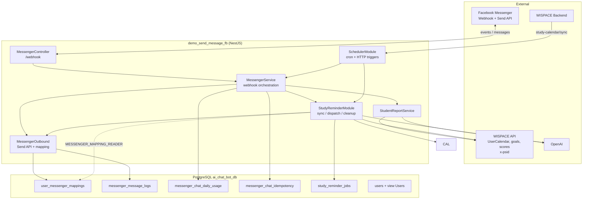

# Tổng quan POC — WISPACE Messenger Bot

Service NestJS kết nối **WISPACE** (nền tảng học IELTS Writing) với **Facebook Messenger**: học viên liên kết tài khoản qua `m.me`, nhận báo cáo tiến độ AI và lời nhắc buổi học sắp tới.

Đây là **POC** — ưu tiên ship nhanh, DB PostgreSQL **riêng** (`ai_chat_bot_db`) + API Wispace HTTP, chưa tách microservice riêng.

---

## 1. Tính năng hiện có

### 1.1. Liên kết Messenger ↔ WISPACE

- Học viên mở link `m.me/{page}?ref={userId}&topic=...&cadence=...` từ WISPACE.
- Webhook Messenger nhận sự kiện → lưu `user_id` ↔ `psid` vào `user_messenger_mappings`.
- Menu bot (persistent menu): đăng ký báo cáo, xem tiến độ, preview nhắc lịch học.

### 1.2. Báo cáo học tập (Exam reminder report)

- **Tự động:** cron **08:00** mỗi ngày — gửi báo cáo cho user đã đăng ký, trong cửa sổ **2–3 ngày** trước ngày thi (`WISPACE_REPORT_DAYS_BEFORE_EXAM_*`).
- **Thủ công:** menu **"Xem tiến độ học tập"** hoặc `POST /messenger/send-reports`.
- Dữ liệu: API Wispace (`TaskScoreAverage`, `User/goals`) → OpenAI → tin nhắn tiếng Việt.

### 1.3. Nhắc lịch học (Study session reminder)

- **Tự động:** sync lịch → bảng `study_reminder_jobs` → dispatch trước giờ học **30 phút** (cấu hình `.env`).
- **Khi đổi lịch:** Wispace gọi `POST /messenger/study-calendar/sync` với `{ userId }` ngay sau POST/DELETE `UserCalendar`.
- **Preview:** menu **"Nhắc lịch học sắp tới"**.
- Nguồn lịch: API `UserCalendar` (`x-psid`) — API-only (I3 ✓).
- Chi tiết: [study-session-reminder.md](./study-session-reminder.md).

### 1.4. Chat tự do + rate limit (FREE_FORM)

- User đã link WISPACE có thể **nhắn text** → bot trả lời qua LLM agent (`MessengerChatQueueService` debounce → `MessengerAgentService`).
- **Quota ngày** theo `(psid, usage_date)` ICT — `messenger_chat_daily_usage`; idempotency `message.mid` — `messenger_chat_idempotency`.
- **Burst** `CHAT_BURST_PER_MINUTE`/phút; **hard cap** concurrent (H3); **hint** “còn X lượt” (Phase 6).
- Menu postback, nhắc lịch cron, báo cáo proactive — **không** trừ quota.
- **1 instance:** `CHAT_QUEUE_STORE=memory` (debounce RAM). **≥2 pod:** `CHAT_QUEUE_STORE=redis` hoặc `postgres` (`CHAT_QUEUE_SHARED=true` → postgres).
- Chi tiết + runbook: [chat-rate-limit-quota.md](./chat-rate-limit-quota.md), mục 12 dưới.

---

## 2. Kiến trúc



### Luồng chính

| Luồng | Trigger | Kết quả |
|-------|---------|---------|
| Đăng ký / webhook | Meta gửi POST `/webhook` | Lưu mapping, trả lời tin nhắn |
| Báo cáo theo lịch thi | Cron 08:00 hoặc postback | LLM report → Messenger |
| Đổi lịch học | Wispace `POST /messenger/study-calendar/sync` | Sync jobs theo `userId` |
| Nhắc lịch học (tự động) | Cron sync 30 phút + dispatch adaptive (S2) | Job queue → LLM reminder → Messenger |
| Chat tự do (text) | Webhook text → debounce queue | Reserve quota → LLM agent → Messenger |
| Ops / test | `POST /messenger/*` | Sync toàn bộ, gửi thủ công |

### Ranh giới trách nhiệm

| Thành phần | Thuộc POC này | Thuộc Wispace (bên ngoài) |
|------------|---------------|----------------------------|
| Gửi tin Messenger, menu bot | ✓ | |
| Bảng mapping + logs + jobs | ✓ (migration) | |
| `UserCalendars`, user profiles | Đọc | ✓ sở hữu dữ liệu |
| Sync khi đổi lịch học | `POST /messenger/study-calendar/sync` | ✓ Wispace gọi sau POST/DELETE lịch |
| API `UserCalendar`, goals, scores | Gọi (x-psid) | ✓ host API |
| Gọi sync sau đổi lịch | Nhận `POST study-calendar/sync` | ✓ gọi sau POST/DELETE lịch |

---

## 3. Cấu trúc code

Repo dùng **Clean Architecture** — mỗi feature trong `src/modules/<name>/` có 4 tầng: `domain` → `application` → `infrastructure` → `presentation`. Chi tiết quy tắc: [AGENTS.md § Clean Architecture](../AGENTS.md#clean-architecture) và `.claude/rules/clean-architecture.md`.

```
demo_send_message_fb/
├── AGENTS.md                 # Hướng dẫn cho AI agent (Cursor, Claude, Codex)
├── docs/
├── scripts/                  # CLI tiện ích (không chạy trong app)
├── src/
│   ├── main.ts, app.module.ts
│   ├── shared/
│   │   ├── config/poc.constants.ts     # Link m.me, parse ref/userId
│   │   ├── common/                     # InternalApiKeyGuard
│   │   └── prompts/                    # *.system.txt, load-system-prompt.ts
│   ├── infrastructure/database/
│   │   ├── database.module.ts
│   │   ├── data-source.ts              # TypeORM CLI → dist/infrastructure/database/
│   │   ├── typeorm.options.ts
│   │   ├── entities/
│   │   └── migrations/
│   └── modules/
│       ├── messenger/          # domain | application | infrastructure | presentation
│       │   └── messenger-outbound.module.ts   # Send API + mapping (tách cycle)
│       ├── chat-rate-limit/    # quota ngày + idempotency mid
│       ├── student-report/
│       ├── study-reminder/
│       └── scheduler/          # cron báo cáo + HTTP ops /messenger/*
├── .env.example
└── package.json
```

### Module NestJS

| Module | Vai trò |
|--------|---------|
| `DatabaseModule` | TypeORM + PostgreSQL, auto migration khi start |
| `MessengerOutboundModule` | Send API, `MessengerRepository`, ports `MESSAGE_SENDER`, `MESSENGER_MAPPING_READER` |
| `MessengerModule` | Webhook orchestration, profile menu, chat queue + agent |
| `ChatRateLimitModule` | Quota FREE_FORM: `checkQuota`, `reserve`, `refund`, config `.env` |
| `StudentReportModule` | Wispace goals/scores → `StudentReportService` (LLM báo cáo) |
| `StudyReminderModule` | Sync lịch, dispatch job, cleanup, LLM nhắc học |
| `SchedulerModule` | `ReportCronService`, HTTP endpoints vận hành |

`AppModule` import trực tiếp `StudyReminderModule`. `StudyReminderModule` import `MessengerOutboundModule` (không `forwardRef` với `MessengerModule`). Dispatch nhắc lịch gửi tin qua port `MESSAGE_SENDER`, không gọi `MessengerService` trực tiếp.

---

## 4. Database

### Bảng do POC tạo (migration)

| Bảng | Mục đích |
|------|----------|
| `user_messenger_mappings` | `user_id`, `psid`, `cadence`, `topic`, `status` |
| `messenger_message_logs` | Audit tin đã gửi / lỗi |
| `messenger_chat_daily_usage` | Counter quota chat FREE_FORM theo `(psid, usage_date)` |
| `messenger_chat_idempotency` | Idempotency `message.mid` khi reserve quota |
| `study_reminder_jobs` | Hàng đợi nhắc lịch (`pending` → `sent` / …) |
| `users` + view `"Users"` | Cache display name / exam date — chỉ `user_id` có mapping Messenger; Redis `cache:user:display:{userId}` khi R5 bật |

Migration: `1717747200008-CreateMessengerUsersCacheTable`.

### Wispace (HTTP API — không bảng local trừ cache `users`)

| Nguồn | Dùng cho |
|-------|----------|
| API `UserCalendar` (`x-psid`) | Lịch học sắp tới (API-only, I3 ✓) |
| API `User/goals`, `TaskScoreAverage` | Báo cáo, ngày thi |

---

## 5. HTTP API

### Messenger (public / Meta)

| Method | Path | Mô tả |
|--------|------|--------|
| GET | `/webhook` | Xác thực webhook Meta |
| POST | `/webhook` | Nhận sự kiện messaging (guard `X-Hub-Signature-256` khi `MESSENGER_WEBHOOK_SIGNATURE_VERIFY` bật) |
| POST | `/messenger/profile/setup` | Cấu hình get started + persistent menu (cần `INTERNAL_API_KEY`) |

Link `m.me` chỉ do **WISPACE backend** phát hành (opaque token) — không còn `GET /messenger/m-me-link`.

### Vận hành & tích hợp Wispace

Tất cả endpoint dưới đây yêu cầu header **`X-Internal-Api-Key`** (hoặc `Authorization: Bearer …`) khớp `INTERNAL_API_KEY` trong `.env`.

| Method | Path | Body | Mô tả |
|--------|------|------|--------|
| POST | `/messenger/study-calendar/sync` | `{ "userId": number }` | **Wispace gọi** sau POST/DELETE `UserCalendar` |
| POST | `/messenger/send-reports` | `{ "psid"?: string, "allowDuplicate"?: boolean }` | Ops gửi báo cáo: bypass cửa sổ thi; mặc định skip đã gửi hôm nay |
| POST | `/messenger/send-reports/retry-dispatch` | — | Chạy tay dispatch outbox R5 |
| POST | `/messenger/sync-study-reminders` | — | Sync toàn bộ user (ops / cron dự phòng) |
| POST | `/messenger/send-study-reminders` | — | Sync + dispatch job đến hạn |
| POST | `/messenger/profile/setup` | — | Cấu hình menu bot (ops) |

Cron nội bộ (sync 30 phút, dispatch adaptive) **không** qua HTTP — không cần API key.

---

## 6. Cron jobs

| Tên | Lịch | Service |
|-----|------|---------|
| `exam-reminder-report` | `0 8 * * *` (08:00) | `ReportCronService` |
| `study-reminder-sync` | Mỗi 30 phút | `StudyReminderWorkerService` |
| `study-reminder-dispatch` | Adaptive 30s–3.5 phút (`STUDY_REMINDER_POLL_*`) | `StudyReminderWorkerService` — S2 ✓ |
| `study-reminder-cleanup` | `0 0 3 * * *` (03:00) | Xóa job terminal cũ |
| `messenger-message-log-cleanup` | `0 0 3 1 * *` (03:00 ngày 1 hàng tháng, ICT) | Xóa audit `messenger_message_logs` cũ hơn `MESSENGER_MESSAGE_LOG_RETENTION_DAYS` (default 90) |
| `messenger-chat-queue-flush` | Mỗi 2 giây (khi `CHAT_QUEUE_STORE` ≠ memory) | Poll buffer redis → flush |

Sync study reminder cũng chạy **lúc server start** (`onModuleInit`).

---

## 7. OpenAI & prompts

System prompt nằm trong `src/shared/prompts/*.system.txt`, load qua `load-system-prompt.ts`. Nest copy sang `dist/shared/prompts/` khi build (`nest-cli.json` → `assets`).

| File | Dùng bởi |
|------|----------|
| `student-report.system.txt` | `modules/student-report/application/services/student-report.service.ts` |
| `study-reminder.system.txt` | `modules/study-reminder/application/services/study-reminder.service.ts` |
| `messenger-chat.system.txt` | `modules/messenger/application/agent/messenger-agent.service.ts` |

Thiếu `OPENAI_API_KEY` → fallback template cứng trong service (không gọi API).

---

## 8. Cấu hình `.env`

Xem `.env.example`. Nhóm chính:

- **Meta:** `PAGE_ACCESS_TOKEN`, `VERIFY_TOKEN`, `MESSENGER_APP_SECRET`, `MESSENGER_WEBHOOK_SIGNATURE_VERIFY`, `MESSENGER_PAGE_ID`, `GRAPH_API_VERSION`
- **OpenAI:** `OPENAI_API_KEY`, `OPENAI_MODEL`
- **Wispace API:** `WISPACE_API_USER_CALENDAR_URL`, `WISPACE_API_USER_GOALS_URL`, `WISPACE_API_TASK_SCORE_URL`, `WISPACE_INTERNAL_KEY` — auth: `x-psid` + `X-Internal-Key`
- **Study reminder:** `STUDY_REMINDER_*` — **bắt buộc**, không hardcode fallback trong code
- **Chat rate limit:** `CHAT_RATE_LIMIT_ENABLED`, `CHAT_FREE_FORM_DAILY_LIMIT`, `CHAT_BURST_PER_MINUTE`, `CHAT_BURST_STORE` (R3), `CHAT_USAGE_TIMEZONE`, `CHAT_RATE_LIMIT_WHITELIST_PSIDS`, `CHAT_QUOTA_REMAINING_HINT_THRESHOLD`, `CHAT_IDEMPOTENCY_STUCK_RESERVED_MS` (H2), `CHAT_MERGED_TEXT_MAX_CHARS` / `CHAT_BURST_COUNT_REFUNDED` (H5), `CHAT_IDEMPOTENCY_RETENTION_DAYS` (H6)
- **Chat queue:** `CHAT_DEBOUNCE_MS`, `CHAT_MAX_BUBBLES`, `CHAT_BUBBLE_MAX_CHARS`, `CHAT_QUEUE_STORE` (R4), `CHAT_QUEUE_SHARED` (H7 legacy), `CHAT_HISTORY_STORE` (R1), `CHAT_DEDUPE_STORE` (R2), `CHAT_QUEUE_PROCESSING_STUCK_MS`, `CHAT_WEBHOOK_DEDUPE_RETENTION_MS`, `CHAT_HISTORY_TTL_MS`, `CHAT_HISTORY_MAX_MESSAGES`
- **Ops API:** `INTERNAL_API_KEY` — header `X-Internal-Api-Key` cho sync / send-reports / profile setup
- **Báo cáo thi:** `WISPACE_REPORT_DAYS_BEFORE_EXAM_MIN/MAX`
- **DB:** `DB_HOST`, `DB_PORT`, `DB_NAME` (`ai_chat_bot_db`), `DB_USER`, `DB_PASSWORD`, `DB_MIGRATIONS_RUN`
- **Redis (optional, VPS):** `REDIS_ENABLED`, `REDIS_HOST`, `REDIS_PORT`, `REDIS_PASSWORD` — R0–R4 stores + R5 user display cache; `GET /health/redis` khi bật
  - Redis chạy **standalone trên VPS** (folder `~/redis`, Docker publish `6379`) — không nằm trong repo app. Local + prod dùng chung `REDIS_HOST` = IP VPS.
- **User display cache (R5):** `USER_DISPLAY_NAME_CACHE_ENABLED`, `USER_DISPLAY_NAME_CACHE_TTL_SECONDS`

---

## 9. Scripts NPM

```bash
npm run start:dev              # Dev server
npm run build                  # Compile + copy prompts
npm run migration:run          # Chạy migration
npm run db:inspect             # Khám phá DB
npm run db:explore-study-schedule
npm run study-reminder:sync    # Build + migrate + sync + dispatch
npm run study-reminder:sync-only
npm run study-reminder:jobs    # In jobs trong DB
npm run study-reminder:jobs -- --failed   # S1: terminal failed
npm run study-reminder:jobs -- --stuck    # S1: processing kẹt
npm run ops:health             # I1+S1 combined ops snapshot
npm run chat-quota:status      # Tra quota chat (psid / userId / ngày)
npm run chat-quota:status -- --ops   # I1 fleet summary
npm run chat-quota:status -- --psid=<psid> --date=2026-06-15
npm run chat-quota:recover-stuck   # H2: refund stuck reserved
npm run chat-quota:cleanup         # H6: xóa idempotency completed/refunded cũ
# Ops DB migrate (một lần):
node scripts/migrate-hub-to-chat-bot-db.mjs   # copy POC tables hub → ai_chat_bot_db
node scripts/drop-poc-tables-old-db.mjs       # drop POC + migrations trên writing_ai_hub_db
```

---

## 10. Phạm vi POC & hạn chế

- **Một instance** — `CRON_LEADER_ENABLED=false` (mặc định); bật `CHAT_RATE_LIMIT_ENABLED=true` trên prod.
- **Scale ≥2 instance** — chat: `CHAT_QUEUE_SHARED=true` (H7); báo cáo 08:00: `CRON_LEADER_ENABLED` + bảng `messenger_scheduled_report_claims` (R4 ✓).
- **Chỉ Messenger** — user chưa map `psid` không nhận tin.
- **Tích hợp lịch học** — Wispace gọi `POST /messenger/study-calendar/sync` khi đổi lịch (S0 ✓); cron 30 phút là dự phòng.
- **API UserCalendar** — cần `WISPACE_API_USER_CALENDAR_URL`; không còn fallback DB.
- **Rate limit chat** — V1 + H1–H7 ✓; gap còn lại toàn dự án: [edge-cases-roadmap.md](./edge-cases-roadmap.md)

Trade-off chi tiết nhắc lịch học: mục 11 trong [study-session-reminder.md](./study-session-reminder.md).

---

## 12. Runbook — rate limit chat (V1)

| Tham số | Khuyến nghị POC | Env |
|---------|-----------------|-----|
| FREE_FORM / ngày | 15–20 | `CHAT_FREE_FORM_DAILY_LIMIT` |
| Burst | 3/phút | `CHAT_BURST_PER_MINUTE` |
| Timezone reset | 00:00 ICT | `CHAT_USAGE_TIMEZONE=Asia/Ho_Chi_Minh` |
| Bật enforcement | Prod POC | `CHAT_RATE_LIMIT_ENABLED=true` |
| PSID QA unlimited | Tùy team | `CHAT_RATE_LIMIT_WHITELIST_PSIDS` (comma-separated) |

**Ops tra quota:**

```bash
npm run chat-quota:status
npm run chat-quota:status -- --psid=<PSID>
npm run chat-quota:status -- --user-id=143 --date=2026-06-15
```

**Tắt nhanh khi sự cố:** đặt `CHAT_RATE_LIMIT_ENABLED=false` và restart — không cần revert code.

**Không trừ quota:** menu postback, nhắc lịch cron, báo cáo 08:00, tin `CHAT_QUOTA_DENIED` / lỗi hệ thống.

**Hardening H1–H7:** ✓ done — H2 recover stuck, H3 hard cap, H4 send semantics, H5 abuse caps, H6 retention/logs, H7 shared queue. Chi tiết: [§5.10](./chat-rate-limit-quota.md#510-edge-cases-thực-tế--roadmap-hardening-h1h7).

**Recover stuck reserved (H2):**

```bash
npm run chat-quota:status              # xem stuckReserved + idempotency stats
npm run chat-quota:recover-stuck -- --dry-run
npm run chat-quota:recover-stuck
```

**Retention idempotency (H6):**

```bash
npm run chat-quota:cleanup -- --dry-run
npm run chat-quota:cleanup
# override: npm run chat-quota:cleanup -- --retention-days=60
```

Log grep (H6 / I1): `CHAT_QUOTA_DENY`, `CHAT_QUOTA_REFUND`, `CHAT_QUOTA_RECOVERED`, `OPS_HEALTH_ALERT`, `OPS_HEALTH_OK`.

**I1 — fleet ops summary:**

```bash
npm run chat-quota:status -- --ops
npm run ops:health
npm run ops:health -- --warn-only   # exit 1 khi có alert (cron ngoài)
```

Grep log app (Docker / PM2 / file):

```bash
grep CHAT_QUOTA_DENY /path/to/app.log | tail -20
grep CHAT_QUOTA_REFUND /path/to/app.log | tail -20
grep CHAT_QUOTA_RECOVERED /path/to/app.log | tail -20
grep OPS_HEALTH_ALERT /path/to/app.log | tail -20
```

Cron nội bộ: `OpsHealthCronService` chạy **09:00 ICT** mỗi ngày (`OPS_HEALTH_ALERT_ENABLED=true`).

**S1 — nhắc lịch failed / stuck:**

```bash
npm run study-reminder:jobs -- --summary
npm run study-reminder:jobs -- --failed
npm run study-reminder:jobs -- --stuck
npm run study-reminder:jobs -- --failed --hours=48 --limit=20
```

Cùng snapshot I1+S1: `npm run ops:health`.

**Scale ≥2 instance (H7):**

```env
CHAT_QUEUE_SHARED=true
npm run migration:run
```

Mỗi pod chạy cron poll buffer 2s; debounce/history/`mid` dedupe lưu PostgreSQL.

Chi tiết kiến trúc: [chat-rate-limit-quota.md](./chat-rate-limit-quota.md).

---

## 11. Chạy local nhanh

```bash
cp .env.example .env   # điền token thật
npm install
npm run migration:run
npm run start:dev
```

Hoặc **Doppler** (không cần `.env` trên disk): xem [doppler-secrets.md](./doppler-secrets.md) → `doppler setup` + `npm run start:dev:doppler`.

Webhook Meta trỏ tới URL public (ngrok / tunnel) → `POST /webhook`.

Sau deploy menu lần đầu: `POST /messenger/profile/setup`.

Bootstrap jobs nhắc lịch: `npm run study-reminder:sync`.

---

## 12. Deploy VPS (Docker + GHCR + Doppler)

GitHub Actions (push `main`): [`.github/workflows/deploy.yml`](../.github/workflows/deploy.yml) — **chỉ build image** khi đổi `src/`, `Dockerfile`, `package*.json`; còn lại VPS reuse `:latest`. Env-only: webhook Doppler hoặc [`sync-env.yml`](../.github/workflows/sync-env.yml) / `npm run env:sync-prod`.

| Secret GitHub | Mục đích |
|---------------|----------|
| `VPS_HOST`, `VPS_USER`, `SSH_PRIVATE_KEY` | SSH deploy |
| `GHCR_PULL_TOKEN` | PAT `read:packages` — VPS `docker login ghcr.io` để pull image private |
| `DOPPLER_TOKEN` | Service token config **prd** — tải env → VPS mỗi deploy |

Image: `ghcr.io/<owner>/messenger-ai-for-student:latest` (tag thêm `:commit-sha`).

Trên VPS: `docker-compose.prod.yml` + `.env` tại `/home/ngoc_anh/messenger-bot/`. Legacy PM2 `publish/` không còn dùng sau migrate.

**Public URL prod:** `https://aiassist.aihubproduction.com` (Nginx → `127.0.0.1:5007`). Docker bind **localhost only** — không expose `:5007` ra internet. Nginx: `client_max_body_size` + rate limit `POST /webhook` — xem [`deploy/nginx/README.md`](../deploy/nginx/README.md).

Khi `DOPPLER_TOKEN` có mặt: CI `doppler secrets download` → SCP `production.env` → `.env`. Không cần SSH sửa env tay.

Chi tiết setup project/config `dev` + `prd`: [doppler-secrets.md](./doppler-secrets.md).
