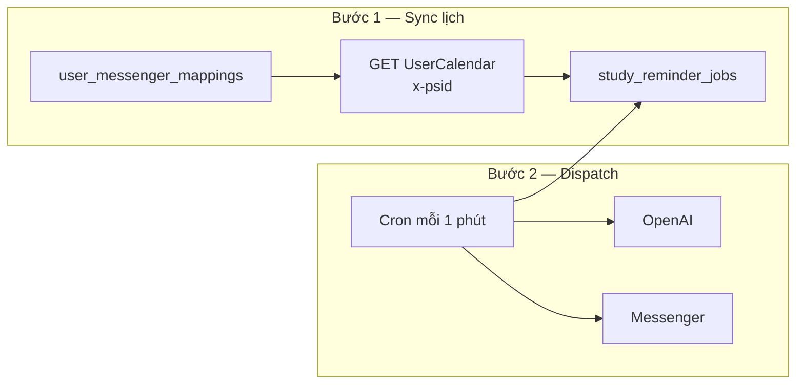
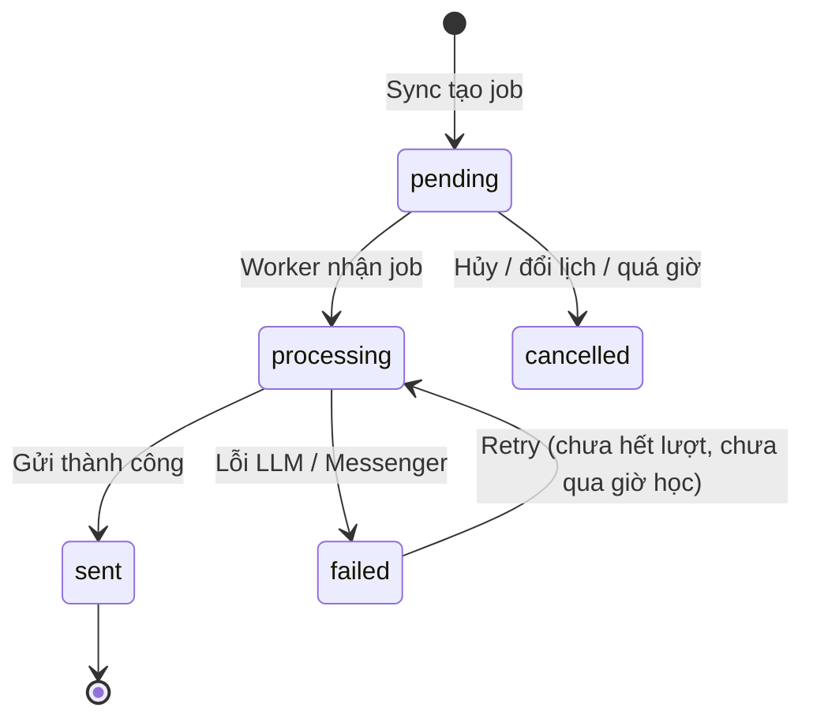
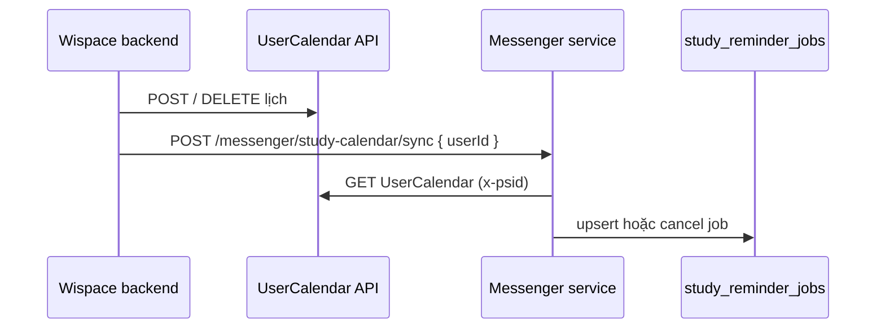
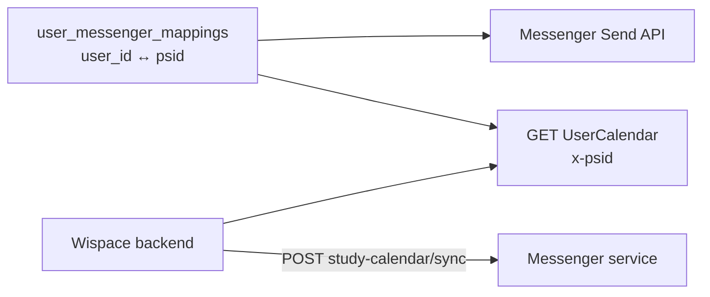

# Nhắc lịch học qua Messenger (Study Session Reminder)

Tài liệu mô tả cách giải quyết tính năng **gửi lời nhắc lịch học thân thiện** cho học viên IELTS qua Facebook Messenger, sinh nội dung bằng LLM.

---

## 1. Mục tiêu

- Tự động nhắc học viên trước giờ học (`STUDY_REMINDER_MINUTES_BEFORE` trong `.env`, mặc định 30 phút).
- Nội dung cá nhân hóa: tên, giờ học, gợi ý việc cần làm, mục tiêu band…
- Chỉ gửi cho người đã **liên kết Messenger** với tài khoản WISPACE.
- Hỗ trợ **test nhanh** qua menu bot, không cần đợi lịch tự động.

---

## 2. Cách giải quyết — Tổng quan

Ý tưởng: **ghi job nhắc lịch vào DB trước**, đến đúng giờ mới **gửi tin qua Messenger**. Lỗi khi gửi thì **retry** — job vẫn còn trong DB, không mất.



| Bước | Tần suất | Việc làm |
|------|----------|----------|
| **Sync** | **API khi lịch đổi** + cron 30 phút (dự phòng) + lúc server start + **23:00 rollover** | Quét horizon 14 ngày → ghi/cập nhật `study_reminder_jobs` |
| **Dispatch** | Mỗi 1 phút | Job đến `remind_at` → LLM sinh nội dung → gửi Messenger |
| **Evening rollover** | **23:00** (`STUDY_REMINDER_TIMEZONE`) | Xóa job **`sent`** → sync lại horizon 14 ngày |
| **Cleanup** | Mỗi ngày 03:00 | Xóa job `cancelled` / `failed` hết retry quá `JOB_RETENTION_DAYS` |
| **Preview** | Theo yêu cầu (menu bot) | Đọc lịch trực tiếp từ API/DB — gửi ngay, không qua job queue |

---

## 3. Luồng chi tiết

### 3.1. Sync — Tạo job từ lịch học

Có **hai chế độ** sync (cùng logic bên trong):

| Chế độ | Kích hoạt | Phạm vi |
|--------|-----------|---------|
| **Theo user** | `POST /messenger/study-calendar/sync` `{ userId }` | Một user — Wispace gọi sau đổi lịch |
| **Toàn bộ** | Cron 30 phút, server start, `POST /messenger/sync-study-reminders` | Mọi mapping ACTIVE có `psid` |

Với mỗi user được sync:

1. Lấy buổi học sắp tới từ **API `UserCalendar`** (header `x-psid`); fallback bảng `UserCalendars` nếu API lỗi.
2. Với mỗi buổi trong horizon (`STUDY_REMINDER_SYNC_HORIZON_HOURS`, mặc định 14 ngày):
   - Tính `remind_at = scheduled_at - STUDY_REMINDER_MINUTES_BEFORE`
   - UPSERT vào `study_reminder_jobs` (`status = pending`)
3. Buổi đã hủy / không còn trong lịch → `status = cancelled`

> **Lưu ý tích hợp (bắt buộc):** Cron 30 phút chỉ là lưới dự phòng. Mỗi khi lịch học thay đổi (POST/DELETE `UserCalendar` hoặc ghi DB) — hệ thống Wispace **gọi API sync** bên dưới ngay sau khi commit. Nếu chỉ chờ cron, học viên có thể nhận nhắc sai giờ hoặc không nhận nhắc cho đến 30 phút sau khi đổi lịch.

**Bootstrap lần đầu** (bảng jobs rỗng nhưng DB đã có lịch cũ):

```bash
npm run study-reminder:sync
```

### 3.2. Dispatch — Gửi tin đúng giờ

Mỗi phút, lấy job thỏa:

- `status` = `pending` hoặc `failed` (còn retry)
- `remind_at <= now`
- `scheduled_at` còn trước giờ học (`> now + MIN_LEAD_MINUTES`)
- `next_retry_at` đã đến (nếu đang retry)

Với mỗi job:



- Thành công → `status = sent`
- Lỗi → `retry_count++`, `next_retry_at = now + RETRY_BACKOFF_MINUTES` (tối đa `MAX_RETRIES`)
- Đã qua giờ học → `cancelled`, không gửi

### 3.3. Cleanup & evening rollover

Bảng `study_reminder_jobs` là **snapshot outbox** (hàng đợi gửi), không phải lưu trữ lịch sử. Audit gửi tin nằm ở `messenger_message_logs`.

#### Evening rollover (23:00, timezone `STUDY_REMINDER_TIMEZONE`)

Horizon sync mặc định **14 ngày** (`STUDY_REMINDER_SYNC_HORIZON_HOURS=336`). Cuối ngày:

1. **Xóa toàn bộ job `sent`** (đã nhắn xong trong ngày).
2. **Sync lại** toàn bộ mapping ACTIVE → tạo job `pending` cho các buổi còn trong 14 ngày tới.

Cron tự chạy; hoặc gọi thủ công:

```http
POST /messenger/study-reminder/evening-rollover
X-Internal-Api-Key: ...
```

Giờ rollover cấu hình qua `STUDY_REMINDER_EVENING_ROLLOVER_HOUR` (mặc định **23**).

#### Cleanup sâu (03:00)

Xóa job terminal **`cancelled`** / **`failed`** (hết retry) cũ hơn `STUDY_REMINDER_JOB_RETENTION_DAYS` (mặc định 7 ngày). Job `pending` / `processing` / `failed` còn retry **không** bị đụng.

#### Khi user đổi lịch (Wispace)

| Luồng | Cách cập nhật |
|-------|----------------|
| **Outbox (T-30)** | `POST /messenger/study-calendar/sync` `{ "userId": 143 }` ngay sau commit lịch |
| **Preview (menu)** | Đọc trực tiếp UserCalendar API/DB — luôn thấy lịch mới, không cần sync job |

Sync theo user sẽ upsert job `pending`, hủy job stale, và **tạo lại job `pending`** nếu buổi đã `sent`/`cancelled` nhưng **giờ học đổi**.

### 3.4. Sinh nội dung — LLM

`StudyReminderService` gom context (lịch, goals, band Task 1/2, **tên từ `Users.DisplayName`**) → gọi **OpenAI** → format tin nhắn.

Tên hiển thị: đọc bảng `Users` theo `user_id` (hoặc mapping `psid` → `user_id`). Thứ tự fallback: `DisplayName` → `Username` → `"bạn"`.

Dispatch tự động và menu preview đều dùng cùng service này. Không có `OPENAI_API_KEY` → fallback template.

### 3.5. Test nhanh

| Cách | Mô tả |
|------|--------|
| Menu **"Nhắc lịch học sắp tới"** | Gửi preview buổi sắp tới nhất ngay |
| `POST /messenger/study-calendar/sync` | **Wispace gọi sau khi đổi lịch** (theo `userId`) |
| `POST /messenger/sync-study-reminders` | Sync toàn bộ user (ops / dự phòng) |
| `POST /messenger/send-study-reminders` | Sync + dispatch job đến hạn |
| `npm run study-reminder:jobs` | Xem danh sách job trong DB |

### 3.6. API sync khi lịch học thay đổi

`study_reminder_jobs` phản ánh **snapshot** lịch tại thời điểm sync. Khi lịch đổi mà không gọi sync kịp, job cũ vẫn `pending` → nhắc sai giờ hoặc nhắc buổi đã hủy.

**Yêu cầu:** Sau mỗi thao tác tạo / cập nhật / xóa lịch (`POST` / `DELETE` `UserCalendar`), **Wispace gọi API** của service Messenger:

```http
POST /messenger/study-calendar/sync
Content-Type: application/json

{ "userId": 2597 }
```

| Hành động lịch | Wispace làm gì | Service sync làm gì |
|----------------|----------------|---------------------|
| Tạo / đổi giờ | Gọi API sync với `userId` | GET `UserCalendar` (x-psid) → UPSERT jobs |
| Xóa buổi | Gọi API sync với `userId` | Buổi không còn trong API → `cancelled` |

Response mẫu:

```json
{
  "scope": "user",
  "userId": 2597,
  "linked": true,
  "mappings": 1,
  "upserted": 2,
  "cancelled": 1,
  "skipped": 0,
  "failures": []
}
```

`linked: false` — user chưa map Messenger → không có job (200 OK, không lỗi).

Sync **theo một `userId`** — không quét toàn bộ mapping. Cron 30 phút + `POST /messenger/sync-study-reminders` vẫn dùng để dự phòng / ops.

**Ví dụ gọi từ Wispace (sau POST/DELETE `/api/UserCalendar`):**

```bash
curl -X POST https://{messenger-service}/messenger/study-calendar/sync \
  -H "Content-Type: application/json" \
  -H "X-Internal-Api-Key: ${INTERNAL_API_KEY}" \
  -d '{"userId": 2597}'
```

Hoặc `Authorization: Bearer ${INTERNAL_API_KEY}`. Giá trị key lấy từ `.env` (`INTERNAL_API_KEY`) — **cùng secret** Wispace backend cấu hình khi gọi service này.



---

## 4. Nguồn dữ liệu

### 4.1. API `UserCalendar` (chính)

Mọi request dùng header **`x-psid`** (PSID Messenger). Base URL: `WISPACE_API_USER_CALENDAR_URL`.

**GET** — danh sách lịch học:

```http
GET /api/UserCalendar
x-psid: {messenger_psid}
```

```json
{
  "data": [
    {
      "id": 12,
      "userId": 2597,
      "eventDate": "2026-06-10T00:00:00Z",
      "time": "08:30",
      "createdAt": "2026-06-09T15:00:00Z"
    }
  ],
  "count": 1
}
```

**POST** — tạo buổi học:

```http
POST /api/UserCalendar
x-psid: {messenger_psid}
Content-Type: application/json

{ "eventDate": "2026-06-10T00:00:00Z", "time": "08:30" }
```

**DELETE** — xóa buổi học:

```http
DELETE /api/UserCalendar/{id}
x-psid: {messenger_psid}
```

Code POC: `UserCalendarApiService` (GET/POST/DELETE) + `UserCalendarScheduleService` (chuẩn hóa → `session_key: calendar:{id}`, ghép `eventDate` + `time` theo `STUDY_REMINDER_TIMEZONE`).

Mọi thay đổi lịch (POST/DELETE) **phải gọi** `POST /messenger/study-calendar/sync` — xem mục [3.6](#36-api-sync-khi-lịch-học-thay-đổi).

### 4.2. `UserCalendars` (PostgreSQL — dự phòng)

Nếu API lỗi và có `user_id` trong mapping → đọc trực tiếp bảng `UserCalendars` (cùng schema logic).

### 4.3. Dữ liệu cho LLM

| API | Mục đích |
|-----|----------|
| `WISPACE_API_USER_GOALS_URL` | `targetScore`, `examDate` |
| `WISPACE_API_TASK_SCORE_URL` | Band Task 1/2 |

### 4.4. Liên kết user



Messenger và API Wispace đều cần **`psid`**. Bảng `user_messenger_mappings` là cầu nối.

---

## 5. Bảng `study_reminder_jobs`

```sql
CREATE TABLE study_reminder_jobs (
  id              SERIAL PRIMARY KEY,
  psid            VARCHAR(64) NOT NULL,
  user_id         INTEGER,
  session_key     VARCHAR(128) NOT NULL,
  scheduled_at    TIMESTAMPTZ NOT NULL,
  remind_at       TIMESTAMPTZ NOT NULL,
  topic           VARCHAR(255),
  status          VARCHAR(20) NOT NULL DEFAULT 'pending',
  retry_count     INTEGER NOT NULL DEFAULT 0,
  max_retries     INTEGER NOT NULL DEFAULT 3,
  next_retry_at   TIMESTAMPTZ,
  last_error      TEXT,
  sent_at         TIMESTAMPTZ,
  created_at      TIMESTAMPTZ NOT NULL DEFAULT NOW(),
  updated_at      TIMESTAMPTZ NOT NULL DEFAULT NOW(),
  UNIQUE (psid, session_key)
);
```

| `status` | Ý nghĩa |
|----------|---------|
| `pending` | Chờ đến `remind_at` |
| `processing` | Đang gửi |
| `sent` | Đã gửi thành công |
| `failed` | Lỗi — chờ retry |
| `cancelled` | Hủy / đổi lịch / quá giờ |

Job terminal (`sent`, `cancelled`, `failed` hết retry) được **xóa hẳng** sau `STUDY_REMINDER_JOB_RETENTION_DAYS` — xem mục 3.3.

---

## 6. Tin nhắn mẫu (LLM)

**Input OpenAI** gồm: tên, giờ học, topic, target band, band Task 1/2…

**Output** format thành:

```
⏰ Time to Study!

Xin chào bạn,

Đây là lời nhắc thân thiện rằng bạn có buổi học sắp diễn ra:

📅 Hôm nay lúc 10:30

Don't forget to:
• Ôn lại các bài essay gần đây
• Luyện viết theo chủ đề IELTS Writing
• ...

Kiên trì luyện tập mỗi ngày sẽ giúp bạn tiến gần hơn tới mục tiêu IELTS.

Cố lên nhé! 💪
```

---

## 7. Cấu trúc code

```
src/study-reminder/
  study-reminder-sync.service.ts       # Sync lịch → jobs (all | theo userId)
  study-reminder-dispatch.service.ts   # Dispatch + retry
  study-reminder-cleanup.service.ts    # Xóa job terminal cũ
  study-reminder-worker.service.ts     # Cron sync / dispatch / cleanup
  study-reminder.service.ts            # LLM
  user-calendar-api.service.ts         # GET/POST/DELETE UserCalendar (x-psid)
  user-calendar-schedule.service.ts    # Chuẩn hóa lịch + fallback DB
  study-session-source.service.ts      # Nguồn buổi học cho sync
  study-reminder-job.repository.ts

src/scheduler/
  scheduler.controller.ts              # POST study-calendar/sync, sync-study-reminders, …

src/messenger/
  messenger.service.ts                 # Gửi tin + menu preview
  messenger-profile.service.ts

src/prompts/
  study-reminder.system.txt            # System prompt OpenAI
```

---

## 8. Cấu hình `.env`

```env
WISPACE_API_USER_CALENDAR_URL=https://backend.aihubproduction.com/api/UserCalendar

STUDY_REMINDER_MINUTES_BEFORE=30
STUDY_REMINDER_MIN_LEAD_MINUTES=1
STUDY_REMINDER_SYNC_HORIZON_HOURS=336
STUDY_REMINDER_MAX_RETRIES=3
STUDY_REMINDER_RETRY_BACKOFF_MINUTES=2
STUDY_REMINDER_JOB_RETENTION_DAYS=7
STUDY_REMINDER_TIMEZONE=Asia/Ho_Chi_Minh

OPENAI_API_KEY=sk-...
OPENAI_MODEL=gpt-5.4

# Ops / Wispace → sync, send-reports (header X-Internal-Api-Key)
INTERNAL_API_KEY=replace-with-a-long-random-secret
```

Tất cả giá trị thời gian **bắt buộc trong `.env`** — không hardcode trong code.

---

## 9. Triển khai

```bash
# Lần đầu: migration + sync dữ liệu lịch cũ vào jobs
npm run study-reminder:sync

# Xem jobs
npm run study-reminder:jobs

# Cập nhật menu bot
POST /messenger/profile/setup
```

**Vận hành:**

- **Bắt buộc:** Wispace gọi `POST /messenger/study-calendar/sync` sau mỗi lần đổi lịch (xem mục 3.6).
- **Dự phòng:** server sync khi khởi động + cron 30 phút.
- Dispatch cron mỗi 1 phút.
- Cleanup cron 03:00 mỗi ngày — xóa job terminal cũ hơn `JOB_RETENTION_DAYS`.

---

## 10. Ghi log Messenger

| `message_type` | Ý nghĩa |
|----------------|---------|
| `STUDY_REMINDER:{timestamp}` | Nhắc tự động qua dispatch |
| `STUDY_SESSION_REMINDER_PREVIEW` | Test menu |
| `STUDY_SESSION_REMINDER_EMPTY` | Không có buổi sắp tới |

Trạng thái gửi chính: `study_reminder_jobs.status`. `messenger_message_logs` dùng để audit.

---

## 11. Trade-off — Điểm mạnh, điểm yếu & hướng cải thiện

Không có giải pháp nào hoàn hảo tuyệt đối. Hướng **outbox table (`study_reminder_jobs`) + cron sync/dispatch** được chọn vì phù hợp **bối cảnh hiện tại**: POC Messenger, đã có PostgreSQL chung với Wispace, quy mô user nhỏ, cần triển khai nhanh mà vẫn có retry và audit. Các hướng khác (message queue riêng, push notification đa kênh, cron poll toàn bộ user mỗi 5 phút…) có ưu điểm riêng nhưng đổi lại chi phí vận hành hoặc độ phức tạp tích hợp cao hơn mức cần thiết lúc này.

### 11.1. Vì sao hướng này hợp lý hiện tại

| Ưu điểm | Giải thích ngắn |
|---------|-----------------|
| **Ít hạ tầng mới** | Không cần Redis/RabbitMQ; job nằm trong Postgres cùng app |
| **Retry & trạng thái rõ** | `pending` → `sent` / `failed` / `cancelled` — dễ debug, không mất job khi gửi lỗi |
| **Tận dụng API Wispace** | `UserCalendar` qua `x-psid`; fallback DB khi API lỗi |
| **Sync theo user** | Wispace gọi một API sau đổi lịch — không cần event bus / webhook |
| **LLM linh hoạt** | Nội dung nhắc cá nhân hóa theo goals/band mà không maintain nhiều template |
| **Tách sync và gửi** | Đổi lịch chỉ cần sync lại jobs; không gọi Messenger/LLM lúc ghi lịch |

### 11.2. Điểm yếu / rủi ro cần biết

| Vấn đề | Mô tả | Mức ảnh hưởng (hiện tại) |
|--------|--------|---------------------------|
| **Lịch và jobs không đồng bộ tức thì** | Snapshot tại lần sync cuối. Wispace quên gọi sync API → tối đa ~30 phút lệch (cron dự phòng) | Cao nếu Wispace chưa gọi API; thấp khi đã tích hợp mục 3.6 |
| **Phụ thuộc tích hợp bên Wispace** | Wispace phải gọi `POST /messenger/study-calendar/sync` sau mỗi lần đổi lịch | Trung bình — API đã có, cần wire ở Wispace |
| **Coupling DB trực tiếp** | Service đọc thẳng bảng `UserCalendars` thay vì contract API ổn định | Trung bình — schema Wispace đổi có thể làm hỏng sync |
| **Độ chính xác thời gian gửi** | Dispatch cron 1 phút → nhắc có thể muộn tối đa ~1 phút so với `remind_at` | Thấp — chấp nhận được với nhắc trước 30 phút |
| **Horizon giới hạn** | Chỉ sync buổi trong `SYNC_HORIZON_HOURS` (14 ngày). Buổi xa hơn chưa có job cho đến lần sync sau khi vào cửa sổ | Thấp với lịch học theo tuần |
| **LLM gọi lúc dispatch** | Mỗi job = 1 lần OpenAI + gọi API goals/score → chi phí, độ trễ, lỗi model làm trễ hoặc fail nhắc | Trung bình — có retry và fallback template |
| **Nội dung không cố định** | Hai lần nhắc cùng buổi (preview vs auto) có thể khác wording do LLM | Thấp |
| **Chỉ kênh Messenger** | User chưa link `psid` hoặc chặn bot → không nhận nhắc | Cao với user chưa mapping — by design |
| **Sync full-scan (cron)** | Cron 30 phút vẫn quét **tất cả** mapping — chỉ là dự phòng; luồng chính sync theo `userId` | Thấp khi ít user; tăng khi scale |
| **API + DB dự phòng** | Nguồn chính API `UserCalendar`; API down thì đọc DB `UserCalendars` | Thấp nếu API ổn định |
| **Nhiều instance app** | `claimJob` qua DB giảm gửi trùng, nhưng cron chạy trên mọi instance — cần theo dõi khi scale ngang | Thấp ở single instance |

### 11.3. So với hướng khác (tóm tắt)

| Hướng | Ưu | Nhược so với hiện tại |
|-------|-----|------------------------|
| **Cron poll mỗi N phút, gửi ngay** | Đơn giản, không bảng jobs | Không retry bền, khó audit, tải DB/API cao khi quét user |
| **Queue ngoài (BullMQ, SQS…)** | Scale tốt, delay chính xác | Thêm hạ tầng, vận hành — overkill cho POC |
| **Scheduled message Messenger** | Meta gửi hộ | Không LLM động, policy/template hạn chế |
| **Push/email đa kênh** | Phủ user không dùng Messenger | Ngoài scope tích hợp hiện tại |

### 11.4. Hướng cải thiện (theo thứ tự ưu tiên)

1. **Wispace wire sync API** — `POST /messenger/study-calendar/sync` + header `X-Internal-Api-Key` (mục 3.6).
2. **Bỏ fallback DB** khi API `UserCalendar` ổn định — single source qua `x-psid`.
4. **Giám sát job `failed`** — alert khi `retry_count` hết hoặc job `processing` kẹt lâu.
5. **Pre-generate hoặc cache nội dung LLM** lúc sync (tùy chọn) — giảm latency lúc dispatch, nội dung ổn định hơn.
6. **Queue chuyên dụng** — khi số user / số job tăng mạnh hoặc cần delay chính xác hơn cron 1 phút.
7. **Mở rộng kênh** — email/push in-app cho user chưa link Messenger (nếu product cần).

### 11.5. Kết luận ngắn

Giải pháp hiện tại **đủ tốt để ship POC và vận hành sớm**: có job queue trong DB, retry, preview, sync API theo `userId`, và cron dự phòng. Điểm yếu chính không nằm ở code dispatch mà ở **Wispace có gọi sync API đúng lúc** và user đã map Messenger. Khi product scale hoặc yêu cầu độ chính xác thời gian / đa kênh tăng, nên cải thiện theo mục 11.4 thay vì thay đổi kiến trúc từ đầu.
